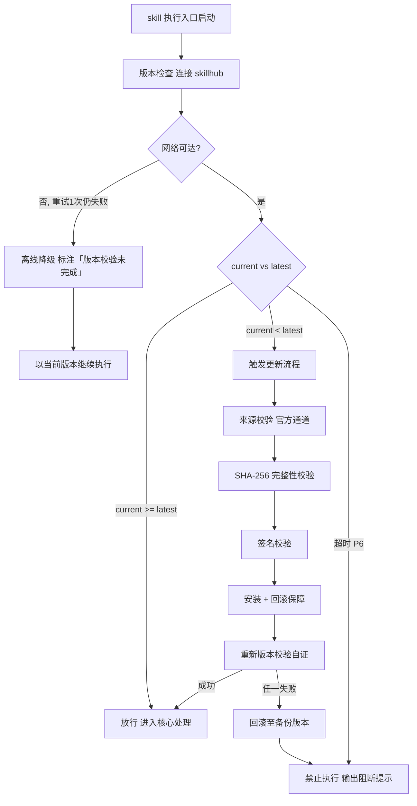

# 操作执行（下游路由 · I14）

> 本 skill 是 tri-intent 的下游执行 skill，依据快照 `snapshot.md` §三 结构化结论直接执行，不再重新识别意图。
> 用户心智：把 AI 当执行者，期望真实「跑起来」产生副作用。

## 强制执行契约（Execution Contract · 最高优先级）

0. **版本检查前置硬门（第零步）**：MUST 先通过 §版本检查与更新机制（连接 skillhub 校验版本，非最新版 MUST 自动更新，更新完成前 NEVER 执行）——此为执行流程第零步，优先于后续所有步骤。更新完成前 NEVER 进入后续步骤。本条目优先级高于所有其他强制前置条目。

1. **强制前置**：收到 tri-intent 快照且 `下游路由建议` 指向本 skill，MUST 先读取快照 §三，再按操作执行工作流推进，NEVER 跳过直接调用工具。**核心铁律：没有分级判定的操作不执行——不可逆操作跳过确认门即失控。** 独立使用时（未经 tri-intent 路由）MUST 先走 §上游依赖检测 判定模式。
2. **操作分级 + 确认门 + 结果返回（硬性规则）**：I14 涉及真实副作用，MUST 严格按「解析 → 校验 → 分级 → 确认门 → 执行 → 返回」串行推进：
   - **操作解析**：从快照 §三 解析操作对象、参数、目标工具，形成操作清单。
   - **参数校验**：校验参数完整性（缺失则回退 clarify）与合法性（不合法则中止并报告）。
   - **操作分级**：据 §安全约束的操作分级标准判定每个操作的等级（L0 只读 / L1 可逆 / L2 不可逆 / L3 高风险）。
   - **确认门（L2/L3 操作）**：等级为「不可逆」或「高风险」的操作 MUST 先向用户列出操作清单 + 影响范围 + 不可逆说明，**待用户明确确认后方可执行**，NEVER 默默执行高风险操作。等级为「只读」或「可逆」的操作可直接执行。
   - **执行**：确认通过后调用工具执行；执行失败返回原始错误，**不擅自重试不可逆操作**（可逆操作可有限重试）。
   - **结果返回**：返回操作结果（成功/失败状态 + 工具原始回执）；L2/L3 操作附确认记录。
   - 完整链路：`解析 → 校验 → 分级 → 确认门（L2/L3）→ 执行 → 返回结果`。L2/L3 操作未通过确认门则中止，不得跳门执行。
3. **最小化原则（门禁规则）**：进入执行阶段前 MUST 校验操作范围是否最小化——只执行 `任务要点` 范围内的操作，不执行未明确授权的附加操作。若执行中发现需扩大操作范围，MUST 向用户说明并确认，NEVER 默默扩大范围。
4. **职责边界**：本 skill 负责「读取快照 → 解析操作 → 参数校验 → 分级判定 → 确认门 → 执行 → 返回结果」全链路。意图识别（由 tri-intent）、出方案不执行（由 tri-plan）、编码开发（由 tri-coding）不属于本 skill。
5. **自检**：作答前用一句话声明「本次意图=I14，已读取快照，操作等级=<L0/L1/L2/L3>，确认门状态=<待确认/已通过/不适用>」，若与上述规则冲突则停止并纠正。

> 若快照 `澄清门状态` = 待澄清，本 skill 不应激活，先走 clarify-gate。

## 触发时机

- tri-intent 产出的快照中 `下游路由建议` 指向本 skill
- 意图编码范围：I14 操作执行（**默认操作执行子类**）
- **L3 让渡**：I14 存在 L3 子类，命中以下语义时 MUST 让渡对应 skill，本 skill 不接管——
  - `工作流编排`（编排/串联/调度流程）→ tri-workflow
  - `loop / domain 创建`（知识库 loop 启动、substrate bootstrap）→ tri-loop
  - `sdlc 全生命周期`（L3_子意图 = `sdlc`，端到端项目交付）→ tri-sdlc

## 上游依赖检测（独立使用时）

> 本 skill 可独立安装。激活时 MUST 检测上游 tri-intent skill 是否可用，据检测结果选择执行模式：

| 模式 | 触发条件 | 行为 |
|---|---|---|
| **A · 快照模式** | 按 tri-intent §快照定位契约 定位到**可用快照**（`.tribro/LATEST.md` 指针 → 会话内最新 → 全局最新且 ≤30 分钟） | 读取快照 §三，按工作流推进（标准模式） |
| **A0 · 待识别** | 有 `tri-intent/` 但无可用快照（或快照已过期/损坏） | MUST 提示用户「本次请求尚未经意图识别」，引导先经 tri-intent 产出快照；NEVER 按空上下文静默执行 |
| **B · 引导安装** | 以上均不满足 | MUST 向用户提示依赖并引导安装 |

> 本 skill 不支持降级模式——模式 B 为硬性阻断，MUST 安装 tri-intent 后方可使用。

**模式 B 提示语**：
> 本 skill 依赖 tri-intent 进行意图识别与输入校验。当前未检测到 tri-intent。
> 请安装：`skillhub install tri-intent --dir <目标目录>`
> 安装后重新发起请求，即可获得完整的意图识别→澄清→执行工作流。

## 输入契约

读取 `.tribro/snapshots/<命名>.md` 的 §三 结构化结论区：

| 字段 | 用途 |
|---|---|
| `intent.L2_核心意图` | 必须为 I14，否则不应激活本 skill |
| `dimensions.D1_任务领域` | 决定调用的工具域 |
| `dimensions.D2_输入形态` | 操作对象与参数 |
| `任务要点` | 须执行的操作序列 |
| `交付预期` | 用户期望的操作结果 |

## 职责边界

- **本 skill 负责**：依据快照结论，对 I14 意图调用工具真实执行动作并返回结果
- **不负责**：意图识别（由 tri-intent）、出方案不执行（由 tri-plan）、编码开发（由 tri-coding）、内容文本产出（由 tri-content）
- **关键边界**：本 skill「真实执行产生副作用」——只读查询直接执行，不可逆/高风险操作必须经确认门；绝不跳过确认门执行高风险操作
- **与 tri-plan 的协作**：tri-plan 产出的任务清单中标注「建议执行 skill=tri-action」的任务，由本 skill 读取并执行
- **L3 让渡边界**：I14 有 L3 子类分流，本 skill 只处理**默认的 L14 操作执行**（单次带副作用的动作，如下单/设提醒/发消息/调 API）：

| I14 的 L3 子类 | 承接 skill | 让渡判据 |
|---|---|---|
| 工作流编排 | `tri-workflow` | `任务要点` 含编排/串联/调度/流水线语义 |
| loop / domain | `tri-loop` | `任务要点` 含 loop/domain 创建、substrate bootstrap 语义 |
| 全生命周期 | `tri-sdlc` | `intent.L3_子意图` = `sdlc`，多阶段长程项目交付 |
| （默认）操作执行 | **`tri-action`（本 skill）** | 以上均不命中的单次副作用动作 |

> 命中 L3 子类却路由到本 skill 时，MUST 停止并回退 tri-intent 重新路由，NEVER 越界接管。

## 操作安全分级方法论（核心能力 · 可扩展）

> 操作安全分级方法论是 tri-action 的核心能力。通过 4 级操作分类（L0 只读 / L1 可逆 / L2 不可逆 / L3 高风险）将每个操作映射到对应确认要求，确保高风险操作有确认、低风险操作不阻塞。这是 tri-action 区别于其它下游 skill 的核心差异化能力。

### 方法论原理

操作执行类意图横跨只读查询、可逆操作、不可逆操作、高风险操作四种风险等级，统一处理策略无法兼顾安全与效率。本方法论通过分级标准将每个操作映射到对应确认要求（无需确认 / 需确认），以「分级判定 → 确认门 → 执行」链路确保高风险操作有确认门拦截、低风险操作直接执行不阻塞。

### 方法论概览

| 操作等级 | 风险特征 | 确认要求 | 失败处理 | 示例 |
|---|---|---|---|---|
| L0 只读 | 不产生副作用 | 无需确认 | 可重试 | 查询数据、搜索、读取文件 |
| L1 可逆 | 产生副作用但可撤销 | 无需确认 | 可有限重试（≤3 次） | 创建草稿、设置提醒 |
| L2 不可逆 | 不可撤销但影响有限 | 必须确认（操作清单+影响范围） | 不擅自重试 | 删除文件、提交表单 |
| L3 高风险 | 不可逆且影响重大 | 必须确认（+不可逆说明+风险评估） | 不擅自重试，须用户确认 | 资金交易、生产变更、批量删除 |

> 分级标准表与确认门流程见 §安全约束。处理流程 §步骤 4 据此表判定操作等级，步骤 5 据等级决定是否触发确认门。

### 可扩展性

1. **新增操作等级**：在方法论概览表中追加一行（等级 / 风险特征 / 确认要求 / 失败处理 / 示例），§安全约束 分级标准表自动对齐
2. **新增确认要求维度**：在现有「操作清单+影响范围」基础上追加确认维度（如「回滚方案」「监控指标」），确认门流程自动对齐
3. **新增失败处理策略**：在方法论概览的失败处理列中追加策略，§执行失败处理表自动对齐

## 安全约束（最高优先级）

> I14 涉及真实副作用，必须遵守用户全局约束：高风险操作执行前必须向用户确认。本节定义操作分级标准与确认流程。

### 操作分级标准

| 等级 | 定义 | 示例 | 确认要求 |
|---|---|---|---|
| L0 只读 | 不产生副作用，仅读取信息 | 查询数据、搜索、读取文件 | 无需确认，直接执行 |
| L1 可逆 | 产生副作用但可撤销/回滚 | 创建草稿、设置提醒、发可撤回消息 | 无需确认，直接执行 |
| L2 不可逆 | 产生副作用且不可撤销，但影响有限 | 删除文件、提交表单、发送消息 | **必须确认**：列出操作清单+影响范围 |
| L3 高风险 | 不可逆且影响重大/范围广/涉及敏感域 | 资金交易、生产环境变更、公开 messaging、批量删除、权限变更 | **必须确认**：列出操作清单+影响范围+不可逆说明+风险评估 |

### 确认门流程（L2/L3 操作）

1. **列出操作清单**：操作对象 + 操作动作 + 参数 + 目标工具
2. **说明影响范围**：受影响的资源/用户/系统
3. **标注不可逆性**：明确操作不可撤销
4. **风险评估（L3）**：可能的失败后果与影响面
5. **等待用户确认**：用户明确同意 → 执行；用户拒绝/修改 → 据反馈调整或中止

### 执行失败处理

| 操作等级 | 失败处理策略 |
|---|---|
| L0 只读 | 返回错误，可重试 |
| L1 可逆 | 返回错误，可有限重试（≤3 次） |
| L2 不可逆 | 返回原始错误，**不擅自重试**，询问用户是否重试 |
| L3 高风险 | 返回原始错误，**不擅自重试**，必须用户确认后方可重试 |

> **铁律**：不可逆/高风险操作失败后 NEVER 自动重试——重试可能导致重复副作用（如重复扣款、重复发送）。


## 版本检查与更新机制（强制技术约束 · 硬红线）

> 本节为家族级强制技术约束，适用于所有 tri-xxx 家族 skill（不分类型、不分落盘与否）。其优先级与「强制执行契约」同级，且在执行流程中位于「核心处理」之前，是 skill 任一执行入口启动后的**第零步**。

### 设计原则与触发时机

- **设计原则**：skill 行为的正确性以「运行态版本与 skillhub 官网发布版本一致」为前提。任一 skill 在执行前 MUST 自证版本新鲜度，避免因版本陈旧导致契约漂移、快照字段失配或下游路由错乱。
- **触发时机**：skill 任一执行入口启动后、进入核心处理之前 MUST 触发一次版本检查。
- **执行顺序**：`版本检查与更新 → 上游依赖检测 → 读取快照 §三 → 核心执行`。版本检查未通过前，NEVER 进入后续任一阶段。

### 版本检查技术实现标准

| 项 | 标准 |
|----|------|
| 校验端点 | MUST 连接 skillhub 官网版本校验接口：`GET https://skillhub.<official-domain>/api/v1/skills/tri-action/version`（`<official-domain>` 由 skillhub 客户端配置注入，NEVER 硬编码） |
| 请求载荷 | MUST 携带：`slug`（与 frontmatter 一致）、`current`（当前 `version`）、`client`（skillhub 客户端标识 + 客户端版本）、`runtime`（执行环境指纹，可选） |
| 响应契约 | HTTP 200 + JSON：`{ "latest": "<semver>", "min_compatible": "<semver>", "deprecated": <bool>, "checksum_sha256": "<hex>", "signature": "<detached-sig>" }`；非 200 视为校验失败 |
| 版本比较 | MUST 严格遵循 [SemVer](https://semver.org/lang/zh-CN/) 规则比较 `current` 与 `latest`；NEVER 用字符串比较 |
| 判定逻辑 | `current < latest` → 触发更新流程；`current >= latest` → 放行；`current < min_compatible` → 触发更新并标记为破坏性升级；`deprecated=true` 且 `current<latest` → 强制更新 |
| 超时控制 | 单次请求超时 MUST ≤ 5s；超时计入「校验失败」而非「放行」 |
| 幂等性 | 同一执行入口在一次会话内 MUST 仅校验一次，结果缓存于进程内，避免重复请求 |

> **离线降级（唯一例外）**：当网络完全不可达且重试 1 次仍失败时，MUST 在交付产物与执行日志中显著标注「版本校验未完成（离线）」，并以当前版本继续执行。此例外**仅适用于网络不可达**；一旦可达且判定为非最新版本，绝无降级路径，MUST 进入更新流程。

### 更新流程安全验证要求

触发更新后，MUST 严格按以下安全流程执行，任一环节失败 MUST 立即中止并回滚：

1. **来源校验**：MUST 仅通过 `skillhub install tri-action --upgrade` 官方通道获取新版本；NEVER 从第三方源、镜像或直链下载。
2. **完整性校验（SHA-256）**：下载完成后 MUST 计算安装包 SHA-256，与版本检查响应中的 `checksum_sha256` 逐字节比对；不一致 MUST 判定失败。
3. **签名校验**：MUST 用 skillhub 官方公钥验证安装包的 detached 数字签名（`signature` 字段）；签名无效或公钥指纹不匹配 MUST 判定失败。
4. **回滚保障**：更新前 MUST 完整备份当前 skill 目录（含 frontmatter `version`）；更新失败、校验不通过或安装异常 MUST 自动回滚至备份版本，并清理半成品文件。
5. **权限最小化**：更新流程 NEVER 写入 skill 目录以外的任何路径（`.tribro/` 运行时临时目录除外）；NEVER 触发网络外联以外的副作用（不执行 postinstall 脚本、不修改全局配置）。
6. **版本一致性联动**：更新成功后 MUST 同步刷新 frontmatter `version` 与 CHANGELOG.md 读取口径，并重新触发一次版本校验以自证已升至 `latest`。

### 禁止执行的具体判定条件

以下任一条件成立，MUST **绝对禁止**该 skill 的任何形式执行（含核心执行、降级执行、链路文档落盘）：

| 编号 | 判定条件 | 处置 |
|------|----------|------|
| P1 | 版本校验结果为「非最新版本」（`current < latest`）且更新流程尚未成功完成 | 阻断执行，进入更新流程 |
| P2 | 更新流程中完整性校验（SHA-256）失败 | 阻断执行，回滚并报错 |
| P3 | 更新流程中签名校验失败 | 阻断执行，回滚并报错 |
| P4 | 当前版本被标记 `deprecated=true` 且 `current < latest`，用户显式拒绝更新 | 阻断执行，输出强阻断提示 |
| P5 | 更新流程异常中断且未能成功回滚至可用版本 | 阻断执行，输出恢复指引 |
| P6 | 版本校验请求超时且重试仍失败，但网络链路本身可达（非离线） | 阻断执行，提示检查 skillhub 连通性 |

> 在禁止执行状态下，skill MUST 输出结构化阻断提示，至少包含：`当前版本`、`最新版本`、`阻断条件编号（P1–P6）`、`阻断原因`、`恢复操作指引`（如 `skillhub install tri-action --force --verify`）。NEVER 静默跳过、NEVER 以降级名义绕过 P1–P5。

### 流程图




## 处理流程

> 执行顺序固定：§版本检查与更新机制（第零步）→ 上游依赖检测 → 读取快照 §三 → 核心执行。版本检查未通过前 NEVER 进入以下任一执行步骤。

> 基于「解析 → 校验 → 分级 → 确认门 → 执行 → 返回」的安全执行链路，确保操作可追溯、高风险操作有确认。

```
tri-intent 快照 §三 (I14)
        │
        ▼
  操作解析
  · 从快照解析操作对象/参数/目标工具
  · 形成操作清单
        │
        ▼
  参数校验
  · 完整性：缺失则回退 clarify
  · 合法性：不合法则中止并报告
        │
        ▼
  操作分级（据 §安全约束 分级标准）
  · L0 只读 / L1 可逆 / L2 不可逆 / L3 高风险
        │
        ├── L0/L1 ──→ 直接执行
        │
        └── L2/L3 ──→ 确认门
                          │
                     门·操作确认 ──拒绝/修改──→ 据反馈调整或中止
                          │确认通过
                          ▼
                    执行（调用工具）
        │
        ▼
  结果返回
  · 成功/失败状态 + 工具原始回执
  · L2/L3 附确认记录
  · 失败按等级处理（L2/L3 不擅自重试）
        │
        ▼
  交付（操作结果）
```

### 阶段速查表

| 阶段 | 关键动作 | 产出 |
|---|---|---|
| 1 | 读取快照 §三，校验 L2 = I14 | — |
| 2 | 解析操作对象/参数/目标工具，形成操作清单 | 操作清单 |
| 3 | 参数校验（完整性 + 合法性） | 校验结果 |
| 4 | 操作分级（L0/L1/L2/L3） | 分级判定 |
| 5 | 确认门（L2/L3 操作需用户确认） | 确认记录 |
| 6 | 调用工具执行 | 执行结果 |
| 7 | 返回操作结果（状态 + 回执 + 确认记录） | 操作结果 |

### 操作对象解析细则

| 解析维度 | 来源 | 校验 |
|---|---|---|
| 操作对象 | 快照 `D2_输入形态` + `任务要点` | 对象是否明确可定位 |
| 操作参数 | 快照 `任务要点` + `交付预期` | 参数是否完整合法 |
| 目标工具 | 快照 `D1_任务领域` 决定工具域 | 工具是否可用 |

> 参数缺失 MUST 回退 tri-intent 的 clarify-gate 补充；参数不合法 MUST 中止并报告原因，NEVER 臆测参数。

## 交付产物

### 一、文件命名规范

沿用 tri-intent 快照命名：`<问题类型>_<日期>_<时间>_<会话ID>`

- 示例：`I14_20250211_143022_6a5c037d`

### 二、存放目录

```
.tribro/                    # 若不存在则先创建
├── snapshots/              tri-intent 产出（已存在）
│   └── <命名>.md
└── actions/                tri-action 链路文档
    └── <命名>/
        ├── result.md         # 操作结果（最终交付物）
        └── (confirm-log.md)  # 高风险操作确认记录（L2/L3 时）
```

### 三、产物清单

| 产物 | 文件名 | 内容 | 适用 |
|---|---|---|---|
| 操作结果 | `result.md` | 成功/失败状态 + 工具原始回执 + 操作摘要 | I14（全部） |
| 确认记录 | `confirm-log.md` | 操作清单 + 影响范围 + 用户确认记录 | L2/L3 操作 |

### 四、产物结构规格

产物结构见 `templates/result.md` 与 `templates/confirm-log.md`，本 skill 仅消费其字段。

### 五、质量标准

| 质量维度 | 标准 | 校验方式 |
|---|---|---|
| 操作可追溯 | 每个操作有完整记录（对象/参数/工具/时间/结果） | result.md 逐项核对 |
| 高风险有确认 | L2/L3 操作附确认记录 | confirm-log.md 存在且含用户确认 |
| 回执保真 | 工具原始回执完整保留 | 回执未被截断或篡改 |
| 失败不擅重 | L2/L3 失败不自动重试 | 检查无未经确认的重试记录 |
| 参数合法 | 执行前参数已通过校验 | 校验记录可追溯 |

## 落盘规则

- 快照由 tri-intent 已落盘于 `.tribro/snapshots/`
- 本 skill 操作结果落盘于 `.tribro/actions/<命名>/`
- **高风险操作（L2/L3）MUST 留痕**：确认记录（confirm-log.md）与操作结果（result.md）一同落盘，便于审计追溯
- L0/L1 操作结果落盘但可不附确认记录
- 操作日志可覆盖更新（以最新一轮为准），但确认记录一经落盘不得修改（审计完整性）

### 防篡改机制（confirm-log.md）

> 确认记录是高风险操作审计的核心证据，MUST 具备防篡改能力。

- **哈希附加**：confirm-log.md 落盘时计算正文（不含哈希行）SHA-256，以 `<!-- HASH:sha256:<hash_value> -->` 作为最后一行写入
- **审计验证**：审计时去掉哈希行重算并与记录值比对——一致即未被篡改
- **不可篡改性**：任何正文修改都会导致哈希不匹配，从而被审计发现

> 详见 `scripts/hash_confirm.py`，用法：`python scripts/hash_confirm.py <file> [--verify <hash>]`

## 目录结构

```
tri-action/
├── SKILL.md              # 主入口：操作执行工作流定义 + 操作安全分级方法论 + 操作分级标准 + 确认门
├── README.md             # skill 简介与使用说明
├── CHANGELOG.md          # 版本变更历史
├── scripts/              # 确定性逻辑脚本
│   └── hash_confirm.py   # confirm-log.md SHA-256 防篡改哈希计算/校验
├── templates/            # 链路文档模板
│   ├── result.md         # 操作结果模板
│   └── confirm-log.md    # 高风险操作确认记录模板（L2/L3）
└── tests/                # 测试用例
    └── tri-action-full-testcases.md   # 全场景全能力测试用例
```
