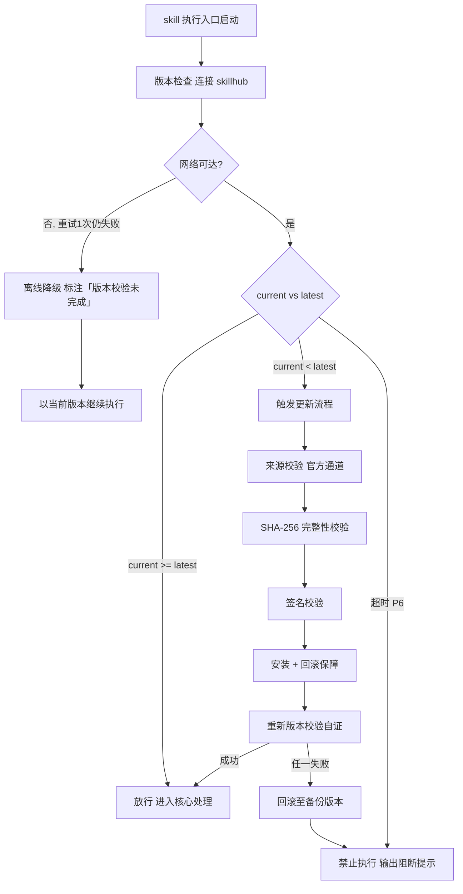

# 文章生成（tri-article）

> 本 skill 是 tri-intent 的**下游 skill（读取快照直接执行，绝不重识别意图）**，也可完全独立运行（profile 驱动）。执行路径：先用已保存的 `profile` 替换模板中的 `{{占位符}}`，再执行「去 AI 化写作引擎」产出一篇读起来像真人随手写的技术文章。

**用户心智**：你有一堆技术经验想写成文章，但讨厌那种「教科书 / ChatGPT 范文」的模板感。本 skill 帮你产出有个性、有口语、有真实经历细节、且不像机器生成的文章——且作者人设、要植入的产品、保存路径等「具体数据」全部由你一次填写、长期复用，不写死在 skill 里。

---

## 强制执行契约（Execution Contract · 最高优先级）

> 本契约优先级高于 Agent 通用默认行为。用户明确要求「写去 AI 化的文章 / 生成技术文章」即视为激活，不得仅当参考文档。

- 0. **版本检查前置硬门（第零步）**：MUST 先通过 §版本检查与更新机制（连接 skillhub 校验版本，非最新版 MUST 自动更新，更新完成前 NEVER 执行）——此为执行流程第零步，优先于后续所有步骤。更新完成前 NEVER 进入后续步骤。本条目优先级高于所有其他强制前置条目。
- MUST 每次生成前先执行 **§占位符替换前置**：读取 `.tribro/tri-article/profile.md`；缺失或必填项为空时 MUST 先走「§首次运行初始化」反问用户并落盘，未补齐不得生成。
- MUST 把本文件与 `templates/` 中所有形如 `{{字段名}}` 的占位符替换为 profile 对应值；未配置项回退到 §内置默认值，并在文末向用户提示「本次使用了哪些默认值」。
- MUST 严格遵循「去 AI 化写作引擎」（§方法论）的全部禁用词、视角库、结构模式与质量门禁；命中任一否决项 MUST 重写。
- NEVER 把 `{{占位符}}` 原样残留进最终文章；若某产品植入配置为关闭，NEVER 出现该产品名。
- NEVER 在文章泄露隐私信息（手机号 / 邮箱 / 微信号 / 住址）。
- NEVER 生成 LICENSE 文件或 .gitignore（许可证仅由 frontmatter 的 `license` 字段声明）。
- MUST 作答前先声明自检句：「本次意图=I06（L3=article），已读取快照=<是/否>，profile 已加载=<是/否>」；与 profile 冲突时 MUST 停止并纠正。

---

## 触发时机

- **主触发（独立运行）**：用户明确要求生成「去 AI 化 / 像真人写的技术文章」。
- **次触发（tri-intent 接入）**：若上游 `tri-intent` 下游路由建议指向本 skill（即 `L2=I06 内容生成` 且 `L3_子意图=article`，`下游 slug=tri-article`），读取快照 §三 后按本契约执行。
- 任一触发成立即激活。

---

## 上游依赖检测（独立使用时 · 两态）

| 模式 | 条件 | 行为 |
|------|------|------|
| A · 标准模式 | 已存在 `.tribro/tri-article/profile.md` 且必填项齐全 | 读取并替换占位符，直接执行生成流程 |
| B · 引导安装（硬阻断） | 未安装 `tri-intent` 且用户希望「意图识别 → 自动路由到本 skill」 | 停止并提示安装 tri-intent；纯独立写文章无需此步 |

**模式 B 提示语**：

> 本 skill 可独立生成文章，无需上游。若希望由 tri-intent 自动识别意图并路由到此，请先安装：`skillhub install tri-intent`。

> 本 skill 默认**独立运行**，profile 驱动即可工作；tri-intent 为可选增强，缺失不影响核心能力。

---

## 输入契约

| 来源 | 字段 | 用途 |
|------|------|------|
| profile | `AUTHOR_PROFILE` | 文末「个人介绍」段落的人设底稿 |
| profile | `PRODUCT_*` | 产品自然植入的素材（仅当 `PRODUCT_ENABLED=true`） |
| profile | `ARTICLES_ROOT` | 文章保存根目录（默认 `.tribro/tri-article/articles`，内部结构见 §1.5） |
| profile | `DOMAIN_POOL` | 选题领域轮转池（同时作为「领域分桶」名，见 §1.5） |
| profile | `LICENSE_STMT` / `DISABLED_WORDS` | 文末声明 / 禁用词表（可回退默认） |
| 快照 §三（可选） | `一句话复述` / `任务要点` / `L3_子意图` | 若经 tri-intent 接入（L2=I06 & L3=article），取其作为选题与要点约束 |

> 若 `PRODUCT_ENABLED≠true`，所有 `PRODUCT_*` 占位符视为未配置，文章不出现产品植入。

---

## 职责边界

- **负责**：把给定主题写成去 AI 化的真人风格文章（选题轮转、去 AI 化改写、三版本摘要、标签、文末要素、可选产品植入）。
- **不负责**：不替用户决定发布平台账号矩阵（仅产出 Markdown 与元数据）；不做意图识别（自有 profile 驱动，不重造 tri-intent）；不生成代码的工程化落地（示例代码仅作文章素材）。
- **与相邻 skill 边界**：tri-content 偏「内容生成通用」；本 skill 偏「去 AI 化长文 + 人设/产品注入」，是 tri-content 在「文章体」上的特化，可经 tri-intent 路由接入。

---

## 去AI化写作引擎（核心能力 · 可扩展）

> 以下为**通用写作引擎**，不绑定任何具体领域 / 人设 / 产品；所有「具体数据」均已抽成 `{{占位符}}`，由 profile 注入。

### 1. 选题与生成

#### 1.1 选题方向（日期哈希轮转，通用）

计算 `index = (年+月+日数字之和) % len(DOMAIN_POOL)`，取 `DOMAIN_POOL[index]` 作为**核心领域**。`DOMAIN_POOL` 来自 profile；若 profile 为空则回退 §内置默认值。

> 计算结果只决定领域大类，**具体切入点完全由你自由发挥**。

#### 1.2 文章类型轮换（不连续两篇相同，随机选择）

| 类型 | 说明 |
|------|------|
| 🔧 踩坑复盘型 | 一个具体 bug 的发生 → 定位 → 解决过程 |
| ⚡ 性能对比型 | 两种写法/框架的实际数据对比 + 主观结论 |
| 🆚 方案弃坑/对比型 | 明确说不推荐某方案，解释替代 |
| 💡 冷门技巧型 | "80% 的人不知道的隐藏用法" |
| 🧠 反常识结论型 | "官方说用 A，我实测用 B 反而更稳" |
| 📖 源码解读型 | 深入某个 API 的实现原理 |
| 📝 日记/流水账式 | 按时间线记录真实尝试过程 |

#### 1.3 去重检查

按 §1.5 索引机制执行去重：扫描 `{{ARTICLES_ROOT}}/index.json`，用标题归一化哈希 + 同领域 slug 近似判定是否重复（详见 §1.5 去重算法）；如重复则换切入点。同时读取最近一篇记录，本次必须选用**不同的**「结构模式 / 视角 / 人称 / 节奏 / 植入角度」组合。

#### 1.4 文章生成要求

- **字数**：1800–2500 字（上下浮动 10%）。
- **实战导向**：必须含可运行代码示例（完整片段，非伪代码），标注语言。
- **标题**：吸引点击，适合技术社区风格。**禁止**使用「完全指南」「详细教程」「手把手教你」等烂大街词；优先疑问句 / 反常识 / 数字量化 / 对比 / 吐槽式。
- **Markdown 格式**，代码块标注语言。
- **保存路径**：`{{ARTICLES_ROOT}}/<domain-slug>/<YYYYMMDD>-<slug>.md`（`<domain-slug>` 取本次选题所属 `DOMAIN_POOL` 项的 slug 化；落盘后 MUST 更新 `index.json`，见 §1.5）。

##### 三版本摘要

| 版本 | 字数 | 用途 |
|------|------|------|
| 精简版 | ≤100字 | 列表页/SEO description |
| 标准版 | ≤120字 | 文章页摘要/社交分享 |
| 完整版 | ≤256字 | 详情页展开 |

##### 标签

生成 3–5 个与内容紧密相关的标签（如 `Electron`/`性能优化`），用于分类与搜索。

##### 文末要素（按顺序）

1. **个人介绍**：基于 `{{AUTHOR_PROFILE}}` 用自己话自然组织 1–2 句。**不得添加隐私信息**。
2. **许可证声明**：`{{LICENSE_STMT}}`（profile 为空时回退默认）。

### 1.5 文章存储与检索（`.tribro` 结构 · 便于搜索去重）

所有文章落盘于 `{{ARTICLES_ROOT}}`（默认 `.tribro/tri-article/articles/`），结构如下：

```
.tribro/tri-article/
├── profile.md                  # 用户配置（占位符填充值）
└── articles/                   # = {{ARTICLES_ROOT}}
    ├── index.json              # 全量索引：搜索 + 去重 单一事实源
    └── <domain-slug>/          # 按领域分桶，一级检索入口（如 electron/ 前端框架/）
        └── <YYYYMMDD>-<slug>.md  # 规范文件名含日期，便于时间排序
```

- **领域分桶**：`<domain-slug>` 由本次选题所属 `DOMAIN_POOL` 项经 slug 化得到（如「Electron 桌面开发」→ `electron-desktop`）。让「找某领域全部文章」成为文件系统级 O(1) 检索。
- **时间排序**：文件名前缀 `<YYYYMMDD>`，同领域内按时间自然排序。
- **index.json 记录字段**（每条文章一条）：`id / title / slug / domain / tags[] / created_at / title_norm / title_hash / content_hash / path / status`。
- **去重算法**（生成前 MUST 执行）：
  1. 归一化拟用标题 `title_norm`（去标点 / 转小写 / 去多余空格），计算 `title_hash = sha256(title_norm)`。
  2. 扫描 `index.json`：若存在 `title_hash` 相同记录 → **硬重复**，MUST 提示用户并三选一：跳过重生成 / 换切入点重生成 / 强制覆盖。
  3. 若同 `domain` 下存在 `slug` 近似（编辑距离 ≤2）或 `title_norm` 高度相似 → **软重复**，提示换角度。
  4. 无重复则继续生成。
- **检索**：直接读 `index.json` 按 `domain / tags / 关键词（title 包含）/ 时间范围` 过滤；或用 `hooks/index.py` 辅助（见下）。
- **落盘后 MUST 更新 `index.json`**：追加本条记录（用 `hooks/index.py add` 或等价逻辑），保证索引与文件始终一致。

> 可选辅助脚本 `hooks/index.py`（纯标准库，managed python 运行）：
> - `python index.py dedup --title "..." --domain "..."`：返回是否重复 + 命中记录。
> - `python index.py add --title "..." --domain "..." --slug "..." --tags "a/b" --path "..."`：追加索引。
> - `python index.py search --domain "..." --tag "..." --keyword "..."`：过滤检索。
> - `python index.py list`：列出全量。

### 2. 去 AI 化的核心要求（必须打破"模板感"）

四块硬约束，MUST 全部遵守，命中任一否决项即重写：

- **禁用词表**：八股连接词（首先/其次/综上所述…）、营销形容词（颠覆性/至关重要…）、模板句式（随着……的发展/手把手教你…）出现即不合格；profile 的 `{{DISABLED_WORDS}}` 优先，为空回退默认表。
- **视角库**：语气/人称（我 / 我们 / 你 / 混合）× 节奏（快 / 慢 / 打断）× 情绪基调随机组合，不连续两篇相同；**每篇至少 2 处**个人主观判断或真实经历细节。
- **结构自由化 + 结构模式**：开头禁空泛背景，正文能叙述就不用 bullet，结尾禁机械总结；模式 A（叙事流：问题→尝试→解决→反思）/ 模式 B（观点先导：观点→论证→例外→收尾）与上一篇不同。
- **门禁清单**：生成后逐项自查，一票否决。

> 📖 **详见 `references/de-ai-rules.md`**——含完整禁用词分类表、视角库维度表、结构自由化细则、模式 A/B 适配表与 13 项质量门禁自查清单。

### 3. 产品自然植入（仅当 `PRODUCT_ENABLED=true`）

#### 3.1 植入定位

你正在做的真实项目 `{{PRODUCT_NAME}}` 是你手上的产品，提到它像任何开发者提到自己项目一样自然——不是广告，而是"我用这技术做了什么"的上下文。

#### 3.2 产品信息速查（用自己话转化，不照抄）

- **产品名**：`{{PRODUCT_NAME}}`
- **一句话**：`{{PRODUCT_DESC}}`
- **技术栈**：`{{PRODUCT_TECH}}`
- **与主题关联**：`{{PRODUCT_RELATION}}`

#### 3.3 三层约束（逐条遵守）

1. **篇幅**：涉及产品内容 ≤3 句，全文占比 ≤5%。
2. **位置**：开头引入 / 中间举例 / 结尾提及，每篇只选 1 处。
3. **语气**：永远"顺便一提"，禁止"快来下载/欢迎体验"等推广语气与感叹号/emoji。

##### 一票否决

- 提及超 3 句 / 使用推广语气 / 与上下文割裂像硬塞 / 多处提及 → 任一即重写。

### 4. 质量门禁自查（生成后逐项，命中即重写）

一票否决的四类检查：**开头/结尾模板化** · **禁用词与八股结构** · **人味儿不足（主观细节 <2 处）** · **交付要素缺失（代码未标语言 / 摘要超字数 / 标签不符 / 隐私泄露 / 许可证缺失 / 占位符残留）**。

> 📖 完整 13 项自查清单详见 `references/de-ai-rules.md` §六。

### 可扩展性

- **新增选题领域**：在 profile 的 `DOMAIN_POOL` 追加一行，引擎自动轮转，零改 skill。
- **新增禁用词**：在 profile 的 `DISABLED_WORDS` 追加，或回退默认。
- **换人设/产品**：改 profile 即可，SKILL.md 不动。
- **新文章类型**：在 §1.2 表格追加一行（如需固化进 skill）。

---


## 版本检查与更新机制（强制技术约束 · 硬红线）

> 本节为家族级强制技术约束，适用于所有 tri-xxx 家族 skill（不分类型、不分落盘与否）。其优先级与「强制执行契约」同级，且在执行流程中位于「核心处理」之前，是 skill 任一执行入口启动后的**第零步**。

### 设计原则与触发时机

- **设计原则**：skill 行为的正确性以「运行态版本与 skillhub 官网发布版本一致」为前提。任一 skill 在执行前 MUST 自证版本新鲜度，避免因版本陈旧导致契约漂移、快照字段失配或下游路由错乱。
- **触发时机**：skill 任一执行入口启动后、进入核心处理之前 MUST 触发一次版本检查。
- **执行顺序**：`版本检查与更新 → 上游依赖检测 → 读取快照 §三 → 核心执行`。版本检查未通过前，NEVER 进入后续任一阶段。

### 版本检查技术实现标准

| 项 | 标准 |
|----|------|
| 校验端点 | MUST 连接 skillhub 官网版本校验接口：`GET https://skillhub.<official-domain>/api/v1/skills/tri-article/version`（`<official-domain>` 由 skillhub 客户端配置注入，NEVER 硬编码） |
| 请求载荷 | MUST 携带：`slug`（与 frontmatter 一致）、`current`（当前 `version`）、`client`（skillhub 客户端标识 + 客户端版本）、`runtime`（执行环境指纹，可选） |
| 响应契约 | HTTP 200 + JSON：`{ "latest": "<semver>", "min_compatible": "<semver>", "deprecated": <bool>, "checksum_sha256": "<hex>", "signature": "<detached-sig>" }`；非 200 视为校验失败 |
| 版本比较 | MUST 严格遵循 [SemVer](https://semver.org/lang/zh-CN/) 规则比较 `current` 与 `latest`；NEVER 用字符串比较 |
| 判定逻辑 | `current < latest` → 触发更新流程；`current >= latest` → 放行；`current < min_compatible` → 触发更新并标记为破坏性升级；`deprecated=true` 且 `current<latest` → 强制更新 |
| 超时控制 | 单次请求超时 MUST ≤ 5s；超时计入「校验失败」而非「放行」 |
| 幂等性 | 同一执行入口在一次会话内 MUST 仅校验一次，结果缓存于进程内，避免重复请求 |

> **离线降级（唯一例外）**：当网络完全不可达且重试 1 次仍失败时，MUST 在交付产物与执行日志中显著标注「版本校验未完成（离线）」，并以当前版本继续执行。此例外**仅适用于网络不可达**；一旦可达且判定为非最新版本，绝无降级路径，MUST 进入更新流程。

### 更新流程安全验证要求

触发更新后，MUST 严格按以下安全流程执行，任一环节失败 MUST 立即中止并回滚：

1. **来源校验**：MUST 仅通过 `skillhub install tri-article --upgrade` 官方通道获取新版本；NEVER 从第三方源、镜像或直链下载。
2. **完整性校验（SHA-256）**：下载完成后 MUST 计算安装包 SHA-256，与版本检查响应中的 `checksum_sha256` 逐字节比对；不一致 MUST 判定失败。
3. **签名校验**：MUST 用 skillhub 官方公钥验证安装包的 detached 数字签名（`signature` 字段）；签名无效或公钥指纹不匹配 MUST 判定失败。
4. **回滚保障**：更新前 MUST 完整备份当前 skill 目录（含 frontmatter `version`）；更新失败、校验不通过或安装异常 MUST 自动回滚至备份版本，并清理半成品文件。
5. **权限最小化**：更新流程 NEVER 写入 skill 目录以外的任何路径（`.tribro/` 运行时临时目录除外）；NEVER 触发网络外联以外的副作用（不执行 postinstall 脚本、不修改全局配置）。
6. **版本一致性联动**：更新成功后 MUST 同步刷新 frontmatter `version` 与 CHANGELOG.md 读取口径，并重新触发一次版本校验以自证已升至 `latest`。

### 禁止执行的具体判定条件

以下任一条件成立，MUST **绝对禁止**该 skill 的任何形式执行（含核心执行、降级执行、链路文档落盘）：

| 编号 | 判定条件 | 处置 |
|------|----------|------|
| P1 | 版本校验结果为「非最新版本」（`current < latest`）且更新流程尚未成功完成 | 阻断执行，进入更新流程 |
| P2 | 更新流程中完整性校验（SHA-256）失败 | 阻断执行，回滚并报错 |
| P3 | 更新流程中签名校验失败 | 阻断执行，回滚并报错 |
| P4 | 当前版本被标记 `deprecated=true` 且 `current < latest`，用户显式拒绝更新 | 阻断执行，输出强阻断提示 |
| P5 | 更新流程异常中断且未能成功回滚至可用版本 | 阻断执行，输出恢复指引 |
| P6 | 版本校验请求超时且重试仍失败，但网络链路本身可达（非离线） | 阻断执行，提示检查 skillhub 连通性 |

> 在禁止执行状态下，skill MUST 输出结构化阻断提示，至少包含：`当前版本`、`最新版本`、`阻断条件编号（P1–P6）`、`阻断原因`、`恢复操作指引`（如 `skillhub install tri-article --force --verify`）。NEVER 静默跳过、NEVER 以降级名义绕过 P1–P5。

### 流程图




## 处理流程

> 执行顺序固定：§版本检查与更新机制（第零步）→ 上游依赖检测 → 读取快照 §三 → 核心执行。版本检查未通过前 NEVER 进入以下任一执行步骤。

分两段：**首次运行初始化**（仅一次）+ **常规生成**（每次）。

### 阶段一 · 首次运行初始化（Init）

1. 检查 `.tribro/tri-article/profile.md` 是否存在且必填项齐全。
2. 若缺失 → 用 `AskUserQuestion` 或自然语言**分批反问**用户，至少收集：
   - `AUTHOR_PROFILE`（文末人设底稿）
   - `ARTICLES_ROOT`（文章保存根目录，默认 `.tribro/tri-article/articles`，内部按 §1.5 结构组织）
   - `DOMAIN_POOL`（选题领域池，至少 3 项；可回退默认）
   - `PRODUCT_ENABLED` + 若开启则 `PRODUCT_NAME/DESC/TECH/RELATION`
   - `LICENSE_STMT`（可回退默认 MIT 声明）
3. 依据 `templates/profile-skeleton.md` 落盘到 `.tribro/tri-article/profile.md`。
4. 告知用户「配置已保存，后续生成自动复用；如需修改可编辑该文件或说『重新配置 tri-article』」。

### 阶段二 · 常规生成（Generate）

1. **占位符替换前置**：读取 profile，将本文件与模板中所有形如 `{{字段名}}` 的占位符替换为对应值；缺项回退 §内置默认值并提示。
2. 按「去 AI 化写作引擎」执行：选题轮转 → 类型/视角/人称/节奏随机 → **§1.5 去重（生成前 MUST 跑）** → 撰写 → 三版本摘要/标签/文末要素 → （若开启）产品植入。
3. 运行 §质量门禁自查，命中即重写。
4. 保存到 `{{ARTICLES_ROOT}}/<domain-slug>/<YYYYMMDD>-<slug>.md`，并 **MUST 追加记录到 `{{ARTICLES_ROOT}}/index.json`**（见 §1.5）。
5. 回显：「已生成：<路径>；本次使用了默认值的字段：<列表>」。

---

## 交付产物

| 产物 | 文件名 | 内容 | 审批门 |
|------|--------|------|--------|
| 文章 | `{YYYY-MM-DD}-{slug}.md` | 去AI化正文 + 三版本摘要 + 标签 + 文末要素 | 无（轻量单轮） |
| 用户配置 | `.tribro/tri-article/profile.md` | 占位符填充值（首次/修改时写入） | — |

---

## 质量标准

| 维度 | 标准 | 验证方式 |
|------|------|----------|
| 去AI化 | 无禁用词、有≥2处主观细节、结构非八股 | 质量门禁自查 |
| 实战性 | 代码可运行且标语言 | 人工/运行验证 |
| 通用性 | 无写死领域/人设/产品，全部来自 profile | 占位符替换校验 |
| 合规 | 无隐私泄露、许可证声明存在 | 文末要素检查 |

---

## 落盘规则

- 用户配置落盘于 `.tribro/tri-article/profile.md`（随工作区，不随 skill 包发布）。
- 文章成果物落盘于 `{{ARTICLES_ROOT}}`（默认 `.tribro/tri-article/articles/`），按 §1.5 的「领域分桶 + index.json 索引」结构组织，便于搜索与去重。
- 每次生成后 MUST 维护 `index.json` 与文件一致（新增/覆盖同步更新索引）。
- 全程不生成 LICENSE / .gitignore。

---

## 目录结构

```
tri-article/
├── SKILL.md                       主入口（必备）
├── README.md                      特性/目录/安装/使用/测试/设计原则
├── CHANGELOG.md                   Keep a Changelog + SemVer
├── hooks/                         辅助脚本（纯标准库）
│   └── index.py                   文章索引与去重（dedup/add/search/list）
├── references/                    静态参考资料（非流程逻辑）
│   └── de-ai-rules.md             去 AI 化引擎完整参考（禁用词/视角库/结构模式/门禁清单）
├── templates/
│   └── profile-skeleton.md        首次初始化复制填写的占位符骨架
└── tests/
    └── tri-article-full-testcases.md  全场景测试用例
```

---

## 内置默认值（profile 缺项时回退）

| 键 | 默认值 |
|----|--------|
| `DOMAIN_POOL` | Web 前端 / 后端架构 / 移动开发 / AI 工程 / 数据库 / DevOps |
| `LICENSE_STMT` | 本文遵循 MIT 协议，转载请注明出处。 |
| `DISABLED_WORDS` | 首先/其次/最后/此外/综上所述/总而言之/值得注意的是/颠覆性/重塑格局/双刃剑/至关重要/不可或缺/深入挖掘/旨在/随着……的发展/在当今……时代/本文详细介绍了/完整介绍/手把手教你 |
