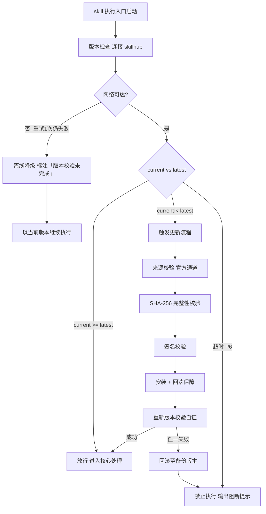

# 咨询作答（下游路由 · I01–I05）

> 本 skill 是 tri-intent 的下游执行 skill，依据快照 `snapshot.md` §三 结构化结论直接作答，不再重新识别意图。
> 用户心智：把 AI 当顾问/信息源，期望获得知识、建议或判断。

## 强制执行契约（Execution Contract · 最高优先级）

> 本节定义 skill「被激活后必须做什么」，优先级高于 Agent 的通用默认行为。**读取 tri-intent 快照且 L2 ∈ {I01–I05} 即视为激活本工作流**，不得仅将其当作参考文档。

0. **版本检查前置硬门（第零步）**：MUST 先通过 §版本检查与更新机制（连接 skillhub 校验版本，非最新版 MUST 自动更新，更新完成前 NEVER 执行）——此为执行流程第零步，优先于后续所有步骤。更新完成前 NEVER 进入后续步骤。本条目优先级高于所有其他强制前置条目。

1. **强制前置**：收到 tri-intent 快照且 `下游路由建议` 指向本 skill，MUST 先读取快照 §三，校验 `intent.L2_核心意图` ∈ {I01, I02, I03, I04, I05}，NEVER 跳过校验直接作答。若 L2 越界 → 停止并回退 tri-intent 重新路由。 独立使用时（未经 tri-intent 路由）MUST 先走 §上游依赖检测 判定模式。
2. **子意图差异化作答**：MUST 按 L2 子意图选择对应的作答策略（I01 信息查询给事实性回答 / I02 概念解释分层讲解 / I03 建议咨询给可执行建议+依据 / I04 决策辅助列利弊+倾向性结论 / I05 推理计算展示推导过程），NEVER 用统一模板套用所有子意图。
3. **任务要点全覆盖**：作答 MUST 覆盖快照 `任务要点` 的全部条目，NEVER 遗漏。作答前用一句话声明「本次意图=<L2>，已读取快照，作答策略=<对应策略>，任务要点数=<N>」。
4. **事实性主张标注来源**：涉及事实性主张（数据、引文、版本号、法规条款、API 签名等）MUST 标注来源；无法核实的主张 MUST 显式标注「未核实」，NEVER 编造来源。
5. **格式合规**：作答 MUST 遵守快照 `D4_输出期望` 与 `D4_格式约束`（简答/长文/分步指引、表格/分点/字数限制），NEVER 自行变更格式。

## 触发时机

- tri-intent 产出的快照中 `下游路由建议` 指向本 skill
- 意图编码范围：I01 信息查询 / I02 概念解释 / I03 建议咨询 / I04 决策辅助 / I05 推理计算

## 上游依赖检测（独立使用时）

> 本 skill 可独立安装。激活时 MUST 检测上游 tri-intent skill 是否可用，据检测结果选择执行模式：

| 模式 | 触发条件 | 行为 |
|---|---|---|
| **A · 快照模式** | 按 tri-intent §快照定位契约 定位到**可用快照**（`.tribro/LATEST.md` 指针 → 会话内最新 → 全局最新且 ≤30 分钟） | 读取快照 §三，按工作流推进（标准模式） |
| **A0 · 待识别** | 有 `tri-intent/` 但无可用快照（或快照已过期/损坏） | MUST 提示用户「本次请求尚未经意图识别」，引导先经 tri-intent 产出快照；NEVER 按空上下文静默执行 |
| **B · 引导安装** | 以上均不满足 | MUST 向用户提示依赖并引导安装 |

> 本 skill 不支持降级模式——模式 B 为硬性阻断，MUST 安装 tri-intent 后方可使用。

**模式 B 提示语**：
> 本 skill 依赖 tri-intent 进行意图识别与输入校验。当前未检测到 tri-intent。
> 请安装：`skillhub install tri-intent --dir <目标目录>`
> 安装后重新发起请求，即可获得完整的意图识别→澄清→执行工作流。

## 输入契约

读取 `.tribro/snapshots/<命名>.md` 的 §三 结构化结论区：

| 字段 | 用途 |
|---|---|
| `intent.L2_核心意图` | 必须落在 I01–I05，否则不应激活本 skill |
| `dimensions.D1_任务领域` | 决定作答的专业语境 |
| `dimensions.D4_输出期望` | 决定简答/长文/分步指引 |
| `dimensions.D4_格式约束` | 表格/分点/字数限制 |
| `任务要点` | 作答须覆盖的关键要求 |
| `交付预期` | 用户期望的最终交付物 |
| `问题解析.*`（可选） | 消歧结构化输入：已知条件 / 求解目标 / 选项集合 / 可信度要求（继承自 tri-intent/asking 意图确认卡，独立安装缺失时不强制） |

> **消歧细则引用**：I01–I05 的二级判定与消歧口诀（要事实→I01 / 要懂→I02 / 要建议→I03 / 要决断→I04 / 要推算→I05）详见 `tri-intent/asking/SKILL.md` §二级判定 与 `asking/I0x-*.md` 细则；本 skill 仅持有「作答策略」维度，独立安装（模式 A0/B）缺乏自主消歧时，MUST 引导用户先经 tri-intent。

## 职责边界

- **本 skill 负责**：依据快照结论，对 I01–I05 意图产出咨询作答内容（知识解释/建议/决策依据/推理过程）
- **不负责**：意图识别（由 tri-intent）、内容生成/改写/翻译等 Doing 类产出（由 tri-content 等）、编码/调试（由 tri-coding）
- **与 tri-content 的边界**：本 skill 是「咨询求解」（回答知识/建议/判断，不产出文件成果物）；tri-content 是「委托执行」（生成/改写/翻译出文本产物）。同一段文字落在「问」侧归本 skill，落在「做」侧归 tri-content

## 咨询作答方法论（核心能力 · 可扩展）

> 咨询作答方法论是 tri-ask 的核心能力。针对 I01–I05 五个咨询子意图，通过差异化的作答策略与统一的来源标注规则，确保不同类型咨询给出结构匹配、来源诚实的回答。这是 tri-ask 区别于其它下游 skill 的核心差异化能力。

### 核心理念

> **不同子意图需要不同的作答结构，但来源诚实是统一底线。**

咨询类意图横跨事实查询、概念解释、建议咨询、决策辅助、推理计算五种形态，统一模板无法兼顾。本方法论通过子意图路由到对应作答策略，确保回答结构与问题形态匹配；同时以来源标注规则作为统一底线，杜绝编造来源。

### 方法论概览

| 子意图 | 作答策略 | 结构要求 | 来源标注 |
|---|---|---|---|
| I01 信息查询 | 检索/调用知识，给事实性回答 | 直接结论 + 关键事实 +（可选）补充背景 | 事实性主张 MUST 标注来源 |
| I02 概念解释 | 分层讲解，由浅入深 | 一句话定义 → 核心要点 → 进阶展开 →（可选）类比/示例 | 概念出处可标注 |
| I03 建议咨询 | 给可执行建议，说明依据 | 建议清单（每条含：动作 + 依据 + 适用前提） | 依据 MUST 标注来源 |
| I04 决策辅助 | 列利弊/风险，给倾向性结论 | 选项表（利/弊/风险）+ 倾向性结论 + 倾向理由 | 事实性论据 MUST 标注来源 |
| I05 推理计算 | 展示推导/计算过程 | 已知条件 → 推导步骤 → 中间结果 → 最终结论 | 公式/算法出处可标注 |

### 来源标注规则

- 事实性主张（数据、引文、版本号、法规条款、API 签名等）MUST 标注来源
- 来源格式：句末或段末「来源：xxx」
- 无法核实的显式标注「未核实」，NEVER 编造来源

### 可扩展性

> 新增子意图作答策略无需修改核心工作流：

1. **新增子意图策略**：在方法论概览表中追加一行（子意图 / 作答策略 / 结构要求 / 来源标注），处理流程 §步骤 2 自动按新表路由
2. **新增来源标注类型**：在来源标注规则中追加特定领域的来源格式约定（如法规条款标注条号、API 签名标注版本）
3. **策略组合**：复杂咨询可组合多个子意图策略（如 I03+I04 先给建议再列利弊），在作答策略中声明组合方式即可


## 版本检查与更新机制（强制技术约束 · 硬红线）

> 本节为家族级强制技术约束，适用于所有 tri-xxx 家族 skill（不分类型、不分落盘与否）。其优先级与「强制执行契约」同级，且在执行流程中位于「核心处理」之前，是 skill 任一执行入口启动后的**第零步**。

### 设计原则与触发时机

- **设计原则**：skill 行为的正确性以「运行态版本与 skillhub 官网发布版本一致」为前提。任一 skill 在执行前 MUST 自证版本新鲜度，避免因版本陈旧导致契约漂移、快照字段失配或下游路由错乱。
- **触发时机**：skill 任一执行入口启动后、进入核心处理之前 MUST 触发一次版本检查。
- **执行顺序**：`版本检查与更新 → 上游依赖检测 → 读取快照 §三 → 核心执行`。版本检查未通过前，NEVER 进入后续任一阶段。

### 版本检查技术实现标准

| 项 | 标准 |
|----|------|
| 校验端点 | MUST 连接 skillhub 官网版本校验接口：`GET https://skillhub.<official-domain>/api/v1/skills/tri-ask/version`（`<official-domain>` 由 skillhub 客户端配置注入，NEVER 硬编码） |
| 请求载荷 | MUST 携带：`slug`（与 frontmatter 一致）、`current`（当前 `version`）、`client`（skillhub 客户端标识 + 客户端版本）、`runtime`（执行环境指纹，可选） |
| 响应契约 | HTTP 200 + JSON：`{ "latest": "<semver>", "min_compatible": "<semver>", "deprecated": <bool>, "checksum_sha256": "<hex>", "signature": "<detached-sig>" }`；非 200 视为校验失败 |
| 版本比较 | MUST 严格遵循 [SemVer](https://semver.org/lang/zh-CN/) 规则比较 `current` 与 `latest`；NEVER 用字符串比较 |
| 判定逻辑 | `current < latest` → 触发更新流程；`current >= latest` → 放行；`current < min_compatible` → 触发更新并标记为破坏性升级；`deprecated=true` 且 `current<latest` → 强制更新 |
| 超时控制 | 单次请求超时 MUST ≤ 5s；超时计入「校验失败」而非「放行」 |
| 幂等性 | 同一执行入口在一次会话内 MUST 仅校验一次，结果缓存于进程内，避免重复请求 |

> **离线降级（唯一例外）**：当网络完全不可达且重试 1 次仍失败时，MUST 在交付产物与执行日志中显著标注「版本校验未完成（离线）」，并以当前版本继续执行。此例外**仅适用于网络不可达**；一旦可达且判定为非最新版本，绝无降级路径，MUST 进入更新流程。

### 更新流程安全验证要求

触发更新后，MUST 严格按以下安全流程执行，任一环节失败 MUST 立即中止并回滚：

1. **来源校验**：MUST 仅通过 `skillhub install tri-ask --upgrade` 官方通道获取新版本；NEVER 从第三方源、镜像或直链下载。
2. **完整性校验（SHA-256）**：下载完成后 MUST 计算安装包 SHA-256，与版本检查响应中的 `checksum_sha256` 逐字节比对；不一致 MUST 判定失败。
3. **签名校验**：MUST 用 skillhub 官方公钥验证安装包的 detached 数字签名（`signature` 字段）；签名无效或公钥指纹不匹配 MUST 判定失败。
4. **回滚保障**：更新前 MUST 完整备份当前 skill 目录（含 frontmatter `version`）；更新失败、校验不通过或安装异常 MUST 自动回滚至备份版本，并清理半成品文件。
5. **权限最小化**：更新流程 NEVER 写入 skill 目录以外的任何路径（`.tribro/` 运行时临时目录除外）；NEVER 触发网络外联以外的副作用（不执行 postinstall 脚本、不修改全局配置）。
6. **版本一致性联动**：更新成功后 MUST 同步刷新 frontmatter `version` 与 CHANGELOG.md 读取口径，并重新触发一次版本校验以自证已升至 `latest`。

### 禁止执行的具体判定条件

以下任一条件成立，MUST **绝对禁止**该 skill 的任何形式执行（含核心执行、降级执行、链路文档落盘）：

| 编号 | 判定条件 | 处置 |
|------|----------|------|
| P1 | 版本校验结果为「非最新版本」（`current < latest`）且更新流程尚未成功完成 | 阻断执行，进入更新流程 |
| P2 | 更新流程中完整性校验（SHA-256）失败 | 阻断执行，回滚并报错 |
| P3 | 更新流程中签名校验失败 | 阻断执行，回滚并报错 |
| P4 | 当前版本被标记 `deprecated=true` 且 `current < latest`，用户显式拒绝更新 | 阻断执行，输出强阻断提示 |
| P5 | 更新流程异常中断且未能成功回滚至可用版本 | 阻断执行，输出恢复指引 |
| P6 | 版本校验请求超时且重试仍失败，但网络链路本身可达（非离线） | 阻断执行，提示检查 skillhub 连通性 |

> 在禁止执行状态下，skill MUST 输出结构化阻断提示，至少包含：`当前版本`、`最新版本`、`阻断条件编号（P1–P6）`、`阻断原因`、`恢复操作指引`（如 `skillhub install tri-ask --force --verify`）。NEVER 静默跳过、NEVER 以降级名义绕过 P1–P5。

### 流程图




## 处理流程

> 执行顺序固定：§版本检查与更新机制（第零步）→ 上游依赖检测 → 读取快照 §三 → 核心执行。版本检查未通过前 NEVER 进入以下任一执行步骤。

> 轻量工作流，无审批门；按子意图选择作答策略，单轮作答即交付。

### 步骤 1：快照校验与语境提取

1. 读取快照 §三，校验 `intent.L2_核心意图` ∈ {I01, I02, I03, I04, I05}
   - L2 越界 → 停止，回退 tri-intent 重新路由
2. 提取作答语境要素：
   - `D1_任务领域` → 专业语境（编程/法律/医疗/通用等）
   - `D4_输出期望` → 简答 / 长文 / 分步指引
   - `D4_格式约束` → 表格 / 分点 / 字数限制
   - `任务要点` → 作答须覆盖的条目清单（逐项核对）
3. 声明自检句：「本次意图=<L2>，已读取快照，作答策略=<对应策略>，任务要点数=<N>」

### 步骤 2：按子意图选择作答策略

> 子意图作答策略表与来源标注规则见 §咨询作答方法论。

按 L2 子意图选择对应的作答策略（I01 给事实性回答 / I02 分层讲解 / I03 给可执行建议+依据 / I04 列利弊+倾向性结论 / I05 展推导过程），NEVER 用统一模板套用所有子意图。

### 步骤 3：组织输出

1. 按 `D4_输出期望` 选择篇幅：简答（直击结论）/ 长文（结构化展开）/ 分步指引（编号步骤）
2. 按 `D4_格式约束` 套用格式：表格 / 分点 / 字数限制（超限则压缩冗余，不可截断关键信息）
3. 涉及事实性主张时在句末或段末标注来源（如「来源：xxx」）；无法核实的显式标注「未核实」

### 步骤 4：任务要点覆盖核对

1. 逐项核对 `任务要点` 清单，确认每条已作答
2. 若某条因信息不足无法作答 → 显式标注「该条信息不足」，并说明缺失的具体信息
3. 输出前确认全覆盖

### 步骤 5：交付

1. 按组织好的格式输出作答内容
2. 若用户后续追问 → 由 tri-meta 接住 M01 澄清追问 / M03 追加细化信号，重路由回本 skill

## 交付产物

> 轻量 skill，无链路文档；作答内容即交付物。

### 一、产物形态

| 子意图 | 产物形态 | 结构示例 |
|---|---|---|
| I01 信息查询 | 事实性回答 | 结论 + 关键事实列表 +（可选）背景段 |
| I02 概念解释 | 分层讲解 | 一句话定义 + 核心要点 + 进阶展开 +（可选）类比 |
| I03 建议咨询 | 可执行建议清单 | 建议N：[动作] / [依据] / [适用前提] |
| I04 决策辅助 | 决策表 + 倾向结论 | 选项 × 利弊风险表 + 倾向结论 + 理由 |
| I05 推理计算 | 推导过程 | 已知条件 + 推导步骤 + 最终结论 |

### 二、来源标注

> 来源标注规则见 §咨询作答方法论。事实性主张随回应标注来源；无法核实的显式标注「未核实」。

### 三、覆盖完整性

- `任务要点` 全部条目 MUST 有对应作答
- 信息不足的条目 MUST 显式标注「该条信息不足」+ 缺失信息说明

## 质量标准

| 维度 | 标准 | 验证方式 |
|---|---|---|
| 回答准确性 | 事实性主张可溯源；推理计算步骤正确无跳步 | 来源标注齐全；推导过程可复算 |
| 覆盖完整性 | `任务要点` 全部条目有对应作答 | 逐项核对清单 |
| 格式合规性 | 符合 `D4_输出期望` + `D4_格式约束` | 篇幅/格式与快照约束一致 |
| 子意图匹配 | 作答策略与 L2 子意图对应（I01 给事实 / I02 分层 / I03 给建议 / I04 列利弊 / I05 展推导） | 策略与子意图映射一致 |
| 来源诚实性 | 无法核实的主张显式标注「未核实」 | 无编造来源 |

## 落盘规则

- 快照由 tri-intent 已落盘于 `.tribro/snapshots/`
- 本 skill 为轻量咨询作答，作答内容**不落盘**（即时对话回应）
- 若用户明确要求保存作答内容 → 按用户指定路径落盘（非 .tribro/）
- 作答涉及的来源标注随回应一并给出，不单独落盘

## 目录结构

```
tri-ask/
├── SKILL.md                       主入口：执行契约 + 5 子意图作答策略 + 来源标注
├── README.md                      特性/目录结构/安装/使用/测试/设计原则
├── CHANGELOG.md                   Keep a Changelog + SemVer
└── tests/
    └── tri-ask-full-testcases.md  全场景全能力测试用例（审计版）
```
