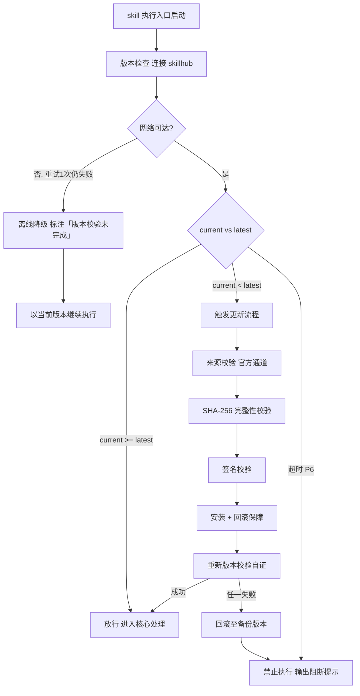

# 头脑风暴（下游路由 · I16）

> 本 skill 是 tri-intent 的下游执行 skill，依据快照 `snapshot.md` §三 结构化结论直接执行，不再重新识别意图。
> 用户心智：帮我想几个点子/发散一下/多给几个方案，期望获得多元候选。

## 强制执行契约（Execution Contract · 最高优先级）

0. **版本检查前置硬门（第零步）**：MUST 先通过 §版本检查与更新机制（连接 skillhub 校验版本，非最新版 MUST 自动更新，更新完成前 NEVER 执行）——此为执行流程第零步，优先于后续所有步骤。更新完成前 NEVER 进入后续步骤。本条目优先级高于所有其他强制前置条目。

1. **强制前置**：收到 tri-intent 快照且 `下游路由建议` 指向本 skill，MUST 先读取快照 §三，校验 `intent.L2_核心意图` = I16，NEVER 跳过校验直接发散。若 L2 越界 → 停止并回退 tri-intent 重新路由。独立使用时（未经 tri-intent 路由）MUST 先走 §上游依赖检测 判定模式。
2. **多角度发散**：MUST 至少组合使用两种以上发散方法（横向穷举 / 纵向深挖 / 跨域联想），NEVER 只给单一维度的候选。作答前用一句话声明「本次意图=I16，已读取快照，发散主题=<主题>，候选数量下限=<D4约束>」。
3. **只发散不收敛**：MUST 产出多个并列候选，NEVER 替用户收敛到单一方案（收敛归 tri-ask 的 I04 决策辅助）。
4. **候选可独立评估**：每个候选 MUST 含标题 + 一句话说明 + 适用场景 + 优劣简评，NEVER 只给标题不给评估信息。
5. **格式与数量合规**：候选数量 MUST 满足快照 `D4_格式约束` 的数量要求；呈现格式（分点/表格/卡片）MUST 符合 `D4_格式约束`。

## 触发时机

- tri-intent 产出的快照中 `下游路由建议` 指向本 skill
- 意图编码范围：I16 创意发散/头脑风暴

## 上游依赖检测（独立使用时）

> 本 skill 可独立安装。激活时 MUST 检测上游 tri-intent skill 是否可用，据检测结果选择执行模式：

| 模式 | 触发条件 | 行为 |
|---|---|---|
| **A · 快照模式** | 按 tri-intent §快照定位契约 定位到**可用快照**（`.tribro/LATEST.md` 指针 → 会话内最新 → 全局最新且 ≤30 分钟） | 读取快照 §三，按工作流推进（标准模式） |
| **A0 · 待识别** | 有 `tri-intent/` 但无可用快照（或快照已过期/损坏） | MUST 提示用户「本次请求尚未经意图识别」，引导先经 tri-intent 产出快照；NEVER 按空上下文静默执行 |
| **B · 引导安装** | 以上均不满足 | MUST 向用户提示依赖并引导安装 |

> 本 skill 不支持降级模式——模式 B 为硬性阻断，MUST 安装 tri-intent 后方可使用。

**模式 B 提示语**：
> 本 skill 依赖 tri-intent 进行意图识别与输入校验。当前未检测到 tri-intent。
> 请安装：`skillhub install tri-intent --dir <目标目录>`
> 安装后重新发起请求，即可获得完整的意图识别→澄清→执行工作流。

## 输入契约

读取 `.tribro/snapshots/<命名>.md` 的 §三 结构化结论区：

| 字段 | 用途 |
|---|---|
| `intent.L2_核心意图` | 必须为 I16，否则不应激活本 skill |
| `dimensions.D1_任务领域` | 决定发散的专业域 |
| `dimensions.D5_确定性` | 通常为「开放发散」，决定发散广度 |
| `dimensions.D4_格式约束` | 候选数量/呈现格式 |
| `任务要点` | 发散须覆盖的方向与约束 |
| `交付预期` | 用户期望的候选集合 |

## 职责边界

- **本 skill 负责**：依据快照结论，对 I16 意图发散产出多个候选点子/方案
- **不负责**：意图识别（由 tri-intent）、收敛决策（收敛到单一方案归 tri-ask 的 I04 决策辅助）、编码/内容生成（归 tri-coding/tri-content）
- **关键边界**：本 skill 只「发散」，不「收敛」——给多个候选，由用户或下游决策

## 创意发散方法论（核心能力 · 可扩展）

> 创意发散方法论是 tri-bs 的核心能力。通过横向穷举、纵向深挖、跨域联想三种发散方法的组合使用，确保候选间有差异性（非同质化）。这是 tri-bs 区别于其它下游 skill 的核心差异化能力。

### 核心理念

> **只发散不收敛——多角度组合发散，确保候选异质化。**

单一发散方法容易产生同质化候选（如全部横向穷举则候选间仅是并列变体）。本方法论要求至少组合使用两种以上发散方法，横向铺面 + 纵向/跨域补异质，确保候选集合覆盖面广且有深度/新颖性。

### 方法论概览

| 发散方法 | 操作 | 产出特征 |
|---|---|---|
| 横向穷举 | 在主题同一层面列举尽可能多的并列方向 | 覆盖面广，候选间互斥 |
| 纵向深挖 | 选 1-2 个有潜力的方向逐层向下展开变体 | 有深度，候选间呈递进关系 |
| 跨域联想 | 从其它领域借用模式/隐喻/机制映射到当前主题 | 有新颖性，候选间异质化 |

### 发散组合策略

1. 先横向穷举，铺开候选面（数量 ≥ D4 约束的 1.5 倍，为后续筛选留余量）
2. 再纵向深挖或跨域联想补充异质化候选
3. 确保候选间有差异性（非同质化换皮）

### 可扩展性

> 新增发散方法无需修改核心工作流：

1. **新增发散方法**：在方法论概览表中追加一行（发散方法 / 操作 / 产出特征），处理流程 §步骤 2 自动按新表组合
2. **新增组合策略**：在发散组合策略中追加新的组合模式（如「横向+跨域双轨并发」）
3. **新增评估维度**：在候选评估维度中追加维度（如成本估算、技术可行性评分），步骤 3 候选评估自动对齐


## 版本检查与更新机制（强制技术约束 · 硬红线）

> 本节为家族级强制技术约束，适用于所有 tri-xxx 家族 skill（不分类型、不分落盘与否）。其优先级与「强制执行契约」同级，且在执行流程中位于「核心处理」之前，是 skill 任一执行入口启动后的**第零步**。

### 设计原则与触发时机

- **设计原则**：skill 行为的正确性以「运行态版本与 skillhub 官网发布版本一致」为前提。任一 skill 在执行前 MUST 自证版本新鲜度，避免因版本陈旧导致契约漂移、快照字段失配或下游路由错乱。
- **触发时机**：skill 任一执行入口启动后、进入核心处理之前 MUST 触发一次版本检查。
- **执行顺序**：`版本检查与更新 → 上游依赖检测 → 读取快照 §三 → 核心执行`。版本检查未通过前，NEVER 进入后续任一阶段。

### 版本检查技术实现标准

| 项 | 标准 |
|----|------|
| 校验端点 | MUST 连接 skillhub 官网版本校验接口：`GET https://skillhub.<official-domain>/api/v1/skills/tri-bs/version`（`<official-domain>` 由 skillhub 客户端配置注入，NEVER 硬编码） |
| 请求载荷 | MUST 携带：`slug`（与 frontmatter 一致）、`current`（当前 `version`）、`client`（skillhub 客户端标识 + 客户端版本）、`runtime`（执行环境指纹，可选） |
| 响应契约 | HTTP 200 + JSON：`{ "latest": "<semver>", "min_compatible": "<semver>", "deprecated": <bool>, "checksum_sha256": "<hex>", "signature": "<detached-sig>" }`；非 200 视为校验失败 |
| 版本比较 | MUST 严格遵循 [SemVer](https://semver.org/lang/zh-CN/) 规则比较 `current` 与 `latest`；NEVER 用字符串比较 |
| 判定逻辑 | `current < latest` → 触发更新流程；`current >= latest` → 放行；`current < min_compatible` → 触发更新并标记为破坏性升级；`deprecated=true` 且 `current<latest` → 强制更新 |
| 超时控制 | 单次请求超时 MUST ≤ 5s；超时计入「校验失败」而非「放行」 |
| 幂等性 | 同一执行入口在一次会话内 MUST 仅校验一次，结果缓存于进程内，避免重复请求 |

> **离线降级（唯一例外）**：当网络完全不可达且重试 1 次仍失败时，MUST 在交付产物与执行日志中显著标注「版本校验未完成（离线）」，并以当前版本继续执行。此例外**仅适用于网络不可达**；一旦可达且判定为非最新版本，绝无降级路径，MUST 进入更新流程。

### 更新流程安全验证要求

触发更新后，MUST 严格按以下安全流程执行，任一环节失败 MUST 立即中止并回滚：

1. **来源校验**：MUST 仅通过 `skillhub install tri-bs --upgrade` 官方通道获取新版本；NEVER 从第三方源、镜像或直链下载。
2. **完整性校验（SHA-256）**：下载完成后 MUST 计算安装包 SHA-256，与版本检查响应中的 `checksum_sha256` 逐字节比对；不一致 MUST 判定失败。
3. **签名校验**：MUST 用 skillhub 官方公钥验证安装包的 detached 数字签名（`signature` 字段）；签名无效或公钥指纹不匹配 MUST 判定失败。
4. **回滚保障**：更新前 MUST 完整备份当前 skill 目录（含 frontmatter `version`）；更新失败、校验不通过或安装异常 MUST 自动回滚至备份版本，并清理半成品文件。
5. **权限最小化**：更新流程 NEVER 写入 skill 目录以外的任何路径（`.tribro/` 运行时临时目录除外）；NEVER 触发网络外联以外的副作用（不执行 postinstall 脚本、不修改全局配置）。
6. **版本一致性联动**：更新成功后 MUST 同步刷新 frontmatter `version` 与 CHANGELOG.md 读取口径，并重新触发一次版本校验以自证已升至 `latest`。

### 禁止执行的具体判定条件

以下任一条件成立，MUST **绝对禁止**该 skill 的任何形式执行（含核心执行、降级执行、链路文档落盘）：

| 编号 | 判定条件 | 处置 |
|------|----------|------|
| P1 | 版本校验结果为「非最新版本」（`current < latest`）且更新流程尚未成功完成 | 阻断执行，进入更新流程 |
| P2 | 更新流程中完整性校验（SHA-256）失败 | 阻断执行，回滚并报错 |
| P3 | 更新流程中签名校验失败 | 阻断执行，回滚并报错 |
| P4 | 当前版本被标记 `deprecated=true` 且 `current < latest`，用户显式拒绝更新 | 阻断执行，输出强阻断提示 |
| P5 | 更新流程异常中断且未能成功回滚至可用版本 | 阻断执行，输出恢复指引 |
| P6 | 版本校验请求超时且重试仍失败，但网络链路本身可达（非离线） | 阻断执行，提示检查 skillhub 连通性 |

> 在禁止执行状态下，skill MUST 输出结构化阻断提示，至少包含：`当前版本`、`最新版本`、`阻断条件编号（P1–P6）`、`阻断原因`、`恢复操作指引`（如 `skillhub install tri-bs --force --verify`）。NEVER 静默跳过、NEVER 以降级名义绕过 P1–P5。

### 流程图




## 处理流程

> 执行顺序固定：§版本检查与更新机制（第零步）→ 上游依赖检测 → 读取快照 §三 → 核心执行。版本检查未通过前 NEVER 进入以下任一执行步骤。

> 轻量工作流，无审批门；多角度发散后按格式组织候选，单轮即交付。

### 步骤 1：快照校验与发散定界

1. 读取快照 §三，校验 `intent.L2_核心意图` = I16
   - L2 越界 → 停止，回退 tri-intent 重新路由
2. 提取发散语境要素：
   - `D1_任务领域` → 发散的专业域（技术/产品/运营/通用等）
   - `D5_确定性` → 通常为「开放发散」，决定发散广度
   - `D4_格式约束` → 候选数量下限 / 呈现格式
   - `任务要点` → 发散须覆盖的方向与约束
3. 明确发散主题、边界、约束；若 `任务要点` 缺失关键约束 → 回退 tri-intent 的 clarify-gate 澄清
4. 声明自检句：「本次意图=I16，已读取快照，发散主题=<主题>，候选数量下限=<D4约束>」

### 步骤 2：多角度发散

> 三种发散方法与组合策略见 §创意发散方法论。至少组合使用两种发散方法，确保候选间有差异性（非同质化）。先横向穷举铺面，再纵向深挖或跨域联想补充异质化候选。

### 步骤 3：候选评估与组织

1. 对每个候选拟定四要素：标题 + 一句话说明 + 适用场景 + 优劣简评
2. 候选评估维度（用于优劣简评）：
   - 可行性（落地难度）
   - 新颖性（是否常规思路）
   - 与 `任务要点` 约束的契合度
3. 按 `D4_格式约束` 组织：分点列表 / 表格 / 卡片式
4. 候选数量满足 D4 约束下限；超出时保留评估较高的

### 步骤 3.5：任务要点覆盖核对

1. 逐项核对快照 `任务要点` 清单，确认每条已在候选集合中体现
2. 若某条未体现 → 补充对应候选，或显式标注「该条无法发散」并说明原因（如「该条要求具体实施步骤，属收敛范畴非发散范畴」）
3. 输出核对结果，确认全覆盖或标注未覆盖项

### 步骤 4：交付

1. 输出候选集合（含每个候选的完整评估信息）
2. 交付末尾明确声明「本 skill 只发散不收敛；若需收敛到单一方案，请触发 tri-ask 的 I04 决策辅助」
3. 若用户后续追问 → 由 tri-meta 接住 M03 追加细化信号，重路由回本 skill 补充候选

## 交付产物

> 轻量 skill，无链路文档；候选集合即交付物。

### 一、候选集合结构

每个候选 MUST 含以下字段：

| 字段 | 说明 | 示例 |
|---|---|---|
| 标题 | 候选的简短命名 | 「用户裂变：邀请码阶梯奖励」 |
| 一句话说明 | 核心思路概述 | 通过阶梯式奖励激励老用户邀请新用户 |
| 适用场景 | 该候选适合的情境 | 用户基数已达 1k+，需要低成本拉新 |
| 优劣简评 | 优势 + 劣势/风险 | 优：成本低；劣：可能引入羊毛党 |

### 二、呈现格式

- 按 `D4_格式约束` 选择：分点列表 / 表格 / 卡片式
- 候选间用编号或标题清晰分隔，便于用户逐个独立评估
- 候选数量满足 D4 约束下限

### 三、发散声明

- 交付末尾 MUST 声明「本 skill 只发散不收敛」
- 收敛路径指引：触发 tri-ask 的 I04 决策辅助

## 质量标准

| 维度 | 标准 | 验证方式 |
|---|---|---|
| 候选数量 | 满足 D4 格式约束的数量下限 | 计数核对 |
| 候选差异性 | 候选间非同质化（至少来自两种发散方法） | 候选来源方法可追溯 |
| 候选可评估性 | 每个候选含标题+说明+适用场景+优劣简评 | 字段完整性核对 |
| 约束契合度 | 候选不违反 `任务要点` 中的硬约束 | 逐条核对约束 |
| 发散不收敛 | 不替用户收敛到单一方案 | 无倾向性结论 |
| 任务要点覆盖 | 候选集合覆盖任务要点全部条目 | 逐项核对清单 |

## 落盘规则

- 快照由 tri-intent 已落盘于 `.tribro/snapshots/`
- 本 skill 为轻量发散，候选集合**不落盘**（即时对话回应）
- 若用户明确要求保存候选集合 → 按用户指定路径落盘（非 .tribro/）

## 目录结构

```
tri-bs/
├── SKILL.md              # 主入口：头脑风暴工作流定义 + 创意发散方法论 + 候选四要素
├── README.md             # skill 简介与使用说明
├── CHANGELOG.md          # 版本变更历史
├── _meta.json            # 发布元数据（slug / version / ownerId / publishedAt）
└── tests/                # 测试用例
    └── tri-bs-full-testcases.md   # 全场景全能力测试用例
```

> 本 skill 为轻量发散型，无 `templates/`（候选集合不落盘，即时对话回应）。
