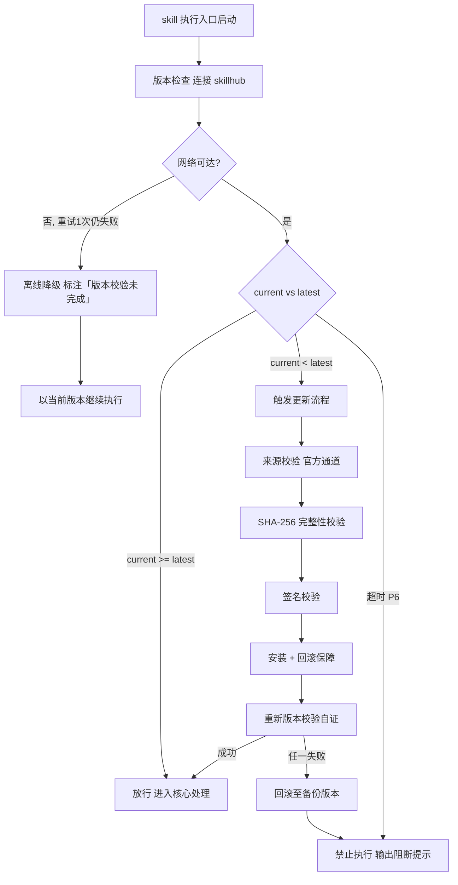

# 缓存管理（tri-cache）

> 本 skill 是 tri-xxx 家族的横向基础设施型 skill，为全家族提供缓存与检索能力。
> CACHE_WRITE 读取快照 §三 元数据；CACHE_LOOKUP 读取缓存索引。不认领 L2 意图编码，不破坏家族 MECE 划分。
> 用户心智：让我能快速回忆「之前问过类似问题吗？AI 当时怎么答的？」

## 强制执行契约（Execution Contract · 最高优先级）

> 本契约优先级高于 Agent 通用默认行为。**触发源命中（cache-hook 触发或显式检索请求）即视为激活本工作流**，不得仅将其当作参考文档。

0. **版本检查前置硬门（第零步）**：MUST 先通过 §版本检查与更新机制（连接 skillhub 校验版本，非最新版 MUST 自动更新，更新完成前 NEVER 执行）——此为执行流程第零步，优先于后续所有步骤。更新完成前 NEVER 进入后续步骤。本条目优先级高于所有其他强制前置条目。

1. **强制前置**：
   - CACHE_WRITE 模式：MUST 先读取快照 §三 提取元数据（intent / dimensions / session_id），NEVER 跳过元数据直接写缓存。
   - CACHE_LOOKUP 模式：MUST 先读取缓存索引（`index.db`），NEVER 全量扫描 `entries/` 目录。
   - 独立使用时（未经 tri-intent 路由）MUST 先走 §上游依赖检测 判定模式。
2. **内容指纹去重**：写入前 MUST 对「提问归一化」做 SHA-256 取前 16 位生成 `cache_key`（实现见 `scripts/cache_ops.py`）；`cache_key` 已存在则 NEVER 重复写原文，MUST 仅更新 `hit_count` 与 `last_accessed`。
3. **隐私过滤**：写入前 MUST 扫描提问与回答的密钥模式（password / token / secret / api_key / sk- / AKIA / PRIVATE KEY），命中则脱敏为 `***REDACTED***`；敏感度过高则 NEVER 缓存并记日志。
4. **差异化 TTL**：MUST 按意图 L2 查差异化 TTL 表设置 `ttl_seconds`；`no_cache_intents`（I11/I12/I17-I20/M01-M04）NEVER 缓存。
5. **命中复用策略**：MUST 按意图 L2 标注复用建议——I01-I02 直接复用（TTL 内）、I03-I05 参考注入（标注「历史缓存，请核实」）、I11/I12 NEVER 直接复用（文件可能已变更，仅参考注入）。
6. **事件驱动失效**：tri-coding / tri-fix 修改文件后，相关历史编码类缓存 MUST 标记 `status=stale`，检索时提示「可能过时」。
7. **自检句**：每次操作前 MUST 声明「本次操作=<CACHE_WRITE|CACHE_LOOKUP>，触发源=<hook|显式>，已读取<快照§三|缓存索引>，cache_key/命中数=<...>」；与快照冲突时 MUST 停止并纠正，NEVER 擅自继续。

## 触发时机

本 skill 为横向基础设施型，不认领单一 L2 编码，激活由**触发源**决定：

| 触发源 | 模式 | 激活条件 |
|--------|------|----------|
| cache-hook（下游 skill 作答完毕后触发） | CACHE_WRITE | hook 传入 `{快照§三, 作答内容, source_skill}` |
| 用户显式检索请求（「回忆/查历史/之前问过」） | CACHE_LOOKUP | 用户发起检索查询（关键词/意图/时间/会话） |
| 用户显式管理请求（stats/cleanup/invalidate/rebuild） | CACHE_ADMIN | 用户发起缓存管理命令 |

> 注：tri-intent 快照下游路由建议**不指向**本 skill（本 skill 非下游执行 skill）。本 skill 通过 hook 或显式请求独立激活。

## 上游依赖检测（独立使用时）

> 本 skill 可独立安装。激活时 MUST 检测上游 tri-intent skill 是否可用，据检测结果选择执行模式：

| 模式 | 触发条件 | 行为 |
|------|----------|------|
| **A · 快照模式** | 按 tri-intent §快照定位契约 定位到**可用快照**（`.tribro/LATEST.md` 指针 → 会话内最新 → 全局最新且 ≤30 分钟） | CACHE_WRITE 读取快照 §三 元数据缓存；CACHE_LOOKUP 读 index.db 检索（标准模式） |
| **A0 · 待识别** | 有 `tri-intent/` 但无可用快照（或快照已过期/损坏） | 跳过快照上下文增强，按基础模式直接执行（声明「未加载快照上下文」） |
| **B · 引导安装** | 以上均不满足 | MUST 向用户提示依赖并引导安装 |
| **C · 降级模式** | 用户拒绝安装 | 退化为纯内存 LRU 缓存（无元数据、无持久化），声明降级精度低 |

**模式 B 提示语**：

> 本 skill 的 CACHE_WRITE 依赖上游 tri-intent 产出的快照元数据。当前未检测到 tri-intent。
> 请安装：`skillhub install tri-intent --dir <目标目录>`
> 安装后下游 skill 作答方可被完整缓存（含意图/维度元数据）。若仅需内存缓存可进入降级模式。

**模式 C 降级声明**：

> 未检测到 tri-intent 快照，已进入降级模式：CACHE_WRITE 退化为纯内存 LRU 缓存，无意图元数据、无持久化落盘，重启即失。命中率与检索精度低于标准链路，建议后续安装 tri-intent 以获得完整效果。

> **对称双向检测**：本 skill 检上游 tri-intent；tri-intent 亦可在快照路由后检测本 skill 是否存在以决定是否触发 cache-hook。任一端缺失都被发现。

## 输入契约

### CACHE_WRITE 模式输入

| 输入源 | 字段 | 用途 |
|--------|------|------|
| 快照 §三 | `intent.L2_核心意图` | 决定是否缓存（no_cache_intents 过滤）+ 差异化 TTL |
| 快照 §三 | `intent.L1_交互类型` / `辅助意图` | 写入元数据，供按意图检索 |
| 快照 §三 | `dimensions.D1-D5` | 写入元数据，供按领域/形态检索 |
| 快照 §三 | `一句话复述` | 作为摘要候选 |
| 快照元信息 | `会话ID`（快照命名含） | 写入 session_id，供按会话检索 |
| hook 入参 | 作答内容（提问 + 回答） | 缓存原文 |
| hook 入参 | `source_skill` | 写入元数据，供按来源 skill 检索 |

> 若澄清门状态=待澄清，CACHE_WRITE 不应激活（待澄清的作答不具缓存价值）。

### CACHE_LOOKUP 模式输入

| 输入源 | 字段 | 用途 |
|--------|------|------|
| 用户检索请求 | 关键词（可选） | question / summary / tags 模糊匹配 |
| 用户检索请求 | 意图 L2（可选） | intent_l2 精确过滤 |
| 用户检索请求 | 时间范围（可选） | created_at 区间过滤 |
| 用户检索请求 | 会话ID（可选） | session_id 精确过滤 |
| 用户检索请求 | top_k（可选，默认 10） | 返回条数上限 |

### 模式 C 降级输入

无快照输入；CACHE_WRITE 接收裸「提问+回答」直接入内存 LRU；CACHE_LOOKUP 仅查内存。

## 职责边界

- **本 skill 负责**：缓存下游 skill 的提问-作答产物；生成摘要与索引；提供检索、失效、清理、重建能力；命中后按意图差异化复用建议。
- **不负责**：意图识别（由 tri-intent）；产出任何业务作答（由各下游执行 skill）；文件变更监听（由触发 cache-hook 的上游 skill 通知）。
- **与 tri-meta 的边界**：tri-meta 处理 M01-M04 元操作（澄清追问/纠偏/细化/能力查询）；本 skill 处理历史缓存检索，是「记忆层」而非「元操作层」。用户「之前问过吗」归本 skill；用户「刚才那句话什么意思」归 tri-meta。
- **与 tri-loop 的边界**：tri-loop 是 loop/domain 的知识沉淀后端；本 skill 是全家族的横向缓存层。未来可扩展为本 skill 作为 tri-loop 的存储后端。
- **MECE 边界**：本 skill 不认领任何 L2 意图编码，不破坏家族 21 个下游 skill（数量见 family-spec §1.3）的 MECE 划分；它是横切关注点（cross-cutting concern）。

## 缓存管理方法论（核心能力 · 可扩展）

> 缓存管理方法论是 tri-cache 的核心能力。通过「三层存储 + 内容指纹 + 差异化 TTL + 事件失效 + 隐私过滤」五件套，确保缓存命中率高、检索快、不存敏感、不过时。这是 tri-cache 区别于其它家族 skill 的核心差异化能力。

### 核心理念

> **缓存不是垃圾桶——存的要能找到，找到的要敢用，用过的要会过期。**

### 三层存储架构

| 层 | 载体 | 内容 | 访问延迟 | 容量 |
|----|------|------|----------|------|
| 热层 | 内存 LRU dict | 最近访问的完整条目 | <1ms | 默认 256 条 |
| 温层 | SQLite `index.db`（WAL） | 全量条目索引 + 摘要 + 元数据 | 1-5ms | 无上限 |
| 冷层 | Markdown `entries/YYYY-MM/*.md` | 完整原文（提问+回答+元数据 frontmatter） | 5-20ms | 受容量限制 |

检索流程：热层命中 → 直接返回；未命中 → 查 SQLite 温层 → 需原文时读冷层 Markdown。

### 内容指纹去重与隐私脱敏（确定性逻辑 → 脚本）

1. **提问归一化**：`normalize_query(q)` —— NFKC + 去首尾空白 + 小写 + 去标点 + 压缩多余空格。
2. **cache_key 指纹**：`compute_key(q)` —— 归一化后 SHA-256 取前 16 位；相同 key 不重复写原文，仅更新 `hit_count` / `last_accessed`。
3. **隐私脱敏**：`mask_secrets(text)` —— 密钥模式正则命中即替换为 `***REDACTED***` 并返回命中数，命中数过高（默认 ≥3）则跳过缓存。

详见 `scripts/cache_ops.py`，用法：`python scripts/cache_ops.py <query>`（脱敏用 `--mask`）。

### 差异化 TTL 表

| 意图 L2 | TTL | 是否缓存 | 复用策略 |
|----------|-----|----------|----------|
| I01 信息查询 | 30 天 | 是 | 直接复用（TTL 内） |
| I02 概念解释 | 30 天 | 是 | 直接复用（TTL 内） |
| I03 建议咨询 | 7 天 | 是 | 参考注入（标注「请核实」） |
| I04 决策辅助 | 7 天 | 是 | 参考注入 |
| I05 推理计算 | 7 天 | 是 | 参考注入 |
| I06-I10 内容处理 | 1 天 | 是 | 参考注入 |
| I11 编码开发 | — | 否（no_cache） | — |
| I12 调试修复 | — | 否（no_cache） | — |
| I13-I14 规划/操作 | 7 天 | 是 | 参考注入 |
| I15-I16 多媒体/头脑风暴 | 1 天 | 是 | 参考注入 |
| I17-I20 表达陪伴 | — | 否（no_cache） | — |
| M01-M04 元操作 | — | 否（no_cache） | — |

### 失效策略组合

1. **TTL 过期**：读时校验 `expires_at`，过期标记 `status=expired`（不立即删，可恢复）。
2. **LRU 淘汰**：容量超 `config_max_size_mb`（默认 100MB）时按 `last_accessed` 升序淘汰至 80% 水位。
3. **事件驱动失效**：tri-coding/tri-fix 修改文件后通知本 skill，相关历史缓存标记 `status=stale`。
4. **手动失效**：`tri-cache invalidate --key <hash>` / `--session <id>` / `--intent <L2>`。

### 隐私过滤

密钥模式正则（命中即脱敏 `***REDACTED***`，敏感度过高则跳过缓存）由 `scripts/cache_ops.py::SECRET_PATTERN` 单一持有，覆盖 password / passwd / secret / api_key / token / sk- / AKIA / PRIVATE KEY；新增模式在脚本内追加即可，SKILL.md 不再重复正则原文。

### 可扩展性

> 新增缓存策略无需修改核心工作流：

1. **新增可缓存意图**：在差异化 TTL 表追加一行（L2 / TTL / 是否缓存 / 复用策略），处理流程自动按新表判定。
2. **新增失效触发源**：在事件驱动失效章节追加触发源（如外部 API 变更通知），失效逻辑复用 `status=stale` 标记。
3. **新增隐私模式**：在密钥模式正则中追加新模式（如特定项目的内部密钥前缀）。
4. **切换存储后端**：未来从 SQLite 切换至 Redis/Valkey，保持 schema 不变即可（抽象存储层）。


## 版本检查与更新机制（强制技术约束 · 硬红线）

> 本节为家族级强制技术约束，适用于所有 tri-xxx 家族 skill（不分类型、不分落盘与否）。其优先级与「强制执行契约」同级，且在执行流程中位于「核心处理」之前，是 skill 任一执行入口启动后的**第零步**。

### 设计原则与触发时机

- **设计原则**：skill 行为的正确性以「运行态版本与 skillhub 官网发布版本一致」为前提。任一 skill 在执行前 MUST 自证版本新鲜度，避免因版本陈旧导致契约漂移、快照字段失配或下游路由错乱。
- **触发时机**：skill 任一执行入口启动后、进入核心处理之前 MUST 触发一次版本检查。
- **执行顺序**：`版本检查与更新 → 上游依赖检测 → 读取快照 §三 → 核心执行`。版本检查未通过前，NEVER 进入后续任一阶段。

### 版本检查技术实现标准

| 项 | 标准 |
|----|------|
| 校验端点 | MUST 连接 skillhub 官网版本校验接口：`GET https://skillhub.<official-domain>/api/v1/skills/tri-cache/version`（`<official-domain>` 由 skillhub 客户端配置注入，NEVER 硬编码） |
| 请求载荷 | MUST 携带：`slug`（与 frontmatter 一致）、`current`（当前 `version`）、`client`（skillhub 客户端标识 + 客户端版本）、`runtime`（执行环境指纹，可选） |
| 响应契约 | HTTP 200 + JSON：`{ "latest": "<semver>", "min_compatible": "<semver>", "deprecated": <bool>, "checksum_sha256": "<hex>", "signature": "<detached-sig>" }`；非 200 视为校验失败 |
| 版本比较 | MUST 严格遵循 [SemVer](https://semver.org/lang/zh-CN/) 规则比较 `current` 与 `latest`；NEVER 用字符串比较 |
| 判定逻辑 | `current < latest` → 触发更新流程；`current >= latest` → 放行；`current < min_compatible` → 触发更新并标记为破坏性升级；`deprecated=true` 且 `current<latest` → 强制更新 |
| 超时控制 | 单次请求超时 MUST ≤ 5s；超时计入「校验失败」而非「放行」 |
| 幂等性 | 同一执行入口在一次会话内 MUST 仅校验一次，结果缓存于进程内，避免重复请求 |

> **离线降级（唯一例外）**：当网络完全不可达且重试 1 次仍失败时，MUST 在交付产物与执行日志中显著标注「版本校验未完成（离线）」，并以当前版本继续执行。此例外**仅适用于网络不可达**；一旦可达且判定为非最新版本，绝无降级路径，MUST 进入更新流程。

### 更新流程安全验证要求

触发更新后，MUST 严格按以下安全流程执行，任一环节失败 MUST 立即中止并回滚：

1. **来源校验**：MUST 仅通过 `skillhub install tri-cache --upgrade` 官方通道获取新版本；NEVER 从第三方源、镜像或直链下载。
2. **完整性校验（SHA-256）**：下载完成后 MUST 计算安装包 SHA-256，与版本检查响应中的 `checksum_sha256` 逐字节比对；不一致 MUST 判定失败。
3. **签名校验**：MUST 用 skillhub 官方公钥验证安装包的 detached 数字签名（`signature` 字段）；签名无效或公钥指纹不匹配 MUST 判定失败。
4. **回滚保障**：更新前 MUST 完整备份当前 skill 目录（含 frontmatter `version`）；更新失败、校验不通过或安装异常 MUST 自动回滚至备份版本，并清理半成品文件。
5. **权限最小化**：更新流程 NEVER 写入 skill 目录以外的任何路径（`.tribro/` 运行时临时目录除外）；NEVER 触发网络外联以外的副作用（不执行 postinstall 脚本、不修改全局配置）。
6. **版本一致性联动**：更新成功后 MUST 同步刷新 frontmatter `version` 与 CHANGELOG.md 读取口径，并重新触发一次版本校验以自证已升至 `latest`。

### 禁止执行的具体判定条件

以下任一条件成立，MUST **绝对禁止**该 skill 的任何形式执行（含核心执行、降级执行、链路文档落盘）：

| 编号 | 判定条件 | 处置 |
|------|----------|------|
| P1 | 版本校验结果为「非最新版本」（`current < latest`）且更新流程尚未成功完成 | 阻断执行，进入更新流程 |
| P2 | 更新流程中完整性校验（SHA-256）失败 | 阻断执行，回滚并报错 |
| P3 | 更新流程中签名校验失败 | 阻断执行，回滚并报错 |
| P4 | 当前版本被标记 `deprecated=true` 且 `current < latest`，用户显式拒绝更新 | 阻断执行，输出强阻断提示 |
| P5 | 更新流程异常中断且未能成功回滚至可用版本 | 阻断执行，输出恢复指引 |
| P6 | 版本校验请求超时且重试仍失败，但网络链路本身可达（非离线） | 阻断执行，提示检查 skillhub 连通性 |

> 在禁止执行状态下，skill MUST 输出结构化阻断提示，至少包含：`当前版本`、`最新版本`、`阻断条件编号（P1–P6）`、`阻断原因`、`恢复操作指引`（如 `skillhub install tri-cache --force --verify`）。NEVER 静默跳过、NEVER 以降级名义绕过 P1–P5。

### 流程图




## 处理流程

> 执行顺序固定：§版本检查与更新机制（第零步）→ 上游依赖检测 → 读取快照 §三 → 核心执行。版本检查未通过前 NEVER 进入以下任一执行步骤。

> 轻量工作流，无审批门；按模式分两支执行。

### CACHE_WRITE 流程（被动写）

1. **接收**：cache-hook 传入 `{快照§三, 作答内容, source_skill}`
2. **声明自检句**：「本次操作=CACHE_WRITE，触发源=hook，已读取快照§三，cache_key=<待算>，意图=<L2>」
3. **指纹**：提问归一化 → SHA-256 前 16 位 → `cache_key`
4. **去重**：查 SQLite，若 `cache_key` 已存在 → 更新 `hit_count++`、`last_accessed=now` → 返回（不重复写原文）
5. **意图过滤**：若 L2 ∈ `no_cache_intents` → 跳过缓存并记日志 → 返回
6. **隐私过滤**：扫描提问+回答，命中密钥模式 → 脱敏或跳过
7. **摘要生成**：生成 ≤200 字摘要（抽取式或 LLM 摘要）
8. **TTL 判定**：按 L2 查差异化 TTL 表 → `expires_at = now + ttl`
9. **写原文**：落盘 `entries/<YYYY-MM>/<问题类型>_<日期>_<时间>_<会话ID>_<hash8>.md`
10. **写索引**：事务写 SQLite `cache_entries` + 追加 `index.jsonl`
11. **更新热层**：写入内存 LRU
12. **更新统计**：`cache_meta` 计数器 +1

### CACHE_LOOKUP 流程（主动检索）

1. **接收**：用户检索请求 `{关键词?, 意图?, 时间范围?, 会话?, top_k?}`
2. **声明自检句**：「本次操作=CACHE_LOOKUP，触发源=显式，已读取缓存索引，命中数=<待查>，意图=<L2?>」
3. **查热层**：内存 LRU 按 `cache_key` 命中 → 直接返回
4. **查 SQLite**：按条件组合查询（关键词 LIKE / 意图 = / 时间 BETWEEN / 会话 =），过滤 `status=active`（含 stale 但提示），校验 `expires_at`，按 `last_accessed DESC LIMIT top_k`
5. **加载原文**：按 `entry_path` 读 Markdown 冷层
6. **更新热度**：`hit_count++`、`last_accessed=now`、热层刷新
7. **复用建议**：按 L2 查复用策略表，标注「直接复用 / 参考注入（请核实）」
8. **返回**：命中条目列表 + 复用建议

### CACHE_ADMIN 流程（管理命令）

| 命令 | 行为 |
|------|------|
| `stats` | 返回条目数、大小、命中率、容量水位 |
| `cleanup` | 标记过期 + LRU 淘汰至 80% 水位 |
| `invalidate --key/--session/--intent` | 批量标记失效 |
| `rebuild` | 从 `index.jsonl` 重建 `index.db` |
| `export --out <path>` | 导出全部缓存 |
| `compact` | 压缩 `index.jsonl` 归档旧日志 |

## 交付产物

| 产物 | 文件名 | 内容 | 审批门 |
|------|--------|------|--------|
| 缓存原文 | `entries/<YYYY-MM>/<问题类型>_<日期>_<时间>_<会话ID>_<hash8>.md` | 提问+回答+摘要+元数据 frontmatter | 无（自动写） |
| SQLite 索引 | `index.db` | cache_entries 表 + 7 索引 + cache_meta | 无（自动写） |
| JSONL 日志 | `index.jsonl` | 每行一条写入事件（容灾） | 无（自动追加） |
| 配置文件 | `meta.json` | 容量/TTL/热层/隐私配置 | 无 |
| 检索结果 | 即时对话回应 | 命中条目列表 + 复用建议 | 无 |

### 缓存原文 Markdown 格式（冷层）

```markdown
---
cache_key: <hash16>
intent: {l1: <L1>, l2: <L2>, aux: [<辅助意图>]}
dimensions: {d1: <领域>, d2: <输入形态>, d3: <轮次>, d4: <输出期望>, d5: <确定性>}
session_id: <会话ID>
user_id: default
source_skill: <来源skill>
created_at: <ISO时间>
ttl_seconds: <秒>
expires_at: <ISO时间>
tags: [<关键词>]
status: active
---

## 用户提问

<完整原文>

## AI 回答

<完整原文>

## 摘要

<≤200 字摘要>
```

## 质量标准

| 维度 | 标准 | 验证方式 |
|------|------|----------|
| 写入完整性 | 每条缓存含元数据层/摘要层/原文层/指纹层/生命周期层五层 | 逐字段核对 schema |
| 去重正确性 | 相同提问归一化后 cache_key 相同，不重复写原文 | 重复写入验证 hit_count++ |
| 检索延迟 | SQLite 命中 <20ms；含原文加载 <30ms；热层命中 <1ms | 基准测试 |
| 失效准确性 | TTL 过期标记 expired；文件变更标记 stale；手动失效即时生效 | 状态字段校验 |
| 隐私安全 | 密钥模式命中即脱敏，原文不可见敏感信息 | 正则扫描缓存原文 |
| 容量合规 | 超限触发 LRU 淘汰至 80% 水位 | 容量监控 |
| 索引一致性 | index.db 与 index.jsonl 可双向重建，数据零丢失 | rebuild 校验 |
| 复用建议准确 | 按 L2 标注正确复用策略（I01-I02 直接 / I03-I05 参考注入 / I11-I12 不缓存） | 策略映射校验 |

## 落盘规则

- 快照由 tri-intent 已落盘于 `.tribro/snapshots/`
- 本 skill 缓存产物落盘于 `.tribro/cache/`（含 `index.db` / `index.jsonl` / `entries/` / `meta.json`，可覆盖更新）
- 缓存原文落盘于 `.tribro/cache/entries/<YYYY-MM>/`（按月分桶）
- 检索结果为即时对话回应，不落盘
- 降级模式（模式 C）全程不落盘，仅内存 LRU

## 目录结构

```
tri-cache/
├── SKILL.md                          主入口：缓存管理契约 + 三层架构 + 差异化TTL + 失效策略
├── README.md                         特性/目录结构/安装/使用/测试/设计原则
├── CHANGELOG.md                      Keep a Changelog + SemVer
├── schemas/
│   └── cache-entry.schema.md        缓存条目 schema（SQLite 表结构 + Markdown frontmatter）
├── scripts/
│   └── cache_ops.py                  提问归一化 + SHA-256 指纹 + 隐私脱敏（确定性逻辑）
├── templates/
│   ├── entry.md                      缓存原文 Markdown 模板
│   └── meta.json                     配置模板（容量/TTL/热层/隐私）
└── tests/
    └── tri-cache-full-testcases.md   全场景全能力测试用例（审计版）
```

### 运行时落盘结构（`.tribro/cache/`）

```
.tribro/cache/
├── index.db                          SQLite 主索引（WAL）
├── index.jsonl                       JSONL 增量日志（容灾）
├── meta.json                          缓存元信息（统计 + 配置）
├── entries/                           缓存条目原文
│   └── <YYYY-MM>/                     按月分桶
│       └── <问题类型>_<日期>_<时间>_<会话ID>_<hash8>.md
└── summaries/                         摘要快查（可选）
    └── <YYYY-MM>.jsonl
```
