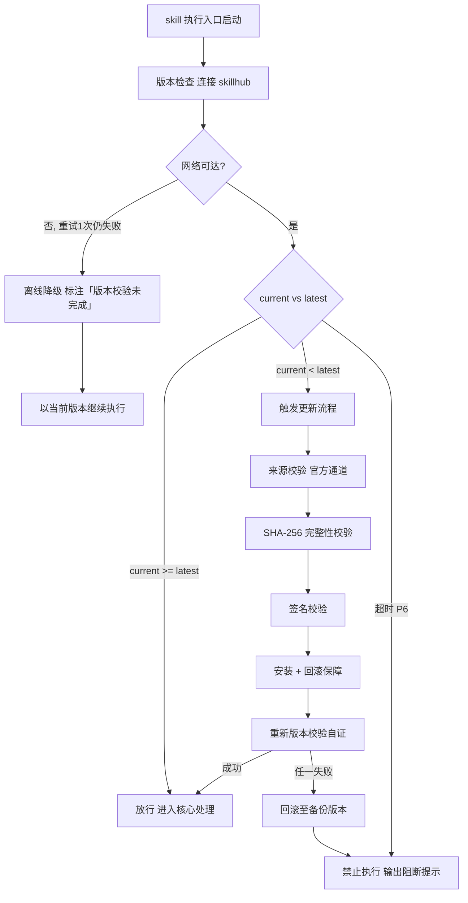

# 审计清单生成（下游路由 · I10 audit-checklist 子类）

> 本 skill 是 tri-intent 的下游执行 skill，依据快照 `snapshot.md` §三 结构化结论直接执行，不再重新识别意图。
> 用户心智：把 AI 当质量保障工程师，期望拿到一份能逐项勾选的 checklist，确保改动/审查/测试不遗漏，而非一份只有结论的报告。

## 强制执行契约（Execution Contract · 最高优先级）

0. **版本检查前置硬门（第零步）**：MUST 先通过 §版本检查与更新机制（连接 skillhub 校验版本，非最新版 MUST 自动更新，更新完成前 NEVER 执行）——此为执行流程第零步，优先于后续所有步骤。更新完成前 NEVER 进入后续步骤。本条目优先级高于所有其他强制前置条目。

1. **强制前置**：激活后 MUST 先读取快照 §三，校验 `intent.L2_核心意图` = I10 且 `L3_子意图` = audit-checklist；越界（非 I10 或 L3 不匹配）MUST 停止并回退 tri-intent 重路由，NEVER 静默按空上下文执行。独立使用时（未经 tri-intent 路由）MUST 先走 §上游依赖检测 判定模式。
2. **四维审计铁律**：MUST 完整覆盖四维审计（改动点/审查点/测试点/测试步骤），任一维度缺失 = 半成品，NEVER 落盘交付。维度定义详见 `references/audit-checklist-template.md`。
3. **双审批门 + 三种输入模式**：
   - **门①（审计范围确认）**：识别 Git 输入模式（暂存区/工作区/commit id）后，MUST 向用户复述审计范围（输入模式/diff 统计/受影响文件清单/四维审计计划），用户确认通过方可进入分析。**禁跳门抢跑**。
   - **审计执行**：逐维生成 checklist，每维含检查项 + 复选框 + 严重程度标签（与 tri-review 对齐：BLOCKER/MAJOR/MINOR）。
   - **门②（checklist 交付确认）**：checklist 落盘后 MUST 向用户呈现文件路径 + 四维统计摘要 + 总检查项数，用户确认通过方为交付完成。
   - **三种输入模式铁律**：MUST 明确识别并使用正确的 Git 输入模式，命令差异见 `references/git-diff-commands.md`；NEVER 在暂存区模式使用工作区 diff 命令。
4. **职责边界**：本 skill 负责「读快照 → 识别 Git 输入模式 → 解析 diff → 四维审计 → 生成 Markdown checklist → 落盘交付」。意图识别（由 tri-intent）、编码开发（由 tri-coding）、代码审查执行（由 tri-review）、调试修复（由 tri-fix）不属于本 skill。**关键边界**：本 skill「只生成清单不执行审查」——清单供开发者自检或 tri-review 作为审查依据；执行审查由 tri-review 完成。
5. **自检**：作答前用一句话声明「本次意图=I10，L3=audit-checklist，已读取快照，当前阶段=<模式识别/门①/审计/清单生成/门②>，四维覆盖=<已覆盖/缺失X维>，Git输入模式=<暂存区/工作区/commit-id>，落盘=<路径/未落盘>」，若与上述规则冲突则停止并纠正。

## 触发时机

- tri-intent 产出的快照中 `下游路由建议` 指向本 skill（L2=I10、L3=audit-checklist）
- 用户直接说「生成审计 checklist」「项目自检清单」「改动审查测试清单」「质量保障 checklist」「commit 提交前检查清单」等 audit-checklist 语义

## 上游依赖检测（独立使用时）

> 本 skill 可独立安装。激活时 MUST 检测上游 tri-intent skill 是否可用，据检测结果选择执行模式：

| 模式 | 触发条件 | 行为 |
|---|---|---|
| **A · 快照模式** | 按 tri-intent §快照定位契约 定位到**可用快照**（`.tribro/LATEST.md` 指针 → 会话内最新 → 全局最新且 ≤30 分钟）且 `下游路由建议` 指向本 skill | 读取快照 §三，按工作流推进（标准模式） |
| **A0 · 待识别** | 有 `tri-intent/` 但无可用快照（或快照已过期/损坏） | MUST 提示用户「本次请求尚未经意图识别」，引导先经 tri-intent 产出快照；NEVER 按空上下文静默执行 |
| **B · 引导安装** | 以上均不满足 | MUST 向用户提示依赖并引导安装 |
| **C · 降级模式** | 用户明确拒绝安装 | 从用户请求自构造等价输入（意图判定默认 I10/L3=audit-checklist + 任务要点 + 交付预期 + Git 输入模式），声明「当前为降级模式，意图识别精度低于完整工作流，生成的 checklist 仍需人工复核检查项完整性」 |

**模式 B 提示语**：
> 本 skill 依赖 tri-intent 进行意图识别与输入校验。当前未检测到 tri-intent。
> 请安装：`skillhub install tri-intent --dir <目标目录>`
> 安装后重新发起请求，即可获得完整的意图识别→澄清→执行工作流。

**模式 C 降级声明**：
> 用户明确拒绝安装后，从用户请求自构造等价输入（意图判定默认 I10/L3=audit-checklist + 任务要点 + 交付预期 + Git 输入模式），声明「当前为降级模式，意图识别精度低于完整工作流，生成的 checklist 仍需人工复核检查项完整性」。

## 输入契约

读取 `.tribro/snapshots/<命名>.md` 的 §三 结构化结论区：

| 字段 | 用途 |
|---|---|
| `intent.L2_核心意图` | 确认为 I10，否则不应激活本 skill |
| `intent.L3_子意图` | 确认为 audit-checklist，否则不应激活本 skill |
| `dimensions.D1_任务领域` | 决定技术栈语境（应为「软件工程/质量保障」） |
| `dimensions.D2_输入形态` | Git 输入模式（暂存区/工作区/commit id）+ 可选 commit hash |
| `dimensions.D4_输出期望` | 应为「checklist」或「自检清单」 |
| `任务要点` | Git 输入模式 + commit id（若指定）+ 关注维度（默认四维全覆盖）+ 输出文件名 |
| `交付预期` | 用户期望的 checklist 粒度与覆盖范围 |

> 若快照 `澄清门状态` = 待澄清，不应激活本 skill——先由 tri-intent 的 clarify-gate 完成澄清。

> **模式 C 降级输入**：从用户原始请求提取 Git 输入模式（默认工作区）+ commit id（若有）+ 关注维度（默认四维全覆盖）+ 输出文件名（默认 `audit-checklist_<日期>_<时间>.md`）。

## 职责边界

- **本 skill 负责**：依据快照或用户直接请求，识别 Git 输入模式 → 解析 diff → 四维审计 → 生成 Markdown checklist → 落盘交付
- **不负责**：意图识别（由 tri-intent）、编码开发（由 tri-coding）、代码审查执行（由 tri-review）、调试修复（由 tri-fix）、生成审查报告（由 tri-review）
- **关键边界**：本 skill「只生成清单不执行审查」——checklist 供开发者自检或作为 tri-review 的审查依据；执行审查（逐项判定 PASS/FAIL）由 tri-review 完成
- **与 tri-review 的边界**：tri-checklist 是「审查前的清单生成」（I10 audit-checklist），产出 checklist；tri-review 是「审查执行本身」（CR 特殊路由），产出审查报告。两者可串联：tri-checklist 生成清单 → 开发者自检 → tri-review 执行审查
- **与 tri-html 的边界**：tri-checklist 是「项目审计清单」（I10 audit-checklist），产出 Markdown checklist；tri-html 是「项目架构可视化」（I10 arch-viz），产出 HTML 报告。两者同属 I10 子类但对象不同（改动/审查点 vs 整体架构）、产出不同（checklist vs HTML）

## tri-checklist 方法论（核心能力 · 可扩展）

> 四维审计 + 三种 Git 输入模式 + Markdown 复选框产出，形成「识别模式 → 解析 diff → 四维审计 → 组装 checklist」的完整方法论。

### 核心理念

> **清单是质量保障的脚手架，复选框是注意力的锚点。** 没有清单的审查容易遗漏，有清单的审查可逐项确认；Markdown 复选框让清单可在 IDE/GitHub 直接渲染勾选。

### 四维审计框架

| 维度 | 核心问题 | 数据来源 | 产出 | 详见 |
|---|---|---|---|---|
| 1. 改动点（Changes） | 改了什么？哪些文件/函数/逻辑？ | `git diff` 解析 | 改动文件清单 + 改动函数清单 + 改动类型（新增/修改/删除） | `references/audit-checklist-template.md` §1 |
| 2. 审查点（Review） | 改动是否正确？质量如何？ | 改动点 + 代码规范 | 代码审查检查项（功能/质量/安全/性能，与 tri-review Phase 1+2 对齐） | `references/audit-checklist-template.md` §2 |
| 3. 测试点（Test） | 测试覆盖够吗？边界条件？ | 改动点 + 测试文件 | 测试覆盖检查项（单元/集成/边界/回归） | `references/audit-checklist-template.md` §3 |
| 4. 测试步骤（Test Steps） | 手动测试怎么走？ | 改动点 + 功能场景 | 手动测试步骤清单（按场景分组的步骤） | `references/audit-checklist-template.md` §4 |

> 每维度的检查项模板、严重程度标签、数据采集方式详见 `references/audit-checklist-template.md`；Git diff 命令参考详见 `references/git-diff-commands.md`。

### 三种 Git 输入模式

| 模式 | 命令 | 适用场景 | 详见 |
|---|---|---|---|
| 暂存区模式 | `git diff --cached` | 提交前自检（已 git add 未 commit） | `references/git-diff-commands.md` §暂存区 |
| 工作区模式 | `git diff` + `git status` | 开发中自检（已改未 add） | `references/git-diff-commands.md` §工作区 |
| commit id 模式 | `git diff <commit>..HEAD` | 审查特定 commit 范围 | `references/git-diff-commands.md` §commit-id |

> Git diff 解析的确定性逻辑（提取改动文件/函数/行数/类型）下沉 `scripts/parse_git_diff.py`，SKILL.md 仅留指针；调用方式 `python scripts/parse_git_diff.py --mode <staged|working|commit> --commit <hash> --out diff.json`。

### Markdown checklist 组装策略

| 组成部分 | 实现 | 指针 |
|---|---|---|
| Markdown 骨架 | 标题 + 元数据 + 四维章节 + 汇总 | `scripts/build_checklist.py` §骨架生成 |
| 复选框 | `- [ ]` 默认未勾选，开发者自检后改 `- [x]` | `scripts/build_checklist.py` §复选框注入 |
| 严重程度标签 | `[BLOCKER]`/`[MAJOR]`/`[MINOR]` 与 tri-review 对齐 | `scripts/build_checklist.py` §标签注入 |
| 分组 | 按维度 → 按检查类别 → 按检查项三级分组 | `scripts/build_checklist.py` §分组逻辑 |
| 组装入口 | `python scripts/build_checklist.py --diff diff.json --template template.json --out checklist.md` | 确定性组装逻辑 |

### 可扩展性

> 以下扩展点均为**追加维度/检查项模板**，不改核心工作流：

| 扩展点 | 零改动扩展方式 |
|---|---|
| 新增审计维度 | 在 `references/audit-checklist-template.md` 追加一维（如「文档审查」），脚本自动支持 |
| 新增检查项 | 在 `references/audit-checklist-template.md` 对应维度追加检查项 |
| 新增 Git 输入模式 | 在 `references/git-diff-commands.md` 追加模式，parse_git_diff.py 自动支持 |
| 技术栈特定检查项 | 在 `references/audit-checklist-template.md` 追加技术栈子节（如 React/Vue/NestJS 特定项） |
| 严重程度分级 | 在 `scripts/build_checklist.py` §标签注入 追加级别（与 tri-review 同步） |


## 版本检查与更新机制（强制技术约束 · 硬红线）

> 本节为家族级强制技术约束，适用于所有 tri-xxx 家族 skill（不分类型、不分落盘与否）。其优先级与「强制执行契约」同级，且在执行流程中位于「核心处理」之前，是 skill 任一执行入口启动后的**第零步**。

### 设计原则与触发时机

- **设计原则**：skill 行为的正确性以「运行态版本与 skillhub 官网发布版本一致」为前提。任一 skill 在执行前 MUST 自证版本新鲜度，避免因版本陈旧导致契约漂移、快照字段失配或下游路由错乱。
- **触发时机**：skill 任一执行入口启动后、进入核心处理之前 MUST 触发一次版本检查。
- **执行顺序**：`版本检查与更新 → 上游依赖检测 → 读取快照 §三 → 核心执行`。版本检查未通过前，NEVER 进入后续任一阶段。

### 版本检查技术实现标准

| 项 | 标准 |
|----|------|
| 校验端点 | MUST 连接 skillhub 官网版本校验接口：`GET https://skillhub.<official-domain>/api/v1/skills/tri-checklist/version`（`<official-domain>` 由 skillhub 客户端配置注入，NEVER 硬编码） |
| 请求载荷 | MUST 携带：`slug`（与 frontmatter 一致）、`current`（当前 `version`）、`client`（skillhub 客户端标识 + 客户端版本）、`runtime`（执行环境指纹，可选） |
| 响应契约 | HTTP 200 + JSON：`{ "latest": "<semver>", "min_compatible": "<semver>", "deprecated": <bool>, "checksum_sha256": "<hex>", "signature": "<detached-sig>" }`；非 200 视为校验失败 |
| 版本比较 | MUST 严格遵循 [SemVer](https://semver.org/lang/zh-CN/) 规则比较 `current` 与 `latest`；NEVER 用字符串比较 |
| 判定逻辑 | `current < latest` → 触发更新流程；`current >= latest` → 放行；`current < min_compatible` → 触发更新并标记为破坏性升级；`deprecated=true` 且 `current<latest` → 强制更新 |
| 超时控制 | 单次请求超时 MUST ≤ 5s；超时计入「校验失败」而非「放行」 |
| 幂等性 | 同一执行入口在一次会话内 MUST 仅校验一次，结果缓存于进程内，避免重复请求 |

> **离线降级（唯一例外）**：当网络完全不可达且重试 1 次仍失败时，MUST 在交付产物与执行日志中显著标注「版本校验未完成（离线）」，并以当前版本继续执行。此例外**仅适用于网络不可达**；一旦可达且判定为非最新版本，绝无降级路径，MUST 进入更新流程。

### 更新流程安全验证要求

触发更新后，MUST 严格按以下安全流程执行，任一环节失败 MUST 立即中止并回滚：

1. **来源校验**：MUST 仅通过 `skillhub install tri-checklist --upgrade` 官方通道获取新版本；NEVER 从第三方源、镜像或直链下载。
2. **完整性校验（SHA-256）**：下载完成后 MUST 计算安装包 SHA-256，与版本检查响应中的 `checksum_sha256` 逐字节比对；不一致 MUST 判定失败。
3. **签名校验**：MUST 用 skillhub 官方公钥验证安装包的 detached 数字签名（`signature` 字段）；签名无效或公钥指纹不匹配 MUST 判定失败。
4. **回滚保障**：更新前 MUST 完整备份当前 skill 目录（含 frontmatter `version`）；更新失败、校验不通过或安装异常 MUST 自动回滚至备份版本，并清理半成品文件。
5. **权限最小化**：更新流程 NEVER 写入 skill 目录以外的任何路径（`.tribro/` 运行时临时目录除外）；NEVER 触发网络外联以外的副作用（不执行 postinstall 脚本、不修改全局配置）。
6. **版本一致性联动**：更新成功后 MUST 同步刷新 frontmatter `version` 与 CHANGELOG.md 读取口径，并重新触发一次版本校验以自证已升至 `latest`。

### 禁止执行的具体判定条件

以下任一条件成立，MUST **绝对禁止**该 skill 的任何形式执行（含核心执行、降级执行、链路文档落盘）：

| 编号 | 判定条件 | 处置 |
|------|----------|------|
| P1 | 版本校验结果为「非最新版本」（`current < latest`）且更新流程尚未成功完成 | 阻断执行，进入更新流程 |
| P2 | 更新流程中完整性校验（SHA-256）失败 | 阻断执行，回滚并报错 |
| P3 | 更新流程中签名校验失败 | 阻断执行，回滚并报错 |
| P4 | 当前版本被标记 `deprecated=true` 且 `current < latest`，用户显式拒绝更新 | 阻断执行，输出强阻断提示 |
| P5 | 更新流程异常中断且未能成功回滚至可用版本 | 阻断执行，输出恢复指引 |
| P6 | 版本校验请求超时且重试仍失败，但网络链路本身可达（非离线） | 阻断执行，提示检查 skillhub 连通性 |

> 在禁止执行状态下，skill MUST 输出结构化阻断提示，至少包含：`当前版本`、`最新版本`、`阻断条件编号（P1–P6）`、`阻断原因`、`恢复操作指引`（如 `skillhub install tri-checklist --force --verify`）。NEVER 静默跳过、NEVER 以降级名义绕过 P1–P5。

### 流程图




## 处理流程

> 执行顺序固定：§版本检查与更新机制（第零步）→ 上游依赖检测 → 读取快照 §三 → 核心执行。版本检查未通过前 NEVER 进入以下任一执行步骤。

```
[模式判定: 快照模式 / 降级模式]
  │
  ▼
读取快照 §三 或 用户直接请求（提取 Git 输入模式/commit id/关注维度/输出文件名）
  │
  ▼
识别 Git 输入模式（暂存区/工作区/commit id）
  │
  ▼
调 scripts/parse_git_diff.py 解析 diff → diff.json
  │（改动文件清单 + 改动函数清单 + 改动类型 + 行数统计）
  ▼
门①·审计范围确认 ──不通过──→ 调整范围 → 再门①
  │（向用户复述：输入模式/diff 统计/受影响文件清单/四维审计计划/输出文件名）
  │通过
  ▼
四维审计（逐维生成 checklist 检查项）
  │  1. 改动点 → 改动文件/函数/类型清单
  │  2. 审查点 → 功能/质量/安全/性能检查项（与 tri-review Phase 1+2 对齐）
  │  3. 测试点 → 单元/集成/边界/回归检查项
  │  4. 测试步骤 → 按场景分组的手动测试步骤
  ▼
调 scripts/build_checklist.py 组装 Markdown checklist
  │（骨架 + 复选框 + 严重程度标签 + 三级分组）
  ▼
落盘 checklist 至用户工作区（默认 audit-checklist_<日期>_<时间>.md）
  │
  ▼
门②·checklist 交付确认 ──不通过──→ 携反馈补充检查项 → 再门②
  │（向用户呈现：文件路径 + 四维统计摘要 + 总检查项数 + BLOCKER/MAJOR/MINOR 分布）
  │通过
  ▼
交付完成（Markdown checklist 文件 + 可选 diff.json 供二次定制）
```

## 交付产物机制

### 一、文件命名规范

沿用 tri-intent 快照命名：`<问题类型>_<日期>_<时间>_<会话ID>`

- checklist 文件名：`audit-checklist_<日期>_<时间>.md`（如 `audit-checklist_20260802_202348.md`）
- diff.json（可选）：`audit-checklist_<日期>_<时间>.json`

### 二、存放目录

```
用户工作区（项目根目录或用户指定目录）
└── audit-checklist_<日期>_<时间>.md       # 最终交付物（Markdown 复选框）

.tribro/                                    # 若不存在则先创建
├── snapshots/                              tri-intent 产出（已存在）
│   └── <命名>.md
└── audit-checklist/                        本 skill 链路文档
    └── <命名>/
        ├── scope-confirmation.md           # 门①载体（审计范围确认）
        └── diff.json                       # Git diff 解析结果（可选）
```

### 三、产物清单

| 产物 | 文件名 | 内容 | 审批门 |
|---|---|---|---|
| 审计范围确认 | `scope-confirmation.md` | 输入模式/diff 统计/受影响文件清单/四维审计计划/输出文件名 | 门① |
| Markdown checklist | `audit-checklist_<日期>_<时间>.md` | 四维审计检查项 + 复选框 + 严重程度标签，可直接在 IDE/GitHub 渲染勾选 | 门② |
| diff 解析数据 | `diff.json`（可选） | 改动文件/函数/类型/行数结构化数据，供二次定制 | — |

## 质量标准

> 每条标准都可被独立验证。交付前逐行核对，任一不达标则回到对应门。

| 维度 | 标准 | 验证方式 |
|---|---|---|
| 四维覆盖 | 四维审计全部覆盖，无缺失维度 | 检查 checklist 含四个维度章节 |
| 检查项完整 | 每维至少 5 个检查项，含复选框 + 严重程度标签 | grep `- \[ \]` 计数 + grep `[BLOCKER\|MAJOR\|MINOR]` |
| Git 输入模式正确 | 使用正确的 Git diff 命令，模式与用户指定一致 | 检查 diff.json 的 mode 字段 |
| 双审批门 | 门①范围确认 + 门②交付确认 100% 执行，无跳门 | 链路文档含两门确认记录 |
| Markdown 可渲染 | checklist 文件在 IDE/GitHub 正常渲染，复选框可勾选 | 人工 IDE 验证 |
| 与 tri-review 对齐 | 审查点检查项与 tri-review Phase 1+2 维度对齐 | 对照 tri-review §方法论 |

## 落盘规则

- 快照由 tri-intent 已落盘于 `.tribro/snapshots/`
- 本 skill 链路文档落盘于 `.tribro/audit-checklist/<命名>/`（可覆盖更新）
- **最终成果物（Markdown checklist）落盘至用户工作区**（项目根目录或用户指定目录，非 `.tribro/`）
- diff.json 作为可选中间产物落盘 `.tribro/audit-checklist/<命名>/`
- NEVER 在用户工作区生成多文件（checklist 必须单文件）

## 目录结构

```
tri-checklist/
├── SKILL.md                          # 主入口：四维审计 + 三种 Git 输入 + Markdown 组装 + 双审批门 + §3.13 代码版权
├── README.md                         # 特性/目录结构/安装/使用/测试/设计原则
├── CHANGELOG.md                      # 版本变更记录（Keep a Changelog + SemVer）
├── _meta.json                        # 安装元数据（ownerId/publishedAt/slug/version，tri-forge 安装时生成）
├── references/
│   ├── audit-checklist-template.md   # 四维审计检查项模板（检查项/严重程度/数据采集）
│   └── git-diff-commands.md          # Git diff 命令参考表（暂存区/工作区/commit id 三种模式）
├── scripts/
│   ├── parse_git_diff.py             # Git diff 解析器（提取改动文件/函数/类型/行数）
│   └── build_checklist.py            # Markdown checklist 组装器（骨架/复选框/标签/分组）
└── tests/
    └── tri-checklist-full-testcases.md  # 全场景测试用例
```

## 代码版权与许可证合规（硬红线）

> 本 skill 生成 Markdown checklist，含 Git 命令脚本与 diff 解析代码，属生成代码类，MUST 遵循 §3.13 硬红线。

### 四类风险

| 风险 | 本 skill 场景 | 规避措施 |
|---|---|---|
| 版权署名 | parse_git_diff.py / build_checklist.py 为原创脚本，MUST 保留版权声明 | 脚本头部保留 MIT 许可声明 |
| 许可证冲突 | checklist 引用 Git 命令（GPL 许可的 Git 本身），但引用命令不构成衍生作品 | checklist 中标注 Git 命令来源；NEVER 复制 Git 源码 |
| 依赖供应链 | parse_git_diff.py 仅用 Python 标准库（subprocess/json/re），无第三方依赖 | 脚本声明「零第三方依赖」；NEVER 引入未审计的第三方库 |
| 标识披露 | diff.json 含改动文件路径，可能泄露敏感路径（如 .env / 密钥文件） | parse_git_diff.py 识别 .gitignore 中的敏感文件，在 diff.json 中脱敏；门①扫描时提示用户敏感文件改动 |

### 提交前六项自检

1. **原创不照搬**：四维检查项 MUST 基于实际 diff 生成，NEVER 照搬模板示例
2. **许可证兼容**：脚本零第三方依赖（仅 Python 标准库），无许可证冲突
3. **依赖已授权**：Python 标准库使用符合 PSF 许可证
4. **披露到位**：checklist 文件头部列明生成工具与 Git 命令来源
5. **license 字段已声明**：本 skill frontmatter `license: MIT` 已声明
6. **敏感信息脱敏**：diff.json 中的密钥/凭证/敏感路径已脱敏

### 底线

**原创不照搬、许可证兼容、依赖已授权、披露到位、license 字段已声明、敏感信息脱敏——六条全过才可交付。**
