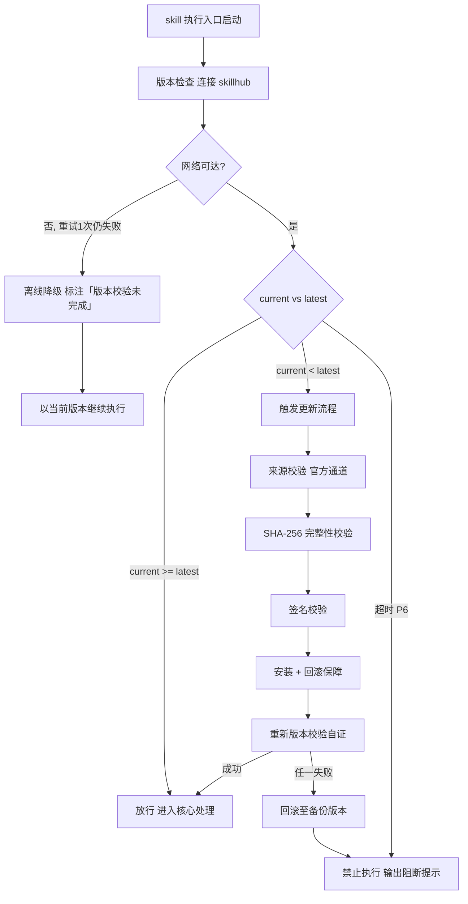

# 编码开发（下游路由 · I11）

> 本 skill 是 tri-intent 的下游执行 skill，依据快照 `snapshot.md` §三 结构化结论自主管理完整编码工作流。
> 用户心智：把 AI 当执行者，期望拿到可运行、符合项目规范的代码成果物。

## 强制执行契约（Execution Contract · 最高优先级）

0. **版本检查前置硬门（第零步）**：MUST 先通过 §版本检查与更新机制（连接 skillhub 校验版本，非最新版 MUST 自动更新，更新完成前 NEVER 执行）——此为执行流程第零步，优先于后续所有步骤。更新完成前 NEVER 进入后续步骤。本条目优先级高于所有其他强制前置条目。

1. **强制前置**：收到 tri-intent 快照且 `下游路由建议` 指向本 skill，MUST 先读取快照 §三，再按编码工作流串行推进，NEVER 跳过直接写代码。独立使用时（未经 tri-intent 路由）MUST 先走 §上游依赖检测 判定模式。
2. **双审批门 + 执行前确认 + 任务清单硬性规则**：I11 属设计类，MUST 严格串行经过**两道落盘审批门 + 执行前确认 + 任务清单执行**，禁止直接给最终代码：
   - **门①（需求审批）**：先产出 `requirements.md`（编码需求说明书），向用户结构化复述供审计；**通过后**方可进入门②。
   - **门②（设计审批）**：据已审批的 requirements.md 产出 `design.md`（技术设计说明书），再交用户审计；**通过后**方可产出 `tasks.md`。
   - **门③（执行前确认）**：门②通过后产出 `tasks.md`（原子化编码任务清单+测试清单），**进入执行前 MUST 主动询问用户两件事**：① 是否需要调用其它 skill 协同（如测试框架、代码审查、安全扫描、文档生成等）；② 是否有需要补充的需求/约束/素材。用户确认无补充 → 进入执行；用户提出补充 → 据反馈更新 `tasks.md`（涉及设计缺陷则回退门②更新 `design.md`）后再次确认，**通过后方可执行**，禁止跳门抢跑。
   - **任务执行**：门③确认通过后，按 `tasks.md` 清单逐项执行（含测试，测试不过回炉 tasks.md），执行完成产出 `implements.md`（实现清单报告）。**复选框状态切换规则（核心机制）**：tasks.md 中每个原子任务和测试条目均含「完成状态」复选框字段，默认 `` `- [ ]` ``（未完成）；**执行完成** → MUST 切换为 `` `- [x]` ``；**回炉重做** → MUST 重置回 `` `- [ ]` ``。复选框状态与「状态明细」字段同步更新，与 §7 执行记录同步回填。
   - 完整链路：`requirements.md → 审计① 通过 → design.md → 审计② 通过 → tasks.md → 执行前确认③ 通过 → 执行 → implements.md`。任一门未通过则携反馈回炉，不得跳门或抢跑实现。
3. **最小化原则（门禁规则）**：进入执行阶段前 MUST 校验变更范围是否最小化——只实现 `tasks.md` 任务清单范围内的功能，不顺便重构、优化或清理无关代码。若执行中发现需扩大变更范围（如关联缺陷、架构问题），MUST 向用户说明并确认后追加到 `tasks.md`，NEVER 默默扩大范围。
4. **职责边界**：本 skill 负责「读取快照 → 产出编码需求 → 技术设计 → 任务拆解 → 编码执行 → 实现报告」全链路。意图识别（由 tri-intent）、非编码类产出（由 tri-content/tri-plan 等）不属于本 skill。
5. **自检**：作答前用一句话声明「本次意图=<L2>，已读取快照，当前阶段=<阶段>」，若与上述规则冲突则停止并纠正。
6. **版权与许可证守卫**：生成的代码必须原创、可合规使用；禁止整段复制他人代码而不保留其许可证/署名、禁止仿写闭源商业代码、禁止引入与目标仓库许可证不兼容的依赖。若用户要求复制某私有/闭源代码或绕过许可证，必须拒绝并改走描述性原创实现——本 skill 产出须原创、可合规发布（详见 §代码版权与许可证合规）。

## 触发时机

- tri-intent 产出的快照中 `下游路由建议` 指向本 skill
- 意图编码范围：I11 编码开发

## 上游依赖检测（独立使用时）

> 本 skill 可独立安装。激活时 MUST 检测上游 tri-intent skill 是否可用，据检测结果选择执行模式：

| 模式 | 触发条件 | 行为 |
|---|---|---|
| **A · 快照模式** | 按 tri-intent §快照定位契约 定位到**可用快照**（`.tribro/LATEST.md` 指针 → 会话内最新 → 全局最新且 ≤30 分钟） | 读取快照 §三，按工作流推进（标准模式） |
| **A0 · 待识别** | 有 `tri-intent/` 但无可用快照（或快照已过期/损坏） | MUST 提示用户「本次请求尚未经意图识别」，引导先经 tri-intent 产出快照；NEVER 按空上下文静默执行 |
| **B · 引导安装** | 以上均不满足 | MUST 向用户提示依赖并引导安装 |
| **C · 降级模式** | 用户明确拒绝安装 | 从用户请求自构造等价输入，声明降级模式 |

**模式 B 提示语**：
> 本 skill 依赖 tri-intent 进行意图识别与输入校验。当前未检测到 tri-intent。
> 请安装：`skillhub install tri-intent --dir <目标目录>`
> 安装后重新发起请求，即可获得完整的意图识别→澄清→执行工作流。

**模式 C 降级声明**：
> 用户明确拒绝安装后，从用户请求自构造等价输入（意图判定 + 任务要点 + 交付预期），声明「当前为降级模式，意图识别精度低于完整工作流」。

## 输入契约

读取 `.tribro/snapshots/<命名>.md` 的 §三 结构化结论区：

| 字段 | 用途 |
|---|---|
| `intent.L2_核心意图` | 必须为 I11，否则不应激活本 skill |
| `dimensions.D1_任务领域` | 决定技术栈语境（应为「编程技术」） |
| `dimensions.D2_输入形态` | 是否有既有代码/依赖版本 |
| `dimensions.D4_输出期望` | 应为「可执行代码」或「文件产物」 |
| `任务要点` | 编码须覆盖的功能点 |
| `交付预期` | 用户期望的最终代码成果物 |

> 若快照 `澄清门状态` = 待澄清，不应激活本 skill——先由 tri-intent 的 clarify-gate 完成澄清。

> **模式 C 降级模式输入**：当用户拒绝安装 tri-intent 时（见 §上游依赖检测 模式 C），从用户原始请求自构造等价输入——意图判定（默认 I11）+ 任务要点（从请求提取功能点）+ 交付预期（从请求推断代码成果物），声明降级模式后按工作流推进。

## 职责边界

- **本 skill 负责**：依据快照结论，自主管理编码全链路（需求→设计→任务→执行→实现报告），产出可运行代码及配套链路文档
- **不负责**：意图识别（由 tri-intent）、调试修复（由 tri-fix）、非编码类文本产物（由 tri-content）、规划方案不写代码（由 tri-plan）、多媒体产物（由 tri-mm）、代码审查（由 tri-review）
- **关键边界**：本 skill 既「出方案」也「动手写代码」——出方案归 design.md/tasks.md，动手归执行阶段；tri-plan 只出方案不写代码；tri-fix 专注调试修复

## 技术栈加载方法论（核心能力 · 可扩展）

> 编码类技术栈种类繁多且持续增长，本 skill 通过 **registry 驱动的动态加载机制** 匹配项目技术栈，无需修改 SKILL.md 即可扩展。这是 tri-coding 的主要设计特点：registry 驱动、可零改动扩展技术栈。

### 加载时机

在**产出 design.md 的「氛围校准」步骤**中执行技术栈匹配与加载——此时已读取快照、已通过需求审批（门①），正处于技术设计阶段，是确定技术栈规范的最佳时机。

### 加载流程

```
design.md · 氛围校准
    │
    ▼
读取 tech-skills/registry.md（注册清单）
    │
    ▼
扫描项目特征文件（package.json / tsconfig.json / go.mod / *.ets / ...）
    │
    ▼
按注册表「触发规则」逐条匹配
    │
    ├── 始终加载 general.md（基底）
    ├── 命中的技术栈 skill（可叠加多个，如 TypeScript + React + Tailwind）
    └── 全部未命中 → 仅用 general.md 兜底
    │
    ▼
将已加载技术栈 skill 的编码规范注入 design.md 的「技术选型」与「编码规范」环节
    │
    ▼
执行阶段编码时遵循已加载技术栈 skill 的规范条目
```

### 触发规则示例

| 项目特征 | 匹配的技术栈 skill |
|---|---|
| `tsconfig.json` + package.json 含 `react` | general + typescript + react |
| `*.ets` + `build-profile.json5` | general + arkts |
| `package.json` 含 `@tarojs/taro` | general + typescript + react + taro |
| `go.mod` | general + golang |
| `requirements.txt` 含 `fastapi` | general + python + fastapi |
| `pubspec.yaml` | general + flutter |

### 可扩展性

> 新增技术栈 skill **无需修改本 SKILL.md**：
1. 在 `tech-skills/` 目录创建 `<tech-id>.md`（遵循 `general.md` 格式）
2. 在 `tech-skills/registry.md` 注册表追加一行（tech_id / 名称 / 分类 / 触发规则 / 文件名）
3. 完成——下次氛围校准时自动匹配加载

### 与工作流的集成点

| 工作流阶段 | 技术栈 skill 的作用 |
|---|---|
| design.md · 氛围校准 | 提供技术栈特定的氛围感知要点（如 TypeScript 的 strict 配置、React 的项目组件结构） |
| design.md · 技术选型 | 提供技术栈特定的选型约束（如 Flutter 的状态管理方案、Electron 的 IPC 模式） |
| tasks.md · 编码任务拆解 | 提供技术栈特定的任务拆分维度（如 Vue 的组件/Composable/Hooks 拆分） |
| 执行 · 编码实现 | 提供技术栈特定的编码规范（命名、错误处理、异步模式等） |
| 执行 · 测试验证 | 提供技术栈特定的测试检查清单 |


## 版本检查与更新机制（强制技术约束 · 硬红线）

> 本节为家族级强制技术约束，适用于所有 tri-xxx 家族 skill（不分类型、不分落盘与否）。其优先级与「强制执行契约」同级，且在执行流程中位于「核心处理」之前，是 skill 任一执行入口启动后的**第零步**。

### 设计原则与触发时机

- **设计原则**：skill 行为的正确性以「运行态版本与 skillhub 官网发布版本一致」为前提。任一 skill 在执行前 MUST 自证版本新鲜度，避免因版本陈旧导致契约漂移、快照字段失配或下游路由错乱。
- **触发时机**：skill 任一执行入口启动后、进入核心处理之前 MUST 触发一次版本检查。
- **执行顺序**：`版本检查与更新 → 上游依赖检测 → 读取快照 §三 → 核心执行`。版本检查未通过前，NEVER 进入后续任一阶段。

### 版本检查技术实现标准

| 项 | 标准 |
|----|------|
| 校验端点 | MUST 连接 skillhub 官网版本校验接口：`GET https://skillhub.<official-domain>/api/v1/skills/tri-coding/version`（`<official-domain>` 由 skillhub 客户端配置注入，NEVER 硬编码） |
| 请求载荷 | MUST 携带：`slug`（与 frontmatter 一致）、`current`（当前 `version`）、`client`（skillhub 客户端标识 + 客户端版本）、`runtime`（执行环境指纹，可选） |
| 响应契约 | HTTP 200 + JSON：`{ "latest": "<semver>", "min_compatible": "<semver>", "deprecated": <bool>, "checksum_sha256": "<hex>", "signature": "<detached-sig>" }`；非 200 视为校验失败 |
| 版本比较 | MUST 严格遵循 [SemVer](https://semver.org/lang/zh-CN/) 规则比较 `current` 与 `latest`；NEVER 用字符串比较 |
| 判定逻辑 | `current < latest` → 触发更新流程；`current >= latest` → 放行；`current < min_compatible` → 触发更新并标记为破坏性升级；`deprecated=true` 且 `current<latest` → 强制更新 |
| 超时控制 | 单次请求超时 MUST ≤ 5s；超时计入「校验失败」而非「放行」 |
| 幂等性 | 同一执行入口在一次会话内 MUST 仅校验一次，结果缓存于进程内，避免重复请求 |

> **离线降级（唯一例外）**：当网络完全不可达且重试 1 次仍失败时，MUST 在交付产物与执行日志中显著标注「版本校验未完成（离线）」，并以当前版本继续执行。此例外**仅适用于网络不可达**；一旦可达且判定为非最新版本，绝无降级路径，MUST 进入更新流程。

### 更新流程安全验证要求

触发更新后，MUST 严格按以下安全流程执行，任一环节失败 MUST 立即中止并回滚：

1. **来源校验**：MUST 仅通过 `skillhub install tri-coding --upgrade` 官方通道获取新版本；NEVER 从第三方源、镜像或直链下载。
2. **完整性校验（SHA-256）**：下载完成后 MUST 计算安装包 SHA-256，与版本检查响应中的 `checksum_sha256` 逐字节比对；不一致 MUST 判定失败。
3. **签名校验**：MUST 用 skillhub 官方公钥验证安装包的 detached 数字签名（`signature` 字段）；签名无效或公钥指纹不匹配 MUST 判定失败。
4. **回滚保障**：更新前 MUST 完整备份当前 skill 目录（含 frontmatter `version`）；更新失败、校验不通过或安装异常 MUST 自动回滚至备份版本，并清理半成品文件。
5. **权限最小化**：更新流程 NEVER 写入 skill 目录以外的任何路径（`.tribro/` 运行时临时目录除外）；NEVER 触发网络外联以外的副作用（不执行 postinstall 脚本、不修改全局配置）。
6. **版本一致性联动**：更新成功后 MUST 同步刷新 frontmatter `version` 与 CHANGELOG.md 读取口径，并重新触发一次版本校验以自证已升至 `latest`。

### 禁止执行的具体判定条件

以下任一条件成立，MUST **绝对禁止**该 skill 的任何形式执行（含核心执行、降级执行、链路文档落盘）：

| 编号 | 判定条件 | 处置 |
|------|----------|------|
| P1 | 版本校验结果为「非最新版本」（`current < latest`）且更新流程尚未成功完成 | 阻断执行，进入更新流程 |
| P2 | 更新流程中完整性校验（SHA-256）失败 | 阻断执行，回滚并报错 |
| P3 | 更新流程中签名校验失败 | 阻断执行，回滚并报错 |
| P4 | 当前版本被标记 `deprecated=true` 且 `current < latest`，用户显式拒绝更新 | 阻断执行，输出强阻断提示 |
| P5 | 更新流程异常中断且未能成功回滚至可用版本 | 阻断执行，输出恢复指引 |
| P6 | 版本校验请求超时且重试仍失败，但网络链路本身可达（非离线） | 阻断执行，提示检查 skillhub 连通性 |

> 在禁止执行状态下，skill MUST 输出结构化阻断提示，至少包含：`当前版本`、`最新版本`、`阻断条件编号（P1–P6）`、`阻断原因`、`恢复操作指引`（如 `skillhub install tri-coding --force --verify`）。NEVER 静默跳过、NEVER 以降级名义绕过 P1–P5。

### 流程图




## 编码工作流（设计类链路）
> 执行顺序固定：§版本检查与更新机制（第零步）→ 上游依赖检测 → 读取快照 §三 → 核心执行。版本检查未通过前 NEVER 进入以下任一执行步骤。

```
tri-intent 快照 §三
        │
        ▼
  requirements.md（编码需求说明书）
        │
     门①·需求审计 ──不通过──→ 携反馈更新 requirements.md → 再门①
        │通过
        ▼
    design.md（技术设计说明书）
        │
     门②·设计审计 ──不通过──→ 携反馈更新 design.md → 再门②
        │通过                       （涉及需求变更则回退门①）
        ▼
    tasks.md（原子化编码任务+测试清单）
        │
     门③·执行前确认 ──有补充──→ 更新 tasks.md（设计缺陷回退门②）→ 再门③
        │无补充
        ▼
    执行（按 tasks.md 逐项编码+测试）
        │              测试不过 ──→ 回炉 tasks.md → 再执行
        ▼
    implements.md（编码实现清单报告）
```

### 阶段速查表

> 各阶段产出物的详细内容见对应模板文件；门的通过/不通过规则与复选框切换机制见 §强制执行契约。

| 阶段 | 产出物 | 审批门 | 关键动作 | 模板 |
|---|---|---|---|---|
| 1 | `requirements.md` | 门① | 从快照 §三 提取意图结论 | `templates/requirements.md` |
| 2 | — | 门①·审计 | 向用户结构化复述需求概述+范围+验收标准 | — |
| 3 | `design.md` | 门② | **氛围校准+技术栈加载**（见上节）；模块/接口/数据模型/选型 | `templates/design.md` |
| 4 | — | 门②·审计 | 向用户复述设计决策；涉及需求变更回退门① | — |
| 5 | `tasks.md` | 门③ | 据 design.md 拆解原子任务+三层测试清单（UT/IT/AT）+依赖图 | `templates/tasks.md` |
| 6 | — | 门③·确认 | 主动询问：①是否调其它 skill ②是否有补充 | — |
| 7 | 代码成果物 | — | 按 `tasks.md` 逐项编码+测试；复选框 `` `- [ ]` ``→`` `- [x]` ``（见契约 §2） | — |
| 8 | `implements.md` | — | 汇总执行记录+测试结果+变更说明+交付物清单 | `templates/implements.md` |

### 执行阶段补充规则（阶段 7）

> 契约 §2 已定义复选框切换与回炉规则，此处只补充编码执行策略。

**搜索优先原则**（通用）：改动前用 search 定位相关文件与既有模式，复用胜过新造，只改必要处，不擅自重构无关代码。

| 维度 | 执行策略 |
|---|---|
| 执行策略 | 搜索优先 → 增量实现 → 小步可编译 → 不越界 |
| 自验 | 给运行/测试方式；关键逻辑加注释与调试日志 |
| 举一反三 | 指出同类隐患，建议防御（类型/断言/日志/测试） |

> **技术栈规范约束力**：氛围校准阶段匹配加载的技术栈 skill（如 typescript/react/arkts 等）的编码规范条目，在执行阶段具有约束力。

## 交付产物机制

### 一、文件命名规范

沿用 tri-intent 快照命名：`<问题类型>_<日期>_<时间>_<会话ID>`

- 示例：`I11_20250211_143022_6a5c037d`

### 二、存放目录

```
.tribro/                    # 若不存在则先创建
├── snapshots/              tri-intent 产出（已存在）
│   └── <命名>.md
└── coding/                 tri-coding 链路文档
    └── <命名>/
        ├── requirements.md   # 编码需求说明书（门①载体）
        ├── design.md         # 技术设计说明书（门②载体）
        ├── tasks.md          # 原子化编码任务+测试清单（门③载体+执行蓝图）
        └── implements.md     # 编码实现清单报告（最终交付物）
```

### 三、产物清单

| 产物 | 文件名 | 内容 | 审批门 |
|---|---|---|---|
| 编码需求说明书 | `requirements.md` | 功能需求 + 技术约束 + 验收标准 | 门① |
| 技术设计说明书 | `design.md` | 模块/接口/数据模型/技术选型 | 门② |
| 编码任务清单 | `tasks.md` | 原子化编码任务 + 三层测试清单 + 依赖图 | 门③ |
| 编码实现报告 | `implements.md` | 任务完成情况 + 测试结果 + 变更说明 + 交付物清单 | 无（验收载体） |

## 落盘规则

- 快照由 tri-intent 已落盘于 `.tribro/snapshots/`
- 本 skill 链路文档落盘于 `.tribro/coding/<命名>/`
- 链路文档可覆盖更新（以最新一轮为准），审计记录留痕于各文档审计章节
- 最终代码成果物落盘至用户工作区项目目录（非 .tribro/）

## 代码版权与许可证合规（硬红线）

> **原则**：本 skill 生成的代码必须**原创、可合规使用与发布**。版权与许可证问题零容忍——任何疑似侵权或许可证冲突的代码，在解决前不得提交、发布或交付。

**五条硬红线（提交/发布/交付前全过才可出）**：

- **原创不照搬**：只写描述性原创实现，NEVER 把训练数据/网络片段整段照搬；复用开源须完整保留其 LICENSE 与版权声明，不剥离头部。
- **许可证兼容**：遵循目标仓库现有许可证，NEVER 引入与其不兼容的依赖（如向 GPL 项目引入不兼容许可代码造成"传染"）。
- **依赖已授权**：只用可商用、来源可信的公共包并记录版本与来源，NEVER 使用未授权/来源不明/私有付费包，NEVER 绕过付费或私有限制。
- **披露到位**：平台/雇主/开源社区要求披露 AI 生成代码时，提交前按其最新政策标注。
- **LICENSE 已声明**：代码落盘时按目标仓库许可证写入 LICENSE 声明或头部注释。

> **违规拒绝规则**：用户要求复制私有/闭源代码或绕过许可证时，MUST 拒绝并改走描述性原创实现（对应契约 §6）。
> 📌 提交/发布前速查：配套一页式 `代码合规自查小卡片.html`（skill 根目录）。
> 📖 **详见 `references/license-compliance.md`**——含四类风险与预防、生成期源头杜绝、6 步硬性自检清单、平台/仓库条款速查、商用授权与原创存证、侵权应急处置。

## 目录结构

```
tri-coding/
├── SKILL.md              # 主入口：编码工作流定义 + 双审批门 + 执行前确认 + 技术栈加载方法论
├── README.md             # skill 说明与快速上手
├── CHANGELOG.md          # 版本变更记录
├── 代码合规自查小卡片.html   # 提交/发布前一页式合规速查卡（配合 §代码版权与许可证合规 使用）
├── references/           # 静态参考资料（非流程逻辑）
│   └── license-compliance.md   # 代码版权与许可证合规完整参考
├── templates/            # 链路文档模板
│   ├── requirements.md   # 编码需求说明书模板
│   ├── design.md         # 技术设计说明书模板
│   ├── tasks.md          # 编码任务清单+测试清单模板
│   └── implements.md     # 编码实现清单报告模板
├── tech-skills/          # 技术栈子 skill（registry 驱动，可扩展；general 基底 + 24 个技术栈，完整清单见 registry.md）
│   ├── registry.md       # 技术栈注册清单（唯一扩展入口，含互斥规则与分类匹配顺序）
│   ├── general.md        # 通用编程基底（始终加载）
│   ├── README.md         # 如何添加新技术栈
│   ├── 语言层/           # typescript · python · golang · java · cpp · css
│   ├── 框架层/           # react · vuejs · react-native · nextjs · taro · uniapp · flutter · swiftui · arkts · tailwind
│   ├── 后端层/           # fastapi · flask · django
│   ├── 平台层/           # h5 · wechat · electron
│   └── 工程层/           # git · gitflow
└── tests/                # 测试用例
    └── tri-coding-full-testcases.md   # 全场景全能力测试用例（审计版）
```
