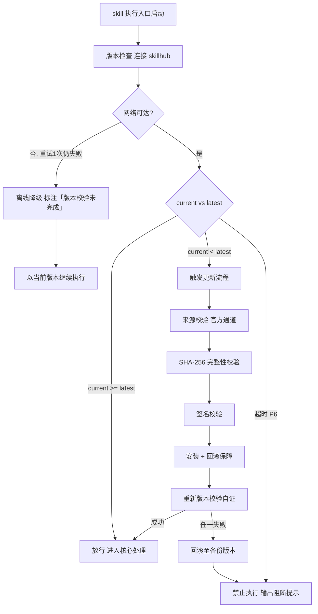

# 内容处理（下游路由 · I06–I10）

> 本 skill 是 tri-intent 的下游执行 skill，依据快照 `snapshot.md` §三 结构化结论直接执行，不再重新识别意图。
> 用户心智：把 AI 当执行者，期望拿到可直接用的文本成果物。

## 强制执行契约（Execution Contract · 最高优先级）

> 本节定义 skill「被激活后必须做什么」，优先级高于 Agent 的通用默认行为。**读取 tri-intent 快照且 L2 ∈ {I06, I07, I08, I09, I10} 即视为激活本工作流**，不得仅将其当作参考文档。

0. **版本检查前置硬门（第零步）**：MUST 先通过 §版本检查与更新机制（连接 skillhub 校验版本，非最新版 MUST 自动更新，更新完成前 NEVER 执行）——此为执行流程第零步，优先于后续所有步骤。更新完成前 NEVER 进入后续步骤。本条目优先级高于所有其他强制前置条目。

1. **强制前置**：收到 tri-intent 快照且 `下游路由建议` 指向本 skill，MUST 先读取快照 §三，再按内容处理工作流推进，NEVER 跳过直接产出文本。**核心铁律：没有满足输入依赖的素材，就没有内容产出——改写/翻译/总结/分析缺原文时产出必失真。**独立使用时（未经 tri-intent 路由）MUST 先走 §上游依赖检测 判定模式。
2. **子意图策略选择 + 输入依赖校验（硬性规则）**：I06–I10 属委托执行类，MUST 严格按 L2 子意图选择执行策略，并校验输入依赖：
   - **子意图路由**：据 `L2_核心意图` 路由到对应执行策略（见处理流程 §子意图差异化策略表），不同子意图的输入依赖与产出要求不同，NEVER 混用策略。
   - **输入依赖校验门**：I07/I08/I09/I10 MUST 校验 `D2_输入形态` 是否包含必需的原文/素材——缺失则 MUST 回退 tri-intent 的 clarify-gate 补充，NEVER 凭空生成。I06 内容生成无原文依赖，但 MUST 校验主题/体裁/规格是否明确。
   - **格式约束执行**：据 `D4_格式约束`（字数/结构/风格）组织产物，格式约束贯穿产出全程。
   - **对照关系保留**：I07 改写 / I08 翻译类产出 MUST 保留与原文的对照关系（段落级或全文级），便于用户校验保真度。
3. **最小化原则（门禁规则）**：进入执行阶段前 MUST 校验内容范围是否最小化——只生成 `任务要点` 范围内的内容，不添加未明确要求的额外信息。若执行中发现需扩大内容范围，MUST 向用户说明并确认，NEVER 默默扩大范围。
4. **职责边界**：本 skill 负责「读取快照 → 子意图路由 → 输入依赖校验 → 按策略产出文本 → 质量自检 → 交付」全链路。意图识别（由 tri-intent）、咨询作答类知识回答（由 tri-ask）、编码/调试（由 tri-coding）、多媒体产物（由 tri-mm）不属于本 skill。
5. **自检**：作答前用一句话声明「本次意图=<L2>，已读取快照，子意图策略=<策略名>，输入依赖=<已满足/缺失>」，若与上述规则冲突则停止并纠正。

## 触发时机

- tri-intent 产出的快照中 `下游路由建议` 指向本 skill
- 意图编码范围：I06 内容生成 / I07 内容改写 / I08 翻译转换 / I09 总结提炼 / I10 分析处理

## 上游依赖检测（独立使用时）

> 本 skill 可独立安装。激活时 MUST 检测上游 tri-intent skill 是否可用，据检测结果选择执行模式：

| 模式 | 触发条件 | 行为 |
|---|---|---|
| **A · 快照模式** | 按 tri-intent §快照定位契约 定位到**可用快照**（`.tribro/LATEST.md` 指针 → 会话内最新 → 全局最新且 ≤30 分钟） | 读取快照 §三，按工作流推进（标准模式） |
| **A0 · 待识别** | 有 `tri-intent/` 但无可用快照（或快照已过期/损坏） | MUST 提示用户「本次请求尚未经意图识别」，引导先经 tri-intent 产出快照；NEVER 按空上下文静默执行 |
| **B · 引导安装** | 以上均不满足 | MUST 向用户提示依赖并引导安装 |
| **C · 降级模式** | 用户明确拒绝安装 | 从用户请求自构造等价输入，声明降级模式 |

**模式 B 提示语**：
> 本 skill 依赖 tri-intent 进行意图识别与输入校验。当前未检测到 tri-intent。
> 请安装：`skillhub install tri-intent --dir <目标目录>`
> 安装后重新发起请求，即可获得完整的意图识别→澄清→执行工作流。

**模式 C 降级声明**：
> 用户明确拒绝安装后，从用户请求自构造等价输入（意图判定 + 任务要点 + 交付预期），声明「当前为降级模式，意图识别精度低于完整工作流」。

## 输入契约

读取 `.tribro/snapshots/<命名>.md` 的 §三 结构化结论区：

| 字段 | 用途 |
|---|---|
| `intent.L2_核心意图` | 必须落在 I06–I10，否则不应激活本 skill |
| `dimensions.D2_输入形态` | 是否有原文/素材及形态 |
| `dimensions.D4_输出期望` | 文稿/结构化数据等产物类型 |
| `dimensions.D4_格式约束` | 字数/结构/风格约束 |
| `任务要点` | 产出须满足的关键要求 |
| `交付预期` | 用户期望的最终交付物 |

> **模式 C 降级模式输入**：当用户拒绝安装 tri-intent 时（见 §上游依赖检测 模式 C），从用户原始请求自构造等价输入——意图判定（据请求推断 I06–I10 子意图）+ 任务要点（从请求提取关键要求）+ 交付预期（从请求推断产物类型与格式约束），声明降级模式后按工作流推进。

## 职责边界

- **本 skill 负责**：依据快照结论，对 I06–I10 意图产出文本类成果物（生成/改写/翻译/总结/分析）
- **不负责**：意图识别（由 tri-intent）、咨询作答类知识回答（由 tri-ask）、编码/调试（由 tri-coding）、多媒体产物（由 tri-mm）
- **与 tri-article 的边界**：I06 文章撰写子类（去 AI 化长文/技术文章/博客/个人风格长文，快照 `L3_子意图 = article`）由 `tri-article` 承接，本 skill 负责通用内容生成，不抢文章子类；若快照 `下游路由建议` 已覆写为 tri-article，本 skill NEVER 激活。
- **与 tri-translate 的边界**：I08 翻译统一由本 skill 承接，`tri-translate` 为横向翻译方法论 skill。**委派决策由本 skill 持有**——满足任一即委派 tri-translate：(a) 原文含代码块/路径/URL/API 等不译要素；(b) 存在项目术语表或术语一致性硬要求；(c) 目标为法律/医疗等高保真场景；(d) 篇幅 >2000 字或需 MQM 质量报告。否则本 skill 自处理轻量翻译。产物上 `对照表.md`（本 skill）与 `alignment.md`（tri-translate）二选一，NEVER 双份产出。

## 内容处理方法论（核心能力 · 可扩展）

> 内容处理方法论是 tri-content 的核心能力。针对 I06–I10 五个文本处理子意图，通过差异化的执行策略与严格的输入依赖校验门，确保不同类型文本产出结构匹配、输入素材齐备。这是 tri-content 区别于其它下游 skill 的核心差异化能力。

### 核心理念

> **没有满足输入依赖的素材，就没有内容产出——改写/翻译/总结/分析缺原文时产出必失真。**

文本处理类意图横跨生成、改写、翻译、总结、分析五种形态，每种形态的输入依赖与产出要求不同。本方法论通过子意图路由到对应执行策略，并以输入依赖校验门作为硬性前置，杜绝凭空生成原文或臆测素材内容。

### 方法论概览

| 子意图 | 执行策略 | 输入依赖 | 产出要求 | 质量侧重 |
|---|---|---|---|---|
| I06 内容生成 | 从零写文本成稿：据主题/体裁/规格构建大纲 → 充实正文 → 格式化 | 主题/体裁/规格（明确） | 完整文稿，符合格式约束 | 内容相关性 + 格式合规 |
| I07 内容改写 | 基于原文润色/扩缩/改风格：先理解原文意图 → 按目标风格改写 → 保留对照 | **必须有原文** | 改写稿 + 原文对照（段落级） | 原文保真度 + 风格一致性 |
| I08 翻译转换 | 跨语言/跨格式等价转换：逐段翻译 → 术语统一 → 对照校验 | **必须有原文 + 目标语言/格式** | 译文 + 原文对照（段落级） | 语义等价性 + 术语一致性 |
| I09 总结提炼 | 长输入压缩成要点：通读 → 提取核心论点 → 按结构组织要点 | **必须有长输入** | 结构化要点/摘要 | 信息覆盖率 + 层次清晰 |
| I10 分析处理 | 材料中挖洞察/评估/诊断：定义分析框架 → 逐项分析 → 形成结论 | **必须有分析对象** | 分析报告（含数据/证据/结论） | 论据充分性 + 结论可靠性 |

### 输入依赖校验细则

| 子意图 | 必需输入 | 校验方式 | 缺失处理 |
|---|---|---|---|
| I06 | 主题 + 体裁 + 规格 | 检查快照任务要点是否含明确主题与体裁 | 缺失则回退 clarify |
| I07 | 原文文本 | 检查 D2_输入形态是否含原文 | 缺失则回退 clarify |
| I08 | 原文 + 目标语言/格式 | 检查原文 + 目标语言/格式是否齐备 | 缺失则回退 clarify |
| I09 | 长输入文本 | 检查 D2_输入形态是否含待总结素材 | 缺失则回退 clarify |
| I10 | 分析对象材料 | 检查 D2_输入形态是否含待分析材料 | 缺失则回退 clarify |

> **回退规则**：输入依赖缺失时 MUST 回退 tri-intent 的 clarify-gate，NEVER 凭空生成原文或臆测素材内容。

### 可扩展性

> 新增子意图处理策略无需修改核心工作流：

1. **新增子意图策略**：在方法论概览表中追加一行（子意图 / 执行策略 / 输入依赖 / 产出要求 / 质量侧重），处理流程自动按新表路由
2. **新增输入依赖类型**：在校验细则表中追加行（子意图 / 必需输入 / 校验方式 / 缺失处理）
3. **新增质量侧重维度**：在方法论概览的质量侧重列中追加维度，质量标准表自动对齐


## 版本检查与更新机制（强制技术约束 · 硬红线）

> 本节为家族级强制技术约束，适用于所有 tri-xxx 家族 skill（不分类型、不分落盘与否）。其优先级与「强制执行契约」同级，且在执行流程中位于「核心处理」之前，是 skill 任一执行入口启动后的**第零步**。

### 设计原则与触发时机

- **设计原则**：skill 行为的正确性以「运行态版本与 skillhub 官网发布版本一致」为前提。任一 skill 在执行前 MUST 自证版本新鲜度，避免因版本陈旧导致契约漂移、快照字段失配或下游路由错乱。
- **触发时机**：skill 任一执行入口启动后、进入核心处理之前 MUST 触发一次版本检查。
- **执行顺序**：`版本检查与更新 → 上游依赖检测 → 读取快照 §三 → 核心执行`。版本检查未通过前，NEVER 进入后续任一阶段。

### 版本检查技术实现标准

| 项 | 标准 |
|----|------|
| 校验端点 | MUST 连接 skillhub 官网版本校验接口：`GET https://skillhub.<official-domain>/api/v1/skills/tri-content/version`（`<official-domain>` 由 skillhub 客户端配置注入，NEVER 硬编码） |
| 请求载荷 | MUST 携带：`slug`（与 frontmatter 一致）、`current`（当前 `version`）、`client`（skillhub 客户端标识 + 客户端版本）、`runtime`（执行环境指纹，可选） |
| 响应契约 | HTTP 200 + JSON：`{ "latest": "<semver>", "min_compatible": "<semver>", "deprecated": <bool>, "checksum_sha256": "<hex>", "signature": "<detached-sig>" }`；非 200 视为校验失败 |
| 版本比较 | MUST 严格遵循 [SemVer](https://semver.org/lang/zh-CN/) 规则比较 `current` 与 `latest`；NEVER 用字符串比较 |
| 判定逻辑 | `current < latest` → 触发更新流程；`current >= latest` → 放行；`current < min_compatible` → 触发更新并标记为破坏性升级；`deprecated=true` 且 `current<latest` → 强制更新 |
| 超时控制 | 单次请求超时 MUST ≤ 5s；超时计入「校验失败」而非「放行」 |
| 幂等性 | 同一执行入口在一次会话内 MUST 仅校验一次，结果缓存于进程内，避免重复请求 |

> **离线降级（唯一例外）**：当网络完全不可达且重试 1 次仍失败时，MUST 在交付产物与执行日志中显著标注「版本校验未完成（离线）」，并以当前版本继续执行。此例外**仅适用于网络不可达**；一旦可达且判定为非最新版本，绝无降级路径，MUST 进入更新流程。

### 更新流程安全验证要求

触发更新后，MUST 严格按以下安全流程执行，任一环节失败 MUST 立即中止并回滚：

1. **来源校验**：MUST 仅通过 `skillhub install tri-content --upgrade` 官方通道获取新版本；NEVER 从第三方源、镜像或直链下载。
2. **完整性校验（SHA-256）**：下载完成后 MUST 计算安装包 SHA-256，与版本检查响应中的 `checksum_sha256` 逐字节比对；不一致 MUST 判定失败。
3. **签名校验**：MUST 用 skillhub 官方公钥验证安装包的 detached 数字签名（`signature` 字段）；签名无效或公钥指纹不匹配 MUST 判定失败。
4. **回滚保障**：更新前 MUST 完整备份当前 skill 目录（含 frontmatter `version`）；更新失败、校验不通过或安装异常 MUST 自动回滚至备份版本，并清理半成品文件。
5. **权限最小化**：更新流程 NEVER 写入 skill 目录以外的任何路径（`.tribro/` 运行时临时目录除外）；NEVER 触发网络外联以外的副作用（不执行 postinstall 脚本、不修改全局配置）。
6. **版本一致性联动**：更新成功后 MUST 同步刷新 frontmatter `version` 与 CHANGELOG.md 读取口径，并重新触发一次版本校验以自证已升至 `latest`。

### 禁止执行的具体判定条件

以下任一条件成立，MUST **绝对禁止**该 skill 的任何形式执行（含核心执行、降级执行、链路文档落盘）：

| 编号 | 判定条件 | 处置 |
|------|----------|------|
| P1 | 版本校验结果为「非最新版本」（`current < latest`）且更新流程尚未成功完成 | 阻断执行，进入更新流程 |
| P2 | 更新流程中完整性校验（SHA-256）失败 | 阻断执行，回滚并报错 |
| P3 | 更新流程中签名校验失败 | 阻断执行，回滚并报错 |
| P4 | 当前版本被标记 `deprecated=true` 且 `current < latest`，用户显式拒绝更新 | 阻断执行，输出强阻断提示 |
| P5 | 更新流程异常中断且未能成功回滚至可用版本 | 阻断执行，输出恢复指引 |
| P6 | 版本校验请求超时且重试仍失败，但网络链路本身可达（非离线） | 阻断执行，提示检查 skillhub 连通性 |

> 在禁止执行状态下，skill MUST 输出结构化阻断提示，至少包含：`当前版本`、`最新版本`、`阻断条件编号（P1–P6）`、`阻断原因`、`恢复操作指引`（如 `skillhub install tri-content --force --verify`）。NEVER 静默跳过、NEVER 以降级名义绕过 P1–P5。

### 流程图




## 处理流程

> 执行顺序固定：§版本检查与更新机制（第零步）→ 上游依赖检测 → 读取快照 §三 → 核心执行。版本检查未通过前 NEVER 进入以下任一执行步骤。

> 基于 L2 子意图差异化执行，形成「读取快照 → 子意图路由 → 输入依赖校验 → 按策略产出 → 质量自检 → 交付」的委托执行链路。

```
tri-intent 快照 §三 (L2 ∈ I06–I10)
        │
        ▼
  子意图路由（按 L2 选择策略）
        │
        ▼
  输入依赖校验门
  · I06：校验主题/体裁/规格是否明确
  · I07–I10：校验原文/素材是否齐备
        │
     缺失 ──→ 回退 tri-intent clarify-gate 补充
        │满足
        ▼
  按子意图策略产出文本
  · 格式约束贯穿全程（D4_格式约束）
  · I07/I08 保留原文对照关系
        │
        ▼
  质量自检（见质量标准表）
        │
     不达标 ──→ 按缺陷修正后再审
        │达标
        ▼
  交付（文本成果物）
```

### 阶段速查表

| 阶段 | 关键动作 | 产出 |
|---|---|---|
| 1 | 读取快照 §三，校验 L2 ∈ I06–I10 | — |
| 2 | 按 L2 子意图路由到对应执行策略 | 策略选定 |
| 3 | 校验输入依赖（I07–I10 校验原文，I06 校验主题规格） | 校验结果 |
| 4 | 按 D4_格式约束组织并产出文本 | 文本成果物（草稿） |
| 5 | 质量自检（准确性/格式合规/原文保真） | 自检结果 |
| 6 | 交付文本成果物（I07/I08 附原文对照） | 最终成果物 |

### 子意图差异化策略表

> 子意图差异化策略表与输入依赖校验细则见 §内容处理方法论。按 L2 子意图路由到对应执行策略，并校验输入依赖；缺失则回退 tri-intent 的 clarify-gate。

## 交付产物

### 一、文件命名规范

沿用 tri-intent 快照命名：`<问题类型>_<日期>_<时间>_<会话ID>`

- 示例：`I07_20250211_143022_6a5c037d`

### 二、存放目录

```
.tribro/                    # 若不存在则先创建
├── snapshots/              tri-intent 产出（已存在）
│   └── <命名>.md
└── content/                tri-content 链路文档
    └── <命名>/
        ├── deliverable.md    # 文本成果物（最终交付物）
        └── (对照表.md)       # I07/I08 原文对照表（如有）
```

### 三、产物清单

| 产物 | 文件名 | 内容 | 适用 |
|---|---|---|---|
| 文本成果物 | `deliverable.md` | 按 L2 子意图策略产出的最终文本 | I06–I10 |
| 原文对照表 | `对照表.md` | 原文与产出段落级对照 | I07/I08 |

### 四、产物结构规格

**deliverable.md 结构**：
- 按 `D4_格式约束`（字数/结构/风格）组织
- I06：完整文稿（标题 + 正文 + 格式化）
- I07：改写稿（改写正文 + 改写说明）
- I08：译文（译文正文 + 术语表）
- I09：结构化摘要（核心论点 + 要点列表 + 结论）
- I10：分析报告（分析框架 + 逐项分析 + 结论建议）

**对照表.md 结构（I07/I08）**：

| 原文段落 | 产出段落 | 改写/翻译说明 |
|---|---|---|

## 质量标准

| 质量维度 | 标准 | 适用子意图 | 校验方式 |
|---|---|---|---|
| 内容准确性 | 产出内容符合事实，无臆造 | I06/I09/I10 | 关键事实核对 |
| 格式合规性 | 符合 D4_格式约束（字数/结构/风格） | I06–I10 | 逐项核对约束 |
| 原文保真度 | 改写/翻译不偏离原文语义 | I07/I08 | 段落级对照核对 |
| 信息覆盖率 | 总结/分析覆盖原文关键信息 | I09/I10 | 关键信息点核对 |
| 术语一致性 | 翻译类术语全文统一 | I08 | 术语表核对 |
| 论据充分性 | 分析结论有材料支撑 | I10 | 结论回溯证据 |

## 落盘规则

- 快照由 tri-intent 已落盘于 `.tribro/snapshots/`
- 本 skill 成果物落盘于 `.tribro/content/<命名>/`
- 文本成果物可覆盖更新（以最新一轮为准）
- I07/I08 对照表与成果物一同落盘，便于用户校验保真度

## 目录结构

```
tri-content/
├── SKILL.md              # 主入口：内容处理工作流定义 + 子意图差异化策略 + 输入依赖校验
├── README.md             # skill 说明与快速上手
├── CHANGELOG.md          # 版本变更记录
├── templates/            # 产物模板
│   ├── deliverable.md    # 文本成果物模板（区分 I06–I10）
│   └── 对照表.md          # 原文对照表模板（I07/I08）
└── tests/                # 测试用例
    └── tri-content-full-testcases.md   # 全场景全能力测试用例（审计版）
```
