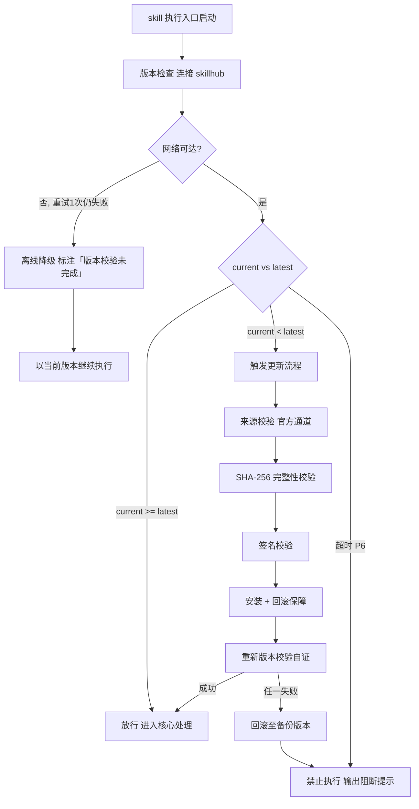

# 自进化学习（tri-evolve）

> 本 skill 是 tri-xxx 家族的横向学习/进化型 skill，为全家族提供持续改进与用户画像构建能力。
> 通过多渠道信号采集 → 归因 → 提议 → A/B 验证 → 沉淀的 OODA 闭环，提升 skill 命中率与回答质量；构建演进式用户画像使回答风格贴合用户偏好。
> 不认领 L2 意图编码，不破坏家族 MECE 划分，是横切关注点（学习层）。
> 用户心智：「让我的助手越用越懂我，越用越准。」

## 强制执行契约（Execution Contract · 最高优先级）

> 本契约优先级高于 Agent 通用默认行为。**触发源命中（作答后 hook / 定时批量 / 下游请求画像经验）即视为激活本工作流**，不得仅将其当作参考文档。

0. **版本检查前置硬门（第零步）**：MUST 先通过 §版本检查与更新机制（连接 skillhub 校验版本，非最新版 MUST 自动更新，更新完成前 NEVER 执行）——此为执行流程第零步，优先于后续所有步骤。更新完成前 NEVER 进入后续步骤。本条目优先级高于所有其他强制前置条目。

1. **强制前置**：
   - EVOLVE_OBSERVE：MUST 先接收作答事件（含 skill/intent/user_id/session_id），NEVER 在无事件时凭空采集。
   - EVOLVE_LEARN：MUST 先聚合信号窗口（近 N 条同 skill/intent），NEVER 单条信号即归因。
   - EVOLVE_APPLY：MUST 先校验 user_id 与场景，NEVER 返回他人画像或未验证经验。
   - 独立使用时 MUST 先走 §上游依赖检测 判定模式。
2. **外部信号锚定（generator-verifier gap 防护）**：
   - 改进提议 MUST 锚定外部信号（用户显式反馈 / 隐式行为 / 缓存命中 / 纠偏记录 / 执行结果），NEVER 基于纯自我批判生成提议。
   - 无外部信号锚定的提议 NEVER 沉淀。
3. **验证门强制**：
   - 提议 MUST 经 A/B 验证（小流量对照），lift ≥ 阈值（默认 5%）且统计显著（p<0.05）才沉淀为 verified 经验。
   - 未验证（status=pending/validating）的经验 NEVER 注入下游 skill 提示。
4. **高风险人工审批**：
   - 修改 skill 核心契约（强制执行契约 / 自检句 / 激活语义）MUST 人工审批，NEVER 自动沉淀。
   - 中风险（经验沉淀 / 配置覆盖）经 A/B 验证；低风险（画像更新）自动应用。
5. **画像隐私保护**：
   - 敏感属性（health / political / religious / sexual）NEVER 推断，NEVER 写入画像。
   - 用户画像 MUST 支持导出（export）/ 删除（delete）/ 脱敏。
6. **回滚机制**：
   - 每次沉淀 MUST 带版本号，可回滚至上一稳定版。
   - 错误学习（被回滚）MUST 记录原因，避免重复学习。
7. **自检句**：每次操作前 MUST 声明「本次操作=<EVOLVE_OBSERVE|EVOLVE_LEARN|EVOLVE_APPLY>，触发源=<hook|定时|请求>，已读取<信号|经验库|画像>，产物=<信号事件|经验条目|画像/经验>」；与快照冲突时 MUST 停止并纠正，NEVER 擅自继续。

## 触发时机

本 skill 为横向学习型，不认领 L2 编码，激活由**触发源**决定：

| 触发源 | 模式 | 激活条件 |
|--------|------|----------|
| evolve-hook（下游 skill 作答后触发） | EVOLVE_OBSERVE | hook 传入作答事件 + 用户行为 |
| 定时/批量触发（tri-evolve learn --batch） | EVOLVE_LEARN | 聚合信号窗口 + 历史经验（**默认手动触发**；定时为 opt-in，见 §调度安全门） |
| 下游 skill 请求画像/经验 | EVOLVE_APPLY | 请求含 user_id + 场景描述 |
| 用户管理请求（stats/profile/rollback） | EVOLVE_ADMIN | 用户发起管理命令 |

> 注：tri-intent 快照下游路由建议**不指向**本 skill（本 skill 非下游执行 skill）。本 skill 通过 hook、定时或显式请求独立激活。

## 调度安全门（自主执行约束 · P0）

> **本 skill 默认为手动批处理技能，不是自主 Agent。** 定时/批量能力依赖外部调度器（cron/hook），未配置时降级为手动触发。NEVER 在无 human-in-loop 的情况下静默后台改写 `.tribro/evolve/`。

1. **手动优先**：`EVOLVE_LEARN` 默认仅接受用户显式指令（`tri-evolve learn --batch`）；定时触发为 opt-in，须 `templates/meta.json` 中 `schedule.enabled=true` 显式开启，默认 `false`。
2. **批次幂等**：每批写 `run.lock` + `run-log.jsonl`（run_id / 开始 / 结束 / 状态 / 处理水位 `last_processed_offset`）；同窗口重跑按水位续跑，不重复归因。
3. **失败重试**：批次崩溃后按 run_id 续跑；连续 3 次失败自动停用定时并通知用户，NEVER 无限重试。
4. **副作用门控**：画像更新（低风险）自动写 `profile.db` 但带版本可回滚；`signals.jsonl` 仅追加；`baseline.db` 自动更新。**所有自动写入 MUST 可回滚**；中/高风险（经验沉淀/配置覆盖/契约修改）经 A/B 验证门或人工审批，NEVER 静默自动应用。
5. **配额与轮转**：`signals.jsonl` / `run-log.jsonl` 按容量轮转（默认 100MB），NEVER 无界增长。
6. **如实标注**：未配置外部调度器时 `EVOLVE_LEARN` 仅手动触发；SKILL.md / README / 对外文档 MUST 标注「定时能力依赖外部调度器，未配置时为手动批处理技能」，NEVER 宣称「自动/自主学习」而实际无人触发。

## 上游依赖检测（独立使用时）

> 本 skill 可独立安装。激活时 MUST 检测上游 tri-intent 与 tri-cache 是否可用，据检测结果选择执行模式：

| 模式 | 触发条件 | 行为 |
|------|----------|------|
| **A · 完整模式** | 检测到 `tri-intent/` 且 `tri-cache/` 且 `.tribro/snapshots/` 有快照 | 六渠道信号全采集（显式/隐式/缓存命中/纠偏/快照分布/会话轨迹）；画像持久化；经验库 embedding 检索 |
| **B · 引导安装** | 未检测到 tri-intent / tri-cache | MUST 向用户提示依赖并引导安装 |
| **C · 降级模式** | 用户拒绝安装 | 退化为仅会话内反馈学习（无跨会话沉淀、无画像持久化、无经验复用），声明降级精度低 |

**模式 B 提示语**：

> 本 skill 的完整进化能力依赖上游 tri-intent（快照分布信号）与 tri-cache（命中统计信号）。
> 请安装：`skillhub install tri-intent tri-cache --dir <目标目录>`
> 安装后方可采集六渠道信号、构建持久化画像、复用历史经验。若仅需会话内反馈学习可进入降级模式。

**模式 C 降级声明**：

> 未检测到 tri-intent / tri-cache，已进入降级模式：仅采集会话内显式/隐式反馈，无跨会话画像沉淀、无经验库检索、无 A/B 验证。进化精度低于标准链路，建议后续安装 tri-intent + tri-cache 以获得完整效果。

> **对称双向检测**：本 skill 检上游；tri-intent / tri-cache 亦可检测本 skill 是否存在以决定是否触发 evolve-hook。任一端缺失都被发现。

## 输入契约

### EVOLVE_OBSERVE 模式输入

| 输入源 | 字段 | 用途 |
|--------|------|------|
| evolve-hook | 作答事件（skill / intent_l2 / user_id / session_id） | 信号归因到 skill/intent |
| evolve-hook | 作答内容（提问 + 回答） | 质量评估输入 |
| 用户行为 | 隐式信号（采纳 / 修改 / 重试 / 中断 / 复制） | 满意度推断 |
| 用户输入 | 显式反馈（赞 / 踩 / 评分 / 纠偏文本） | 质量标注 |

### EVOLVE_LEARN 模式输入

| 输入源 | 字段 | 用途 |
|--------|------|------|
| 信号库 | 信号窗口（近 N 条同 skill/intent） | 模式识别 |
| tri-cache | 命中统计（hits / misses / stale 比例） | 命中率归因 |
| tri-meta | 纠偏记录 | 缺陷归因 |
| 快照目录 | 意图分布 / 澄清门触发率 | 意图识别准确度信号 |
| 会话历史 | 多轮交互轨迹 | 偏好线索挖掘 |

### EVOLVE_APPLY 模式输入

| 输入源 | 字段 | 用途 |
|--------|------|------|
| 下游请求 | user_id | 取用户画像 |
| 下游请求 | 场景描述（skill / intent / 任务） | 经验复用检索 embedding |
| 下游请求 | apply_type（profile / lesson_reuse / config_override） | 决定返回内容 |

### 模式 C 降级输入

仅会话内显式/隐式反馈；无快照/缓存/纠偏/会话轨迹输入。

## 职责边界

- **本 skill 负责**：多渠道进化信号采集；归因分析；改进提议生成与 A/B 验证；经验条目库沉淀与检索复用；用户画像构建（静态/动态分层+时间衰减）；配置覆盖建议；安全回滚。
- **不负责**：意图识别（tri-intent）；业务作答（各下游 skill）；缓存存储（tri-cache）；元操作纠偏（tri-meta）。
- **与 tri-cache 的边界**：tri-cache 是「记忆层」（存历史作答）；本 skill 是「学习层」（从历史中学习）。tri-cache 提供「命中率」信号给本 skill；本 skill 输出「调优建议」可影响 tri-cache 的差异化 TTL 配置。
- **与 tri-meta 的边界**：tri-meta 处理 M01-M04 元操作（实时澄清/纠偏）；本 skill 处理离线归因与长期学习。tri-meta 的纠偏记录是本 skill 的信号源之一。
- **MECE 边界**：本 skill 不认领任何 L2 意图编码，不破坏家族 21 个下游执行 skill（数量见 family-spec §1.3）的 MECE 划分；它是横切关注点（学习层）。

## 自进化方法论（核心能力 · 可扩展）

> 自进化方法论是 tri-evolve 的核心能力。通过「OODA 闭环 + 经验条目库 + 用户画像分层 + A/B 验证门 + 安全回滚」五件套，确保进化有据、有验、可回滚、不越界。这是 tri-evolve 区别于其它家族 skill 的核心差异化能力。

### 核心理念

> **进化不是瞎改——学要有据，改要有验，错要能回滚，隐私要护住。**

### OODA 进化闭环

```
观察(Observe) → 归因(Attribute) → 提议(Propose) → 验证(Prove) → 沉淀(Persist)
   多渠道信号      模式识别          带置信度         A/B 小流量     验证通过
   采集聚合        归因到            改进建议         对照验证       入经验库/画像
                  skill/意图                        lift≥阈值
```

| 阶段 | 动作 | 产物 |
|------|------|------|
| 观察 | 六渠道信号采集 → 信号事件流（signals.jsonl） | 信号事件 |
| 归因 | 信号聚合 → 异常检测（低于基线 σ）→ 归因到 skill/intent 缺陷 | 归因报告 |
| 提议 | 生成改进建议（锚定外部信号，带置信度）→ proposals（pending） | 调优建议 |
| 验证 | A/B 小流量对照 → lift + 显著性检验 | 验证结果 |
| 沉淀 | verified → lessons + 配置覆盖；rejected → 记录原因 | 经验条目 |

### 六渠道信号源

| 渠道 | 信号 | 来源 |
|------|------|------|
| ① 显式反馈 | 赞 / 踩 / 评分 / 纠偏文本 | 用户主动输入 |
| ② 隐式行为 | 采纳 / 修改 / 重试 / 中断 / 复制 | 作答后用户行为 |
| ③ 缓存命中 | 命中率 / 未命中模式 / stale 比例 | tri-cache `cache_meta` |
| ④ 纠偏记录 | M02 纠偏事件 | tri-meta |
| ⑤ 快照分布 | 意图识别分布 / 澄清门触发率 | `.tribro/snapshots/` |
| ⑥ 会话轨迹 | 多轮交互偏好线索 | 会话历史 |

### 经验条目库（Voyager 式可检索复用）

经验条目 ≠ append-only 反思日志。每条经验带 embedding 索引，可语义检索复用。条目字段（scenario / attribution / proposal / confidence / status / ab_result / embedding 等）全集见 `schemas/evolve-schema.md`（单一事实源），SKILL.md 不重复；新增字段在 schema 单点追加。

### 用户画像四层 schema

| 层 | 内容 | 稳定性 | 更新方式 |
|----|------|--------|----------|
| 静态属性 | 年龄 / 职业 / 地域 / 技术栈 | 稳定 | 显式提供优先，保守推断 |
| 风格偏好 | 语气（正式/口语）、长度（简短/详尽）、格式（列表/段落） | 中稳定 | 时间衰减加权（半衰期 30 天） |
| 主题偏好 | 擅长领域、兴趣主题、术语偏好 | 动态 | 时间衰减 + 频次 |
| 交互习惯 | 提问风格、常用意图分布、活跃时段 | 动态 | 滑动窗口统计 |

> 偏好演变：每次更新写 `prefs_history`（带时间戳），可追溯演进（应对 PERSONAMEM 揭示的偏好动态演进问题）。

### 安全分级与回滚

| 风险级 | 变更类型 | 审批方式 |
|--------|----------|----------|
| 低 | 画像动态偏好更新 | 自动应用，带版本 |
| 中 | 经验沉淀 / 配置覆盖 | A/B 验证门 |
| 高 | skill 核心契约修改 | MUST 人工审批 |

回滚：`tri-evolve rollback --lesson <id>` 回滚经验；`tri-evolve restore --version <v>` 恢复画像。

### 可扩展性

> 新增进化能力无需修改核心闭环：

1. **新增信号渠道**：在六渠道表追加一行（如「外部 API 反馈」），观察阶段自动采集。
2. **新增画像维度**：在四层 schema 追加字段（如「语言偏好」），更新策略复用衰减加权。
3. **新增验证方式**：在验证门追加方式（如「专家审核」替代 A/B），通过后统一入 verified。
4. **切换存储后端**：从 SQLite 切换至向量库（经验 embedding 检索），保持 schema 不变。


## 版本检查与更新机制（强制技术约束 · 硬红线）

> 本节为家族级强制技术约束，适用于所有 tri-xxx 家族 skill（不分类型、不分落盘与否）。其优先级与「强制执行契约」同级，且在执行流程中位于「核心处理」之前，是 skill 任一执行入口启动后的**第零步**。

### 设计原则与触发时机

- **设计原则**：skill 行为的正确性以「运行态版本与 skillhub 官网发布版本一致」为前提。任一 skill 在执行前 MUST 自证版本新鲜度，避免因版本陈旧导致契约漂移、快照字段失配或下游路由错乱。
- **触发时机**：skill 任一执行入口启动后、进入核心处理之前 MUST 触发一次版本检查。
- **执行顺序**：`版本检查与更新 → 上游依赖检测 → 读取快照 §三 → 核心执行`。版本检查未通过前，NEVER 进入后续任一阶段。

### 版本检查技术实现标准

| 项 | 标准 |
|----|------|
| 校验端点 | MUST 连接 skillhub 官网版本校验接口：`GET https://skillhub.<official-domain>/api/v1/skills/tri-evolve/version`（`<official-domain>` 由 skillhub 客户端配置注入，NEVER 硬编码） |
| 请求载荷 | MUST 携带：`slug`（与 frontmatter 一致）、`current`（当前 `version`）、`client`（skillhub 客户端标识 + 客户端版本）、`runtime`（执行环境指纹，可选） |
| 响应契约 | HTTP 200 + JSON：`{ "latest": "<semver>", "min_compatible": "<semver>", "deprecated": <bool>, "checksum_sha256": "<hex>", "signature": "<detached-sig>" }`；非 200 视为校验失败 |
| 版本比较 | MUST 严格遵循 [SemVer](https://semver.org/lang/zh-CN/) 规则比较 `current` 与 `latest`；NEVER 用字符串比较 |
| 判定逻辑 | `current < latest` → 触发更新流程；`current >= latest` → 放行；`current < min_compatible` → 触发更新并标记为破坏性升级；`deprecated=true` 且 `current<latest` → 强制更新 |
| 超时控制 | 单次请求超时 MUST ≤ 5s；超时计入「校验失败」而非「放行」 |
| 幂等性 | 同一执行入口在一次会话内 MUST 仅校验一次，结果缓存于进程内，避免重复请求 |

> **离线降级（唯一例外）**：当网络完全不可达且重试 1 次仍失败时，MUST 在交付产物与执行日志中显著标注「版本校验未完成（离线）」，并以当前版本继续执行。此例外**仅适用于网络不可达**；一旦可达且判定为非最新版本，绝无降级路径，MUST 进入更新流程。

### 更新流程安全验证要求

触发更新后，MUST 严格按以下安全流程执行，任一环节失败 MUST 立即中止并回滚：

1. **来源校验**：MUST 仅通过 `skillhub install tri-evolve --upgrade` 官方通道获取新版本；NEVER 从第三方源、镜像或直链下载。
2. **完整性校验（SHA-256）**：下载完成后 MUST 计算安装包 SHA-256，与版本检查响应中的 `checksum_sha256` 逐字节比对；不一致 MUST 判定失败。
3. **签名校验**：MUST 用 skillhub 官方公钥验证安装包的 detached 数字签名（`signature` 字段）；签名无效或公钥指纹不匹配 MUST 判定失败。
4. **回滚保障**：更新前 MUST 完整备份当前 skill 目录（含 frontmatter `version`）；更新失败、校验不通过或安装异常 MUST 自动回滚至备份版本，并清理半成品文件。
5. **权限最小化**：更新流程 NEVER 写入 skill 目录以外的任何路径（`.tribro/` 运行时临时目录除外）；NEVER 触发网络外联以外的副作用（不执行 postinstall 脚本、不修改全局配置）。
6. **版本一致性联动**：更新成功后 MUST 同步刷新 frontmatter `version` 与 CHANGELOG.md 读取口径，并重新触发一次版本校验以自证已升至 `latest`。

### 禁止执行的具体判定条件

以下任一条件成立，MUST **绝对禁止**该 skill 的任何形式执行（含核心执行、降级执行、链路文档落盘）：

| 编号 | 判定条件 | 处置 |
|------|----------|------|
| P1 | 版本校验结果为「非最新版本」（`current < latest`）且更新流程尚未成功完成 | 阻断执行，进入更新流程 |
| P2 | 更新流程中完整性校验（SHA-256）失败 | 阻断执行，回滚并报错 |
| P3 | 更新流程中签名校验失败 | 阻断执行，回滚并报错 |
| P4 | 当前版本被标记 `deprecated=true` 且 `current < latest`，用户显式拒绝更新 | 阻断执行，输出强阻断提示 |
| P5 | 更新流程异常中断且未能成功回滚至可用版本 | 阻断执行，输出恢复指引 |
| P6 | 版本校验请求超时且重试仍失败，但网络链路本身可达（非离线） | 阻断执行，提示检查 skillhub 连通性 |

> 在禁止执行状态下，skill MUST 输出结构化阻断提示，至少包含：`当前版本`、`最新版本`、`阻断条件编号（P1–P6）`、`阻断原因`、`恢复操作指引`（如 `skillhub install tri-evolve --force --verify`）。NEVER 静默跳过、NEVER 以降级名义绕过 P1–P5。

### 流程图




## 处理流程

> 执行顺序固定：§版本检查与更新机制（第零步）→ 上游依赖检测 → 读取快照 §三 → 核心执行。版本检查未通过前 NEVER 进入以下任一执行步骤。

> 三模式分流程，无审批门（验证门替代，A/B 验证非人工审批门）。

### EVOLVE_OBSERVE 流程（被动观察）

1. **接收**：evolve-hook 传入作答事件 + 用户行为
2. **声明自检句**：「本次操作=EVOLVE_OBSERVE，触发源=hook，已读取信号，产物=信号事件」
3. **信号采集**：六渠道事件入库 signals.jsonl
4. **质量分计算**：赞踩比 / 重试率 / 纠偏率 / 命中率
5. **异常检测**：低于基线 σ → 标记待归因
6. **画像增量更新**：隐式行为更新动态偏好（时间衰减加权）

### EVOLVE_LEARN 流程（主动学习）

1. **接收**：定时/批量触发
2. **声明自检句**：「本次操作=EVOLVE_LEARN，触发源=定时，已读取信号库+经验库，产物=经验条目/调优建议」
3. **信号聚合**：按 (skill, intent) 聚合窗口
4. **归因分析**：模式识别 → 归因到缺陷
5. **提议生成**：锚定外部信号 → proposals（pending，带置信度）
6. **A/B 验证**：小流量分流 → 累积样本 → lift + 显著性
7. **沉淀决策**：lift ≥ 5% 且 p<0.05 → verified 入 lessons；否则 rejected
8. **基线更新**：baseline 表追加时序记录

### EVOLVE_APPLY 流程（主动应用）

1. **接收**：下游请求 {user_id, 场景, apply_type}
2. **声明自检句**：「本次操作=EVOLVE_APPLY，触发源=请求，已读取画像+经验库，产物=画像/经验/配置覆盖」
3. **画像返回**（apply_type=profile）：取 user_id 画像（静态+动态），冷启动用 default
4. **经验复用**（apply_type=lesson_reuse）：场景 embedding 检索 top-k verified 经验
5. **配置覆盖**（apply_type=config_override）：返回 verified proposal 的 config_override
6. **隐私校验**：敏感属性 NEVER 返回
7. **返回**：画像 / 经验 / 配置覆盖

## 交付产物

| 产物 | 文件名 | 内容 | 审批门 |
|------|--------|------|--------|
| 信号事件流 | `signals.jsonl` | 每行一信号事件 | 无（自动采集） |
| 经验条目库 | `lessons.db` | verified 经验 + embedding | A/B 验证门 |
| 用户画像 | `profile.db` | 静态/动态分层 + 演变历史 | 无（自动更新） |
| 调优建议 | `proposals.db` | pending/validating/verified/applied | A/B 验证门 |
| 质量基线 | `baseline.db` | 各 skill 各意图质量时序 | 无（自动记录） |
| 画像/经验返回 | 即时对话回应 | 画像 + 复用经验 + 配置覆盖 | 无 |

### 经验条目格式（lessons.db）

```yaml
lesson_id: <UUID>
scenario: <场景描述>
attribution: <归因：skill/intent/缺陷>
proposal: <改进建议>
confidence: 0.85
status: verified
ab_result: {lift: 0.08, sample: 50, p_value: 0.03}
embedding: <向量>
source_channels: [explicit_feedback, cache_hit]
target_skill: tri-ask
target_intent: I01
created_at: <ISO时间>
verified_at: <ISO时间>
schema_version: 1
```

## 质量标准

| 维度 | 标准 | 验证方式 |
|------|------|----------|
| 信号完整性 | 六渠道信号全采集入库 | 事件计数核对 |
| 外部锚定 | 提议 100% 锚定外部信号 | 提议源校验 |
| 验证门 | verified 经验均经 A/B（lift≥5% 且 p<0.05） | ab_result 字段校验 |
| 高风险审批 | 核心契约修改 100% 人工审批 | 审批记录核对 |
| 画像分层 | 静态/动态分层 + 时间衰减 | schema 字段校验 |
| 隐私保护 | 敏感属性 NEVER 入画像 | 画像扫描校验 |
| 回滚可用 | 每次沉淀可回滚 | rollback 命令验证 |
| 经验复用 | embedding 检索延迟 <30ms | 基准测试 |
| 错误学习率 | 被回滚沉淀比例 <10% | 统计监控 |

## 落盘规则

- 快照由 tri-intent 已落盘于 `.tribro/snapshots/`
- 本 skill 进化产物落盘于 `.tribro/evolve/`（含 signals.jsonl / lessons.db / profile.db / proposals.db / baseline.db，可覆盖更新）
- 信号事件流落盘于 `.tribro/evolve/signals.jsonl`（追加写）
- 画像/经验返回为即时对话回应，不落盘
- 降级模式（模式 C）仅会话内学习，不跨会话落盘

## 目录结构

```
tri-evolve/
├── SKILL.md                          主入口：进化契约 + OODA 闭环 + 画像分层 + 验证门
├── README.md                         特性/目录结构/安装/使用/测试/设计原则
├── CHANGELOG.md                      Keep a Changelog + SemVer
├── schemas/
│   └── evolve-schema.md             进化数据 schema（lessons/profile/proposals/baseline 表）
├── templates/
│   └── meta.json                     配置模板（A/B 阈值/衰减/风险分级/敏感属性/schedule）
└── tests/
    └── tri-evolve-full-testcases.md  全场景全能力测试用例（审计版）
```

### 运行时落盘结构（`.tribro/evolve/`）

```
.tribro/evolve/
├── signals.jsonl                     信号事件流（追加写）
├── lessons.db                        经验条目库（SQLite + embedding）
├── profile.db                        用户画像（静态/动态/演变历史）
├── proposals.db                      调优建议（pending/validating/verified/applied）
├── baseline.db                       质量基线时序
└── meta.json                         进化元信息（统计 + 配置）
```
