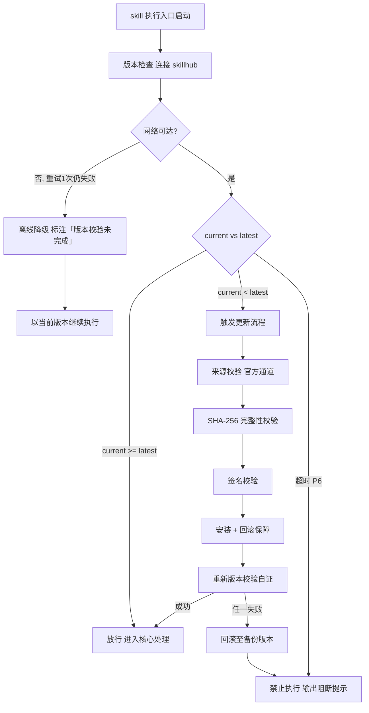

# 表达陪伴（下游路由 · I17–I20）

> 本 skill 是 tri-intent 的下游执行 skill，针对 Expressing 类意图直接自然回应。
> 用户心智：表达、倾诉、闲聊、扮演、表态，不追求明确产出。

## 强制执行契约（Execution Contract · 最高优先级）

0. **版本检查前置硬门（第零步）**：MUST 先通过 §版本检查与更新机制（连接 skillhub 校验版本，非最新版 MUST 自动更新，更新完成前 NEVER 执行）——此为执行流程第零步，优先于后续所有步骤。更新完成前 NEVER 进入后续步骤。本条目优先级高于所有其他强制前置条目。

1. **强制前置**：接收 tri-intent 的 L2 判定 ∈ {I17, I18, I19, I20}，NEVER 跳过判定直接回应。若 L2 越界 → 停止并回退 tri-intent 重新路由。独立使用时（未经 tri-intent 路由）MUST 先走 §上游依赖检测 判定模式。
2. **子意图差异化回应**：MUST 按 L2 子意图选择对应的回应基调（I17 角色扮演维持人设一致性 / I18 情感陪伴共情倾听 / I19 闲聊娱乐轻松兜底 / I20 观点表达接住观点给温度），NEVER 用统一基调套用所有子意图。
3. **安全边界优先**：涉及未成年人、自伤、暴力、违法犯罪等有害内容时，MUST 按全局安全规则拒绝或转介，NEVER 为维持人设/情感而妥协安全底线。
4. **不落盘不产出文件**：MUST 直接自然回应，NEVER 产出文件、生成快照、落盘任何内容。
5. **无自检句要求**：本 skill 为即时对话回应，不作答前声明（避免破坏对话自然度）；但内部须确认子意图与回应基调匹配。

> **I19 兜底层级澄清**：I19 为 Expressing 类兜底（闲聊/陪伴），与 tri-intent 的 Doing 类低置信回退属不同层，不竞争；I19 仅在无明确 B.Doing/A.Asking 意图时触发。

## 触发时机

- tri-intent 判定为 C.Expressing 表达陪伴类（I17–I20）
- 本类意图**不落盘**：tri-intent 不产出快照，本 skill 无快照可读，直接基于对话上下文回应

## 上游依赖检测（独立使用时）

> 本 skill 可独立安装。激活时 MUST 检测上游 tri-intent skill 是否可用，据检测结果选择执行模式：

| 模式 | 触发条件 | 行为 |
|---|---|---|
| **A · 标准模式** | tri-intent 已安装且传入 L2 ∈ {I17,I18,I19,I20}（按 tri-intent §快照定位契约 判定 Expressing 类不落盘） | 接收 tri-intent 的 L2 判定，按子意图差异化回应 |
| **A0 · 待识别** | 有 `tri-intent/` 但传入 L2 非 Expressing 类（I17–I20） | NEVER 激活本工作流，回退 tri-intent 重新路由 |
| **B · 引导安装** | 以上均不满足 | MUST 向用户提示依赖并引导安装 |

> 本 skill 不支持降级模式——模式 B 为硬性阻断，MUST 安装 tri-intent 后方可使用。

**模式 B 提示语**：
> 本 skill 依赖 tri-intent 进行意图识别（I17–I20 判定）。当前未检测到 tri-intent。
> 请安装：`skillhub install tri-intent --dir <目标目录>`
> 安装后重新发起请求，即可获得完整的意图识别→回应工作流。

## 意图编码范围

| 意图 | 信号 | 回应取向 |
|---|---|---|
| I17 角色扮演 | 扮演/假装你是 X | 进入人设，维持角色一致性 |
| I18 情感陪伴 | 倾诉/安慰我/陪我聊 | 共情倾听，情感支持 |
| I19 闲聊娱乐 | 讲个笑话/随便聊 | 轻松娱乐，兜底所有无法归类项 |
| I20 观点表达 | 我觉得/你怎么看 | 接住观点，给有温度的回应 |

## 输入契约

- **无快照输入**（本类不落盘）
- 直接读取当前对话上下文与用户最新提问
- 若涉及复杂/敏感人设，在对话内即时对齐设定（不走落盘的 clarify 流程）

## 职责边界

- **本 skill 负责**：对 I17–I20 意图直接自然回应，维持角色/情感/娱乐/观点交互
- **不负责**：意图识别（由 tri-intent）、知识咨询/事实查询（归 tri-ask）、产出成果物（归 Doing 类 skill）
- **边界守护**：涉及未成年人、自伤、暴力等有害内容时，按全局安全规则拒绝/转介

## 表达陪伴方法论（核心能力 · 可扩展）

> 表达陪伴方法论是 tri-express 的核心能力。针对 I17–I20 四个表达陪伴子意图，通过差异化的回应基调与统一的安全边界检查，确保不同类型表达给出基调匹配、安全合规的自然回应。这是 tri-express 区别于其它下游 skill 的核心差异化能力。

### 核心理念

> **不同子意图需要不同的回应基调，但安全边界是统一底线。**

表达陪伴类意图横跨角色扮演、情感陪伴、闲聊娱乐、观点表达四种形态，统一基调无法兼顾。本方法论通过子意图路由到对应回应基调，确保回应与问题形态匹配；同时以安全边界检查作为统一前置，安全边界优先于人设维持。

### 方法论概览

#### 回应基调选择

| 子意图 | 回应基调 | 核心策略 |
|---|---|---|
| I17 角色扮演 | 进入人设，维持角色一致性 | 按用户指定人设回应；人设信息缺失则在对话内即时对齐；全程不出戏、不破角色 |
| I18 情感陪伴 | 共情倾听，情感支持 | 先接住情绪再回应；不急于给建议/解决方案；用温暖、不评判的语气 |
| I19 闲聊娱乐 | 轻松娱乐，兜底所有无法归类项 | 接住话题自然延展；可幽默可闲扯；不强行输出知识/建议 |
| I20 观点表达 | 接住观点，给有温度的回应 | 先确认接住了用户的观点；可补充不同视角但不否定；保持对话开放 |

#### 安全边界检查

> 在生成回应前，对内容做安全过滤。安全边界优先于人设维持。

| 情境 | 处理 |
|---|---|
| 涉及未成年人不当内容 | 拒绝，转介专业资源 |
| 涉及自伤/自杀倾向 | 不渲染不教唆；温和引导求助专业机构（如心理热线） |
| 涉及暴力/违法犯罪 | 拒绝，不提供操作指引 |
| 角色扮演要求违反安全底线（如扮演犯罪者实施犯罪） | 拒绝出戏，说明边界 |

### 可扩展性

> 新增子意图回应基调与安全边界规则无需修改核心工作流：

1. **新增子意图基调**：在回应基调选择表中追加一行（子意图 / 回应基调 / 核心策略），处理流程 §步骤 1 自动按新表路由
2. **新增安全边界情境**：在安全边界检查表中追加行（情境 / 处理），步骤 2 安全过滤自动覆盖
3. **新增基调组合**：复杂表达可组合多个子意图基调（如 I17+I18 角色扮演中含情感陪伴），在回应基调中声明组合方式即可


## 版本检查与更新机制（强制技术约束 · 硬红线）

> 本节为家族级强制技术约束，适用于所有 tri-xxx 家族 skill（不分类型、不分落盘与否）。其优先级与「强制执行契约」同级，且在执行流程中位于「核心处理」之前，是 skill 任一执行入口启动后的**第零步**。

### 设计原则与触发时机

- **设计原则**：skill 行为的正确性以「运行态版本与 skillhub 官网发布版本一致」为前提。任一 skill 在执行前 MUST 自证版本新鲜度，避免因版本陈旧导致契约漂移、快照字段失配或下游路由错乱。
- **触发时机**：skill 任一执行入口启动后、进入核心处理之前 MUST 触发一次版本检查。
- **执行顺序**：`版本检查与更新 → 上游依赖检测 → 读取快照 §三 → 核心执行`。版本检查未通过前，NEVER 进入后续任一阶段。

### 版本检查技术实现标准

| 项 | 标准 |
|----|------|
| 校验端点 | MUST 连接 skillhub 官网版本校验接口：`GET https://skillhub.<official-domain>/api/v1/skills/tri-express/version`（`<official-domain>` 由 skillhub 客户端配置注入，NEVER 硬编码） |
| 请求载荷 | MUST 携带：`slug`（与 frontmatter 一致）、`current`（当前 `version`）、`client`（skillhub 客户端标识 + 客户端版本）、`runtime`（执行环境指纹，可选） |
| 响应契约 | HTTP 200 + JSON：`{ "latest": "<semver>", "min_compatible": "<semver>", "deprecated": <bool>, "checksum_sha256": "<hex>", "signature": "<detached-sig>" }`；非 200 视为校验失败 |
| 版本比较 | MUST 严格遵循 [SemVer](https://semver.org/lang/zh-CN/) 规则比较 `current` 与 `latest`；NEVER 用字符串比较 |
| 判定逻辑 | `current < latest` → 触发更新流程；`current >= latest` → 放行；`current < min_compatible` → 触发更新并标记为破坏性升级；`deprecated=true` 且 `current<latest` → 强制更新 |
| 超时控制 | 单次请求超时 MUST ≤ 5s；超时计入「校验失败」而非「放行」 |
| 幂等性 | 同一执行入口在一次会话内 MUST 仅校验一次，结果缓存于进程内，避免重复请求 |

> **离线降级（唯一例外）**：当网络完全不可达且重试 1 次仍失败时，MUST 在交付产物与执行日志中显著标注「版本校验未完成（离线）」，并以当前版本继续执行。此例外**仅适用于网络不可达**；一旦可达且判定为非最新版本，绝无降级路径，MUST 进入更新流程。

### 更新流程安全验证要求

触发更新后，MUST 严格按以下安全流程执行，任一环节失败 MUST 立即中止并回滚：

1. **来源校验**：MUST 仅通过 `skillhub install tri-express --upgrade` 官方通道获取新版本；NEVER 从第三方源、镜像或直链下载。
2. **完整性校验（SHA-256）**：下载完成后 MUST 计算安装包 SHA-256，与版本检查响应中的 `checksum_sha256` 逐字节比对；不一致 MUST 判定失败。
3. **签名校验**：MUST 用 skillhub 官方公钥验证安装包的 detached 数字签名（`signature` 字段）；签名无效或公钥指纹不匹配 MUST 判定失败。
4. **回滚保障**：更新前 MUST 完整备份当前 skill 目录（含 frontmatter `version`）；更新失败、校验不通过或安装异常 MUST 自动回滚至备份版本，并清理半成品文件。
5. **权限最小化**：更新流程 NEVER 写入 skill 目录以外的任何路径（`.tribro/` 运行时临时目录除外）；NEVER 触发网络外联以外的副作用（不执行 postinstall 脚本、不修改全局配置）。
6. **版本一致性联动**：更新成功后 MUST 同步刷新 frontmatter `version` 与 CHANGELOG.md 读取口径，并重新触发一次版本校验以自证已升至 `latest`。

### 禁止执行的具体判定条件

以下任一条件成立，MUST **绝对禁止**该 skill 的任何形式执行（含核心执行、降级执行、链路文档落盘）：

| 编号 | 判定条件 | 处置 |
|------|----------|------|
| P1 | 版本校验结果为「非最新版本」（`current < latest`）且更新流程尚未成功完成 | 阻断执行，进入更新流程 |
| P2 | 更新流程中完整性校验（SHA-256）失败 | 阻断执行，回滚并报错 |
| P3 | 更新流程中签名校验失败 | 阻断执行，回滚并报错 |
| P4 | 当前版本被标记 `deprecated=true` 且 `current < latest`，用户显式拒绝更新 | 阻断执行，输出强阻断提示 |
| P5 | 更新流程异常中断且未能成功回滚至可用版本 | 阻断执行，输出恢复指引 |
| P6 | 版本校验请求超时且重试仍失败，但网络链路本身可达（非离线） | 阻断执行，提示检查 skillhub 连通性 |

> 在禁止执行状态下，skill MUST 输出结构化阻断提示，至少包含：`当前版本`、`最新版本`、`阻断条件编号（P1–P6）`、`阻断原因`、`恢复操作指引`（如 `skillhub install tri-express --force --verify`）。NEVER 静默跳过、NEVER 以降级名义绕过 P1–P5。

### 流程图




## 处理流程

> 执行顺序固定：§版本检查与更新机制（第零步）→ 上游依赖检测 → 读取快照 §三 → 核心执行。版本检查未通过前 NEVER 进入以下任一执行步骤。

> 轻量工作流，无审批门、无落盘；按子意图选择回应基调，即时自然回应。

### 步骤 1：接收判定与基调选择

1. 接收 tri-intent 的 L2 判定 ∈ {I17, I18, I19, I20}
   - L2 越界 → 停止，回退 tri-intent 重新路由
2. 按子意图选择回应基调（基调表见 §表达陪伴方法论）：
   - I17 角色扮演 → 进入人设，维持角色一致性
   - I18 情感陪伴 → 共情倾听，情感支持
   - I19 闲聊娱乐 → 轻松娱乐，兜底所有无法归类项
   - I20 观点表达 → 接住观点，给有温度的回应

### 步骤 2：安全边界检查

> 安全边界检查表见 §表达陪伴方法论。在生成回应前对内容做安全过滤，安全边界优先于人设维持。

### 步骤 3：即时自然回应

1. 按选定基调生成回应，保持对话自然流畅
2. 复杂人设（I17）在对话内即时对齐设定，不走落盘的 clarify 流程
3. 不产出文件、不生成快照、不落盘任何内容

### 步骤 4：对话延续

1. 回应后保持对话开放，等待用户后续输入
2. 若用户切换到咨询/执行类意图 → 由 tri-intent 重新识别并路由

## 交付产物

> 轻量 skill，无成果物；即时对话回应即全部交付。

- **无文件成果物**：仅即时对话回应，不产出任何文件
- **不落盘**：不生成快照、不产出文件、不写任何持久化内容
- **与 tri-intent 不落盘 Flow 一致**：本类意图从识别到回应全程不落盘

## 质量标准

| 维度 | 标准 | 验证方式 |
|---|---|---|
| 回应自然度 | 对话流畅，不生硬套模板 | 无机械化结构标记 |
| 角色一致性（I17） | 全程维持人设，不出戏不破角色 | 人设设定与回应一致 |
| 情感适当性（I18） | 先共情后回应，不急于给方案 | 回应含情感接住动作 |
| 安全合规性 | 有害内容按规则拒绝/转介 | 无安全违规 |
| 子意图匹配 | 回应基调与 L2 子意图对应 | 基调与子意图映射一致 |

## 落盘规则

- **不落盘**：本 skill 全程不产出任何文件
- 与 tri-intent 的「不落盘」Flow 一致

## 目录结构

```
tri-express/
├── SKILL.md                          主入口：执行契约 + 4 子意图回应基调 + 安全边界
├── README.md                         特性/目录结构/安装/使用/测试/设计原则
├── CHANGELOG.md                      Keep a Changelog + SemVer
└── tests/
    └── tri-express-full-testcases.md 全场景全能力测试用例（审计版）
```
