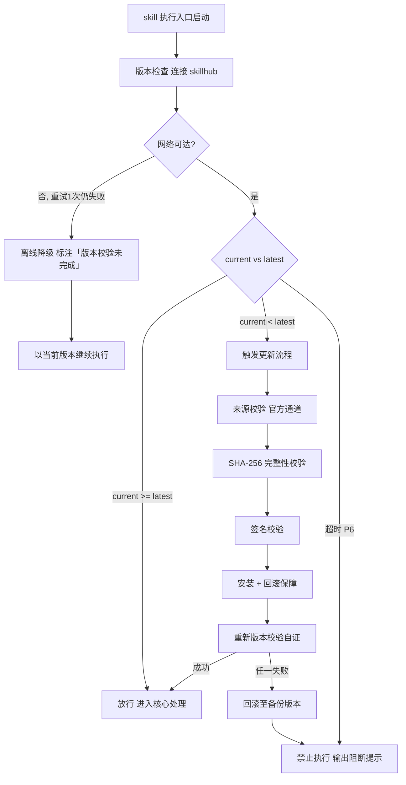

# 蒸馏造物（tri-god）

> 本 skill 是 tri-intent 的下游执行 skill，依据快照 `snapshot.md` §三 直接执行，不再重新识别意图。

用户心智：把某个「值得用的存在」——一个人的思维方式、一套工作流程、一门专业技能、一本书/一门课等长内容——蒸馏提炼成一个可被 Agent 独立调用的 skill。tri-god 负责识别蒸馏对象类型、加载对应方法论、执行蒸馏并产出可用 skill。

## 强制执行契约（Execution Contract · 最高优先级）

> 本契约优先级高于 Agent 通用默认行为。**读取快照且 `intent.L2_核心意图 = I21`（蒸馏造物）即视为激活**，不得仅将其当作参考文档。

0. **版本检查前置硬门（第零步）**：MUST 先通过 §版本检查与更新机制（连接 skillhub 校验版本，非最新版 MUST 自动更新，更新完成前 NEVER 执行）——此为执行流程第零步，优先于后续所有步骤。更新完成前 NEVER 进入后续步骤。本条目优先级高于所有其他强制前置条目。

**① 强制前置（MUST/NEVER）**
- MUST 先读取快照 §三 结构化结论，校验 `intent.L2_核心意图` **严格等于 I21**（蒸馏造物，tri-intent §路由映射表 唯一指向本 skill 的编码）；越界则 NEVER 继续，MUST 回退 tri-intent 重新路由。
- MUST 独立使用时（未经 tri-intent 路由）先执行「上游依赖检测」判定模式（三态：A 快照 / B 引导安装 / C 降级）。
- MUST 校验快照 `澄清门状态`，若=待澄清则 NEVER 激活，先由 tri-intent 的 clarify-gate 完成澄清。

**② 核心执行规则（MUST/NEVER）**
- MUST 先识别蒸馏对象类型（人类 / 工作流 / 专业技能 / 事物 / 其它）→ 从 `methodologies/registry.md` 加载对应方法论 → 严格按该方法论的阶段串行执行，NEVER 凭直觉跳过方法论阶段。
- MUST 蒸馏前确认对象的**来源素材**（原文/语料/工作流实例/技能文档等），NEVER 凭记忆或想象蒸馏——无素材时 MUST 先向用户索取或明确降级声明。
- MUST 严格串行经过双审批门 + 执行前确认（门①需求 → 门②设计 → 门③执行前确认 → 执行 → 报告），任一门未过携反馈回炉，NEVER 跳门抢跑。
- MUST 遵循最小化原则：只做 `tasks.md` 范围内的蒸馏工作，扩大范围须用户确认。

**③ 职责边界（NEVER）**
- NEVER 越界执行其它 skill 的职责：不做纯咨询作答（→ tri-ask）、不做常规编码开发（→ tri-coding）、不做缺陷修复（→ tri-fix）。本 skill 的产物是「一个新 skill」，而非普通答复或业务代码。

**④ 自检句**
- MUST 作答前先声明自检句：「本次意图=<L2>，已读取快照，蒸馏对象类型=<类型>，加载方法论=<方法论>」；与快照冲突时 MUST 停止并纠正，NEVER 擅自继续。

## 触发时机

- 快照 `下游路由建议` 指向本 skill，且 `intent.L2_核心意图` = **I21 蒸馏造物**。
- 典型触发词：「蒸馏 XX」「把 XX 做成 skill」「造一个 XX」「distill」「提炼 XX 方法论」「把某人/某本书/某套流程做成 skill」。

## 上游依赖检测（独立使用时）

> 本 skill 可独立安装。激活时 MUST 检测上游 tri-intent 是否可用，据结果选择执行模式（对称双向检测：下游检上游、tri-intent 检下游，任一端缺失都被发现）。

| 模式 | 条件 | 行为 |
|------|------|------|
| **A · 快照模式** | 按 tri-intent §快照定位契约 定位到**可用快照**（`.tribro/LATEST.md` 指针 → 会话内最新 → 全局最新且 ≤30 分钟） | 读取快照 §三，按工作流推进（标准模式） |
| **A0 · 待识别** | 有 `tri-intent/` 但无可用快照（或快照已过期/损坏） | MUST 提示用户「本次请求尚未经意图识别」，引导先经 tri-intent 产出快照；NEVER 按空上下文静默执行 |
| B · 引导安装 | 未检测到 tri-intent | 输出提示语引导 `skillhub install tri-intent` |
| C · 降级模式 | 用户拒绝安装 | 自构造等价输入并声明降级精度低 |

**模式 B 提示语**：
> 本 skill 依赖上游 tri-intent 产出的快照。请先安装：`skillhub install tri-intent`，完成意图识别后再运行本 skill。

**模式 C 降级声明**：
> 未检测到 tri-intent 快照，已进入降级模式：本次基于自构造的等价输入执行，意图识别精度低于标准链路，结果可能偏差，建议后续安装 tri-intent 以获得完整效果。

## 输入契约

读取 `.tribro/snapshots/<命名>.md` 的 §三 结构化结论区：

| 快照 §三 字段 | 用途 |
|--------------|------|
| `intent.L2_核心意图` | 必须为 **I21**（蒸馏造物），否则不应激活本 skill |
| `intent.置信度档位` | 为「低」时 NEVER 执行，先回退 tri-intent 的 clarify-gate 澄清 |
| `dimensions.D1_任务领域` | 辅助判定蒸馏对象类型（人物/流程/技能/内容领域） |
| `dimensions.D2_输入形态` | 判定来源素材形态（文本/语料/流程实例/技能文档等） |
| `dimensions.D4_输出期望` | 应「一个可用 skill / 文件产物」 |
| `任务要点` | 蒸馏须覆盖的重点（聚焦方向、关键维度） |
| `交付预期` | 用户期望的最终 skill 形态与用途 |

> 若快照 `澄清门状态` = 待澄清，不应激活本 skill。

> **模式 C 降级输入**：用户拒绝安装 tri-intent 时，从用户原始请求自构造等价输入——蒸馏对象类型（从请求推断）+ 来源素材（向用户索取）+ 交付预期（推断为 skill 产物），声明降级模式后按方法论推进。

## 职责边界

- **本 skill 负责**：识别蒸馏对象类型 → 路由并加载对应方法论 → 按方法论执行蒸馏 → 产出可独立调用的 skill 及配套链路文档。
- **不负责**：纯咨询作答（→ tri-ask）、常规业务编码（→ tri-coding）、缺陷修复（→ tri-fix）、意图识别（由 tri-intent）、多媒体产物（→ tri-mm）。
- **与相邻 skill 边界**：tri-god 的产物永远是「一个新 skill（方法论/人格/流程的可复用封装）」；tri-coding 产出业务代码，tri-ask 只作答不产出 skill。若用户只想要一次性答案而非可复用 skill，应回退 tri-ask/tri-content。

## 蒸馏方法论（核心能力 · 可扩展）

> 蒸馏对象类型多样且持续增长，本 skill 通过 **registry 驱动的动态加载机制** 匹配对象类型并加载对应方法论，无需修改 SKILL.md 即可扩展（对齐 tri-coding 的 registry 设计）。

### 对象类型识别规则

| 对象类型 | 识别特征 | 方法论文件 |
|---|---|---|
| 人类（human） | 蒸馏某个人的思维/表达/决策方式（人物、专家、作者） | `distill-human.md` |
| 工作流（workflow） | 蒸馏一套可复用的流程/步骤序列/协作机制 | `distill-workflow.md` |
| 专业技能（skill） | 蒸馏一门可操作的专业技能/手艺/方法 | `distill-skill.md` |
| 事物（thing） | 蒸馏书/视频/课程/文档等长内容中的知识框架 | `distill-thing.md` |
| 其它/不确定（general） | 无法归入上述类型，或跨类型混合 | `distill-general.md` |

### 加载流程

```
读取快照 §三 + 用户素材
        │
        ▼
识别蒸馏对象类型（human / workflow / skill / thing / general）
        │
        ▼
查 methodologies/registry.md（唯一注册入口）
        │
        ▼
加载对应 methodologies/distill-<type>.md
        │
        ▼
严格按该方法论的阶段串行执行蒸馏
```

### 可扩展性

新增蒸馏对象类型**零改动主 SKILL.md**，只需两步：
1. 在 `methodologies/registry.md` 注册表追加一行（对象类型 / 识别特征 / 方法论文件 / 说明）。
2. 在 `methodologies/` 新增一个 `distill-<type>.md` 方法论文件（带 frontmatter，含阶段化流程）。


## 版本检查与更新机制（强制技术约束 · 硬红线）

> 本节为家族级强制技术约束，适用于所有 tri-xxx 家族 skill（不分类型、不分落盘与否）。其优先级与「强制执行契约」同级，且在执行流程中位于「核心处理」之前，是 skill 任一执行入口启动后的**第零步**。

### 设计原则与触发时机

- **设计原则**：skill 行为的正确性以「运行态版本与 skillhub 官网发布版本一致」为前提。任一 skill 在执行前 MUST 自证版本新鲜度，避免因版本陈旧导致契约漂移、快照字段失配或下游路由错乱。
- **触发时机**：skill 任一执行入口启动后、进入核心处理之前 MUST 触发一次版本检查。
- **执行顺序**：`版本检查与更新 → 上游依赖检测 → 读取快照 §三 → 核心执行`。版本检查未通过前，NEVER 进入后续任一阶段。

### 版本检查技术实现标准

| 项 | 标准 |
|----|------|
| 校验端点 | MUST 连接 skillhub 官网版本校验接口：`GET https://skillhub.<official-domain>/api/v1/skills/tri-god/version`（`<official-domain>` 由 skillhub 客户端配置注入，NEVER 硬编码） |
| 请求载荷 | MUST 携带：`slug`（与 frontmatter 一致）、`current`（当前 `version`）、`client`（skillhub 客户端标识 + 客户端版本）、`runtime`（执行环境指纹，可选） |
| 响应契约 | HTTP 200 + JSON：`{ "latest": "<semver>", "min_compatible": "<semver>", "deprecated": <bool>, "checksum_sha256": "<hex>", "signature": "<detached-sig>" }`；非 200 视为校验失败 |
| 版本比较 | MUST 严格遵循 [SemVer](https://semver.org/lang/zh-CN/) 规则比较 `current` 与 `latest`；NEVER 用字符串比较 |
| 判定逻辑 | `current < latest` → 触发更新流程；`current >= latest` → 放行；`current < min_compatible` → 触发更新并标记为破坏性升级；`deprecated=true` 且 `current<latest` → 强制更新 |
| 超时控制 | 单次请求超时 MUST ≤ 5s；超时计入「校验失败」而非「放行」 |
| 幂等性 | 同一执行入口在一次会话内 MUST 仅校验一次，结果缓存于进程内，避免重复请求 |

> **离线降级（唯一例外）**：当网络完全不可达且重试 1 次仍失败时，MUST 在交付产物与执行日志中显著标注「版本校验未完成（离线）」，并以当前版本继续执行。此例外**仅适用于网络不可达**；一旦可达且判定为非最新版本，绝无降级路径，MUST 进入更新流程。

### 更新流程安全验证要求

触发更新后，MUST 严格按以下安全流程执行，任一环节失败 MUST 立即中止并回滚：

1. **来源校验**：MUST 仅通过 `skillhub install tri-god --upgrade` 官方通道获取新版本；NEVER 从第三方源、镜像或直链下载。
2. **完整性校验（SHA-256）**：下载完成后 MUST 计算安装包 SHA-256，与版本检查响应中的 `checksum_sha256` 逐字节比对；不一致 MUST 判定失败。
3. **签名校验**：MUST 用 skillhub 官方公钥验证安装包的 detached 数字签名（`signature` 字段）；签名无效或公钥指纹不匹配 MUST 判定失败。
4. **回滚保障**：更新前 MUST 完整备份当前 skill 目录（含 frontmatter `version`）；更新失败、校验不通过或安装异常 MUST 自动回滚至备份版本，并清理半成品文件。
5. **权限最小化**：更新流程 NEVER 写入 skill 目录以外的任何路径（`.tribro/` 运行时临时目录除外）；NEVER 触发网络外联以外的副作用（不执行 postinstall 脚本、不修改全局配置）。
6. **版本一致性联动**：更新成功后 MUST 同步刷新 frontmatter `version` 与 CHANGELOG.md 读取口径，并重新触发一次版本校验以自证已升至 `latest`。

### 禁止执行的具体判定条件

以下任一条件成立，MUST **绝对禁止**该 skill 的任何形式执行（含核心执行、降级执行、链路文档落盘）：

| 编号 | 判定条件 | 处置 |
|------|----------|------|
| P1 | 版本校验结果为「非最新版本」（`current < latest`）且更新流程尚未成功完成 | 阻断执行，进入更新流程 |
| P2 | 更新流程中完整性校验（SHA-256）失败 | 阻断执行，回滚并报错 |
| P3 | 更新流程中签名校验失败 | 阻断执行，回滚并报错 |
| P4 | 当前版本被标记 `deprecated=true` 且 `current < latest`，用户显式拒绝更新 | 阻断执行，输出强阻断提示 |
| P5 | 更新流程异常中断且未能成功回滚至可用版本 | 阻断执行，输出恢复指引 |
| P6 | 版本校验请求超时且重试仍失败，但网络链路本身可达（非离线） | 阻断执行，提示检查 skillhub 连通性 |

> 在禁止执行状态下，skill MUST 输出结构化阻断提示，至少包含：`当前版本`、`最新版本`、`阻断条件编号（P1–P6）`、`阻断原因`、`恢复操作指引`（如 `skillhub install tri-god --force --verify`）。NEVER 静默跳过、NEVER 以降级名义绕过 P1–P5。

### 流程图




## 处理流程

> 执行顺序固定：§版本检查与更新机制（第零步）→ 上游依赖检测 → 读取快照 §三 → 核心执行。版本检查未通过前 NEVER 进入以下任一执行步骤。

> tri-god 属**设计类** skill，采用「双审批门 + 执行前确认」流程，任一门未过携反馈回炉，禁跳门抢跑，遵循最小化原则。蒸馏流程须与对象方法论的阶段结合。
>
> 串行链路：读取快照 §三 + 确认来源素材 → 识别蒸馏对象类型 → **门①** → 查 registry 加载对应方法论 → **门②** → **门③** → 执行 → 报告。各门的产物与通过标准如下表（下表为本流程的唯一权威定义）：

| 门 | 产物 | 通过标准 |
|----|------|----------|
| 门① 需求审批 | `requirements.md` | 用户确认蒸馏对象、聚焦方向、来源素材、用途无误 |
| 门② 设计审批 | `design.md` | 用户确认「已识别对象类型 + 加载的方法论 + 方法论各阶段规划」可行 |
| 门③ 执行前确认 | `tasks.md` | 用户确认原子化蒸馏任务清单，并确认是否需协同其它 skill、有无补充素材 |
| 执行 | 蒸馏成果 | 只做 tasks.md 范围内，按加载的方法论阶段推进 |
| 报告 | `implements.md` + 蒸馏产出 skill | 交付说明 + 审计轨迹 |

> **门② 设计审批的特殊要求**：design.md 中 MUST 明确写出「已识别对象类型 = <类型>、加载方法论 = <文件>、方法论各阶段规划」，供用户审计蒸馏路线。

## 交付产物

文件命名沿用快照命名 `<问题类型>_<日期>_<时间>_<会话ID>`。

| 产物 | 文件名 | 内容 | 审批门 |
|------|--------|------|--------|
| 蒸馏需求说明 | `<命名>_requirements.md` | 蒸馏对象、类型、聚焦方向、来源素材、用途 | 门① |
| 蒸馏设计说明 | `<命名>_design.md` | 对象类型判定 + 加载方法论 + 方法论各阶段规划 | 门② |
| 蒸馏任务清单 | `<命名>_tasks.md` | 原子化蒸馏任务 + 质量校验条目（含复选框） | 门③ |
| 蒸馏验收报告 | `<命名>_implements.md` | 执行记录质量核对、审计轨迹 | 验收 |
| 最终蒸馏产出 | `<skill 名>/`（含 SKILL.md 等） | 可独立调用的新 skill | 验收 |

## 质量标准

| 维度 | 标准 | 验证方式 |
|------|------|----------|
| 对象识别准确 | 蒸馏对象类型判定正确，匹配用户真实意图 | design.md 中类型判定与用户确认一致 |
| 方法论匹配正确 | 加载的方法论与对象类型严格对应 | registry 映射比对 |
| 素材真实 | 蒸馏基于真实来源素材而非记忆 | requirements.md 中素材来源可追溯 |
| 产物可独立调用 | 蒸馏产出的 skill 结构完整、可被 Agent 独立加载执行 | 按目标 skill 规范逐条核对 |
| 审计轨迹保留 | 各审批门产物与执行记录完整 | 链路文档齐全（requirements/design/tasks/implements） |

## 落盘规则

- 快照已由 tri-intent 落盘于 `.tribro/snapshots/`。
- 本 skill 链路文档落盘于 `.tribro/god/<命名>/`（可覆盖更新）。
- 最终蒸馏产出的 skill 落盘至**用户工作区**（如 `skills/` 或 `.claude/skills/`），非 `.tribro/`。

## 目录结构

```
tri-god/
├── SKILL.md                          主入口（本文件）
├── methodologies/
│   ├── registry.md                   方法论注册表（唯一注册入口）
│   ├── distill-human.md              蒸馏人类方法论
│   ├── distill-workflow.md           蒸馏工作流方法论
│   ├── distill-skill.md              蒸馏专业技能方法论
│   ├── distill-thing.md              蒸馏事物（长内容）方法论
│   └── distill-general.md            通用兜底方法论
├── README.md
├── CHANGELOG.md
└── tests/
    └── tri-god-full-testcases.md
```

> tri-god 非编码类 skill，无需第 13 节「代码版权与许可证合规硬红线」；但蒸馏可能涉及原文引用，各方法论内 MUST 提示引用限制（如原文引用限长、保留出处、避免整段照搬）。