# Mermaid 图表语法模板

> 本文件是 tri-html 六维分析输出图表的 Mermaid 语法模板库。build_html.py 将这些模板填充实际数据后内联到 HTML。SKILL.md 仅留指针，详细语法在此检索。

> **grep 检索模式**：`grep -n "## <图表类型>" references/mermaid-templates.md`（如 `grep -n "## C4 Context" `）

---

## C4 Context 图（架构设计主图）

> 适用于 §1 架构设计维度，展示系统与外部依赖的关系。

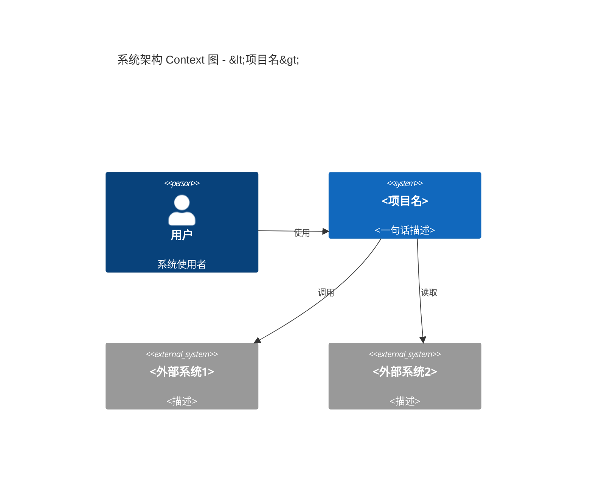

## Container 图（架构设计辅图）

> 适用于 §1 架构设计维度，展示系统内部容器/组件。

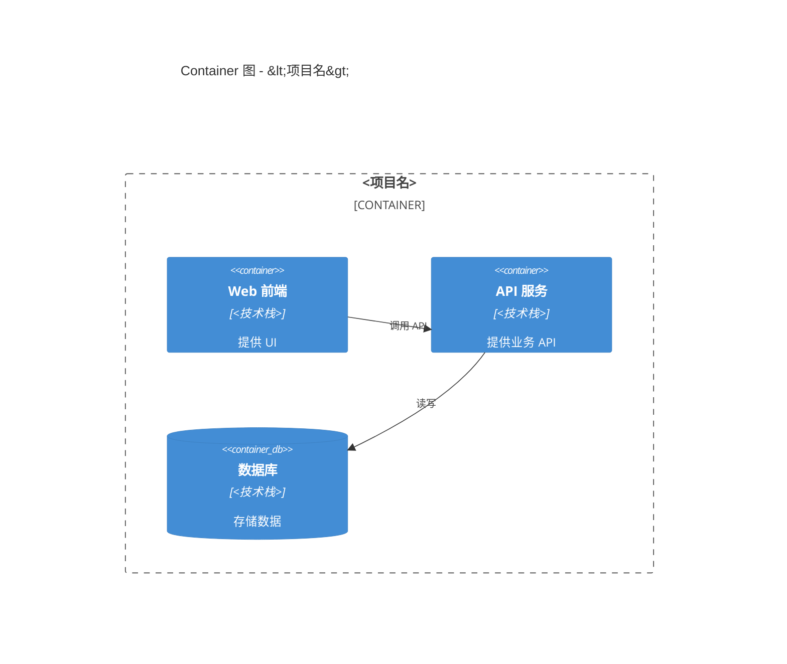

## 目录树 mind map（目录结构主图）

> 适用于 §2 目录结构维度，展示目录组织。

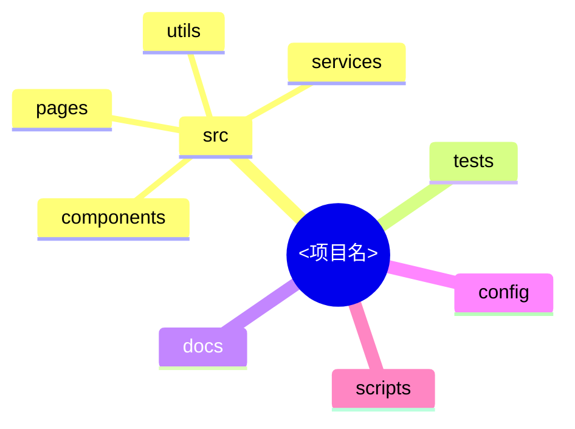

## 文件类型饼图（目录结构辅图）

> 适用于 §2 目录结构维度，展示文件类型分布。

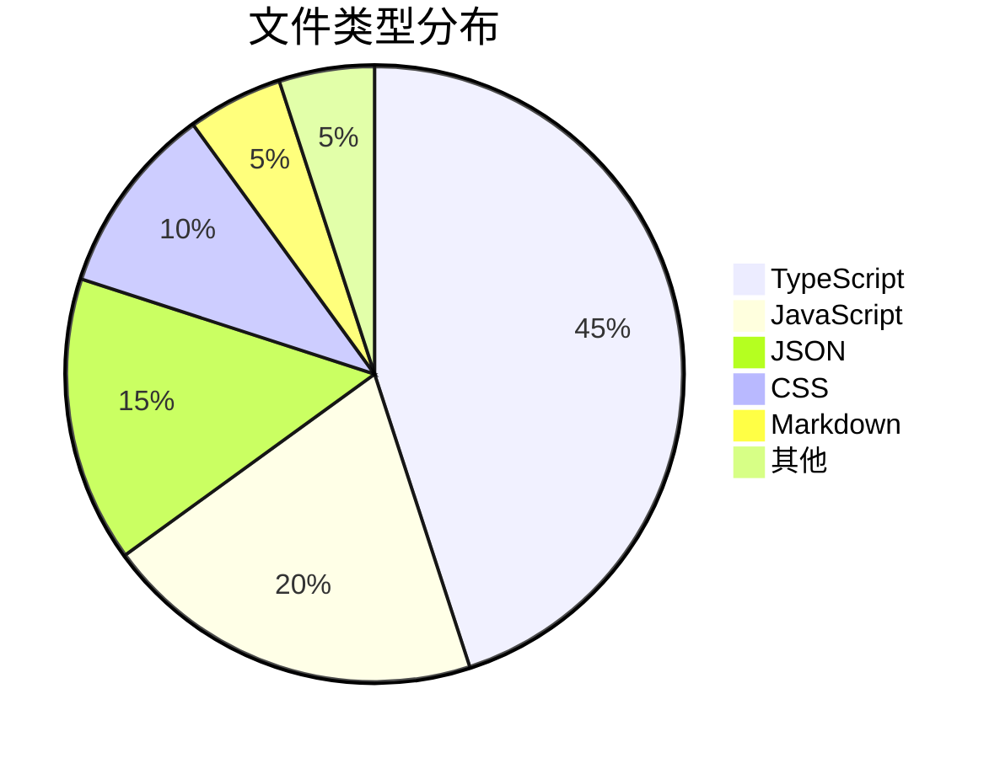

## 技术栈矩阵（技术栈选型主图）

> 适用于 §3 技术栈选型维度，分类列示技术栈。

> Mermaid 无原生表格图，用 flowchart 模拟：

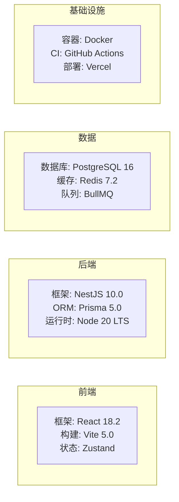

## 依赖关系图（技术栈选型辅图）

> 适用于 §3 技术栈选型维度，展示核心依赖关系。

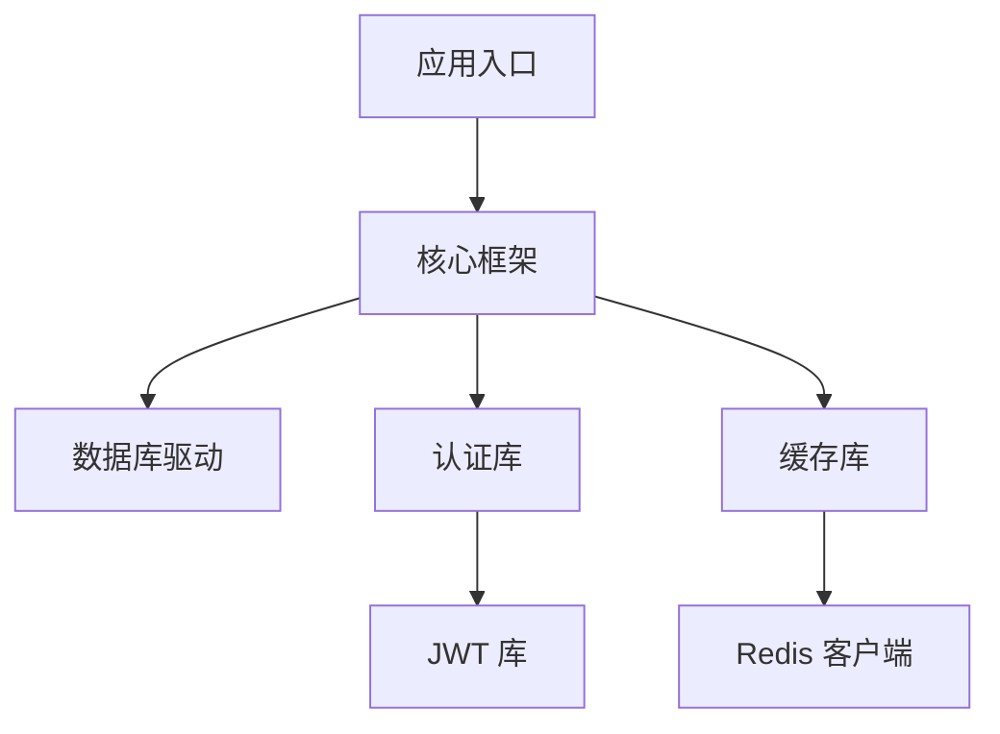

## 类图（代码设计主图）

> 适用于 §4 代码设计维度，展示核心类/接口关系。

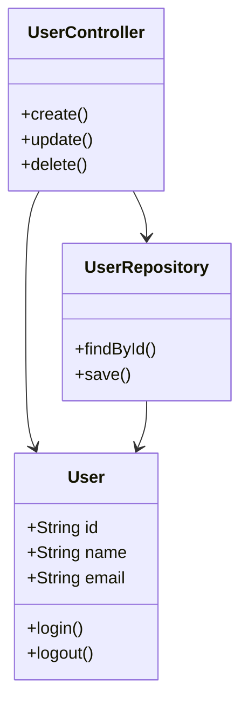

## ER 图（代码设计辅图）

> 适用于 §4 代码设计维度，展示数据模型关系（若有数据库）。

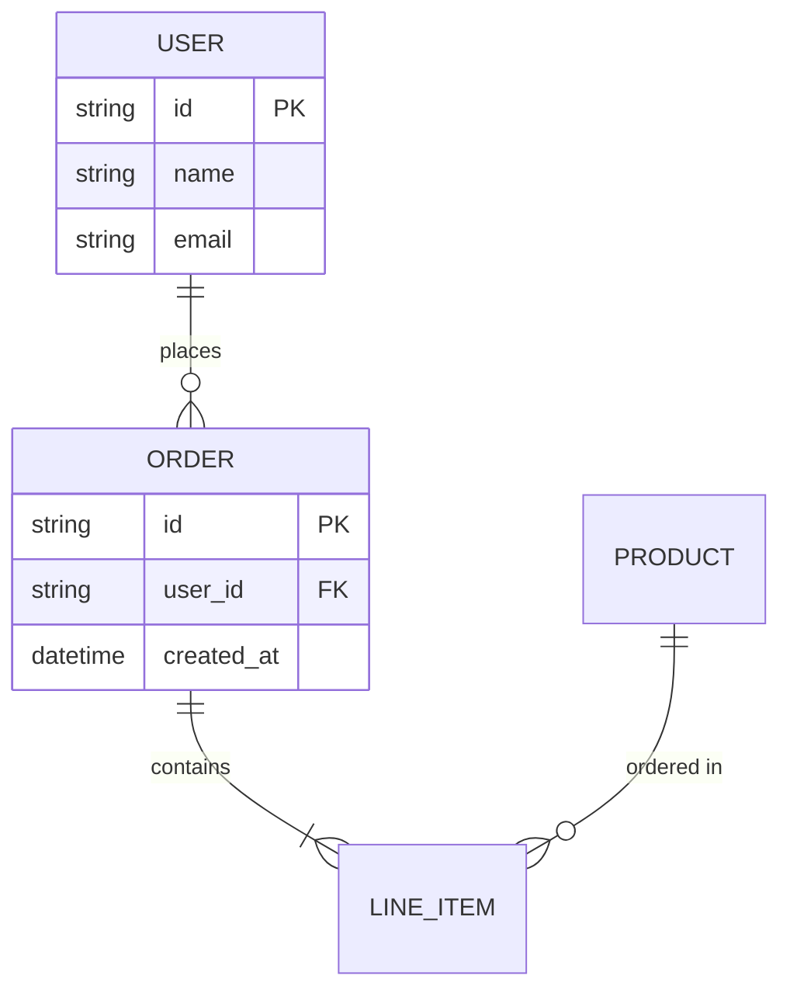

## 功能模块协作图（功能设计主图）

> 适用于 §5 功能设计维度，展示功能模块协作。

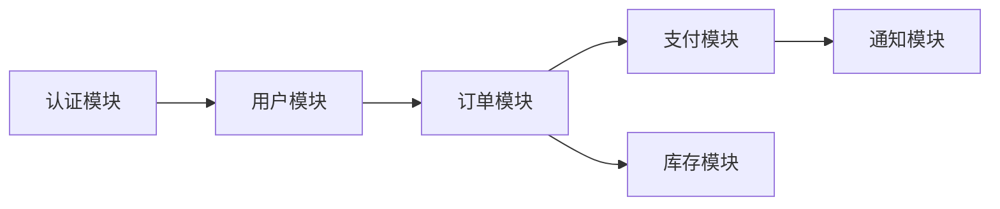

## 用户旅程图（功能设计辅图）

> 适用于 §5 功能设计维度，展示关键用户旅程。

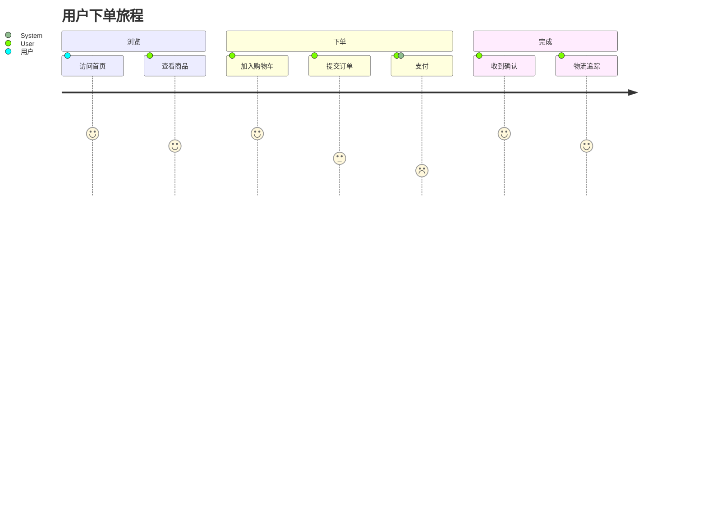

## 状态机图（功能设计辅图）

> 适用于 §5 功能设计维度，展示状态机（订单/任务/工作流）。

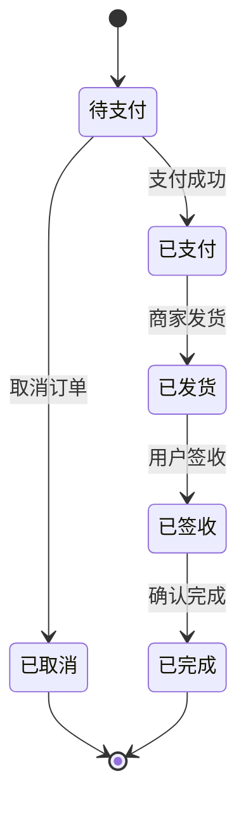

## 特殊设计策略图（特殊设计主图）

> 适用于 §6 特殊设计维度，按实际识别到的策略绘制。示例为安全认证流程：

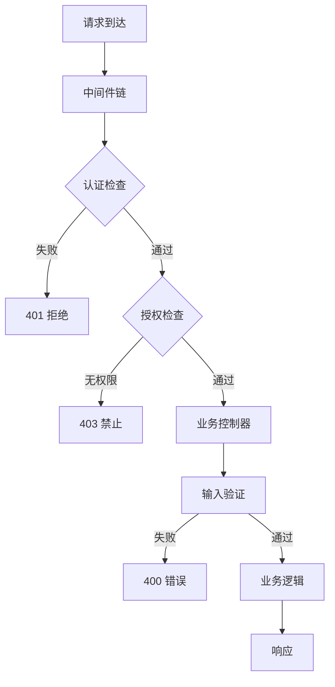

## 缓存架构图（特殊设计辅图）

> 适用于 §6 特殊设计维度，展示缓存策略。

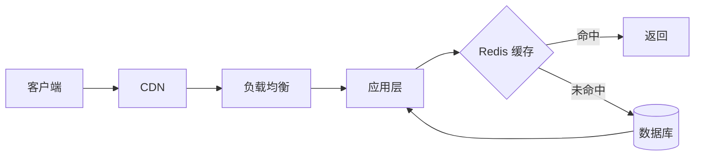

## 监控拓扑图（特殊设计辅图）

> 适用于 §6 特殊设计维度，展示可观测性架构。

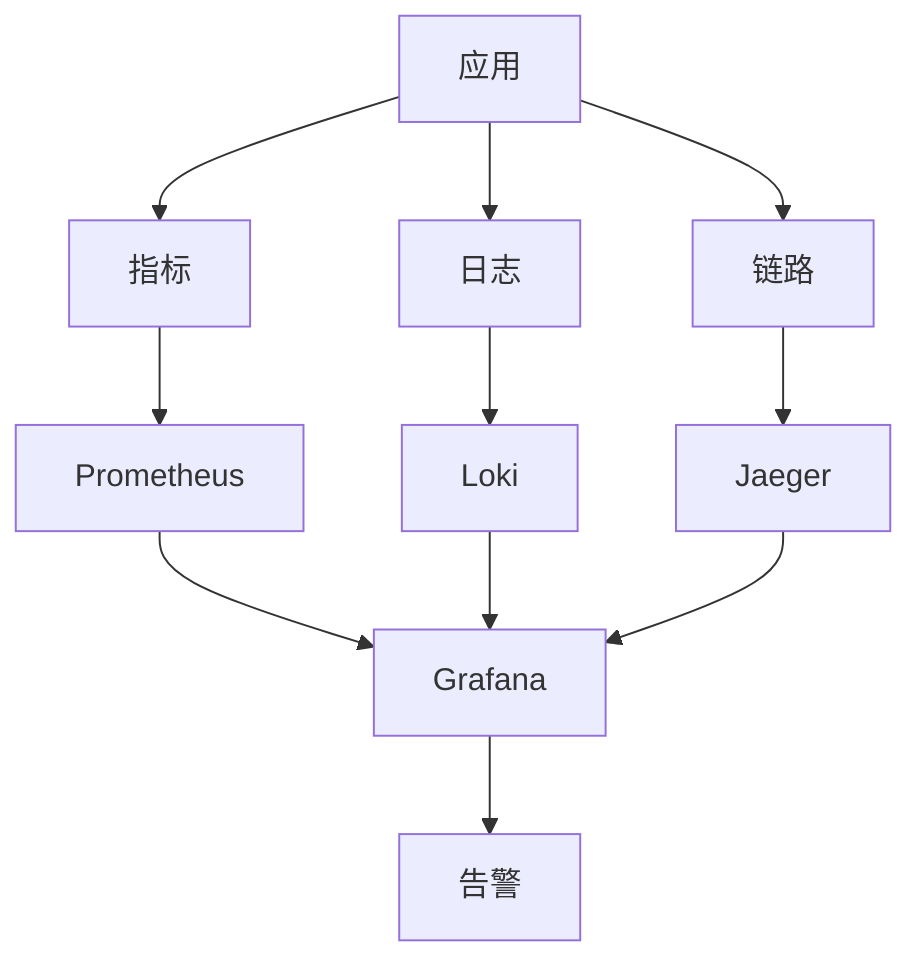

---

## 模板填充规则

1. **占位符替换**：模板中 `<项目名>`、`<技术栈>`、`<描述>` 等占位符 MUST 替换为实际数据
2. **语法校验**：build_html.py 内置 Mermaid 语法校验，语法错误的图表 MUST 修正后再注入
3. **按需选择**：每维度主图必选，辅图按实际识别到的内容选择（无数据库则不画 ER 图）
4. **节点数控制**：单图节点数建议 ≤15，超出时分图绘制（避免 Mermaid 渲染性能问题）
5. **特殊字符转义**：节点文本含 `()[]{}|` 等特殊字符时用引号包裹（如 `Node["文本(含括号)"]`）
