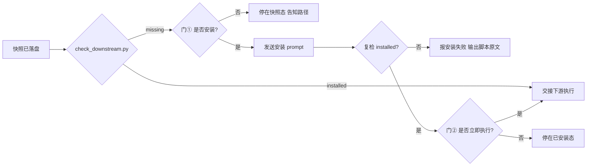

# 意图识别总路由（第一层：顶层意图三分法）

> 依据 OpenAI《How People Use ChatGPT》三分法 + 学术界问题意图分类学构建的 MECE 分类体系入口。任何一次用户提问必然落入且仅落入一个大类。

## 强制执行契约（Execution Contract · 最高优先级）

> 本节定义 skill「被激活后必须做什么」，优先级高于 Agent 的通用默认行为。**引用/读取本文件即视为激活本工作流**，不得仅将其当作参考文档。

0. **版本检查前置硬门（第零步）**：MUST 先通过 §版本检查与更新机制（按 `references/version-check-spec.md` 做本地版本一致性校验，本仓库为自维护 fork、不做远端比对；按脚本输出与退出码处置）——此为执行流程第零步，优先于后续所有步骤。版本检查完成前 NEVER 进入路由步骤。本条目优先级高于所有其他强制前置条目。
1. **强制前置**：收到任何新用户提问，MUST 先执行「路由步骤」完成意图识别，再产出快照交接下游，NEVER 跳过直接给成果物。
2. **唯一交付产物**：非「不落盘」类意图，MUST 产出 `.tribro/snapshots/<命名>.md`（模板见 `templates/snapshot.md`），并**同时覆盖写** `.tribro/LATEST.md` 指针文件（格式见 §快照定位契约），供下游 skill 无歧义定位。快照是本 skill 的**唯一交付产物**——内含用户原始提问、意图分析过程、结构化结论数据（intent + 置信度 + dimensions + 任务要点 + 下游路由建议 + 下游 slug）。若 `.tribro/` 目录不存在，MUST 先创建该目录再落盘。**禁止产出** requirements.md、design.md、tasks.md、implements.md、reports.md 等任何下游交付物——那些由下游 skill 依据快照自行产出。
3. **可选轻量复述**：识别完成后，可至多一次将快照中的结构化结论复述给用户，供其发现明显误识别即可。不设回炉循环、不设多轮审批。当 clarify-gate 已完成澄清、需求已充分时，连这一次复述都可跳过。原则上无需再次向用户确认真实意图。
4. **职责边界**：本 skill 仅负责「识别意图分类（L1/L2）→ 标注正交维度（D1–D5）→ 需求模糊时主动澄清（clarify-gate）→ 产出快照 → 交接下游 skill」。设计、拆解、执行、测试、审批等一切下游职责均不属于本 skill。
5. **置信度强制**：MUST 为本次识别给出 0–1 置信度自评并写入快照（见 §置信度机制）。置信度 <0.60 时 NEVER 直接交接下游，MUST 回退 clarify-gate；<0.85 或存在竞争意图时 MUST 执行一次轻量复述。
6. **下游分发强制**：产出快照后 MUST 执行 §下游依赖检测——脚本判定未安装时 MUST 走两道确认门（门① 安装确认 → 发送安装 prompt → 复检 → 门② 执行确认），NEVER 未经门① 同意擅自安装，NEVER 未经门② 同意擅自执行下游，NEVER 因下游缺失就由本 skill 越界代答。
7. **自检**：作答前用一句话声明「本次意图=<L2>，置信度=<数值/档位>，版本检查=<已通过/离线降级/通道降级/升级降级>，已产出快照+LATEST 指针，路由建议=<下游 slug>，下游检测=<已安装/未安装>，分发=<直接交接/门①待确认/门①已拒/已安装-门②待确认/门②已拒>」，若与上述规则冲突则停止并纠正。

| 若命中 | 落盘 | 下游路由建议 |
|---|---|---|
| I01–I05（Asking 咨询求解） | 快照 | 咨询作答 skill |
| I06–I10（内容生成/改写/翻译/总结/分析） | 快照 | 内容处理 skill |
| I11（编码开发） | 快照 | 编码开发 skill（tri-coding；全生命周期子类→tri-sdlc） |
| I12（调试修复） | 快照 | 调试修复 skill（tri-fix） |
| 代码审查（review/审查/CR） | 快照 | 代码审查 skill（tri-review） |
| I13（规划拆解） | 快照 | 规划拆解 skill（工作流设计子类→tri-workflow；全生命周期子类→tri-sdlc） |
| I14（操作执行） | 快照 | 操作执行 skill（工作流编排子类→tri-workflow；loop/domain 创建子类→tri-loop；全生命周期子类→tri-sdlc） |
| I15（多媒体生成） | 快照 | 多媒体生成 skill |
| I16（头脑风暴） | 快照 | 头脑风暴 skill |
| I21（蒸馏造物） | 快照 | 蒸馏造物 skill（tri-god） |
| I17–I20（Expressing 表达陪伴） | 不落盘 | 表达陪伴 skill（直接自然回应） |
| M01–M04（Meta 元操作） | 快照 | 元操作处理 skill |
| M05（中止确认） | 不落盘 | 即时叫停/放行 |
| 需求模糊/矛盾/缺关键信息 | 先澄清 | 先走 clarify-gate 补齐后再识别 |

## 触发时机

- 任何新用户提问进入工作流的**第一步**
- 需要将模糊、复合的用户输入路由到精确处理链路时

### 不触发场景（Not-Trigger）

本 skill 不接手以下情形（命中即转出，仅产出快照后交接，不越界产出）：

- 「意图已被上游指定 / 快照已存在」——直接由对应下游 skill 读取快照执行，本 skill 不重识别。
- 「产出需求/设计/任务清单/实现报告/最终回答」——识别后由各下游 skill 依据快照自行产出，本 skill 不代做。
- 「轻量咨询作答 / 具体领域执行（编码、翻译、写作等）」——属各 L2 落点 skill（本分支保留如 tri-coding 等），本 skill 只做识别与路由。

## 第一层判定（四选一，互斥穷尽）

| 大类 | 判定信号 | 用户心智 | 占比 | 下钻目录 |
| --- | --- | --- | --- | --- |
| **A. Asking 咨询求解** | 问「是什么/为什么/怎么办/哪个好」，期望获得知识、建议、判断 | 把 AI 当顾问/信息源 | ~49% | `asking/` (I01–I05) |
| **B. Doing 委托执行** | 说「帮我写/做/改/算/查代码」，期望拿到可直接用的成果物 | 把 AI 当执行者 | ~40% | `doing/` (I06–I16 + I21 + 代码审查) |
| **C. Expressing 表达陪伴** | 倾诉、闲聊、扮演、表态，不追求明确产出 | 把 AI 当倾听者/伙伴 | ~11% | `expressing/` (I17–I20) |
| **Meta 元操作** | 针对「上一轮回复」或「AI 本身」发问 | 关于对话本身 | 边缘补全 | `meta/` (M01–M05) |

## 路由步骤

> 执行顺序固定：`§版本检查与更新机制（第零步）→ 下游依赖检测 → 路由识别 → 产出快照 → 交接下游`。版本检查未通过前 NEVER 进入以下任一路由步骤。

0. **版本检查（第零步）**：MUST 先执行 §版本检查与更新机制，通过后方可进入核心路由流程。版本检查未通过前 NEVER 进入后续步骤。
1. **提取核心动词**：识别用户「想让 AI 做什么动作」，这是主分类键
2. **一层判定**：按上表信号定位到 A/B/C/Meta 之一（若跨界如「头脑风暴」，取用户最终期望产出动作，见 `doing/I16-brainstorm`）
3. **二层下钻**：进入对应目录，激活匹配的二级意图 skill 精准识别
4. **代码审查特殊路由**：若核心动词为「审查/review/CR/code review」，L2 标注为「代码审查」（Doing 大类特殊路由项），`下游路由建议` 指向 tri-review，详见 `doing/code-review.md`
5. **全生命周期（SDLC）子类路由**：若 L2 判定为 I11、I13 或 I14，且任务要点含全生命周期语义（全生命周期/SDLC/研发流程/立项到上线/端到端交付/完整开发流程/从需求到发布/阶段门禁），`L3_子意图` 标注为 `sdlc`，`下游路由建议` 覆写为 tri-sdlc，L2 保持 I11/I13/I14 不变，详见 `doing/sdlc-design.md`。**本子类优先级高于第 6、7 步的 workflow / loop 子类**：同时命中时以「交付对象是一个真实项目，还是一份流程定义/一个长期循环体」判定归属。
6. **工作流设计子类路由**：若 L2 判定为 I13 或 I14，且任务要点含工作流设计语义（工作流/流水线/审批流/自动化流程/CI-CD/编排/pipeline），且**未命中第 5 步 sdlc 子类**，`下游路由建议` 覆写为 tri-workflow，L2 保持 I13/I14 不变，详见 `doing/workflow-design.md`
7. **loop/domain 创建子类路由**：若 L2 判定为 I14，且任务要点含 loop/domain 创建语义（loop/domain/循环/知识库/beat/workstream/charter/cadence），且**未命中第 5 步 sdlc 子类**，`下游路由建议` 覆写为 tri-loop，L2 保持 I14 不变，详见 `doing/loop-design.md`
8. **蒸馏造物路由**：若核心动作为「蒸馏/提炼/萃取/distill/造一个skill/把XX做成skill/复刻某人/复刻工作流」且期望产出为「一个可复用的新 skill」，L2 判定为 **I21 蒸馏造物**，`下游路由建议` 指向 tri-god，详见 `doing/I21-distill.md`。注意与 I11 编码开发边界：I11 产出的是「业务代码/程序」，I21 产出的是「可独立调用的 skill（含方法论蒸馏）」。
9. **多意图消歧**：一句含多意图时，取「最终期望产出」为主意图，其余降为辅助标签
10. **边缘兜底**：无法归入任一 I/M 项时，落 `expressing/I19-chitchat`，确保 100% 有落点
11. **澄清前置**：若需求模糊/矛盾/缺关键信息，先激活 `clarify-gate` 对齐后再继续
12. **动作泛化降级**：若判为 B.Doing 但**核心动作过于泛化**（如「搞定」「搞一下」「处理一下」），无法映射到具体 I06–I16 或 I21 产出动作，降级归 `asking/I03 建议咨询`（本质是求助如何处理），并强制走 `clarify-gate` 澄清后再重路由。
   - **关键边界**：降级判定以「**动作能否映射到具体 I06–I16 或 I21**」为唯一标准，**非**「对象是否缺失」。
   - **动作明确但对象缺失**（如「优化一下」「翻译一下」「改写一下」）：动作可映射到 I07/I08 等，**不降级**，直接走 `clarify-gate` 补齐对象后保持原意图。
   - **动作泛化无法映射**（如「帮我搞定那件事」「搞一下」）：降级归 I03。

## MECE 保证

- **完全穷尽**：任一提问 = 第一层(A/B/C/Meta) × 第二层(I01–I21、CR 或 M01–M05) × 第三层(D1–D5 标签)
- **相互独立**：以「核心动作」为唯一主键判定，杜绝类别重叠
- **兜底闭环**：I19 闲聊娱乐为 Expressing 兜底，保证零覆盖空白
- **落点总数**：27 个（I01–I21 共 21 个 + CR 代码审查 1 个 + M01–M05 共 5 个）。
  CR 为无数字编码的特殊路由项，在机器可读字段中统一以 `CR` 表示，确保编码体系闭合可枚举。

## 置信度机制（识别可靠性量化）

> 意图识别必须给出**可量化的自评置信度**，据此决定「直接交接 / 强制复述 / 回退澄清」，
> 避免低可靠性识别静默流入下游造成错误执行。阈值与 `hooks/intent-gate.py` 常量保持单一事实源。

**一句话摘要**：四维加权打分（动词明确性 0.35 / 语料匹配度 0.25 / 邻近意图排除强度 0.25 / 上下文完备度 0.15）得出 0–1 置信度，按三档处置——**高 ≥0.85** 直接交接可跳过复述、**中 0.60–0.85** 交接但强制复述一次、**低 <0.60** 禁止交接强制回退 `clarify-gate`；主次分差 < 0.15 时即使高档也强制复述。

> 📖 **详见 `references/confidence-mechanism.md`**——含四维权重表、三档阈值处置表、竞争意图规则、Expressing 例外、未评估兜底、置信度三字段落盘约定与 `hooks/intent-gate.py` 校验命令。

## 目录结构

```
tri-intent/
├── SKILL.md      主入口（本文件）：三分法判定 + 路由步骤 + 落盘规则 + 下游依赖检测
├── README.md     skill 说明与快速上手
├── CHANGELOG.md  版本变更记录
├── asking/       I01 信息查询 / I02 概念解释 / I03 建议咨询 / I04 决策辅助 / I05 推理计算
├── doing/        I06–I16 生成/改写/翻译/总结/分析/编码/调试/规划/执行/多媒体/头脑风暴 + I21 蒸馏造物 + 代码审查特殊路由 + 工作流设计/loop/全生命周期（SDLC）子类路由
├── expressing/   I17 角色扮演 / I18 情感陪伴 / I19 闲聊娱乐 / I20 观点表达
├── meta/         M01 澄清追问 / M02 纠错反馈 / M03 追加细化 / M04 能力询问 / M05 中止确认
├── clarify-gate/ 澄清对齐门（G1 苏格拉底式 / G2 批判式反问）
├── hooks/        intent-gate.py（识别结果呈现器，可选轻量复述）
├── references/   静态参考资料（非流程逻辑）
│   ├── confidence-mechanism.md   置信度机制完整参考（四维权重 + 三档阈值）
│   ├── snapshot-contract.md      快照定位契约与异常处置表（下游必读）
│   └── intent-confirm-card.md    意图确认卡 v2 完整 YAML 模板与填充规则
├── templates/    snapshot.md（唯一交付产物模板）
└── tests/        测试用例
```

### 可扩展性

1. **新增落点**：在 §第一层判定 与 §路由步骤 追加编码（编号顺延），并在 `doing/` 建对应细则文件——路由逻辑零改动
2. **新增 L3 子类**：在子类路由段追加说明（判定语义 + 消歧 + 优先级），MUST 在 `family-spec.md` §五 登记变体
3. **新增正交维度**：在维度表追加标签，快照模板与本 skill 同步扩展

## 版本检查与更新机制（强制技术约束 · 硬红线）

<!-- version-stub v1 · 瘦指针节点；细则唯一真源见 references/version-check-spec.md -->

> 任一执行入口启动后的**第零步**，先于核心执行阶段。细则唯一真源：`references/version-check-spec.md`；
> 可执行实现（逻辑唯一真源）：`scripts/check_update.py`。
> **铁律**：版本比较、升级执行、回退、状态判定 MUST 由脚本完成；prompt 层 ONLY
> 「调用脚本 + 解析其 JSON 输出 + 按 `state` 处置」，NEVER 在 prompt 内联推断版本或拼接升级命令。

```bash
python scripts/check_update.py --slug tri-intent --json
```

- 处置：按脚本输出放行或阻断（判据与 `block_code` 语义见真源）；NEVER 因版本门自身故障阻断 skill 启动。

## 意图确认卡（通用主模板 · 识别结果结构化呈现）

> **用法**：意图识别完成后，用识别结果填充意图确认卡 v2 模板，作为快照 §三 结构化结论区的内容。
> - 对**用户**：用「一句话复述」+「待确认项」让用户 3 秒看懂自己的需求
> - 对 **LLM**：`intent` / `dimensions` 等结构化字段可被下游 skill 直接读取执行，**无需再次意图识别**
> - 各分类目录下有该组的**专属细化模板**，字段更贴合场景，优先使用专属模板

**一句话摘要**：确认卡含五段——`一句话复述` + `intent` 机器执行区（L1/L2/L3/辅助意图/置信度三字段）+ `dimensions` 正交标签区（D1–D5）+ `任务要点`/`澄清门状态`/`待确认项`/`交付预期` + `下游路由建议`/`下游 slug`；填充遵循「必填不留空、复述先行、机器区自洽、澄清优先」四条规则。

> 📖 **详见 `references/intent-confirm-card.md`**——含完整 YAML 模板、四条填充规则与字段-下游消费对照表。

## 兜底处理（NEVER 静默失败）

本 skill 在下列五类异常下 MUST 走显式降级路径并在快照中**标注实际降级与置信度**，NEVER 静默失败、NEVER 强行凑一个不确信的路由：

| 异常类 | 触发 | 兜底路径 |
|---|---|---|
| ① 版本检查异常 | `scripts/check_update.py` 返回非 A/D 或退出码 ≥20（BLOCK） | 按 §版本检查与更新机制 处置；BLOCK 时停止识别并报告 |
| ② 门禁不过 | 置信度低于交付阈值 / 竞争意图未消解（见 §置信度机制） | 走 clarify-gate 向用户追问以抬升置信度；仍低于阈值 MUST 如实标注低置信并列出候选意图，NEVER 静默选一个 |
| ③ 上游缺失 | 本 skill 为家族**上游总路由**，无上游依赖 | 不适用；本 skill 即上游，任何新提问均可独立处理 |
| ④ hook 缺失 | 触发源为「任何新提问的第一步」，**不以 hook 为触发源**；`hooks/intent-gate.py` 是路由真源的可执行载体 | 无 hook 环境（未注册 / 宿主不支持）时，识别与路由流程**照常按本 SKILL.md 执行**；`intent-gate.py` 缺失仅使路由校验命令不可用，MUST 在快照中登记「未做 hook 校验」，NEVER 因缺 hook 而拒答 |
| ⑤ 异常场景 | 输入无法归入任一 I/M 项 / 快照写入失败 | 无法归类 → 落 `expressing/I19-chitchat` 边缘兜底，保证 100% 有落点；快照写入失败 → 报告失败原因并给出内存态识别结果，NEVER 假装已落盘 |

## 🔴 检查点与红灯清单（STOP · NEVER）

### 🔴 用户确认检查点（STOP）

- 🔴 **STOP**：门① 安装确认——下游 skill 未安装时 MUST 先征询「是否现在安装 <slug>」，未获用户同意 NEVER 继续。
- 🔴 **STOP**：门② 执行确认——安装复检通过后 MUST 再征询「是否立即执行该 skill 处理本次请求」，未获用户同意 NEVER 继续。
- 🔴 **STOP**：置信度门（三档处置）——置信度 <0.60 或竞争意图未消解时，MUST 回退 clarify-gate 追问，未获用户澄清 NEVER 继续。

### 🚫 红灯清单（NEVER）

- NEVER 跳过意图识别直接给成果物（§强制执行契约 · 强制前置）
- NEVER 产出 requirements.md、design.md、tasks.md、implements.md、reports.md 等下游交付物（§强制执行契约 · 唯一交付产物）
- NEVER 未经门① 同意擅自安装、未经门② 同意擅自执行下游（§强制执行契约 · 下游分发强制）
- NEVER 因下游缺失就由本 skill 越界代答（§下游依赖检测 · B 路径）
- NEVER 强行凑一个不确信的路由或静默选一个候选意图（§兜底处理）

## 产出物机制（意图识别的最终交付）

> 意图识别完成后，产出**唯一交付产物**——快照（`snapshot.md`），交接下游 skill。不产出任何下游交付物。

### 一、文件命名规范

统一格式：`<问题类型>_<日期>_<时间>_<会话ID>`

- **问题类型**：取 L2 意图编码，如 `I08`、`I11`、`M01`
- **日期**：`YYYYMMDD`，如 `20250211`
- **时间**：`HHMMSS`，如 `143022`
- **会话ID**：取当前对话会话 ID（`chat_session_id`，由 IDE 通过 system reminder 提供）的**前 8 位**，如 `6a5c037d`，用于区分同秒内的多次提问并关联同一会话内的多次产出
- 示例：`I08_20250211_143022_6a5c037d`

### 二、存放目录

```
.tribro/            # 若不存在则先创建
├── snapshots/      快照（唯一交付产物，溯源+交接，永不覆盖）
│   └── <命名>.md
└── LATEST.md       指针文件（始终指向本会话最新快照，覆盖写）
```

#### 快照定位契约（下游 skill 必读）

> 快照「永不覆盖」会导致目录持续堆积，且文件名含会话 ID——下游 skill 无法凭空推算该读哪个文件。
> 故 tri-intent MUST 在落盘快照的**同时**维护指针文件（`.tribro/LATEST.md`，覆盖写）。

**一句话摘要**：下游 skill 按四级优先级定位快照——① 读 `.tribro/LATEST.md` 的 `snapshot_path`（推荐）→ ② 会话 ID 匹配的最新快照 → ③ 全局最新且修改时间 **≤ 30 分钟**（超时即过期不得使用）→ ④ 读到后 MUST 校验 `intent.L2_核心意图` 属于本 skill 认领范围，越界即停止并回退重路由。快照缺失/过期/损坏/字段不全/意图越界/低置信度六类异常均有统一处置动作，NEVER 静默按空上下文执行或猜测性修补。

> 📖 **详见 `references/snapshot-contract.md`**——含四级定位优先级细则、`LATEST.md` 最小格式示例、六类快照异常处置表，以及与下游「上游依赖检测」三态（A/A0/B/C）的对应速查。

### 三、快照内容

| 产出物 | 文件名 | 内容 | 用途 |
|---|---|---|---|
| **快照** | `<命名>.md` | ① 用户原始提问原文 ② 意图分析过程（L1/L2/D1–D5 逐步判定推导） ③ 结构化结论（意图确认卡完整字段 + 下游路由建议） | 供用户**后续溯源** + 供下游 skill **直接读取执行** |

> 模板文件见 `templates/snapshot.md`。快照是 tri-intent 的唯一产出，下游 skill 读取快照 §三 结构化结论后自行产出需求文档、设计文档、任务清单等链路文档。

## 落盘规则

> **Flow 三态**（意图识别的落盘去向枚举）：`落盘快照 | 不落盘 | 先澄清`

- **先澄清**（`clarify-gate` 命中优先）：
  - 需求模糊/矛盾/缺关键信息 → 先经 `clarify-gate`（G1/G2）反问补齐
  - 流程：反问补齐 → 回填意图确认卡 → 产出快照
  - **例外**：Expressing（I17–I20）即使需对齐（如复杂/敏感人设 Gate=是），也仅在对话内即时对齐设定，不走落盘的「先澄清」流程，Flow 仍为「不落盘」
- **落盘快照**（默认）：
  - 除 Expressing/M05 外的所有意图
  - 流程：识别完成 → 填充意图确认卡 → 产出快照 `snapshot.md` → 可选轻量复述一次 → 交接下游 skill
  - 落盘路径：`.tribro/snapshots/<命名>.md` + 指针 `.tribro/LATEST.md`；`.tribro/` 目录不存在时 MUST 先创建（见 §强制执行契约 第 2 条）
- **不落盘**（免打断/即时响应）：
  - Expressing（I17–I20，默认）、Meta 的 M05 中止确认
  - 流程：直接自然回应，不生成快照

### 四、可选轻量复述（识别结果呈现器）

意图识别产出快照后，**可选**将快照中的结构化结论复述给用户一次：

1. 复述内容：一句话复述 + L2 意图 + 任务要点 + 下游路由建议
2. 目的：供用户发现明显误识别，而非审批执行计划
3. **不设回炉循环**：用户指出误识别时，更新快照即可，不设多轮审批门
4. **可跳过**：当 clarify-gate 已完成澄清、需求已充分时，连这一次复述都可跳过

> 复述渲染由 `hooks/intent-gate.py` 提供（可选调用），定位为「识别结果呈现器」而非「执行前闸门」。

## 下游依赖检测（产出快照后）

> 本 skill 产出快照后，MUST 检测 `下游路由建议` 指向的下游 skill 是否已安装。**仅对「落盘快照」类意图执行检测**——「不落盘」类（Expressing I17–I20、M05）直接自然回应，无下游 skill 需交接，跳过检测。

### 一、路由映射表

> **分支说明（MUST 先读）**：本分支为**编程工作流专线**，只携带编程线 skill。
> 下表只列**本分支有下游 skill** 的落点；未列出的落点**分类能力保留**（识别照常、快照照常产出），
> 但 `下游路由建议` 标注为「本分支未包含」，**跳过下游依赖检测**。全量实现见归档分支 `archive-full-skills-20260924`。

| L2 意图 | 下游 skill slug | skill 目录名 |
|---|---|---|
| I10 | tri-html / tri-checklist / tri-code-analyzer | **仅 L3 子类有下游**（一跳覆写）：`tri-html/`（arch-viz）、`tri-checklist/`（audit-checklist）、`tri-code-analyzer/`（code-analyzer）；I10 默认（通用分析）本分支未包含 |
| I11 | tri-coding | `tri-coding/`（默认）；前端设计方向子类→`tri-frontend-design/`（见下）；动效实现子类→`tri-lottie/`（见下）；PM 原型解析子类→`tri-prototype/`（见下）；全生命周期子类→`tri-sdlc/` |
| I12 | tri-fix | `tri-fix/` |
| 代码审查（CR） | tri-review | `tri-review/` |
| I13 | tri-plan | `tri-plan/`（默认）；工作流设计子类→`tri-workflow/`；全生命周期子类→`tri-sdlc/` |
| I14 | tri-action | `tri-action/`（默认）；工作流编排子类→`tri-workflow/`；loop/domain 创建子类→`tri-loop/`；全生命周期子类→`tri-sdlc/` |
| I21 | tri-god | `tri-god/` |
| M01–M04 | tri-meta | `tri-meta/` |
| M05 | — | 「不落盘」类，跳过检测 |

> **本分支未包含的落点（无下游 skill）**：I01–I05（咨询求解）、I06–I09（内容生成 / 改写 / 翻译 / 总结）、
> I10 默认（通用分析）、I15（多媒体生成）、I16（头脑风暴）、I17–I20（表达陪伴）。
> 这些落点的 L1/L2 判定与快照产出**照常执行**（分类体系不因裁剪而改变），
> 仅在 `下游路由建议` 字段标注「本分支未包含 —— 全量版见 `archive-full-skills-20260924`」，**不触发门① 安装询问**。

> **已移除的子类路由（本分支未包含，登记备查）**：I15 音乐创作子类（`L3=music` → 原 `tri-mm/` 委派 `tri-music/`）、
> I06 文章撰写子类（`L3=article` → 原 `tri-article/`）、I06 PM 产物子类（`L3=pm` → 原 `tri-pm/`）。
> 三者在本分支**不再产出下游路由建议**；识别仍标注对应 `L3_子意图`，但 `下游路由建议` 置为「本分支未包含」。

> **I10 三个子类说明（子类路由 · 本分支全部保留）**：L2=I10 分析处理时，按产出物形态三选一（一跳覆写）：
> - `L3=arch-viz`（分析项目架构 / 生成架构可视化 HTML / 画项目架构图 / 项目全貌报告 / 架构师视角分析项目）→ **tri-html**
> - `L3=audit-checklist`（生成审计 checklist / 项目自检清单 / 改动审查测试清单 / commit 提交前检查清单）→ **tri-checklist**
> - `L3=code-analyzer`（剖析代码库 / 帮我读懂这个项目 / 接手项目全维度分析 / 代码库 onboarding）→ **tri-code-analyzer**
>
> **三者 MECE**：产出物是**可视化 HTML 图表** → tri-html；是**可勾选审计清单** → tri-checklist；是**代码级深剖 Markdown 报告** → tri-code-analyzer；同时命中时按用户指定输出物形态判定（详见 `doing/I10-analyze.md` §冲突消解）。
> **I10 默认（通用分析）在本分支无下游**——原承载方 `tri-content` 未包含在本分支。
> 下游依赖检测分别检测 `tri-html/`、`tri-checklist/`、`tri-code-analyzer/`（及 `.tribro/skills/<slug>/`），缺失即提示安装。

> **I11/I13/I14 全生命周期子类说明（子类路由）**：当 L2 ∈ {I11, I13, I14}，且任务要点含全生命周期语义（全生命周期/SDLC/研发流程/立项到上线/端到端交付/完整开发流程/从需求到发布/阶段门禁）时，
> `L3_子意图` 标注为 `sdlc`，`下游路由建议` **覆写为 tri-sdlc**（一跳）。三个 L2 共用同一子类键，因为「按完整流程做个项目」可能以编码（I11）、规划（I13）或推进执行（I14）为表层动词，但交付对象同为「一个走完九阶段的真实项目」。
> **优先级**：sdlc 子类高于 workflow 子类与 loop 子类；同时命中时以「交付对象是真实项目 / 流程定义产物 / 长期循环体」判定，详见 `doing/sdlc-design.md`。
> 下游依赖检测在此场景仅需检测 `tri-sdlc/`，缺失即提示安装。tri-sdlc 的 9 个阶段子SKILL 位于 `tri-sdlc/children/`，随包分发，**不是顶层 skill，不参与本表路由**。

> **I11 前端设计方向子类说明（子类路由）**：当 L2=I11 编码开发，且任务要点为「界面设计方向/风格锚点选定/配色字体结构方案/动效设计与评审/多变体探索」等**设计语义**而非代码实现时，
> `L3_子意图` 标注为 `frontend-design`，`下游路由建议` **直接覆写为 tri-frontend-design**（一跳）。
> 判定要点：产出物是设计方向与令牌规格（CSS 令牌/动效基线/多变体方案）→ tri-frontend-design；产出物是可运行代码实现 → tri-coding 默认。「实现这个页面」仍走 tri-coding，仅设计先行场景覆写。
> 下游依赖检测在此场景仅需检测 `tri-frontend-design/`，缺失即提示安装。

> **I11 PM 原型解析子类说明（pm-prototype · 子类路由）**：当 L2=I11 编码开发，且任务要点为「解析原型 / 原型转需求 / PM 给了原型链接 / PRD + 原型转成需求文档」等 **PM→Dev 桥接语义**而非代码实现时，
> `L3_子意图` 标注为 `pm-prototype`，`下游路由建议` **直接覆写为 tri-prototype**（一跳）。
> 与 frontend-design / motion 子类 MECE：产出设计方向与令牌规格 → tri-frontend-design；产出动效代码 → tri-lottie；产出**编码需求文档**（`requirements.md`）→ tri-prototype；一般编码 → tri-coding 默认。
> tri-prototype 的产物 `requirements.md` **无缝衔接 tri-coding 门②**（tri-coding 读取该文件产出 design.md）。
> 下游依赖检测在此场景需检测 `tri-prototype/`，缺失即提示安装。

> **I11 动效实现子类说明（motion · 子类路由）**：当 L2=I11 编码开发，且任务要点含「生成动画/动效代码、Lottie 集成、转场/微交互/加载态实现、动画代码审查修复」等**动效实现语义**时，
> `L3_子意图` 标注为 `motion`，`下游路由建议` 直接覆写为 `tri-lottie` （一跳）。
> 与 frontend-design 子类 MECE：产出设计方向与令牌规格 → tri-frontend-design；产出动画代码/集成/审查 → tri-lottie；一般编码 → tri-coding 默认。
> 下游依赖检测在此场景需同时检测 `.tribro/skills/tri-lottie/` 或源码树 `tri-lottie/`，缺失即提示安装。

> **已移除的子类路由（本分支未包含，登记备查）**：I08 格式转换子类族（`L3=pdf2md` / `docx2md` / `pptx2md` / `xlsx2md` / `html2md`
> → 原 `tri-<fmt>2md/`）与 I08 知识库搭建子类（`L3=wiki` → 原 `tri-wiki/`）。
> I08 翻译转换在本分支**无下游**；原「翻译统一走 `tri-content`、`tri-translate` 作横向方法论支撑」的边界说明随之失效，参照物已不存。

> **横向型 skill（本分支 2 个）**：`tri-evolve`（自进化 / 用户画像）、`tri-true`（四道防线消除幻觉）。
> 二者为横向基础设施 / 方法论型，**不认领 L2 意图、不进本表路由**，由 hook、下游 skill 委派或用户显式调用激活。
>
> 全量版中另有 `tri-cache`（缓存）、`tri-translate`（翻译方法论）、`tri-cost`（token 成本审计）、
> `tri-guard`（技能安全审计）、`tri-humanize`（去 AI 化改写）共 5 个横向型，**未包含在本分支**。

> **其余不参与本表路由的 skill 及理由（全量枚举，保证顶层 skill 路由状态逐一可查）**：
> `tri-forge`——内部专用工具（skill 生成 / 合规自检 / 蒸馏门⑤），由用户直接调用，不承载用户任务语义，非下游。
>
> **已移除（本分支未包含）**：`tri-learn`（学习教练，领域单入口）、`tri-jobhunt`（求职单入口，显式 `/tri-jobhunt` 调用）、
> `tri-geo`（GEO 单领域入口，用户显式调用激活）——三者均为领域单入口、不经 L2 意图路由，原名下理由随之失效，本分支不再枚举。

### 二、检测步骤（脚本驱动 · 确定性）

1. **读取路由建议**：从快照 §三 `下游路由建议` 字段获取目标下游 skill
2. **映射 skill slug**：按路由映射表将 L2 意图映射到具体 slug。（原 I15 音乐子类的二跳 `tri-mm` → `tri-music` 随该 skill 移出本分支，不再映射。）
3. **执行检测脚本**：MUST 调用检测脚本取得确定性结论，NEVER 凭记忆或单一路径臆断：

   ```bash
   python tri-intent/scripts/check_downstream.py --slug <slug> [--slug <slug2>] --json
   ```

   脚本覆盖四处安装位置 + 一处注册表：家族源码树、`.tribro/skills/`（tri-forge 落盘位）、平台用户级 `~/.workbuddy|.trae|.cursor|.qcoder/skills/`、平台项目级 `<project>/.workbuddy/skills/`，并读 `.skills_store_lock.json` 判定能否斜杠激活。任一位置存在 `SKILL.md` 即 `installed=true`。退出码：`0` 全部已安装 / `1` 存在缺失。

4. **据 `installed` 分流**：
   - **已安装** → 直接交接执行（§三 A 路径），不额外打扰用户
   - **未安装** → 进入 §三 B 路径的**两道确认门**

> `activatable=false` 但 `installed=true` 属正常态——家族多数下游仅存在于源码树、由 tri-intent 内部委派，本就不需要斜杠激活。此情形 NEVER 提示安装。

### 三、分发处置（A 已安装直发 / B 未安装两道门）

#### A · 已安装 → 直接交接

快照已落盘，下游 skill 读取快照 §三 自主执行，tri-intent 职责到此终止。

#### B · 未安装 → 门① 安装确认 → 门② 执行确认

> 设计意图：让「意图识别 → 自动安装 → 自动执行」成为一条不断链的流水线，同时给两个不可逆动作（装东西、跑东西）各留一个用户出口。

**门① 安装确认**——MUST 先征询，NEVER 未经同意直接安装：

> 意图识别已完成，快照已产出（`<快照路径>`）。
> 路由建议指向 `<slug>`，但四处安装位置均未检测到该下游 skill，工作流无法自动推进。
> 是否现在安装 `<slug>`？（是 / 否）

- **用户同意** → MUST 原样发送以下安装 prompt，交由 Agent 依 skillhub 官方文档完成安装：

  ```
  请根据 https://skillhub.cn/install/skillhub.md，安装<slug>
  ```

  多个缺失 slug（如 I15 二跳）MUST 逐个发送，按依赖顺序先装被委派方。
- **用户拒绝** → 停在快照态。MUST 告知「快照已保留在 `<快照路径>`，后续安装 `<slug>` 后可直接接手」，NEVER 由 tri-intent 越界代替下游执行。

**安装后复检**——MUST 重跑 §二 检测脚本自证安装成功：

- 复检 `installed=true` → 进入门②
- 复检仍为 `false` → NEVER 进入门②。输出安装失败结论 + 脚本原始输出，请用户核查 skillhub 登录态与网络

**门② 执行确认**——安装成功后 MUST 再征询一次：

> `<slug>` 已安装完成（v`<version>`）。
> 是否立即执行该 skill 处理本次请求？（是 / 否）

- **用户同意** → 交接下游，下游读取快照 §三 自主执行
- **用户拒绝** → 停在已安装态，告知快照路径，后续可随时唤起下游

#### 分发状态机



### 四、与下游 skill 上游检测的对称关系

> tri-intent 的「下游依赖检测」与下游 skill 的「上游依赖检测」构成对称的双向检测机制：
>
> - **下游 skill → 上游**（35 个 tri-* skill 已实现，含 28 个路由型 + 7 个横向型）：激活时检测 tri-intent 是否可用 → 不可用提示安装 → 高频 skill 支持降级模式
> - **上游 → 下游 skill**（tri-intent 本节）：产出快照后检测下游 skill 是否可用 → 不可用提示安装
>
> 双向检测确保：无论用户先安装哪一端，缺失的另一端都会被检测到并给出安装引导。
>
> 计数口径（MUST 随 §一 枚举联动更新，NEVER 沿用历史值）：路由型 **16** = §一路由映射表全部下游 slug 去重
> （`tri-coding` / `tri-frontend-design` / `tri-lottie` / `tri-prototype` / `tri-sdlc` / `tri-fix` / `tri-review` /
> `tri-plan` / `tri-workflow` / `tri-action` / `tri-loop` / `tri-html` / `tri-checklist` / `tri-code-analyzer` /
> `tri-god` / `tri-meta`）；横向型 **2** = `tri-evolve` / `tri-true`（不认领 L2 编码、不进路由表，由委派或显式调用激活）。任一枚举变更 MUST 同步本节。
