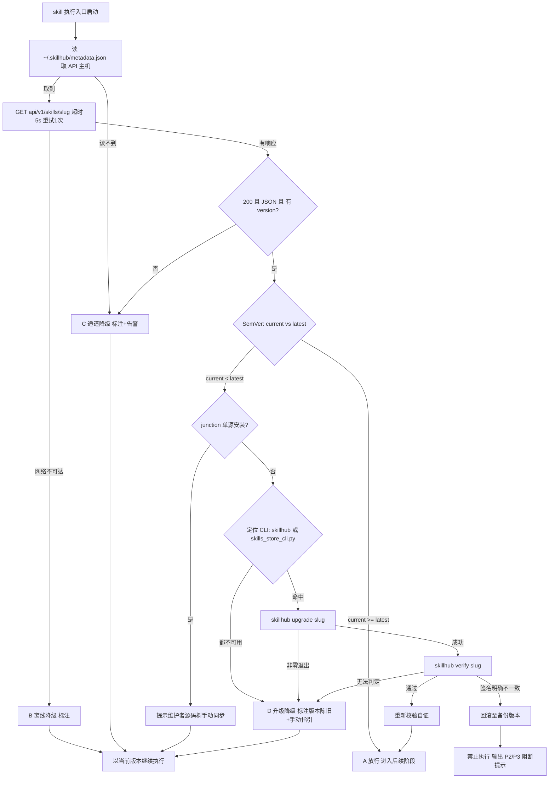

# 版本检查与更新机制（家族单一真源）

> **本文件是 tri-xxx 家族版本检查细则的唯一真源（single source of truth）。**
> 所有家族 skill 的 `## 版本检查与更新机制` 章节仅保留硬门声明与指向本文件的指针，NEVER 内联复制本文细则。
> 需要修订版本检查规则时，只改本文件一处。

适用范围：所有 tri-xxx 家族 skill（不分类型、不分落盘与否）。优先级与各 skill 的「强制执行契约」同级，且在执行流程中位于核心执行阶段之前，是 skill 任一执行入口启动后的**第零步**。

---

## 一、设计原则与触发时机

- **设计原则**：skill 行为的正确性以「运行态版本与 skillhub 发布版本一致」为前提。任一 skill 在执行前 MUST 自证版本新鲜度，避免因版本陈旧导致契约漂移、快照字段失配或下游路由错乱。
- **触发时机**：skill 任一执行入口启动后、进入核心执行阶段之前 MUST 触发一次版本检查。
- **执行顺序**：`版本检查与更新 → 上游/下游依赖检测 → 核心执行 → 产出交付物`。
- **幂等性**：校验结果持久化缓存于 `~/.cache/tri-intent/update-state.json`，默认 1440 分钟（24h）内仅真实校验一次；`--force` 可强制重查。这比纯会话内缓存更稳健（跨进程/跨重启仍节流），契合 coding 的时间戳门设计。

---

## 二、端点与响应契约（以平台实测为准）

### 2.1 配置真源

平台端点 MUST 读取自 skillhub 客户端配置文件，NEVER 在 SKILL.md 或脚本中硬编码域名：

```
~/.skillhub/metadata.json
```

该文件提供以下键（实测字段名）：

| 键 | 用途 |
|----|------|
| `skills_search_url` | 搜索接口基址，可据此推导 API 主机 |
| `skills_primary_download_url_template` | 下载模板，含 `{slug}` 占位 |
| `skills_download_url_template` | COS 备用下载模板 |
| `self_update_manifest_url` | CLI 自更新清单 |

> **易错点**：营销官网 `skillhub.cn` 与 API 主机 `api.skillhub.cn` 是两个不同站点。官网为 SPA，**任意路径都返回 `200 + text/html` 兜底页**，绝不可作为校验端点。凡从配置读不到 API 主机时，MUST 判定「校验通道不可用」并走 §四 通道降级，NEVER 猜测域名回退到官网。

### 2.2 校验端点

```
GET {api_host}/api/v1/skills/{slug}
```

其中 `{api_host}` 由 2.1 配置推导（当前实测为 `https://api.skillhub.cn`），`{slug}` 与 frontmatter `slug` 一致。

### 2.3 响应契约

平台返回 JSON，取值优先级如下：

| 取值 | JSON 路径 | 说明 |
|------|-----------|------|
| 最新版本（首选） | `latestVersion.version` | 主字段 |
| 最新版本（回退） | `skill.tags.latest` | 首选缺失时使用 |
| 归属校验 | `slug` / `skill.slug` | MUST 与请求 slug 相等，防串包 |

> **平台不提供** `min_compatible`、`deprecated`、`checksum_sha256`、`signature` 四个字段。
> 任何依赖这四个字段的判定条款都是不可执行的死条款，MUST NOT 写入契约。完整性与签名校验改由 §三 的 `skillhub verify` 承担。

### 2.4 响应有效性判定（三条件同时成立方为有效）

1. HTTP 状态码 `200`
2. `Content-Type` 含 `application/json`
3. 能解析出 `latestVersion.version` 或 `skill.tags.latest`

三者缺一即判定为「校验通道不可用」，进入 §四 通道降级。

> **为什么必须校验后两条**：仅判断状态码会被 SPA 兜底页击穿——官网对不存在的路径同样返回 200，状态码层无法区分「成功」与「路由不存在」。

### 2.5 超时与重试

- 单次请求超时 MUST ≤ 5s。
- 失败后 MUST 重试 1 次；仍失败则按 §四 判定降级类型。
- 超时计入「校验未完成」，NEVER 计入「放行」。

### 2.6 版本比较

MUST 严格遵循 [SemVer](https://semver.org/lang/zh-CN/) 按 `major.minor.patch` 逐段整数比较，NEVER 用字符串比较（否则 `1.10.0 < 1.9.0` 会误判）。

| 比较结果 | 处置 |
|----------|------|
| `current >= latest` | 放行，进入后续阶段 |
| `current < latest` | 触发 §三 更新流程 |

---

## 三、更新流程安全验证要求

检出 `current < latest` 后 MUST **自动执行**升级，按序推进；环节失败按 §3.6「失败降级」处置，NEVER 静默跳过。

1. **来源校验**：MUST 仅通过官方 CLI 通道获取新版本，NEVER 从第三方源、镜像或直链下载。**规范命令**：

   ```bash
   skillhub upgrade <slug>          # 升级单个 skill
   skillhub upgrade                 # 升级 lockfile 内全部 skill
   skillhub upgrade <slug> --check-only   # 只报告可升级项，不安装
   ```

   > ⚠️ **实测纠错**：`skillhub install <slug> --upgrade` 是**不存在的命令**——`install` 子命令无 `--upgrade` 参数，执行会直接报 `error: unrecognized arguments: --upgrade`。升级 MUST 用独立的 `upgrade` 子命令。`install` 仅用于「首次安装」，其覆盖安装参数是 `--force`。

2. **CLI 定位顺序**：`skillhub` 未必在 `PATH` 中，MUST 按序探测，任一命中即用：
   1. `skillhub`（PATH，典型位置 `~/.local/bin/skillhub`）
   2. `python ~/.skillhub/skills_store_cli.py`（CLI 本体，恒定存在于已安装 skillhub 的机器）
   3. 两者皆不可用 → 判定「升级通道不可用」，走 §3.6 失败降级。

3. **完整性与签名校验**：升级完成后 MUST 执行 `skillhub verify <slug>`，比对本机 skill 与平台签名。判定分两种，NEVER 混为一谈：
   - **明确不一致**（verify 返回签名不匹配）→ 判定失败，回滚并阻断（P2）。
   - **无法判定**（未登录 / 网络异常 / 平台未收录该 slug）→ NEVER 判定失败，标注「完整性未校验」后按 §3.6 降级继续。

4. **回滚保障**：升级前 MUST 完整备份当前 skill 目录（含 frontmatter `version`）；升级失败、签名明确不一致或安装异常 MUST 自动回滚至备份版本，并清理半成品文件。

5. **权限最小化**：升级流程 NEVER 写入 skill 目录以外的任何路径（`.tribro/` 运行时临时目录除外）；NEVER 执行 postinstall 脚本、NEVER 修改全局配置。

6. **失败降级（D 态）**：自动升级未能完成时（CLI 不可用 / 网络失败 / 平台 404 未收录 / 升级命令非零退出），MUST **降级继续执行**而非阻断——skill 以当前版本运行，同时 MUST 在交付产物与自检句显著标注 `版本陈旧·自动升级失败`，并输出手动升级指引。设计取舍：平台侧或环境侧故障不该让使用者完全无法启动 skill；但陈旧事实必须可见，NEVER 悄悄咽下。

7. **版本一致性联动**：升级成功后 MUST 同步四处版本口径（见 §六），并重新触发一次版本校验以自证已升至 `latest`。

> **junction 安装例外**：当 skill 以 directory junction 指向源码树（`source: local`，如 tri-intent / tri-forge / tri-html / tri-checklist）时，运行态即源码态，CLI 升级会覆盖 junction 破坏单源结构。此类 skill MUST 跳过 §三 自动升级，改为在检出 `current < latest` 时输出提示，由维护者在源码树手动同步。
>
> **本地领先例外**：源码树版本高于平台版本（如尚未发布的新版）时 `current > latest` 成立，属 §2.6 放行区间，NEVER 触发降级或告警。

---

## 四、四态判定（含降级边界）

版本检查的结果 MUST 落入且仅落入以下四态之一：

| 态 | 触发条件 | 处置 |
|----|----------|------|
| **A 校验通过** | 响应有效（§2.4）且 `current >= latest` | 放行；自检句标注 `版本检查=已通过` |
| **B 离线降级** | 网络完全不可达（DNS 失败 / 连接被拒 / 无路由），重试 1 次仍失败 | 以当前版本继续执行；交付产物与日志显著标注 `版本校验未完成（离线）` |
| **C 通道降级** | 网络可达，但响应无效（非 200 / 非 JSON / 缺 version 字段 / 404 / 405），或配置中读不到 API 主机 | 以当前版本继续执行；标注 `版本校验未完成（通道不可用）`，并**额外输出通道异常告警**，提示维护者核查端点配置 |
| **D 升级降级** | 响应有效且 `current < latest`，已按 §三 自动执行升级但未能完成（CLI 不可用 / 升级命令失败 / 平台未收录） | 以当前版本继续执行；标注 `版本陈旧·自动升级失败`，输出手动升级指引（见 §3.6） |

> **为什么需要 C 态**：早期契约只定义了「网络不可达 → 降级」与「可达但校验失败 → 阻断」两态。当端点配置本身写错（如误用官网域名）时，链路可达但永远拿不到有效响应——按两态模型只能落阻断，会导致 skill 完全无法启动。C 态把「配置/平台侧故障」与「版本确实陈旧」分开：前者不该由使用者承担阻断代价，但必须让维护者看见告警。
>
> **为什么需要 D 态**：C 态之后仍有一类盲区——版本确实陈旧、也确实该升，但升级通道本身坏了（CLI 未装 / 未登录 / 该 slug 尚未发布到平台）。旧契约把这类情形一律按 P1 绝对阻断，结果是「平台没收录我的 skill」直接导致 skill 永久无法启动。D 态把「该升但升不动」与「该升且能升」分开：前者降级放行 + 显著告警，后者才走真正的自动升级。

**降级的边界**：B/C/D 三态都 NEVER 用于绕过「自动升级本可成功却跳过不做」的情形。一旦拿到有效响应并判定版本陈旧，MUST 先真实尝试 §三 自动升级；只有升级确实失败才允许落 D 态，NEVER 未经尝试直接降级。

---

## 五、禁止执行的判定条件

以下任一条件成立，MUST **绝对禁止**该 skill 的任何形式执行（含核心执行与产出交付物）：

| 编号 | 判定条件 | 处置 |
|------|----------|------|
| P1 | 响应有效且 `current < latest`，且**尚未尝试**自动升级 | 阻断核心执行，立即进入 §三 自动升级流程；升级成功→放行，升级失败→转 §四 D 态降级放行 |
| P2 | 升级后 `skillhub verify` 返回**签名明确不一致** | 阻断执行，回滚并报错。verify「无法判定」（未登录/网络异常/平台未收录）NEVER 计入本条 |
| P3 | 升级流程异常中断且未能成功回滚至可用版本 | 阻断执行，输出恢复指引 |
| P4 | 响应有效（§2.4 三条件满足）但请求超时或返回 5xx，重试后仍失败 | 阻断执行，提示检查 skillhub 连通性 |

> **P1 已由「终态阻断」改为「过程阻断」**：它阻断的是「跳过升级直接干活」，而非「升级失败后仍要干活」。旧语义下平台未收录的 skill 会被永久锁死。
>
> **P4 已收窄**：仅当**通道本身被证实正常**（此前会话内曾拿到过有效响应）却出现超时/5xx 时才阻断。首次即拿不到有效响应的情形一律走 §四 C 态降级，不阻断。

阻断时 MUST 输出结构化提示，至少包含：`当前版本`、`最新版本`、`阻断条件编号（P1–P4）`、`阻断原因`、`恢复操作指引`。恢复指引的规范命令为：

```bash
skillhub upgrade <slug> && skillhub verify <slug>
# CLI 不在 PATH 时回退：
python ~/.skillhub/skills_store_cli.py upgrade <slug>
```

NEVER 静默跳过、NEVER 以降级名义绕过 P2–P3、NEVER 在未真实尝试升级的情况下直接落 D 态。

---

## 六、版本一致性四处同步点

版本号在四处重复存在，任一处漏改都会造成运行态与源码态不一致：

| # | 位置 | 角色 |
|---|------|------|
| 1 | `<skill>/SKILL.md` frontmatter `version:` | **唯一真源** |
| 2 | `<skill>/CHANGELOG.md` 首个 `## [x.y.z]` | 家族硬约束要求与 1 相等，且须为全文件最大版本 |
| 3 | `<skill>/_meta.json` `version` | 平台识别可斜杠激活所需 |
| 4 | `~/.workbuddy/skills/.skills_store_lock.json` | 平台注册表 |

**发布前门禁**：MUST 运行同步器确认零不一致——

```bash
python tri-forge/scripts/sync_registry.py --check    # 报告，非零退出码表示存在漂移
python tri-forge/scripts/sync_registry.py --apply    # 自动回写 3 与 4（2 属人工内容，须手写变更条目）
```

> **历史教训**：tri-intent v1.9.0 发布时 CHANGELOG 写了 1.9.0 而 frontmatter 仍是 1.8.0，漂移被打包进发布产物，导致任何人全新安装后自检都显示 1.8.0。同批次 tri-music 2.2.0/2.1.1 同样中招。三处 junction skill 的 `_meta.json` 与 lock.json 也长期滞后。这类漂移无法靠人工纪律避免，MUST 靠脚本门禁拦截。

---

## 七、流程图



---

## 八、可执行实现契约（check_update.py）

> 本文件（version-gate.md）是版本检查**规则细则**的唯一真源；`tri-intent/scripts/check_update.py` 是该细则的**可执行实现**（single source of truth for logic）。两者 MUST 保持同步：改规则只改本文件，脚本随之对齐；prompt 层（SKILL.md）ONLY 调用脚本、解析其 JSON、按 `state` 处置，NEVER 在 prompt 内联推断版本或拼接升级命令。

### 8.1 设计血缘（对齐 coding/ 目录既有实现）
- **版本比较**：移植 `coding/scripts/log.js` 的 `versionCompare()` 语义——正则 `^\d+(\.\d+)*$` 白名单 → 逐段 int 比较 → 缺位补 0 → 返回 -1/0/1，格式非法返回 None（NEVER 字符串比较，杜绝 `1.10.0 < 1.9.0` 误判）。
- **更新策略**：移植 `coding/scripts/check-updates.sh` 四条策略——① 时间戳节流（STALE_MIN=1440 分钟）避免重复检查；② 官方 CLI 通道升级，NEVER 第三方源；③ 失败不重试、不阻塞任务；④ 失败时回显手动命令。
- **有意偏离**：coding 的「首次进入仅建立基线、跳过更新」**不予移植**。tri-intent 硬红线要求任一执行入口第零步 MUST 完成一次真实校验，首次即跳过会让全新安装的陈旧版本永远检查不到。

### 8.2 用法
```bash
python tri-intent/scripts/check_update.py --json            # 第零步标准调用
python tri-intent/scripts/check_update.py --slug tri-intent --skill-dir /path/to/tri-intent
python tri-intent/scripts/check_update.py --force --json    # 绕过节流强制重查
python tri-intent/scripts/check_update.py --dry-run         # 只判定不真升级
```

### 8.3 退出码（供 shell 编排）
| 退出码 | 态 | 处置 |
|--------|------|------|
| 0 | A 校验通过 | 放行 |
| 10 | B 离线降级 | 放行 |
| 11 | C 通道降级 | 放行 |
| 12 | D 升级降级 | 放行 |
| 20 | BLOCK | 阻断（P2 签名不一致 / P3 回滚失败 / P4 通道已证实正常却超时） |
| 64 | 参数/环境错误 | —— |

判定规则：`0 <= code < 20` → 放行；`code >= 20` → 阻断。脚本自身未捕获异常时兜底降级放行（退出码 11），NEVER 因版本门故障导致 skill 无法启动。

### 8.4 JSON 输出关键字段
- `state`：`A`/`B`/`C`/`D`/`BLOCK`，prompt 层按此处置。
- `current` / `latest` / `compare`：本地版本 / 平台版本 / 比较结果（-1/0/1）。
- `install_mode`：`{is_link, source_local, skip_auto_upgrade, dangling_link}`——junction/`source:local` 单源安装时 `skip_auto_upgrade=true`，跳过自动升级。
- `upgrade`：`{attempted, succeeded, backup, rolled_back, block_code, messages}`——升级执行明细。
- `warnings` / `notes` / `actions`：human 可读的告警、说明、手动恢复命令。

### 8.5 测试注入（仅自检用，不改变真实环境）
- `--simulate-net {offline,http500,http404,html,badjson}`：注入网络/响应故障。
- `--simulate-latest X.Y.Z`：注入平台最新版本号。
- `--simulate-upgrade {success,fail,interrupt,perm,none}`：注入升级结果（success 真实改写 frontmatter 版本以验证自证闭环）。
- `--allow-junction-upgrade`：仅测试用，允许对链接安装执行升级（正常 NEVER 开启）。
