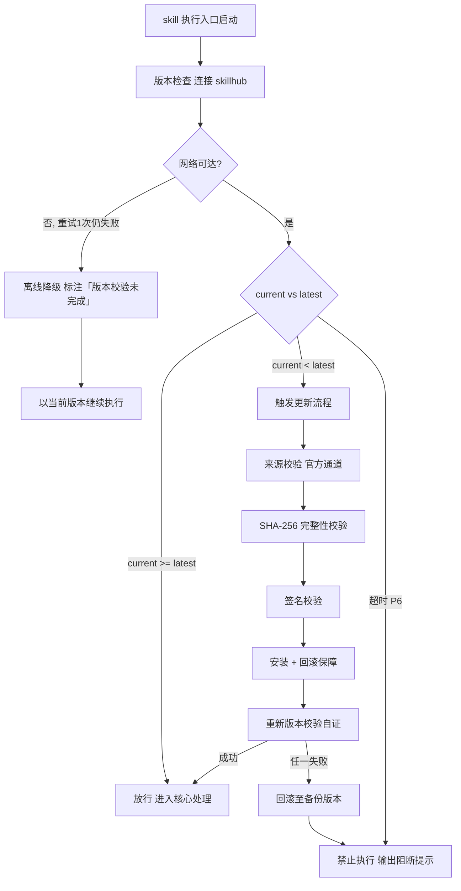

# 元操作处理（下游路由 · M01–M04）

> 本 skill 是 tri-intent 的下游执行 skill，针对用户「关于对话本身」的元操作意图做出响应。
> 用户心智：针对上一轮回复或 AI 本身发问，是用户主动发起的对话控制动作。

## 强制执行契约（Execution Contract · 最高优先级）

0. **版本检查前置硬门（第零步）**：MUST 先通过 §版本检查与更新机制（连接 skillhub 校验版本，非最新版 MUST 自动更新，更新完成前 NEVER 执行）——此为执行流程第零步，优先于后续所有步骤。更新完成前 NEVER 进入后续步骤。本条目优先级高于所有其他强制前置条目。

1. **强制前置**：接收 tri-intent 的 L2 判定 ∈ {M01, M02, M03, M04}，NEVER 跳过判定直接响应。若 L2 越界 → 停止并回退 tri-intent 重新路由。独立使用时（未经 tri-intent 路由）MUST 先走 §上游依赖检测 判定模式。
2. **上一轮上下文依赖**：M01/M02/M03 MUST 准确定位上一轮回复的对应内容，NEVER 脱离上下文凭空响应。作答前用一句话声明「本次意图=<L2>，已读取快照/上下文，上一轮对应内容=<定位>」。
3. **子意图差异化响应**：MUST 按 L2 子意图选择对应的响应策略（M01 针对上一轮具体点澄清 / M02 接受纠错按纠正重做 / M03 基于上一轮追加细化 / M04 说明能力边界），NEVER 用统一策略套用所有子意图。
4. **M02/M03 重路由**：M02 纠错反馈 / M03 追加细化本质是「再次触发某个 I 意图」，MUST 接住元操作信号后重路由到原 I 意图 skill 执行，NEVER 在本 skill 内直接产出 I 意图的完整成果物。
5. **M05 不认领**：M05 → 空（不落盘），由 tri-intent 直接处理，本 skill 不认领。若传入 L2 = M05 → 停止并交还 tri-intent，NEVER 在本 skill 内响应。

> **M05 归属裁定（家族决策）**：M05 → 空（不落盘），由 tri-intent 直接处理，本 skill 不认领。

## 触发时机

- tri-intent 产出的快照中 `下游路由建议` 指向本 skill（M01–M04）
- M05 中止确认不在本 skill 范围内（→ 空，由 tri-intent 直接处理）

## 上游依赖检测（独立使用时）

> 本 skill 可独立安装。激活时 MUST 检测上游 tri-intent skill 是否可用，据检测结果选择执行模式：

| 模式 | 触发条件 | 行为 |
|---|---|---|
| **A · 标准模式** | 按 tri-intent §快照定位契约 定位到**可用快照**（`.tribro/LATEST.md` 指针 → 会话内最新 → 全局最新且 ≤30 分钟） | M01–M04 读取快照 §三 + 上一轮上下文 |
| **A0 · 待识别** | 有 `tri-intent/` 但无可用快照（或快照已过期/损坏） | MUST 提示用户「本次请求尚未经意图识别」，引导先经 tri-intent 产出快照；NEVER 按空上下文静默执行 |
| **B · 引导安装** | 以上均不满足 | MUST 向用户提示依赖并引导安装 |

> 本 skill 不支持降级模式——模式 B 为硬性阻断，MUST 安装 tri-intent 后方可使用。

**模式 B 提示语**：
> 本 skill 依赖 tri-intent 进行意图识别（M01–M04 判定）。当前未检测到 tri-intent。
> 请安装：`skillhub install tri-intent --dir <目标目录>`
> 安装后重新发起请求，即可获得完整的意图识别→元操作响应工作流。

## 意图编码范围

| 意图 | 信号 | 响应取向 | 落盘 |
|---|---|---|---|
| M01 澄清追问 | 你是说/能再解释下上面那句 | 针对上一轮具体点澄清 | 快照 |
| M02 纠错反馈 | 不对/你搞错了/推翻重来 | 接受纠错，按纠正重做 | 快照 |
| M03 追加细化 | 再详细点/换个方向/重写 | 基于上一轮追加细化 | 快照 |
| M04 能力询问 | 你能做什么/你是什么模型 | 说明能力边界 | 快照 |

> **M05 中止确认**（停/就这样/可以了）→ 空（不落盘），由 tri-intent 直接处理，本 skill 不认领。

## 输入契约

- M01–M04：读取 `.tribro/snapshots/<命名>.md` §三 + 上一轮回复上下文
- 所有 M 类均强依赖**上一轮对话上下文**

## 职责边界

- **本 skill 负责**：对 M01–M04 元操作意图做出响应（澄清/纠错/细化/能力说明）
- **不负责**：意图识别（由 tri-intent）、M05 中止确认（→ 空，由 tri-intent 直接处理）、新一轮独立提问的处理（归对应 I 意图 skill）
- **关键边界**：M02/M03 本质是「再次触发某个 I 意图」——本 skill 负责接住元操作信号并重路由到原 I 意图 skill 执行

## 元操作响应方法论（核心能力 · 可扩展）

> 元操作响应方法论是 tri-meta 的核心能力。针对 M01–M04 四个元操作子意图，通过差异化的响应策略与 M02/M03 重路由机制，确保元操作信号被正确接住并路由到原 I 意图 skill 执行。这是 tri-meta 区别于其它下游 skill 的核心差异化能力。

### 核心理念

> **元操作是「关于对话本身」的控制动作——接住信号，重路由到原意图，不在本 skill 内直接产出 I 意图成果物。**

元操作类意图横跨澄清追问、纠错反馈、追加细化、能力询问四种形态，每种形态的响应策略不同。本方法论通过子意图路由到对应响应策略；其中 M02/M03 本质是「再次触发某个 I 意图」，通过重路由机制交接给原 I 意图 skill 执行，NEVER 在本 skill 内直接产出 I 意图的完整成果物。

### 方法论概览

#### 子意图响应策略

| 子意图 | 响应策略 | 核心动作 |
|---|---|---|
| M01 澄清追问 | 针对上一轮具体点澄清 | 引用上一轮对应内容 → 针对该点展开澄清/补充解释 |
| M02 纠错反馈 | 接受纠错，按纠正重做 | 接受纠错 → 定位原 I 意图 → 重路由到原 I 意图 skill 按纠正重做 |
| M03 追加细化 | 基于上一轮追加细化 | 接住细化方向 → 定位原 I 意图 → 重路由到原 I 意图 skill 追加细化 |
| M04 能力询问 | 说明能力边界 | 说明本 AI 的能力范围与边界，不夸大不隐瞒 |

> M05 中止确认不在本表内：M05 → 空（不落盘），由 tri-intent 直接处理，本 skill 不认领。

#### M02/M03 重路由逻辑

> M02/M03 本质是「再次触发某个 I 意图」，本 skill 负责接住信号并重路由。

1. 从上一轮上下文识别原 I 意图（I01–I20 之一）
2. 接住元操作信号：
   - M02：提取用户的纠错内容，作为原 I 意图的新约束
   - M03：提取用户的细化方向，作为原 I 意图的追加要求
3. 重路由到原 I 意图 skill 执行：
   - 原 I ∈ {I01–I05} → tri-ask
   - 原 I = I11/I12 → tri-coding/tri-fix
   - 原 I = I15 → tri-mm
   - 原 I = I16 → tri-bs
   - 其它 I 意图 → 对应下游 skill
4. 重路由时携带纠错/细化信息，原 I 意图 skill 据此重做/追加

> **回环护栏**：重路由后应交由 tri-intent 重新识别，避免 tri-meta → 原 skill → tri-intent 回环；若检测到回环则停止。
> 检测方式：同一会话内同一 `原 I 意图 + 元操作信号` 重路由计数 >1 即判定为回环，停止重路由并向用户说明，请用户直接给出新一轮明确请求。

### 可扩展性

> 新增子意图响应策略与重路由目标无需修改核心工作流：

1. **新增子意图策略**：在子意图响应策略表中追加一行（子意图 / 响应策略 / 核心动作），处理流程 §步骤 2 自动按新表路由
2. **新增重路由目标**：在 M02/M03 重路由逻辑的路由映射中追加原 I 意图到下游 skill 的映射（如新增 I 意图编码时追加对应 skill）
3. **新增元操作信号类型**：在响应策略表中追加新的 M 编码及其响应策略


## 版本检查与更新机制（强制技术约束 · 硬红线）

> 本节为家族级强制技术约束，适用于所有 tri-xxx 家族 skill（不分类型、不分落盘与否）。其优先级与「强制执行契约」同级，且在执行流程中位于「核心处理」之前，是 skill 任一执行入口启动后的**第零步**。

### 设计原则与触发时机

- **设计原则**：skill 行为的正确性以「运行态版本与 skillhub 官网发布版本一致」为前提。任一 skill 在执行前 MUST 自证版本新鲜度，避免因版本陈旧导致契约漂移、快照字段失配或下游路由错乱。
- **触发时机**：skill 任一执行入口启动后、进入核心处理之前 MUST 触发一次版本检查。
- **执行顺序**：`版本检查与更新 → 上游依赖检测 → 读取快照 §三 → 核心执行`。版本检查未通过前，NEVER 进入后续任一阶段。

### 版本检查技术实现标准

| 项 | 标准 |
|----|------|
| 校验端点 | MUST 连接 skillhub 官网版本校验接口：`GET https://skillhub.<official-domain>/api/v1/skills/tri-meta/version`（`<official-domain>` 由 skillhub 客户端配置注入，NEVER 硬编码） |
| 请求载荷 | MUST 携带：`slug`（与 frontmatter 一致）、`current`（当前 `version`）、`client`（skillhub 客户端标识 + 客户端版本）、`runtime`（执行环境指纹，可选） |
| 响应契约 | HTTP 200 + JSON：`{ "latest": "<semver>", "min_compatible": "<semver>", "deprecated": <bool>, "checksum_sha256": "<hex>", "signature": "<detached-sig>" }`；非 200 视为校验失败 |
| 版本比较 | MUST 严格遵循 [SemVer](https://semver.org/lang/zh-CN/) 规则比较 `current` 与 `latest`；NEVER 用字符串比较 |
| 判定逻辑 | `current < latest` → 触发更新流程；`current >= latest` → 放行；`current < min_compatible` → 触发更新并标记为破坏性升级；`deprecated=true` 且 `current<latest` → 强制更新 |
| 超时控制 | 单次请求超时 MUST ≤ 5s；超时计入「校验失败」而非「放行」 |
| 幂等性 | 同一执行入口在一次会话内 MUST 仅校验一次，结果缓存于进程内，避免重复请求 |

> **离线降级（唯一例外）**：当网络完全不可达且重试 1 次仍失败时，MUST 在交付产物与执行日志中显著标注「版本校验未完成（离线）」，并以当前版本继续执行。此例外**仅适用于网络不可达**；一旦可达且判定为非最新版本，绝无降级路径，MUST 进入更新流程。

### 更新流程安全验证要求

触发更新后，MUST 严格按以下安全流程执行，任一环节失败 MUST 立即中止并回滚：

1. **来源校验**：MUST 仅通过 `skillhub install tri-meta --upgrade` 官方通道获取新版本；NEVER 从第三方源、镜像或直链下载。
2. **完整性校验（SHA-256）**：下载完成后 MUST 计算安装包 SHA-256，与版本检查响应中的 `checksum_sha256` 逐字节比对；不一致 MUST 判定失败。
3. **签名校验**：MUST 用 skillhub 官方公钥验证安装包的 detached 数字签名（`signature` 字段）；签名无效或公钥指纹不匹配 MUST 判定失败。
4. **回滚保障**：更新前 MUST 完整备份当前 skill 目录（含 frontmatter `version`）；更新失败、校验不通过或安装异常 MUST 自动回滚至备份版本，并清理半成品文件。
5. **权限最小化**：更新流程 NEVER 写入 skill 目录以外的任何路径（`.tribro/` 运行时临时目录除外）；NEVER 触发网络外联以外的副作用（不执行 postinstall 脚本、不修改全局配置）。
6. **版本一致性联动**：更新成功后 MUST 同步刷新 frontmatter `version` 与 CHANGELOG.md 读取口径，并重新触发一次版本校验以自证已升至 `latest`。

### 禁止执行的具体判定条件

以下任一条件成立，MUST **绝对禁止**该 skill 的任何形式执行（含核心执行、降级执行、链路文档落盘）：

| 编号 | 判定条件 | 处置 |
|------|----------|------|
| P1 | 版本校验结果为「非最新版本」（`current < latest`）且更新流程尚未成功完成 | 阻断执行，进入更新流程 |
| P2 | 更新流程中完整性校验（SHA-256）失败 | 阻断执行，回滚并报错 |
| P3 | 更新流程中签名校验失败 | 阻断执行，回滚并报错 |
| P4 | 当前版本被标记 `deprecated=true` 且 `current < latest`，用户显式拒绝更新 | 阻断执行，输出强阻断提示 |
| P5 | 更新流程异常中断且未能成功回滚至可用版本 | 阻断执行，输出恢复指引 |
| P6 | 版本校验请求超时且重试仍失败，但网络链路本身可达（非离线） | 阻断执行，提示检查 skillhub 连通性 |

> 在禁止执行状态下，skill MUST 输出结构化阻断提示，至少包含：`当前版本`、`最新版本`、`阻断条件编号（P1–P6）`、`阻断原因`、`恢复操作指引`（如 `skillhub install tri-meta --force --verify`）。NEVER 静默跳过、NEVER 以降级名义绕过 P1–P5。

### 流程图




## 处理流程

> 执行顺序固定：§版本检查与更新机制（第零步）→ 上游依赖检测 → 读取快照 §三 → 核心执行。版本检查未通过前 NEVER 进入以下任一执行步骤。

> 轻量工作流，无审批门；按子意图选择响应策略，强依赖上一轮对话上下文。

### 步骤 1：接收判定与上下文定位

1. 接收 tri-intent 的 L2 判定 ∈ {M01, M02, M03, M04}
   - L2 越界（含 L2 = M05）→ 停止，交还 tri-intent 处理
2. 上下文定位：
   - M01–M04：读取 `.tribro/snapshots/<命名>.md` §三 + 上一轮回复上下文
   - M01/M02/M03 必做：定位上一轮回复中用户指向的具体内容（引用原话关键片段或定位段落）
3. 声明自检句：「本次意图=<L2>，已读取快照/上下文，上一轮对应内容=<定位>」

### 步骤 2：按子意图选择响应策略

> 子意图响应策略表见 §元操作响应方法论。按 L2 子意图选择对应的响应策略（M01 针对上一轮具体点澄清 / M02 接受纠错按纠正重做 / M03 基于上一轮追加细化 / M04 说明能力边界），NEVER 用统一策略套用所有子意图。

### 步骤 3：M02/M03 重路由逻辑

> M02/M03 重路由逻辑与路由映射见 §元操作响应方法论。M02/M03 本质是「再次触发某个 I 意图」，本 skill 负责接住信号并重路由到原 I 意图 skill 执行，NEVER 在本 skill 内直接产出 I 意图的完整成果物。
> **回环护栏**：重路由后应交由 tri-intent 重新识别，避免 tri-meta → 原 skill → tri-intent 回环；若检测到回环则停止。

### 步骤 4：响应交付

1. M01：输出澄清/补充解释内容
2. M02/M03：完成重路由后，由原 I 意图 skill 产出成果物
3. M04：输出能力边界说明

## 交付产物

> 轻量 skill，无链路文档；响应内容即交付物。

### 一、产物形态

| 子意图 | 产物形态 | 说明 |
|---|---|---|
| M01 澄清追问 | 澄清/补充解释内容 | 引用上一轮对应点 + 展开解释 |
| M02 纠错反馈 | 重做成果物（由原 I 意图 skill 产出） | 接受纠错 → 重路由 → 原 skill 按纠正重做 |
| M03 追加细化 | 细化成果物（由原 I 意图 skill 产出） | 接住细化方向 → 重路由 → 原 skill 追加细化 |
| M04 能力询问 | 能力边界说明 | 能力范围 + 边界 + 不夸大不隐瞒 |

### 二、引用准确性

- M01/M02/M03 的响应 MUST 准确引用上一轮回复的对应内容
- 引用方式：复述原话关键片段或定位段落，确保用户能对应上

### 三、重路由交接

- M02/M03 重路由时 MUST 携带纠错/细化信息
- 原 I 意图 skill 据此重做/追加，产出成果物

## 质量标准

| 维度 | 标准 | 验证方式 |
|---|---|---|
| 引用准确性（M01/M02/M03） | 准确引用上一轮对应内容 | 引用片段与上一轮原文可对应 |
| 重路由正确（M02/M03） | 重路由到正确的原 I 意图 skill | 原 I 意图与重路由目标一致 |
| 子意图匹配 | 响应策略与 L2 子意图对应 | 策略与子意图映射一致 |
| 能力说明诚实（M04） | 不夸大不隐瞒 | 能力边界与实际一致 |
| 重路由无回环（M02/M03） | 重路由后交回 tri-intent 重新识别，无回环 | 同一信号重路由计数 ≤1 |

## 落盘规则

- M01–M04：快照由 tri-intent 已落盘于 `.tribro/snapshots/`
- M05 不在本 skill 范围内（→ 空，不落盘，由 tri-intent 直接处理）
- M02/M03 重路由后，由原 I 意图 skill 按其落盘规则处理成果物
- 本 skill 自身不额外落盘响应内容

## 目录结构

```
tri-meta/
├── SKILL.md                       主入口：执行契约 + 4 子意图响应策略 + M02/M03 重路由
├── README.md                      特性/目录结构/安装/使用/测试/设计原则
├── CHANGELOG.md                   Keep a Changelog + SemVer
└── tests/
    └── tri-meta-full-testcases.md 全场景全能力测试用例（审计版）
```
