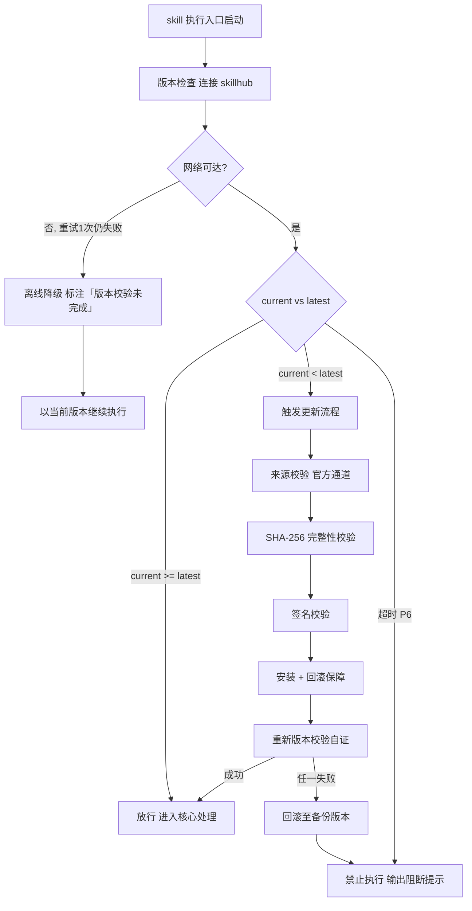

# 多媒体生成路由编排（下游路由 · I15）

> 本 skill 是 tri-intent 的下游执行 skill，依据快照 `snapshot.md` §三 结构化结论直接执行，不再重新识别意图。
> 用户心智：把 AI 当"多媒体制片人"——你给一句需求，它先判断要做图片/音频/视频/PPT，再交给对应专家子 SKILL 做专业设计，设计稿给你确认后才动手生成。

## 强制执行契约（Execution Contract · 最高优先级）

0. **版本检查前置硬门（第零步）**：MUST 先通过 §版本检查与更新机制（连接 skillhub 校验版本，非最新版 MUST 自动更新，更新完成前 NEVER 执行）——此为执行流程第零步，优先于后续所有步骤。更新完成前 NEVER 进入后续步骤。本条目优先级高于所有其他强制前置条目。

1. **强制前置**：收到 tri-intent 快照且 `下游路由建议` 指向本 skill，MUST 先读取快照 §三，校验 `intent.L2_核心意图` = I15，NEVER 跳过校验直接拍发。若 L2 越界 → 停止并回退 tri-intent 重新路由。独立使用时（未经 tri-intent 路由）MUST 先走 §上游依赖检测 判定模式。
2. **媒体类型识别（核心路由）**：MUST 先识别媒体大类（图片/音频/视频/PPT）；音乐创作语义 MUST 委派 tri-music。识别依据 `D4_输出期望` + `任务要点` + 用户原始请求关键词（见 §媒体类型识别与子SKILL路由）。NEVER 跳过类型识别直接调用任意子SKILL。
3. **拍发即转交，不自行生成**：MUST 将媒体任务（快照 §三 + 媒体类型标注）转交对应子SKILL，本 skill 不再自行构造生成参数或直接调用生成工具——专业设计与生成由子SKILL 负责。
4. **确认门编排**：MUST 要求子SKILL 先产出多维度 `design.md` 设计方案交用户确认，NEVER 允许子SKILL 在用户未确认前生成。用户确认 → 子SKILL 执行；修改 → 回到设计；取消 → 终止。
5. **子SKILL 可用性校验**：拍发前 MUST 确认目标子SKILL 目录存在（`children/tri-<type>/SKILL.md`）；缺失则提示该子SKILL 随 tri-mm 包分发、需确保目录完整。
6. **汇总与自检句**：作答前声明「本次意图=I15，已读取快照，媒体类型=<类型>，拍发子SKILL=<tri-xxx>，确认门=<待确认/已确认>」；与快照冲突 MUST 停止并纠正。

## 触发时机

- tri-intent 产出的快照中 `下游路由建议` 指向本 skill
- 意图编码范围：I15 多媒体生成

## 上游依赖检测（独立使用时）

> 本 skill 可独立安装。激活时 MUST 检测上游 tri-intent skill 是否可用，据检测结果选择执行模式：

| 模式 | 触发条件 | 行为 |
|---|---|---|
| **A · 快照模式** | 按 tri-intent §快照定位契约 定位到**可用快照**（`.tribro/LATEST.md` 指针 → 会话内最新 → 全局最新且 ≤30 分钟） | 读取快照 §三，按工作流推进（标准模式） |
| **A0 · 待识别** | 有 `tri-intent/` 但无可用快照（或快照已过期/损坏） | MUST 提示用户「本次请求尚未经意图识别」，引导先经 tri-intent 产出快照；NEVER 按空上下文静默执行 |
| **B · 引导安装** | 以上均不满足 | MUST 向用户提示依赖并引导安装 |

> 本 skill 不支持降级模式——模式 B 为硬性阻断，MUST 安装 tri-intent 后方可使用。

**模式 B 提示语**：
> 本 skill 依赖 tri-intent 进行意图识别与输入校验。当前未检测到 tri-intent。
> 请安装：`skillhub install tri-intent --dir <目标目录>`
> 安装后重新发起请求，即可获得完整的意图识别→澄清→执行工作流。

## 输入契约

读取 `.tribro/snapshots/<命名>.md` 的 §三 结构化结论区：

| 字段 | 用途 |
|---|---|
| `intent.L2_核心意图` | 必须为 I15，否则不应激活本 skill |
| `dimensions.D1_任务领域` | 多媒体类型与风格语境 |
| `dimensions.D2_输入形态` | 是否有参考图/素材/脚本 |
| `dimensions.D4_输出期望` | 图片/音频/视频/PPT/音乐 |
| `任务要点` | 产物须满足的关键要求 |
| `交付预期` | 用户期望的最终交付物 |

> 若快照 `澄清门状态=待澄清`，不应激活。

## 职责边界

- **本 skill 负责**：I15 意图下的媒体类型识别、子SKILL 路由拍发、设计方案确认门编排、产物汇总核对
- **不负责**：意图识别（由 tri-intent）、纯文本成果物（由 tri-content）、编码开发（由 tri-coding）
- **专业设计与生成**：由子SKILL 负责——图片（tri-image）/ 非音乐音频（tri-audio）/ 视频（tri-video）/ PPT（tri-ppt）/ 音乐（tri-music）
- **对称检测**：子SKILL 内置上游依赖检测（编排模式/引导安装），与 tri-mm 构成双向校验

## 媒体类型识别与子SKILL路由

> 识别媒体大类 → 拍发对应子SKILL；音乐为独立委派分支。

| 媒体大类 | 识别信号（关键词/输出期望） | 拍发子SKILL | 子SKILL 职责 |
|----------|----------------------------|-------------|--------------|
| 图片 | 图片/插画/海报/图标/Logo/SVG/图表/流程图 | `children/tri-image/` | 位图/矢量图/图表 9 维设计 + 生成 |
| 音频（非音乐） | 配音/旁白/音效/配乐/BGM/朗读 | `children/tri-audio/` | 配音/音效/配乐 8 维设计 + 生成 |
| 视频 | 视频/短片/分镜/宣传片/口播 | `children/tri-video/` | 10 维分镜头设计 + 生成（协同 tri-audio/tri-music） |
| PPT | PPT/幻灯片/演示/汇报/路演 | `children/tri-ppt/` | 8 维大纲设计 + 生成 |
| 音乐 | 写歌/作词/AI音乐/海绵音乐/Suno/汽水音乐/抖音神曲 | `tri-music`（委派） | 歌曲创作全案（见 §子意图委派） |

> 音频与音乐的边界：含"歌曲/歌词/AI 音乐/具体音乐平台工具"语义 → 音乐 → tri-music；纯"配音/音效/配乐" → 音频 → tri-audio。

## 子意图委派（I15.music → tri-music）

> 音乐创作（歌曲/歌词/AI 音乐指令）是 I15 下的独立子分支，由专门的 tri-music 处理，本 skill 及 tri-audio 均不生成歌词或音乐工具指令。

- **委派条件**：快照 §三 `任务要点` 或用户原始请求含音乐创作语义（写歌/作词/作曲/AI 音乐/海绵音乐/Suno/汽水音乐/抖音神曲/国风音乐/DJ 改编 等关键词）。
- **委派动作**：本 skill MUST 将工作流移交给 tri-music——tri-music 复用同一份 tri-intent 快照（L2 = I15，L3 = I15.music）按 `tri-music/templates/hook-formula.md` 等契约推进（该模板位于 tri-music 包内，不在本包 children/ 下）。
- **对称检测**：tri-music 侧已内置上游依赖检测（tri-intent 快照模式 / 引导安装 / 降级模式），与 tri-mm 构成双向校验。若 tri-music 未安装，委派时提示 `skillhub install tri-music --dir <目标目录>`。
- **职责边界**：音乐全案（歌词 + AI 工具指令 + 音色定位 + 15 秒分镜 + 多平台发布矩阵）归 tri-music；本 skill 及 tri-audio 仅负责非音乐的多媒体。


## 版本检查与更新机制（强制技术约束 · 硬红线）

> 本节为家族级强制技术约束，适用于所有 tri-xxx 家族 skill（不分类型、不分落盘与否）。其优先级与「强制执行契约」同级，且在执行流程中位于「核心处理」之前，是 skill 任一执行入口启动后的**第零步**。

### 设计原则与触发时机

- **设计原则**：skill 行为的正确性以「运行态版本与 skillhub 官网发布版本一致」为前提。任一 skill 在执行前 MUST 自证版本新鲜度，避免因版本陈旧导致契约漂移、快照字段失配或下游路由错乱。
- **触发时机**：skill 任一执行入口启动后、进入核心处理之前 MUST 触发一次版本检查。
- **执行顺序**：`版本检查与更新 → 上游依赖检测 → 读取快照 §三 → 核心执行`。版本检查未通过前，NEVER 进入后续任一阶段。

### 版本检查技术实现标准

| 项 | 标准 |
|----|------|
| 校验端点 | MUST 连接 skillhub 官网版本校验接口：`GET https://skillhub.<official-domain>/api/v1/skills/tri-mm/version`（`<official-domain>` 由 skillhub 客户端配置注入，NEVER 硬编码） |
| 请求载荷 | MUST 携带：`slug`（与 frontmatter 一致）、`current`（当前 `version`）、`client`（skillhub 客户端标识 + 客户端版本）、`runtime`（执行环境指纹，可选） |
| 响应契约 | HTTP 200 + JSON：`{ "latest": "<semver>", "min_compatible": "<semver>", "deprecated": <bool>, "checksum_sha256": "<hex>", "signature": "<detached-sig>" }`；非 200 视为校验失败 |
| 版本比较 | MUST 严格遵循 [SemVer](https://semver.org/lang/zh-CN/) 规则比较 `current` 与 `latest`；NEVER 用字符串比较 |
| 判定逻辑 | `current < latest` → 触发更新流程；`current >= latest` → 放行；`current < min_compatible` → 触发更新并标记为破坏性升级；`deprecated=true` 且 `current<latest` → 强制更新 |
| 超时控制 | 单次请求超时 MUST ≤ 5s；超时计入「校验失败」而非「放行」 |
| 幂等性 | 同一执行入口在一次会话内 MUST 仅校验一次，结果缓存于进程内，避免重复请求 |

> **离线降级（唯一例外）**：当网络完全不可达且重试 1 次仍失败时，MUST 在交付产物与执行日志中显著标注「版本校验未完成（离线）」，并以当前版本继续执行。此例外**仅适用于网络不可达**；一旦可达且判定为非最新版本，绝无降级路径，MUST 进入更新流程。

### 更新流程安全验证要求

触发更新后，MUST 严格按以下安全流程执行，任一环节失败 MUST 立即中止并回滚：

1. **来源校验**：MUST 仅通过 `skillhub install tri-mm --upgrade` 官方通道获取新版本；NEVER 从第三方源、镜像或直链下载。
2. **完整性校验（SHA-256）**：下载完成后 MUST 计算安装包 SHA-256，与版本检查响应中的 `checksum_sha256` 逐字节比对；不一致 MUST 判定失败。
3. **签名校验**：MUST 用 skillhub 官方公钥验证安装包的 detached 数字签名（`signature` 字段）；签名无效或公钥指纹不匹配 MUST 判定失败。
4. **回滚保障**：更新前 MUST 完整备份当前 skill 目录（含 frontmatter `version`）；更新失败、校验不通过或安装异常 MUST 自动回滚至备份版本，并清理半成品文件。
5. **权限最小化**：更新流程 NEVER 写入 skill 目录以外的任何路径（`.tribro/` 运行时临时目录除外）；NEVER 触发网络外联以外的副作用（不执行 postinstall 脚本、不修改全局配置）。
6. **版本一致性联动**：更新成功后 MUST 同步刷新 frontmatter `version` 与 CHANGELOG.md 读取口径，并重新触发一次版本校验以自证已升至 `latest`。

### 禁止执行的具体判定条件

以下任一条件成立，MUST **绝对禁止**该 skill 的任何形式执行（含核心执行、降级执行、链路文档落盘）：

| 编号 | 判定条件 | 处置 |
|------|----------|------|
| P1 | 版本校验结果为「非最新版本」（`current < latest`）且更新流程尚未成功完成 | 阻断执行，进入更新流程 |
| P2 | 更新流程中完整性校验（SHA-256）失败 | 阻断执行，回滚并报错 |
| P3 | 更新流程中签名校验失败 | 阻断执行，回滚并报错 |
| P4 | 当前版本被标记 `deprecated=true` 且 `current < latest`，用户显式拒绝更新 | 阻断执行，输出强阻断提示 |
| P5 | 更新流程异常中断且未能成功回滚至可用版本 | 阻断执行，输出恢复指引 |
| P6 | 版本校验请求超时且重试仍失败，但网络链路本身可达（非离线） | 阻断执行，提示检查 skillhub 连通性 |

> 在禁止执行状态下，skill MUST 输出结构化阻断提示，至少包含：`当前版本`、`最新版本`、`阻断条件编号（P1–P6）`、`阻断原因`、`恢复操作指引`（如 `skillhub install tri-mm --force --verify`）。NEVER 静默跳过、NEVER 以降级名义绕过 P1–P5。

### 流程图




## 处理流程

> 执行顺序固定：§版本检查与更新机制（第零步）→ 上游依赖检测 → 读取快照 §三 → 核心执行。版本检查未通过前 NEVER 进入以下任一执行步骤。

> 路由编排型工作流：识别 → 拍发 → 子SKILL 内设计+确认+生成 → 汇总。

### 步骤 1：快照校验与媒体类型识别

1. 读取快照 §三，校验 `intent.L2_核心意图` = I15
   - L2 越界 → 停止，回退 tri-intent 重新路由
2. 提取生成语境要素（D1/D2/D4/任务要点/交付预期）
3. 识别媒体大类（图片/音频/视频/PPT/音乐），参考 §媒体类型识别与子SKILL路由
4. 声明自检句：「本次意图=I15，已读取快照，媒体类型=<类型>，拍发子SKILL=<tri-xxx>」

### 步骤 2：拍发子SKILL（转交媒体任务）

1. 确认目标子SKILL 目录存在（`children/tri-<type>/SKILL.md` 或 `tri-music/`）；缺失则提示补全
2. 将媒体任务（快照 §三 + 媒体类型标注）转交对应子SKILL
3. 音乐 → 走 §子意图委派 转 tri-music

### 步骤 3：子SKILL 内「设计 → 确认 → 生成」（由子SKILL 执行）

> 此阶段由对应子SKILL 主导，tri-mm 负责确认门编排监督：

1. 子SKILL 完成多维度分析，产出 `design.md` 设计方案
2. **确认门**：将 design.md 呈现用户确认
   - 确认 → 子SKILL 生成产物
   - 修改 → 修订 design.md 回到确认
   - 取消 → 终止
3. 子SKILL 生成产物落盘工作区，落盘各自 `result.md`

### 步骤 4：汇总与核对

1. 收集子SKILL 返回的产物路径与 result.md
2. 逐项核对快照 `任务要点` 覆盖（跨子SKILL 协同项如视频旁白/BGM 一并核对）
3. 落盘 tri-mm 编排结果 `.tribro/multimedia/<命名>/result.md`
4. 返回用户：产物路径 + 设计方案摘要

## 交付产物

> tri-mm 作为编排器，本身不产出多媒体文件；其交付物为「编排结果 + 各子SKILL 产物汇总」。

### 一、产物清单

| 产物 | 说明 | 落盘位置 |
|---|---|---|
| 多媒体文件 | 由各子SKILL 生成（图片/音频/视频/PPT） | 工作区（可访问路径） |
| design.md | 各子SKILL 设计方案 | 子SKILL 各自 `.tribro/multimedia/<type>/<命名>/` |
| result.md | 子SKILL 执行结果 + tri-mm 编排结果 | 子SKILL 目录 / `.tribro/multimedia/<命名>/result.md` |

### 二、覆盖完整性

- 产物 MUST 满足 `任务要点` 中的关键要求
- 产物格式 MUST 符合 `D4_输出期望`
- 确认门 MUST 已通过（用户确认记录存在）方可生成

## 质量标准

| 维度 | 标准 | 验证方式 |
|---|---|---|
| 类型识别准确 | 媒体大类与子SKILL 一一对应 | 路由表匹配 |
| 拍发正确 | 任务转交对应子SKILL | 子SKILL 激活 |
| 确认门到位 | 生成前用户已确认 design.md | 确认记录存在 |
| 产物可访问 | 文件已落盘 | 路径可打开 |
| 协同正确 | 视频旁白→tri-audio、BGM→tri-music | 不越界 |
| 任务要点覆盖 | 满足任务要点全部条目 | 逐项核对 |

## 落盘规则

> 与 tri-intent（`.tribro/snapshots/`）、tri-action（`.tribro/actions/`）、tri-loop（`.tribro/loops/`）、tri-music（`.tribro/music/`）保持一致。

- 快照由 tri-intent 已落盘于 `.tribro/snapshots/`
- **tri-mm 编排结果**落盘于 `.tribro/multimedia/<命名>/result.md`
- **子SKILL 链路文档**各自落盘：
  - `.tribro/multimedia/image/<命名>/`（tri-image）
  - `.tribro/multimedia/audio/<命名>/`（tri-audio）
  - `.tribro/multimedia/video/<命名>/`（tri-video）
  - `.tribro/multimedia/ppt/<命名>/`（tri-ppt）
- **多媒体产物**（图片/音频/视频/PPT）落盘于工作区并返回可访问路径——这些是实际产物，不是 tri 链路文档

## 目录结构

> `children/` 下每个子SKILL 都是**自带 README/CHANGELOG/tests 的独立子包**，可随 tri-mm 整包分发，也可单独审计与版本演进。

```
tri-mm/
├── SKILL.md                     主入口：I15 路由编排 + 媒体类型识别 + 确认门编排
├── README.md
├── CHANGELOG.md
├── tests/
│   └── tri-mm-full-testcases.md 全场景测试用例
└── children/                    子SKILL（多维设计 + 确认门 + 生成）
    ├── tri-image/               图片（位图/矢量图/图表）
    │   ├── SKILL.md             9 维设计 + 生成
    │   ├── README.md
    │   ├── CHANGELOG.md
    │   └── tests/tri-image-full-testcases.md
    ├── tri-audio/               音频（配音/音效/配乐，非音乐）
    │   ├── SKILL.md             8 维设计 + 生成
    │   ├── README.md
    │   ├── CHANGELOG.md
    │   └── tests/tri-audio-full-testcases.md
    ├── tri-video/               视频（分镜头设计）
    │   ├── SKILL.md             10 维分镜头设计 + 生成
    │   ├── README.md
    │   ├── CHANGELOG.md
    │   └── tests/tri-video-full-testcases.md
    └── tri-ppt/                 演示文稿（大纲设计）
        ├── SKILL.md             8 维大纲设计 + 生成
        ├── README.md
        ├── CHANGELOG.md
        └── tests/tri-ppt-full-testcases.md
```

> 跨包引用：音乐分支的 6 维 Hook 公式模板位于 **tri-music 包**（`tri-music/templates/hook-formula.md`），不随 tri-mm 分发。
