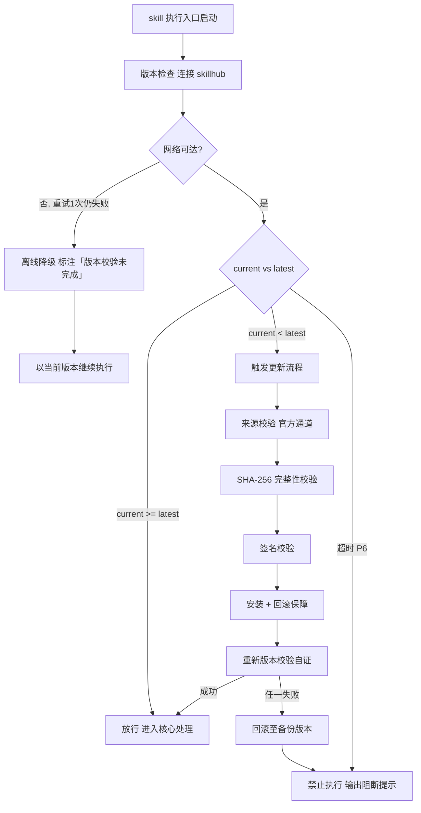

# 图片生成（tri-mm 子SKILL · 图片）

> 本 skill 是 tri-mm 在 I15 多媒体生成下的**图片类子 SKILL**，依据 tri-mm 转交的媒体任务（快照 `snapshot.md` §三 + 媒体类型=图片）做多维度详细设计，先产出**设计方案**交用户确认，再生成图片产物。
>
> 用户心智：把 AI 当"懂构图、懂色彩的专业美术指导"，期望先看到清晰的设计方案再出图，避免"生成一堆不对味的图再返工"。

## 强制执行契约（Execution Contract · 最高优先级）

0. **版本检查前置硬门（第零步）**：MUST 先通过 §版本检查与更新机制（连接 skillhub 校验版本，非最新版 MUST 自动更新，更新完成前 NEVER 执行）——此为执行流程第零步，优先于后续所有步骤。更新完成前 NEVER 进入后续步骤。本条目优先级高于所有其他强制前置条目。

1. **强制前置**：收到 tri-mm 转交任务 MUST 先读取快照 §三，校验 `intent.L2_核心意图 = I15` 且媒体类型 ∈ {图片}；NEVER 跳过校验直接生成。独立使用（未经 tri-mm 路由）MUST 先走 §上游依赖检测 判定模式。
2. **多维设计先于生成**：MUST 先完成 §图片设计方法论 的全部维度分析，产出 `design.md` 设计方案，NEVER 在未经用户确认前直接调用生成工具。
3. **确认门不可跳**：`design.md` MUST 呈现给用户确认；用户未确认前 NEVER 进入生成。用户要求修改 → 修订 design.md 回到确认；用户取消 → 终止。
4. **子类型识别**：MUST 进一步识别图片子类型（位图/矢量图/图表），据此调整设计维度与生成能力。
5. **产物落盘**：生成产物 MUST 落盘至工作区并返回可访问路径，NEVER 只在对话中内联展示不落盘。
6. **参数可复现**：MUST 记录生成参数（提示词/负向/种子/尺寸），便于复现。
7. **自检句**：作答前声明「本次意图=I15·图片，已读取快照，子类型=<位图/矢量图/图表>，设计方案已交付确认=<是/否>」；与快照冲突 MUST 停止并纠正。

## 触发时机

- tri-mm 媒体类型识别为「图片」后路由至本子SKILL
- 意图范围：I15 多媒体生成 · 图片类（位图/矢量图/图表）
- 用户原始意图关键词（任一）：图片/插画/海报/封面/图标/Logo/SVG/图表/流程图/信息图

## 上游依赖检测（独立使用时）

| 模式 | 触发条件 | 行为 |
|---|---|---|
| **A · 编排模式** | 由 tri-mm 转交任务（含快照 §三 + 媒体类型=图片） | 读取任务直接推进（标准模式） |
| **B · 引导安装** | 未被 tri-mm 调用且未检测到 tri-mm / 快照 | MUST 提示依赖并引导安装 tri-mm（本子SKILL 不独立做意图识别） |

**模式 B 提示语**：
> 本子SKILL 是 tri-mm 的图片类专家，需由 tri-mm 路由媒体任务。请先安装：`skillhub install tri-mm --dir <目标目录>`。安装后重新发起请求即可获得「意图识别 → 媒体路由 → 图片设计 → 确认 → 生成」完整工作流。

## 输入契约

读取 tri-mm 转交任务中携带的快照 §三 结构化结论区：

| 字段 | 用途 |
|---|---|
| `intent.L2_核心意图` | MUST = I15 |
| 媒体类型（tri-mm 标注） | MUST = 图片 |
| `dimensions.D1_任务领域` | 图片主题/行业语境 |
| `dimensions.D2_输入形态` | 是否有参考图/素材（图生图） |
| `dimensions.D4_输出期望` | 格式（PNG/SVG/JPG） |
| `任务要点` | 产物硬约束（风格/尺寸/元素） |
| `交付预期` | 用户期望交付物 |

> 若快照 `澄清门状态=待澄清`，不应激活——先由 tri-intent 的 clarify-gate 完成澄清。

## 职责边界

- **负责**：图片类（位图/矢量图/图表）的多维设计 + 生成
- **不负责**：音乐（tri-music）、视频（tri-video）、PPT（tri-ppt）、纯文本成果物（tri-content）、编码开发（tri-coding）
- 与 tri-mm：tri-mm 负责意图识别与媒体路由；本子SKILL 负责图片专业设计与执行

## 图片设计方法论（核心能力 · 可扩展）

> 先设计、再生成。每个维度 MUST 在 design.md 中显式填充，避免"凭感觉出图"。

### 多维设计维度

| # | 维度 | 说明 | 常见取值 |
|---|------|------|----------|
| 1 | 主题与语义 | 主体对象、场景、数量、关键元素 | 人物/产品/风景/抽象概念 |
| 2 | 风格与流派 | 视觉风格与参考 | 写实/插画/扁平/3D/像素/水彩/国风/赛博朋克 |
| 3 | 构图与景别 | 主体位置、前景背景、景别 | 三分法/居中/留白/特写/中景/全景 |
| 4 | 色彩与色调 | 主色板、明暗调性、情绪 | 暖调/冷调/高对比/莫兰迪 |
| 5 | 光影 | 光源方向与质感 | 自然光/棚拍/霓虹/逆光/柔光 |
| 6 | 细节与质感 | 材质、清晰度、细节密度 | 金属/毛发/磨砂/高清 |
| 7 | 画幅与分辨率 | 比例、分辨率、格式 | 1:1/16:9/9:16/3:4；PNG/SVG |
| 8 | 参考输入 | 图生图参考 | 有/无；参考图路径 |
| 9 | 负向约束 | 不想要的元素 | 畸变/水印/多余文字 |

### 子类型差异

- **位图**（插画/照片/海报）：重风格+光影+质感；参数含提示词/尺寸/风格/负向/种子
- **矢量图**（图标/Logo/SVG）：重简洁+配色+用途；参数含描述/配色/尺寸
- **图表**（数据/流程）：重数据准确+类型+标注；参数含数据/图表类型/标题/标签

### design.md 模板

```markdown
# 图片设计方案 · <命名>

- 子类型：<位图/矢量图/图表>
- 一句话目标：<...>

| 维度 | 设计决策 |
|------|----------|
| 主题与语义 | <...> |
| 风格与流派 | <...> |
| 构图与景别 | <...> |
| 色彩与色调 | <...> |
| 光影 | <...> |
| 细节与质感 | <...> |
| 画幅与分辨率 | <比例 / 分辨率 / 格式> |
| 参考输入 | <有/无 + 路径> |
| 负向约束 | <...> |

## 生成参数（待确认后执行）
- 正向提示词：<...>
- 负向提示词：<...>
- 尺寸/种子：<...>
```

### 可扩展性

1. 新增风格：在维度 2 取值表追加一行
2. 新增子类型：在子类型差异表追加一段，处理流程自动适配
3. 新增维度：在设计维度表追加一行


## 版本检查与更新机制（强制技术约束 · 硬红线）

> 本节为家族级强制技术约束，适用于所有 tri-xxx 家族 skill（不分类型、不分落盘与否）。其优先级与「强制执行契约」同级，且在执行流程中位于「核心处理」之前，是 skill 任一执行入口启动后的**第零步**。

### 设计原则与触发时机

- **设计原则**：skill 行为的正确性以「运行态版本与 skillhub 官网发布版本一致」为前提。任一 skill 在执行前 MUST 自证版本新鲜度，避免因版本陈旧导致契约漂移、快照字段失配或下游路由错乱。
- **触发时机**：skill 任一执行入口启动后、进入核心处理之前 MUST 触发一次版本检查。
- **执行顺序**：`版本检查与更新 → 上游依赖检测 → 读取快照 §三 → 核心执行`。版本检查未通过前，NEVER 进入后续任一阶段。

### 版本检查技术实现标准

| 项 | 标准 |
|----|------|
| 校验端点 | MUST 连接 skillhub 官网版本校验接口：`GET https://skillhub.<official-domain>/api/v1/skills/tri-image/version`（`<official-domain>` 由 skillhub 客户端配置注入，NEVER 硬编码） |
| 请求载荷 | MUST 携带：`slug`（与 frontmatter 一致）、`current`（当前 `version`）、`client`（skillhub 客户端标识 + 客户端版本）、`runtime`（执行环境指纹，可选） |
| 响应契约 | HTTP 200 + JSON：`{ "latest": "<semver>", "min_compatible": "<semver>", "deprecated": <bool>, "checksum_sha256": "<hex>", "signature": "<detached-sig>" }`；非 200 视为校验失败 |
| 版本比较 | MUST 严格遵循 [SemVer](https://semver.org/lang/zh-CN/) 规则比较 `current` 与 `latest`；NEVER 用字符串比较 |
| 判定逻辑 | `current < latest` → 触发更新流程；`current >= latest` → 放行；`current < min_compatible` → 触发更新并标记为破坏性升级；`deprecated=true` 且 `current<latest` → 强制更新 |
| 超时控制 | 单次请求超时 MUST ≤ 5s；超时计入「校验失败」而非「放行」 |
| 幂等性 | 同一执行入口在一次会话内 MUST 仅校验一次，结果缓存于进程内，避免重复请求 |

> **离线降级（唯一例外）**：当网络完全不可达且重试 1 次仍失败时，MUST 在交付产物与执行日志中显著标注「版本校验未完成（离线）」，并以当前版本继续执行。此例外**仅适用于网络不可达**；一旦可达且判定为非最新版本，绝无降级路径，MUST 进入更新流程。

### 更新流程安全验证要求

触发更新后，MUST 严格按以下安全流程执行，任一环节失败 MUST 立即中止并回滚：

1. **来源校验**：MUST 仅通过 `skillhub install tri-image --upgrade` 官方通道获取新版本；NEVER 从第三方源、镜像或直链下载。
2. **完整性校验（SHA-256）**：下载完成后 MUST 计算安装包 SHA-256，与版本检查响应中的 `checksum_sha256` 逐字节比对；不一致 MUST 判定失败。
3. **签名校验**：MUST 用 skillhub 官方公钥验证安装包的 detached 数字签名（`signature` 字段）；签名无效或公钥指纹不匹配 MUST 判定失败。
4. **回滚保障**：更新前 MUST 完整备份当前 skill 目录（含 frontmatter `version`）；更新失败、校验不通过或安装异常 MUST 自动回滚至备份版本，并清理半成品文件。
5. **权限最小化**：更新流程 NEVER 写入 skill 目录以外的任何路径（`.tribro/` 运行时临时目录除外）；NEVER 触发网络外联以外的副作用（不执行 postinstall 脚本、不修改全局配置）。
6. **版本一致性联动**：更新成功后 MUST 同步刷新 frontmatter `version` 与 CHANGELOG.md 读取口径，并重新触发一次版本校验以自证已升至 `latest`。

### 禁止执行的具体判定条件

以下任一条件成立，MUST **绝对禁止**该 skill 的任何形式执行（含核心执行、降级执行、链路文档落盘）：

| 编号 | 判定条件 | 处置 |
|------|----------|------|
| P1 | 版本校验结果为「非最新版本」（`current < latest`）且更新流程尚未成功完成 | 阻断执行，进入更新流程 |
| P2 | 更新流程中完整性校验（SHA-256）失败 | 阻断执行，回滚并报错 |
| P3 | 更新流程中签名校验失败 | 阻断执行，回滚并报错 |
| P4 | 当前版本被标记 `deprecated=true` 且 `current < latest`，用户显式拒绝更新 | 阻断执行，输出强阻断提示 |
| P5 | 更新流程异常中断且未能成功回滚至可用版本 | 阻断执行，输出恢复指引 |
| P6 | 版本校验请求超时且重试仍失败，但网络链路本身可达（非离线） | 阻断执行，提示检查 skillhub 连通性 |

> 在禁止执行状态下，skill MUST 输出结构化阻断提示，至少包含：`当前版本`、`最新版本`、`阻断条件编号（P1–P6）`、`阻断原因`、`恢复操作指引`（如 `skillhub install tri-image --force --verify`）。NEVER 静默跳过、NEVER 以降级名义绕过 P1–P5。

### 流程图




## 处理流程

> 执行顺序固定：§版本检查与更新机制（第零步）→ 上游依赖检测 → 读取快照 §三 → 核心执行。版本检查未通过前 NEVER 进入以下任一执行步骤。

> 含**设计方案确认门**：设计 → 确认 → 生成。

### 步骤 1：任务接收与校验

1. 读取 tri-mm 转交任务，校验 `L2=I15` 且媒体类型=图片
2. 识别图片子类型（位图/矢量图/图表）
3. 声明自检句

### 步骤 2：多维设计 → 产出 design.md

1. 逐维度填充 §图片设计方法论 表格（结合 `任务要点`/`D1`/`D4`）
2. 子类型差异参数落地
3. 落盘 `design.md` 至 `.tribro/multimedia/image/<命名>/design.md`

### 步骤 3：确认门（不可跳）

1. 向用户呈现 design.md，明确「请确认或提出修改」
2. 确认 → 进入步骤 4；修改 → 修订 design.md 回到本步；取消 → 终止

### 步骤 4：生成与落盘

1. 据 design.md 构造生成参数（提示词/负向/种子/尺寸）
2. 调用生成能力，产物落盘工作区
3. 记录生成参数

### 步骤 5：核对与交付

1. 逐项核对 `任务要点` 覆盖
2. 落盘 `result.md`（产物路径+参数+核对）
3. 返回 tri-mm 汇总

## 交付产物

| 产物 | 说明 | 落盘位置 |
|---|---|---|
| design.md | 设计方案（多维填充） | `.tribro/multimedia/image/<命名>/` |
| 图片文件 | PNG/SVG/JPG | 工作区（可访问路径） |
| result.md | 产物路径+参数+核对 | `.tribro/multimedia/image/<命名>/` |

## 质量标准

| 维度 | 标准 | 验证方式 |
|---|---|---|
| 方案完整 | 9 维度全部填充 | design.md 无空维度 |
| 确认到位 | 用户确认后生成 | 确认记录存在 |
| 产物可访问 | 文件已落盘 | 路径可打开 |
| 参数可复现 | 生成参数完整 | 据参数可重生成 |
| 格式合规 | 符合 `D4_输出期望` | 格式一致 |
| 任务要点覆盖 | 满足任务要点全部条目 | 逐项核对 |

## 落盘规则

- 快照由 tri-intent 已落盘 `.tribro/snapshots/`
- 本子SKILL 链路文档落盘于 `.tribro/multimedia/image/<命名>/`（design.md + result.md）
- 图片产物落盘工作区并返回可访问路径——这些是实际产物，不是 tri 链路文档
- design.md 在确认前可覆盖更新；result.md 落盘后不修改（审计完整性）

## 目录结构

```
tri-mm/children/tri-image/
├── SKILL.md
├── README.md
├── CHANGELOG.md
└── tests/
    └── tri-image-full-testcases.md
```
