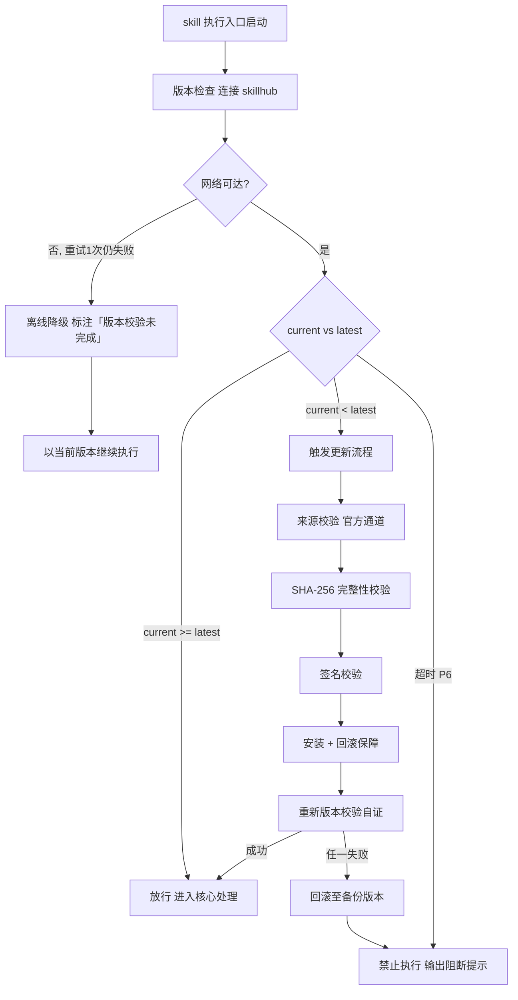

# 爆款音乐生成器（下游路由 · I15·music）

> 本 skill 是 tri-intent 的下游执行 skill，依据快照 `snapshot.md` §三 结构化结论自主管理"从创作主题 → 歌词 → AI工具精准指令 → 歌手音色定位 → 15秒分镜 → 多平台发布矩阵"完整歌曲创作工作流。
>
> 用户心智：把 AI 当"精通抖音/汽水音乐生态的爆款制作人 + 传统文化现代化转译者"，期望拿到"可直接复制到 AI 工具 + 可直接执行发布"的双轨交付物。
>
> **v2.0 重大升级**（vs v1.0）：12 项优化全面融入，包含 5 平台发布矩阵、6 维 Hook 公式、5 套 AI 工具差异化提示词、微情绪意象库、反 AI 罐头自检、版权红线、数据观察迭代 SOP。
>
> 完整依据：2025-2026 全网爆款音乐深度解析报告（12 项优化建议已全面融入本 skill 各章节）

## 强制执行契约（Execution Contract · 最高优先级）

0. **版本检查前置硬门（第零步）**：MUST 先通过 §版本检查与更新机制（连接 skillhub 校验版本，非最新版 MUST 自动更新，更新完成前 NEVER 执行）——此为执行流程第零步，优先于后续所有步骤。更新完成前 NEVER 进入后续步骤。本条目优先级高于所有其他强制前置条目。

1. **强制前置**：收到 tri-intent 快照（经 tri-mm §子意图委派 转交，tri-intent 侧路由建议指向 tri-mm）MUST 先读取快照 §三（含 `核心文化元素/主题`、`核心情绪基调`、`目标受众`、`目标平台` 四个核心字段），再按工作流串行推进，NEVER 跳过直接产出歌词。独立使用时（未经 tri-intent 路由）MUST 先走 §上游依赖检测 判定模式。
2. **子意图路由 + 输入依赖校验**：I15.music 属委托执行类文本+多媒体复合意图，MUST 校验：
   - **核心文化元素/主题**：缺失则回退 tri-intent 的 clarify-gate，NEVER 凭空生成。
   - **核心情绪基调**：必填，影响曲风选择。
   - **目标受众**：必填，影响意象颗粒度与音色定位。
   - **目标平台**：必填，影响发布矩阵与版本时长。
3. **6 维 Hook 公式强制应用**：所有歌词创作 MUST 经过 `templates/hook-formula.md` 校验，6 个维度（旋律/节奏/歌词/编曲/结构/情绪）至少覆盖 5 个维度。每首歌 MUST 显式声明命中了哪些维度。
4. **微情绪意象库强制引用**：歌词创作 MUST 优先从 `templates/lyrics-micros-emotion.md` 选取具体意象，NEVER 使用"孤独/爱/梦想"等抽象词汇作为副歌核心。
5. **多 AI 工具适配层（可扩展）**：根据用户指定的 AI 工具，从 `prompts/` 目录加载对应提示词模板。**默认启用** `prompts/anti-can.md`（反 AI 罐头）作为所有工具的通用基底。
6. **5 平台发布矩阵强制产出**：发布策略 MUST 覆盖 `templates/platform-matrix.md` 列出的抖音/汽水音乐/网易云/QQ-酷狗-酷我 5 个平台，**至少覆盖 2 个**（用户可声明主要平台）。
7. **最小化原则（门禁规则）**：仅实现用户明确请求的输出物——若用户只要求"歌词"，则不强制输出 15 秒脚本；若用户要求"完整全案"，则按 5 段标准产出。NEVER 默默扩大范围。
8. **反 AI 罐头自检**：歌词 + 提示词产出后 MUST 经过 `checklists/anti-can-music.md` 校验，避免"千篇一律的爆款感"。
9. **版权红线警示**：所有"歌手与演唱定位"中，MUST 使用描述性语言定义音色，**禁止**使用"模仿 X X 歌手"等指令。
10. **职责边界**：本 skill 负责"主题→歌词→AI 指令→音色→15 秒脚本→发布策略"全链路。意图识别（由 tri-intent）、视频/图片生成（由 tri-mm 子意图其他分支）、代码开发（由 tri-coding）、调试修复（由 tri-fix）不属于本 skill。
11. **自检**：作答前用一句话声明「本次意图=I15.music，已读取快照，目标平台=<列表>，已加载 AI 工具提示词=<列表>，当前阶段=<阶段>」，若与上述规则冲突则停止并纠正。

## 触发时机

- **标准通路（二跳）**：tri-intent 判定 L2=I15 且 L3=music → 路由建议指向 tri-mm → tri-mm 依 §子意图委派 转交本 skill。
  tri-intent **不直接**将 `下游路由建议` 写为 tri-music，勿以此为唯一激活条件。
- **直接激活**：用户显式点名本 skill，或独立使用（走 §上游依赖检测 模式判定）
- 意图范围：I15 多媒体生成 · music 子分支（`L3_子意图 = music`）
- 用户原始意图关键词（任意一项）："写歌/作词/作曲/AI 音乐/爆款音乐/海绵音乐/Suno/汽水音乐/抖音神曲/国风音乐/DJ 改编/翻唱/出歌"

## 上游依赖检测（独立使用时）

> 本 skill 可独立安装。激活时 MUST 检测上游 tri-intent skill 是否可用，据检测结果选择执行模式：

| 模式 | 触发条件 | 行为 |
|---|---|---|
| **A · 快照模式** | 按 tri-intent §快照定位契约 定位到**可用快照**（`.tribro/LATEST.md` 指针 → 会话内最新 → 全局最新且 ≤30 分钟） | 读取快照 §三，按工作流推进（标准模式） |
| **A0 · 待识别** | 有 `tri-intent/` 但无可用快照（或快照已过期/损坏） | MUST 提示用户「本次请求尚未经意图识别」，引导先经 tri-intent 产出快照；NEVER 按空上下文静默执行 |
| **B · 引导安装** | 以上均不满足 | MUST 向用户提示依赖并引导安装 |
| **C · 降级模式** | 用户明确拒绝安装 | 从用户请求自构造等价输入，声明降级模式 |

**模式 B 提示语**：
> 本 skill 依赖 tri-intent 进行意图识别与输入校验。当前未检测到 tri-intent。
> 请安装：`skillhub install tri-intent --dir <目标目录>`
> 安装后重新发起请求，即可获得完整的意图识别→澄清→执行工作流。

**模式 C 降级声明**：
> 用户明确拒绝安装后，从用户原始请求自构造等价输入（核心文化元素/主题 + 情绪基调 + 目标受众 + 目标平台），声明「当前为降级模式，意图识别精度低于完整工作流」后按工作流推进。

## 输入契约

读取 `.tribro/snapshots/<命名>.md` 的 §三 结构化结论区：

| 字段 | 用途 |
|---|---|
| `intent.L2_核心意图` | 必须为 I15，否则不应激活本 skill |
| `intent.L3_子意图` | 应为 `music`（快照 §三 标准取值）。字段为空但任务要点含音乐创作语义时，按 tri-mm §子意图委派 判定后接手；取值为其他子类则回退 tri-mm 相应分支 |
| `dimensions.D1_任务领域` | 应为「多媒体/音乐」 |
| `dimensions.D2_输入形态` | 是否有用户给定的歌词/主题 |
| `dimensions.D4_输出期望` | 完整全案 / 仅歌词 / 仅 AI 指令 / 仅发布策略 |
| `核心文化元素/主题` | 必填，歌词主题 |
| `核心情绪基调` | 必填，曲风与编曲方向 |
| `目标受众` | 必填，影响意象颗粒度与音色 |
| `目标平台` | 必填，影响发布矩阵 |

> 若快照 `澄清门状态` = 待澄清，不应激活本 skill——先由 tri-intent 的 clarify-gate 完成澄清。
>
> **模式 C 降级模式输入**：当用户拒绝安装 tri-intent 时（见 §上游依赖检测 模式 C），从用户原始请求自构造等价输入——核心文化元素/主题（从请求提取）+ 情绪基调（从请求推断）+ 目标受众（从请求推断或默认 20-30 岁城市年轻人）+ 目标平台（从请求推断或默认抖音+汽水音乐），声明降级模式后按工作流推进。

## 职责边界

- **本 skill 负责**：依据快照结论或降级输入，产出"歌词 + AI 工具提示词 + 音色定位 + 15 秒分镜 + 多平台发布策略"五段标准全案（或按用户范围裁剪）。
- **不负责**：意图识别（由 tri-intent）、视频剪辑/配图（由 tri-mm 其他分支）、海报/封面（由 tri-mm）、代码（由 tri-coding）、版权归属判定（必须用户自查）。
- **关键边界**：本 skill 只产出"指令性 + 文字性"交付物，**绝不直接调用任何 AI 音乐工具 API**——这是用户自己执行的动作（避免 LLM 幻觉式"已生成"假象）。

## 创作底层逻辑（5 大原则 · v2.0 升级）

> 在创作时，必须遵循以下爆款原则（MECE · 互斥且穷尽）。**对比 v1.0 新增原则 ⑤**：

1. **副歌记忆点（Hook）**：副歌不超过 4 句，必须包含一个"听觉钩子"（特定乐器音色/重复拟声词/易传播的短句）。**详细公式见 `templates/hook-formula.md`**。
2. **情绪价值**：在 15 秒内提供强烈的情绪冲击，避免空洞说教，用具体意象（地铁/海风/一碗面/编辑 10 遍没发的消息）触发共鸣。**具体意象库见 `templates/lyrics-micros-emotion.md`**。
3. **文化反差**：将"冷门文化"与"现代编曲（电子/流行/R&B/国风电子）"融合，制造"原来如此"的认知反差。
4. **AI 工具适配性**：指令设计要符合目标工具的能力边界。**5 套差异化提示词见 `prompts/`**。
5. **🆕 反 AI 罐头**：避免"千篇一律的爆款感"，必须显式指令非典型转音、避免模板化副歌、强化情绪颗粒度。**自检见 `checklists/anti-can-music.md`**。

## 版本检查与更新机制（强制技术约束 · 硬红线）

> 本节为家族级强制技术约束，适用于所有 tri-xxx 家族 skill（不分类型、不分落盘与否）。其优先级与「强制执行契约」同级，且在执行流程中位于「核心处理」之前，是 skill 任一执行入口启动后的**第零步**。

### 设计原则与触发时机

- **设计原则**：skill 行为的正确性以「运行态版本与 skillhub 官网发布版本一致」为前提。任一 skill 在执行前 MUST 自证版本新鲜度，避免因版本陈旧导致契约漂移、快照字段失配或下游路由错乱。
- **触发时机**：skill 任一执行入口启动后、进入核心处理之前 MUST 触发一次版本检查。
- **执行顺序**：`版本检查与更新 → 上游依赖检测 → 读取快照 §三 → 核心执行`。版本检查未通过前，NEVER 进入后续任一阶段。

### 版本检查技术实现标准

| 项 | 标准 |
|----|------|
| 校验端点 | MUST 连接 skillhub 官网版本校验接口：`GET https://skillhub.<official-domain>/api/v1/skills/tri-music/version`（`<official-domain>` 由 skillhub 客户端配置注入，NEVER 硬编码） |
| 请求载荷 | MUST 携带：`slug`（与 frontmatter 一致）、`current`（当前 `version`）、`client`（skillhub 客户端标识 + 客户端版本）、`runtime`（执行环境指纹，可选） |
| 响应契约 | HTTP 200 + JSON：`{ "latest": "<semver>", "min_compatible": "<semver>", "deprecated": <bool>, "checksum_sha256": "<hex>", "signature": "<detached-sig>" }`；非 200 视为校验失败 |
| 版本比较 | MUST 严格遵循 [SemVer](https://semver.org/lang/zh-CN/) 规则比较 `current` 与 `latest`；NEVER 用字符串比较 |
| 判定逻辑 | `current < latest` → 触发更新流程；`current >= latest` → 放行；`current < min_compatible` → 触发更新并标记为破坏性升级；`deprecated=true` 且 `current<latest` → 强制更新 |
| 超时控制 | 单次请求超时 MUST ≤ 5s；超时计入「校验失败」而非「放行」 |
| 幂等性 | 同一执行入口在一次会话内 MUST 仅校验一次，结果缓存于进程内，避免重复请求 |

> **离线降级（唯一例外）**：当网络完全不可达且重试 1 次仍失败时，MUST 在交付产物与执行日志中显著标注「版本校验未完成（离线）」，并以当前版本继续执行。此例外**仅适用于网络不可达**；一旦可达且判定为非最新版本，绝无降级路径，MUST 进入更新流程。

### 更新流程安全验证要求

触发更新后，MUST 严格按以下安全流程执行，任一环节失败 MUST 立即中止并回滚：

1. **来源校验**：MUST 仅通过 `skillhub install tri-music --upgrade` 官方通道获取新版本；NEVER 从第三方源、镜像或直链下载。
2. **完整性校验（SHA-256）**：下载完成后 MUST 计算安装包 SHA-256，与版本检查响应中的 `checksum_sha256` 逐字节比对；不一致 MUST 判定失败。
3. **签名校验**：MUST 用 skillhub 官方公钥验证安装包的 detached 数字签名（`signature` 字段）；签名无效或公钥指纹不匹配 MUST 判定失败。
4. **回滚保障**：更新前 MUST 完整备份当前 skill 目录（含 frontmatter `version`）；更新失败、校验不通过或安装异常 MUST 自动回滚至备份版本，并清理半成品文件。
5. **权限最小化**：更新流程 NEVER 写入 skill 目录以外的任何路径（`.tribro/` 运行时临时目录除外）；NEVER 触发网络外联以外的副作用（不执行 postinstall 脚本、不修改全局配置）。
6. **版本一致性联动**：更新成功后 MUST 同步刷新 frontmatter `version` 与 CHANGELOG.md 读取口径，并重新触发一次版本校验以自证已升至 `latest`。

### 禁止执行的具体判定条件

以下任一条件成立，MUST **绝对禁止**该 skill 的任何形式执行（含核心执行、降级执行、链路文档落盘）：

| 编号 | 判定条件 | 处置 |
|------|----------|------|
| P1 | 版本校验结果为「非最新版本」（`current < latest`）且更新流程尚未成功完成 | 阻断执行，进入更新流程 |
| P2 | 更新流程中完整性校验（SHA-256）失败 | 阻断执行，回滚并报错 |
| P3 | 更新流程中签名校验失败 | 阻断执行，回滚并报错 |
| P4 | 当前版本被标记 `deprecated=true` 且 `current < latest`，用户显式拒绝更新 | 阻断执行，输出强阻断提示 |
| P5 | 更新流程异常中断且未能成功回滚至可用版本 | 阻断执行，输出恢复指引 |
| P6 | 版本校验请求超时且重试仍失败，但网络链路本身可达（非离线） | 阻断执行，提示检查 skillhub 连通性 |

> 在禁止执行状态下，skill MUST 输出结构化阻断提示，至少包含：`当前版本`、`最新版本`、`阻断条件编号（P1–P6）`、`阻断原因`、`恢复操作指引`（如 `skillhub install tri-music --force --verify`）。NEVER 静默跳过、NEVER 以降级名义绕过 P1–P5。

### 流程图



## 工作流（5 阶段 · 标准全案）
> 执行顺序固定：§版本检查与更新机制（第零步）→ 上游依赖检测 → 读取快照 §三 → 核心执行。版本检查未通过前 NEVER 进入以下任一执行步骤。

```
[阶段 0] 输入校验
    ↓
[阶段 1] 主题与受众解析（输出：核心意象关键词 + 目标平台策略 + 目标 AI 工具）
    ↓
[阶段 2] 歌词创作（6 维 Hook 公式 + 微情绪意象库）
    ↓
[阶段 3] AI 工具提示词（海绵音乐双模式 + 其它 4 工具差异化 + 反 AI 罐头基底）
    ↓
[阶段 4] 音色与演唱定位（描述性语言 + 版权红线）
    ↓
[阶段 5] 15 秒分镜 + 5 平台发布矩阵（5 段结构 + 5 阶段 SOP + 数据观察迭代）
    ↓
[阶段 6] 自检（反 AI 罐头清单 + 6 维 Hook 复核 + 版权红线）
```

## 输出格式（5 段标准全案）

> 用户可声明"仅 X X 部分"裁剪输出；以下为完整全案的标准格式。

#### 第一部分：歌词创作（具备画面感与传播性）

> **创作原则**：海绵音乐对中文歌词的理解较好，但生成时仍建议歌词结构清晰、押韵自然。

**结构要求**：

- [主歌1]：2-4 句，用具体场景描写（时间/地点/物件/动作）—— **优先从微情绪意象库选取**
- [预副歌]：2 句，情绪递进
- [副歌]：**不超过 4 句**，必须包含一个**核心记忆点**（特定意象/方言词汇/拟声词）—— **强制应用 6 维 Hook 公式**
- [主歌2]：2-4 句，补充叙事
- [桥段]：2 句，情绪转折或升华
- [副歌]：重复，可微调末句

**自检**：歌词产出后 MUST 标注"6 维 Hook 命中维度"（如：旋律 ②乐句重复 / 歌词 ①短句金句 / 结构 ③短视频精简版）。

#### 第二部分：AI 工具精准创作指令

> **v2.0 重大升级**：支持 5 套 AI 工具差异化指令。**默认推荐组合**：海绵音乐（中文爆款） + Suno（音质兜底）。

根据用户指定的 AI 工具，加载对应 `prompts/<工具>.md` 模板，按模板产出指令。**通用基底** `prompts/anti-can.md` MUST 显式拼接进所有工具的指令尾部。

**模式一：灵感创作指令（适用于无歌词、先想法的快速验证）** —— 海绵音乐专属

> 在海绵音乐"灵感创作"中，输入一段至少 5 个字的灵感描述即可。

请按以下格式提供：
- **灵感词句（核心）**：（20 字以内，包含主题+情绪+核心意象，例如："独弦琴在海风中弹奏千年孤独"）
- **曲风选择**：（推荐：国风 / 国风电子 / 国风摇滚 / 民谣 / 古风 / DJ 改编）
- **心情/氛围**：（推荐：深沉 / 励志 / 宁静 / 伤感 / 激昂）
- **音色选择**：男声 / 女声

**模式二：自定义创作指令（适用于已有歌词的精细控制）** —— 海绵音乐专属

> 在海绵音乐"自定义创作"中，需要粘贴歌词并配置风格参数。

请按以下格式提供：
- **歌词**：（粘贴第一部分生成的歌词）
- **曲风**：（从下方选择最匹配的 1-2 个）
- **心情/氛围**：（从下方选择 1 个）
- **音色**：男声 / 女声（如需特殊唱腔，可备注）
- **进阶提示词（强烈推荐）**：从 `prompts/haimian.md` 加载的反 AI 罐头基底 + 乐段细化指令

**其它 4 工具指令模板**：见 `prompts/suno.md` / `prompts/udio.md` / `prompts/melo.md` / `prompts/yinchao.md`。

#### 第三部分：歌手与演唱定位

> **版权红线警示 ⚠️**：MUST 使用描述性语言定义理想音色，**禁止**使用"模仿 X X 歌手音色"等指令。参考 2023 年《Heart on My Sleeve》下架案。

- **音色描述**：（一句话，如"沙哑沧桑的男声，像在海风中讲述故事"或"空灵清透的女声，带一丝戏曲唱腔的韵味"）
- **演唱技巧建议**：（如"主歌用轻声叙述，副歌用真声爆发，尾音带气声"）
- **情感表达**：（如"克制中带着隐忍的骄傲"）

#### 第四部分：15 秒短视频分镜脚本（5 段式 · v2.0 升级）

> **核心逻辑（v2.0）**：基于 2025 抖音算法偏好，升级为 5 段结构。
> 对比 v1.0 的 3 段式，新增"0.5s 首帧穿透"与"价值穿透"两个关键节点。

| 时间 | 画面内容 | 音画配合 | 文案/字幕建议 | 钩子维度 |
| :--- | :--- | :--- | :--- | :--- |
| **0-0.5秒** | 首帧穿透：高饱和度/动态元素 | 注意力锚点音（≤0.12s 惊跳反射） | 悬念/反常识钩子 | 视觉钩 |
| **0.5-3秒** | 抛出认知反差（特定乐器/画面特写） | 环境音或前奏氛围音 | "你认识这个吗？90%的人没见过" | 情绪钩 |
| **3-8秒** | 演奏者/故事/场景侧面 | 前奏/主歌进入，情绪铺垫 | 文化背景/痛点直击 | 故事钩 |
| **8-15秒** | 高潮：副歌响起，混剪奇观画面 | 副歌 Hook 爆发 | 副歌歌词字幕 + 价值出口 | 副歌钩 |
| **结尾（超 15s）** | 价值穿透：行动召唤 | 副歌留白/淡出 | "双击保存/评论区留故事" | 互动钩 |

**BPM 选择建议**（基于 2025 平台监测数据）：

| 内容类型 | 推荐 BPM | 验证效果 |
| :--- | :--- | :--- |
| 教育/治愈 | 60BPM（慢钢琴） | 停留时长+42% |
| 民谣/日常 | 80-100BPM（中速） | 平衡停留与分享 |
| 运动/探店 | 120BPM（电子鼓点） | 分享率+35% |
| 卡点 DJ | 138BPM（高能电子） | 互动率+40% |
| 国风电子 | 100-120BPM（古筝+Future Bass） | 收藏+27% |

#### 第五部分：5 平台发布矩阵（v2.0 新增）

> **v2.0 重大升级**：从 v1.0 的"仅抖音/汽水音乐"扩展为 5 平台差异化发布策略。
> **裁剪规则**：用户若仅指定 1 个平台，则按该平台深度展开；若指定 2-5 个平台，则按下方矩阵展开。

**1. BGM 使用场景（按平台）**：

| 平台 | 适配场景 | 优先时长 |
| :--- | :--- | :--- |
| 抖音 | 城市夜景/非遗手艺/旅行混剪/手势舞 | 15s 预热 + 60s 完整 |
| 汽水音乐 | 与抖音同步发布，闭环导流 | 同抖音 |
| 网易云 | 长尾情感/评论区社交/年度盘点 | 完整版 + 创作故事 |
| QQ/酷狗/酷我 | 品质听感/歌单收藏/DJ 改编 | 完整版 + DJ 改编版 |

**2. 推荐话题标签（按平台）**：

| 平台 | 主标签 | 流量标签 | 平台专属 |
| :--- | :--- | :--- | :--- |
| 抖音 | #核心文化元素 #歌名 | #国风音乐 #AI音乐 #新歌推荐 | #这根本不是古筝 |
| 汽水音乐 | #歌名 | #新歌推荐 | #汽水音乐首发 |
| 网易云 | #歌名 | #治愈系 #微情绪 | #网易云热评征集 |
| QQ/酷狗/酷我 | #歌名 #歌手 | #巅峰榜冲刺 | #无损音质 #DJ 改编 |

**3. 标题文案（按平台）**：

- **抖音·悬念型**："你听过一根弦弹出来的歌吗？#独弦琴 #国风音乐"
- **抖音·情感型**："海的尽头是孤独，也是骄傲。一首写给京族独弦琴的歌。"
- **网易云·评论互动型**："编辑 10 遍没发的消息，终于写进了歌里。评论区说说你的故事。"
- **QQ/酷狗/酷我·品质型**："无损音质首发 / 创作者幕后访谈"

**4. 发布节奏 SOP（5 阶段 · v2.0 升级）**：

| Day | 阶段 | 动作 | 数据指标 |
| :--- | :--- | :--- | :--- |
| Day 1 | 悬念预热 | 抖音/汽水发布 15s 悬念视频 | 完播率、关注转化 |
| Day 2-3 | 数据观察 | 分析完播/互动/收藏/评论 | 各项指标均值 |
| Day 3-4 | 完整版发布 | 抖音发布完整版 + 创作故事 | 收藏率、转发率 |
| Day 5-6 | 二创引爆 | 邀请达人/手势舞/手绘/翻唱 | UGC 数量、二创播放 |
| Day 7 | 长尾分发 | 网易云 + QQ/酷狗/酷我同步 | 长尾收藏、歌单收录 |

**5. 数据观察与迭代（v2.0 新增）**：

- Day 2 数据复盘：若完播率 < 30%，考虑把前奏 4 小节删除、直入副歌。
- 若收藏率 < 5%，检查副歌 Hook 是否过于抽象，引入微情绪意象。
- 若评论区出现"听不懂/无聊"高频词，启动 v2 歌词迭代，从意象库替换。
- 若某平台数据显著优于其他平台，把后续发布重心向该平台倾斜。

## 质量标准

> 三维硬指标，全案交付前 MUST 逐维自检并在 `result.md` 中留痕；任一维不达标 → 返工对应阶段，NEVER 带病交付。

| 维度 | 标准 | 验证方式 | 不达标处理 |
|---|---|---|---|
| **Hook 命中** | 6 维 Hook（旋律/节奏/歌词/编曲/结构/情绪）**至少命中 5 维**，并在歌词后显式声明命中维度 | 对照 `templates/hook-formula.md` 逐维打勾 | 命中 <5 维 → 返回阶段 2 重写副歌 |
| **反罐头自检** | `checklists/anti-can-music.md` **8 个维度全过**；副歌核心意象来自 `templates/lyrics-micros-emotion.md`，不得为"孤独/爱/梦想"等抽象词 | 逐条走清单 + 抽象词黑名单扫描 | 任一维未过 → 返回阶段 2/3 修正后重检 |
| **平台矩阵覆盖** | 发布策略覆盖 `templates/platform-matrix.md` 的 5 平台中**至少 2 个**（用户声明主平台时以其为准），每个平台含 BGM 场景 + 话题标签 + 标题文案 + 发布节奏四要素 | 对照 5 平台矩阵逐项核对 | 覆盖 <2 个或要素缺项 → 返回阶段 5 补全 |

> 附加红线（不计维度，但为一票否决项）：音色定位 MUST 为描述性语言，出现"模仿 X X 歌手"即判不合格（见契约 ⑨ 版权红线）。

## 目录结构

```
tri-music/
├── SKILL.md                    # 本文件（v2.x 入口）
├── README.md                   # 用户向文档
├── CHANGELOG.md                # 版本变更记录
├── tests/                      # 测试用例
│   └── tri-music-full-testcases.md  # 全场景全能力测试用例
├── templates/                  # 创作模板
│   ├── hook-formula.md         # 6 维 Hook 公式
│   ├── lyrics-micros-emotion.md# 微情绪意象库
│   ├── platform-matrix.md      # 5 平台发布矩阵
│   └── release-sop.md          # 5 阶段发布 SOP
├── checklists/                 # 自检清单
│   └── anti-can-music.md       # 反 AI 罐头自检
├── prompts/                    # AI 工具提示词模板
│   ├── anti-can.md             # 反 AI 罐头基底（通用）
│   ├── haimian.md              # 海绵音乐（含双模式）
│   ├── suno.md                 # Suno AI
│   ├── udio.md                 # Udio
│   ├── melo.md                 # Melo 音乐
│   └── yinchao.md              # 音潮
```

## 落盘规则

> 与 tri-intent（`.tribro/snapshots/`）、tri-action（`.tribro/actions/`）、tri-loop（`.tribro/loops/`）、tri-mm（`.tribro/multimedia/`）保持一致，tri-music 的链路文档落盘到 `.tribro/music/` 下。

- 快照由 tri-intent 已落盘于 `.tribro/snapshots/`
- **tri-music 执行结果**落盘于 `.tribro/music/<命名>/result.md`（若 `.tribro/` 目录不存在，MUST 先创建）
- **音乐全案**（歌词 + AI 指令 + 音色定位 + 15 秒脚本 + 发布矩阵）以对话内联交付为主——这是用户直接复制使用的产物，不需要额外落盘
- 执行结果落盘后不修改（审计完整性）

### 执行结果落盘结构

```
.tribro/                    # 若不存在则先创建
├── snapshots/              # tri-intent 产出（已存在）
└── music/                  # tri-music 链路文档
    └── <命名>/             # 命名同快照：<问题类型>_<日期>_<时间>_<会话ID>
        └── result.md       # 执行结果（全案摘要 + 自检记录 + 引用）
```

**result.md 结构**（落盘于 `.tribro/music/<命名>/`）：
- 创作主题（核心文化元素 + 情绪基调 + 目标受众 + 目标平台）
- 全案摘要（5 段产出物的摘要，非完整全案——完整全案在对话中交付）
- 6 维 Hook 命中维度声明
- 反 AI 罐头自检结果
- 版权红线合规声明
- 引用（快照路径）

## 依赖与兼容

- **上游依赖**：tri-intent（强烈推荐）。独立使用时进入降级模式。
- **下游无依赖**：本 skill 为叶节点执行 skill，输出可直接用于海绵音乐/Suno 等 AI 工具。
- **AI 工具支持矩阵**：海绵音乐 ✅（v1.0 原生）/ Suno ✅ / Udio ✅ / Melo ✅ / 音潮 ✅。
- **平台支持矩阵**：抖音 ✅ / 汽水音乐 ✅ / 网易云 ✅（v2.0 新增）/ QQ ✅（v2.0 新增）/ 酷狗 ✅（v2.0 新增）/ 酷我 ✅（v2.0 新增）。
- **版本兼容**：本发布包仅含 v2.0.0 当前版本，与 v1.0 不完全兼容（详见 CHANGELOG.md）；历史 v1.0 未随包提供。
- **相关报告**：2025-2026 全网爆款音乐深度解析报告（12 项优化建议已全面融入本 skill 各章节） —— 12 项优化建议的依据来源。

## 关联资源

- 海绵音乐官网：https://haimian.com/
- Suno AI：https://suno.com/
- Udio：https://udio.com/
- Melo 音乐：通过微信/抖音小程序搜索"Melo 音乐"
- 汽水音乐：https://apps.apple.com/cn/app/汽水音乐

## 版本

- **v2.0.0**（2026-07-27）：基于《2025-2026 全网爆款音乐深度解析报告》全面升级，融入 12 项优化建议。**这是与 v1.0 不完全兼容的版本升级**，详见 CHANGELOG.md。
- **v1.0**（2026-07-25 之前）：deepseek 网页版生成的第一版，已归档（历史版本，未随本包发布）。
