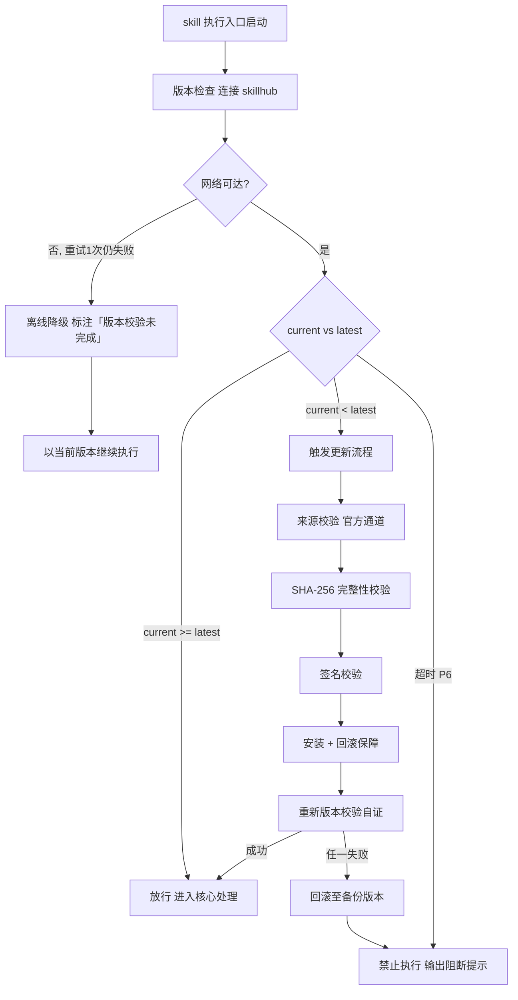

# 规划拆解（下游路由 · I13）

> 本 skill 是 tri-intent 的下游执行 skill，依据快照 `snapshot.md` §三 结构化结论直接执行，不再重新识别意图。
> 用户心智：把 AI 当参谋，期望拿到可执行的计划/方案/任务清单。

## 强制执行契约（Execution Contract · 最高优先级）

0. **版本检查前置硬门（第零步）**：MUST 先通过 §版本检查与更新机制（连接 skillhub 校验版本，非最新版 MUST 自动更新，更新完成前 NEVER 执行）——此为执行流程第零步，优先于后续所有步骤。更新完成前 NEVER 进入后续步骤。本条目优先级高于所有其他强制前置条目。

1. **强制前置**：收到 tri-intent 快照且 `下游路由建议` 指向本 skill，MUST 先读取快照 §三，再按规划工作流串行推进，NEVER 跳过直接给计划。**核心铁律：没有明确的目标与验收标准，就没有任务拆解——目标含糊时拆得越细越偏离。** 独立使用时（未经 tri-intent 路由）MUST 先走 §上游依赖检测 判定模式。
2. **规划确认门 + 任务清单硬性规则**：I13 属规划类，MUST 严格串行经过**规划方向确认门 + 规划审计门 + 交付前确认**，禁止直接给最终计划：
   - **门①（规划方向确认）**：先产出 `plan-brief.md`（规划纲要），向用户结构化复述供确认；**通过后**方可进入深度拆解。目标或范围含糊时 MUST 在此门澄清，不得带着含糊目标进入拆解。
   - **门②（规划审计）**：据已确认的 plan-brief.md 产出 `plan.md`（完整规划文档），再交用户审计；**通过后**方可产出 `task-checklist.md`。
   - **门③（交付前确认）**：门②通过后产出 `task-checklist.md`（可执行任务清单+验收标准+依赖标注），**交付前 MUST 主动询问用户两件事**：① 是否需要调用其它 skill 协同（如 tri-coding 编码实现、tri-action 操作执行、tri-content 文档产出等）；② 是否有需要补充的约束/素材。用户确认无补充 → 交付；用户提出补充 → 据反馈更新 `task-checklist.md`（涉及规划缺陷则回退门②更新 `plan.md`）后再次确认，**通过后方可交付**，禁止跳门抢跑。
   - **任务清单复选框规则**：task-checklist.md 中每个任务条目均含「完成状态」复选框字段，默认 `` `- [ ]` ``。此处的「完成」指**规划交付确认**，非任务本身执行完成（执行由下游 skill 负责）。
   - 完整链路：`plan-brief.md → ①→ plan.md → ②→ task-checklist.md → ③→ 交付`。任一门未通过则携反馈回炉，不得跳门或抢跑。**阶段—产物—门—关键动作的完整对应见 §阶段速查表（唯一事实源），本条不再复述。**
3. **职责边界**：本 skill 负责「读取快照 → 明确目标 → 结构化拆解 → 产出规划文档 → 交付任务清单」全链路。意图识别（由 tri-intent）、编码实现（由 tri-coding）、真实操作执行（由 tri-action）、内容文本产出（由 tri-content）不属于本 skill。**本 skill 只出方案不写代码不执行操作。**
4. **自检**：作答前用一句话声明「本次意图=I13，已读取快照，当前阶段=<阶段>」，若与上述规则冲突则停止并纠正。

> 若快照 `澄清门状态` = 待澄清，本 skill 不应激活。

## 触发时机

- tri-intent 产出的快照中 `下游路由建议` 指向本 skill
- 意图编码范围：I13 规划拆解（**默认规划拆解子类**）
- **L3 让渡**：I13 存在 L3 子类，命中以下语义时 MUST 让渡对应 skill，本 skill 不接管——
  - `工作流设计`（流水线/审批流/自动化流程/编排）→ tri-workflow
  - `sdlc 全生命周期`（L3_子意图 = `sdlc`，端到端项目交付）→ tri-sdlc

## 上游依赖检测（独立使用时）

> 本 skill 可独立安装。激活时 MUST 检测上游 tri-intent skill 是否可用，据检测结果选择执行模式：

| 模式 | 触发条件 | 行为 |
|---|---|---|
| **A · 快照模式** | 按 tri-intent §快照定位契约 定位到**可用快照**（`.tribro/LATEST.md` 指针 → 会话内最新 → 全局最新且 ≤30 分钟） | 读取快照 §三，按工作流推进（标准模式） |
| **A0 · 待识别** | 有 `tri-intent/` 但无可用快照（或快照已过期/损坏） | MUST 提示用户「本次请求尚未经意图识别」，引导先经 tri-intent 产出快照；NEVER 按空上下文静默执行 |
| **B · 引导安装** | 以上均不满足 | MUST 向用户提示依赖并引导安装 |

> 本 skill 不支持降级模式——模式 B 为硬性阻断，MUST 安装 tri-intent 后方可使用。

**模式 B 提示语**：
> 本 skill 依赖 tri-intent 进行意图识别与输入校验。当前未检测到 tri-intent。
> 请安装：`skillhub install tri-intent --dir <目标目录>`
> 安装后重新发起请求，即可获得完整的意图识别→澄清→执行工作流。

## 输入契约

读取 `.tribro/snapshots/<命名>.md` 的 §三 结构化结论区：

| 字段 | 用途 |
|---|---|
| `intent.L2_核心意图` | 必须为 I13，否则不应激活本 skill |
| `dimensions.D1_任务领域` | 决定规划的专业语境与方法论 |
| `dimensions.D3_交互轮次` | 单轮交付还是长程迭代规划 |
| `dimensions.D4_输出期望` | 方案/任务清单/分步指引 |
| `任务要点` | 规划须覆盖的目标与约束 |
| `交付预期` | 用户期望的最终交付物 |

## 职责边界

- **本 skill 负责**：依据快照结论，对 I13 意图产出规划类成果物（计划/方案/任务清单/排期/里程碑）
- **不负责**：意图识别（由 tri-intent）、编码实现（由 tri-coding）、真实操作执行（由 tri-action）、内容文本产出（由 tri-content）
- **关键边界**：本 skill 只出「方案/计划」，不「动手做」——动手执行归 tri-action 或 tri-coding
- **与 tri-coding 的协作**：tri-plan 产出的 task-checklist.md 可作为 tri-coding 的执行输入；tri-plan 只拆解任务不规定代码实现细节，技术实现方案归 tri-coding 的 design.md
- **与 tri-action 的协作**：tri-plan 产出的任务清单中标注「建议执行 skill=tri-action」的任务，由 tri-action 读取并执行
- **L3 让渡边界**：I13 有 L3 子类分流，本 skill 只处理**默认的 I13 规划拆解**（产出计划/方案/任务清单/排期等**规划文档本身**）：

| I13 的 L3 子类 | 承接 skill | 让渡判据 | 与 tri-plan 的差别 |
|---|---|---|---|
| 工作流设计 | `tri-workflow` | `任务要点` 含流水线/审批流/自动化流程/编排语义 | 产出的是**流程定义产物**（SKILL/CI 配置/DAG/审批模板），交付即结束 |
| 全生命周期 | `tri-sdlc` | `intent.L3_子意图` = `sdlc`，端到端项目交付 | 驱动一个**真实项目走完 P0–P8 九阶段**，规划只是其 P0/P3 的一环 |
| （默认）规划拆解 | **`tri-plan`（本 skill）** | 以上均不命中 | 产出规划文档本身，不驱动执行 |

> 命中 L3 子类却路由到本 skill 时，MUST 停止并回退 tri-intent 重新路由，NEVER 越界接管。


## 版本检查与更新机制（强制技术约束 · 硬红线）

> 本节为家族级强制技术约束，适用于所有 tri-xxx 家族 skill（不分类型、不分落盘与否）。其优先级与「强制执行契约」同级，且在执行流程中位于「核心处理」之前，是 skill 任一执行入口启动后的**第零步**。

### 设计原则与触发时机

- **设计原则**：skill 行为的正确性以「运行态版本与 skillhub 官网发布版本一致」为前提。任一 skill 在执行前 MUST 自证版本新鲜度，避免因版本陈旧导致契约漂移、快照字段失配或下游路由错乱。
- **触发时机**：skill 任一执行入口启动后、进入核心处理之前 MUST 触发一次版本检查。
- **执行顺序**：`版本检查与更新 → 上游依赖检测 → 读取快照 §三 → 核心执行`。版本检查未通过前，NEVER 进入后续任一阶段。

### 版本检查技术实现标准

| 项 | 标准 |
|----|------|
| 校验端点 | MUST 连接 skillhub 官网版本校验接口：`GET https://skillhub.<official-domain>/api/v1/skills/tri-plan/version`（`<official-domain>` 由 skillhub 客户端配置注入，NEVER 硬编码） |
| 请求载荷 | MUST 携带：`slug`（与 frontmatter 一致）、`current`（当前 `version`）、`client`（skillhub 客户端标识 + 客户端版本）、`runtime`（执行环境指纹，可选） |
| 响应契约 | HTTP 200 + JSON：`{ "latest": "<semver>", "min_compatible": "<semver>", "deprecated": <bool>, "checksum_sha256": "<hex>", "signature": "<detached-sig>" }`；非 200 视为校验失败 |
| 版本比较 | MUST 严格遵循 [SemVer](https://semver.org/lang/zh-CN/) 规则比较 `current` 与 `latest`；NEVER 用字符串比较 |
| 判定逻辑 | `current < latest` → 触发更新流程；`current >= latest` → 放行；`current < min_compatible` → 触发更新并标记为破坏性升级；`deprecated=true` 且 `current<latest` → 强制更新 |
| 超时控制 | 单次请求超时 MUST ≤ 5s；超时计入「校验失败」而非「放行」 |
| 幂等性 | 同一执行入口在一次会话内 MUST 仅校验一次，结果缓存于进程内，避免重复请求 |

> **离线降级（唯一例外）**：当网络完全不可达且重试 1 次仍失败时，MUST 在交付产物与执行日志中显著标注「版本校验未完成（离线）」，并以当前版本继续执行。此例外**仅适用于网络不可达**；一旦可达且判定为非最新版本，绝无降级路径，MUST 进入更新流程。

### 更新流程安全验证要求

触发更新后，MUST 严格按以下安全流程执行，任一环节失败 MUST 立即中止并回滚：

1. **来源校验**：MUST 仅通过 `skillhub install tri-plan --upgrade` 官方通道获取新版本；NEVER 从第三方源、镜像或直链下载。
2. **完整性校验（SHA-256）**：下载完成后 MUST 计算安装包 SHA-256，与版本检查响应中的 `checksum_sha256` 逐字节比对；不一致 MUST 判定失败。
3. **签名校验**：MUST 用 skillhub 官方公钥验证安装包的 detached 数字签名（`signature` 字段）；签名无效或公钥指纹不匹配 MUST 判定失败。
4. **回滚保障**：更新前 MUST 完整备份当前 skill 目录（含 frontmatter `version`）；更新失败、校验不通过或安装异常 MUST 自动回滚至备份版本，并清理半成品文件。
5. **权限最小化**：更新流程 NEVER 写入 skill 目录以外的任何路径（`.tribro/` 运行时临时目录除外）；NEVER 触发网络外联以外的副作用（不执行 postinstall 脚本、不修改全局配置）。
6. **版本一致性联动**：更新成功后 MUST 同步刷新 frontmatter `version` 与 CHANGELOG.md 读取口径，并重新触发一次版本校验以自证已升至 `latest`。

### 禁止执行的具体判定条件

以下任一条件成立，MUST **绝对禁止**该 skill 的任何形式执行（含核心执行、降级执行、链路文档落盘）：

| 编号 | 判定条件 | 处置 |
|------|----------|------|
| P1 | 版本校验结果为「非最新版本」（`current < latest`）且更新流程尚未成功完成 | 阻断执行，进入更新流程 |
| P2 | 更新流程中完整性校验（SHA-256）失败 | 阻断执行，回滚并报错 |
| P3 | 更新流程中签名校验失败 | 阻断执行，回滚并报错 |
| P4 | 当前版本被标记 `deprecated=true` 且 `current < latest`，用户显式拒绝更新 | 阻断执行，输出强阻断提示 |
| P5 | 更新流程异常中断且未能成功回滚至可用版本 | 阻断执行，输出恢复指引 |
| P6 | 版本校验请求超时且重试仍失败，但网络链路本身可达（非离线） | 阻断执行，提示检查 skillhub 连通性 |

> 在禁止执行状态下，skill MUST 输出结构化阻断提示，至少包含：`当前版本`、`最新版本`、`阻断条件编号（P1–P6）`、`阻断原因`、`恢复操作指引`（如 `skillhub install tri-plan --force --verify`）。NEVER 静默跳过、NEVER 以降级名义绕过 P1–P5。

### 流程图




## 处理流程

> 执行顺序固定：§版本检查与更新机制（第零步）→ 上游依赖检测 → 读取快照 §三 → 核心执行。版本检查未通过前 NEVER 进入以下任一执行步骤。

> 基于 WBS（Work Breakdown Structure）方法论，形成「目标 → 阶段 → 任务 → 验收标准 → 风险」的结构化拆解链路。
> 链路一览：`快照 §三 → plan-brief.md → 门① → plan.md → 门② → task-checklist.md → 门③ → 交付`（可视化流程图见 `README.md` §使用）。

### 阶段速查表（阶段 ↔ 产物 ↔ 门 ↔ 关键动作 · 唯一事实源）

> 本表是「阶段—产物—审批门—关键动作」对应关系的唯一事实源，§强制执行契约 与 §交付产物 均引用本表，不再另立映射。

| 阶段 | 产出物 | 审批门 | 关键动作 | 回炉规则 |
|---|---|---|---|---|
| 1 | `plan-brief.md` | 门① | 从快照 §三 提取目标/范围/约束；SMART 校准 + 验收标准骨架 + 里程碑草案 | — |
| 2 | — | 门①·确认 | 向用户复述规划方向+目标+范围+约束；目标含糊则在此澄清 | 不通过 → 更新 `plan-brief.md` 再门① |
| 3 | `plan.md` | 门② | WBS 分解（目标→阶段→任务）+ 依赖图 + 里程碑 + 风险登记 + 验收标准 | — |
| 4 | — | 门②·审计 | 向用户复述拆解合理性+依赖关系+风险缓解 | 不通过 → 更新 `plan.md` 再门②；涉及方向变更回退门① |
| 5 | `task-checklist.md` | 门③ | 据 plan.md 产出可执行任务清单+逐项验收标准+依赖标注 | — |
| 6 | — | 门③·确认 | 主动询问：①是否调其它 skill ②是否有补充 | 有补充 → 更新 `task-checklist.md` 再门③；规划缺陷回退门② |
| 7 | 规划成果物 | — | 交付 plan.md + task-checklist.md；复选框标记交付确认 | — |

### 目标拆解方法论（核心能力 · 可扩展）

> **不要含糊，要可度量。不要堆砌，要可独立。不要遗漏，要有兜底。**

#### 第一步：目标定义（plan-brief.md 阶段）

从快照 §三 提取规划目标，按 SMART 原则校准：

| 维度 | 校准问题 | 完成标准 |
|---|---|---|
| Specific（明确） | 目标是否无歧义？ | 用一句话描述，他人可复述一致 |
| Measurable（可度量） | 如何判断达成？ | 有可判定的验收标准 |
| Achievable（可达） | 资源/约束是否支撑？ | 约束已识别且有应对 |
| Relevant（相关） | 与用户真实需求是否一致？ | 与快照交付预期对齐 |
| Time-bound（有时限） | 何时完成？ | 有里程碑或截止节点 |

> 目标含糊时 MUST 在门①澄清，不得带着含糊目标进入拆解。

#### 第二步：WBS 任务分解（plan.md 阶段）

按「目标 → 阶段 → 任务 → 子任务」逐层分解：

```
目标（Goal）
├── 阶段 1（Phase）
│   ├── 任务 1.1（Task）
│   │   ├── 子任务 1.1.1
│   │   └── 子任务 1.1.2
│   └── 任务 1.2
├── 阶段 2
│   └── ...
└── 阶段 N
```

**分解原则**：
- **可独立执行**：每个叶子任务可被独立分配和执行，不依赖同层其它任务的中间产物
- **粒度适中**：单个任务的工作量可预估，过大则继续拆分，过小则合并
- **100% 覆盖**：同层任务之和 = 父项全部范围，无遗漏无重叠（MECE）
- **验收可判**：每个叶子任务有明确的完成判定标准

#### 第三步：依赖关系标注

为每个任务标注依赖：

| 依赖类型 | 标记 | 含义 |
|---|---|---|
| 完成-开始（FS） | `→` | 前置完成后本任务才能开始 |
| 开始-开始（SS） | `⇒` | 前置开始后本任务才能开始 |
| 完成-完成（FF） | `⇐` | 前序完成后本任务才能完成 |
| 外部依赖 | `⇢` | 依赖外部输入/审批/资源 |

**依赖图无环校验**：MUST 验证依赖关系无循环，若检测到环则重构拆解以消除环。

#### 第四步：里程碑设定

按阶段交付物设定里程碑：

- 里程碑 = 阶段交付物 + 验收节点 + 预估时间
- 里程碑应可验收（有明确的完成判定）
- 关键路径上的里程碑标记为「关键里程碑」

#### 第五步：风险登记

| 风险项 | 可能性 | 影响 | 缓解措施 | 触发条件 | 应对策略 |
|---|---|---|---|---|---|
| ... | 高/中/低 | 高/中/低 | ... | ... | ... |

**风险质量标准**：每个风险 MUST 有缓解措施；高可能性+高影响的风险 MUST 有应对策略（规避/转移/减轻/接受）。

#### 可扩展性

> 新增拆解维度或校准规则无需修改核心工作流：

1. **新增拆解步骤**：在第一~五步中插入新步骤（如「资源分配」「质量门设定」），plan-brief.md / plan.md / task-checklist.md 模板自动对齐
2. **新增依赖类型**：在依赖关系标注表中追加行（依赖类型 / 标记 / 含义），依赖图无环校验自动覆盖
3. **新增风险维度**：在风险登记表中追加列或行（如「合规风险」「技术债风险」），风险质量标准自动适用

## 交付产物

### 一、文件命名规范

沿用 tri-intent 快照命名：`<问题类型>_<日期>_<时间>_<会话ID>`

- 示例：`I13_20250211_143022_6a5c037d`

### 二、存放目录

```
.tribro/                    # 若不存在则先创建
├── snapshots/              tri-intent 产出（已存在）
│   └── <命名>.md
└── plans/                  tri-plan 链路文档
    └── <命名>/
        ├── plan-brief.md     # 规划纲要（门①载体）
        ├── plan.md           # 完整规划文档（门②载体）
        └── task-checklist.md # 可执行任务清单（门③载体+最终交付物）
```

### 三、产物清单

| 产物 | 文件名 | 内容 | 审批门 |
|---|---|---|---|
| 规划纲要 | `plan-brief.md` | 目标+范围+约束+验收标准骨架+里程碑草案 | 门① |
| 完整规划文档 | `plan.md` | WBS 分解+依赖图+里程碑+风险登记+验收标准 | 门② |
| 可执行任务清单 | `task-checklist.md` | 原子任务+逐项验收标准+依赖标注+复选框 | 门③ |

### 四、产物结构规格

**plan.md（完整规划文档）结构**：
1. 规划目标（SMART 校准）
2. 范围边界（包含/排除）
3. 约束条件（技术/资源/时间/外部）
4. 阶段拆解（WBS 树状图）
5. 任务清单（含编号/描述/预估/负责域）
6. 依赖关系图（标注依赖类型，无环）
7. 里程碑（含关键路径标记）
8. 风险登记（含缓解措施与应对策略）
9. 验收标准（逐任务可判定）

**task-checklist.md（可执行任务清单）结构**：
- 每个任务条目含：编号 / 描述 / 验收标准 / 依赖标注 / 建议执行 skill / 完成状态复选框
- 按阶段分组，标注阶段间依赖

### 五、质量标准

| 质量维度 | 标准 | 校验方式 |
|---|---|---|
| 任务可独立执行 | 每个叶子任务可独立分配执行 | 检查无同层隐含依赖 |
| 验收标准可判定 | 每个任务有明确的完成判定条件 | 验收标准不含「大致」「尽量」等模糊词 |
| 依赖关系无环 | 依赖图无循环 | 拓扑排序校验通过 |
| 风险有缓解措施 | 每个风险都有缓解措施 | 逐条核对风险登记表 |
| 范围无遗漏无重叠 | 同层任务 MECE | 任务之和 = 父项范围 |

## 落盘规则

- 快照由 tri-intent 已落盘于 `.tribro/snapshots/`
- 本 skill 链路文档落盘于 `.tribro/plans/<命名>/`
- 链路文档可覆盖更新（以最新一轮为准），确认/审计记录留痕于各文档对应章节
- 最终规划成果物（plan.md + task-checklist.md）落盘至 `.tribro/plans/<命名>/`，供下游 skill（tri-coding/tri-action 等）读取作为执行输入

## 目录结构

```
tri-plan/
├── SKILL.md              # 主入口：规划工作流定义 + 规划确认门 + 目标拆解方法论
├── README.md             # 使用说明 + 可视化流程图（§使用）
├── CHANGELOG.md          # 版本变更记录
├── templates/
│   ├── plan-brief.md     # 规划纲要模板（门①载体）
│   ├── plan.md           # 完整规划文档模板（门②载体）
│   └── task-checklist.md # 可执行任务清单模板（门③载体+最终交付物）
└── tests/
    └── tri-plan-full-testcases.md  # 全量测试用例
```
