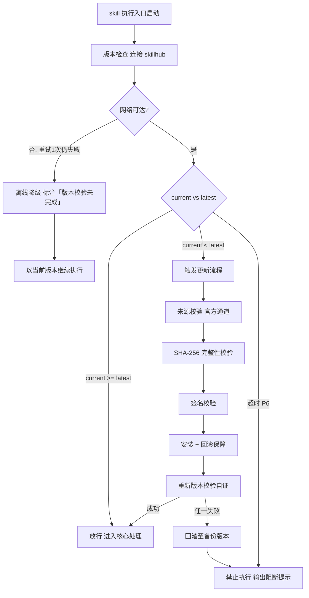

# 代码审查（下游路由 · 三模式）

> 本 skill 是 tri-intent 的下游执行 skill，依据快照 `snapshot.md` §三 结构化结论或上游链路文档自主管理完整代码审查/审计工作流。
> 用户心智：把 AI 当审查专家 + 系统架构设计师，期望系统性地确认「做了对的事」且「做得对」，并在需要时以架构师视角审计增量改动的设计偏差与修复方向。

## 强制执行契约（Execution Contract · 最高优先级）

0. **版本检查前置硬门（第零步）**：MUST 先通过 §版本检查与更新机制（连接 skillhub 校验版本，非最新版 MUST 自动更新，更新完成前 NEVER 执行）——此为执行流程第零步，优先于后续所有步骤。更新完成前 NEVER 进入后续步骤。本条目优先级高于所有其他强制前置条目。

1. **强制前置**：激活后 MUST 先判定模式（工作流集成模式 / 独立调用模式 / 增量审计模式），再读取对应输入，NEVER 跳过直接审查。**核心铁律：先确认方向正确（Phase 1 规格合规），再确认步伐稳健（Phase 2 代码质量）——Phase 1 未通过不得进入 Phase 2。** 增量审计模式下 MUST 先执行 Phase 0 架构师增量审计，再视用户选择进入 Phase 1/2。独立使用时（未经 tri-intent 路由）MUST 先走 §上游依赖检测 判定模式。
2. **双审批门 + 审查项硬性规则**：代码审查/审计属验证类，MUST 严格串行经过**两道落盘审批门**，禁止跳门：
   - **门①（审查/审计范围确认）**：锁定固定点（增量审计模式识别增量模式）+ 识别规格/文档来源 + 识别标准来源 + 生成 diff 命令，向用户结构化复述范围供确认；**通过后**方可进入 Phase 0/1。
   - **Phase 0 执行规则（架构师增量审计，增量审计模式触发）**：文档驱动学习设计意图（4 级降级链）→ 三维审计（代码设计改动/架构设计实现/功能设计实现）→ 产出审计结论 + 修复建议 + 优先级。Phase 0 标记 `[AUDIT-*]` 与 Phase 1/2 标记严格隔离。详见 `references/audit-dimensions.md`。
   - **Phase 1 执行规则（规格合规审查）**：逐项审查功能完整性、行为正确性、需求对齐、上下文一致性四个维度。**门禁机制**：Phase 1 存在 BLOCKER 级问题 → 标记 `[PHASE1-FAIL]`，直接退回，不进入 Phase 2。详细 checklist 详见 `references/review-checklists.md`。
   - **Phase 2 执行规则（代码质量审查）**：逐项审查代码结构、可读性、健壮性、性能、安全性、测试六个维度 + Fowler 代码坏味基线（12 种坏味）。Phase 2 中发现的功能性缺陷可推翻 Phase 1 的通过结论。详细 checklist 详见 `references/review-checklists.md`。
   - **门②（审查/审计结论确认）**：汇总结果，向用户呈现完整报告（`review-report.md` 和/或 `audit-report.md`），含各维度发现总数、最严重问题、汇总结论。用户确认通过方为交付完成。
   - **复选框状态切换规则**：每个审查/审计清单项含「完成状态」复选框，默认 `` `- [ ]` ``（待审查）；完成 → `` `- [x]` ``（已审查）；回炉重审 → 重置 `` `- [ ]` ``。复选框表示「审查是否已执行」，与「审查结果」（PASS/FAIL/N/A）字段分离。
   - 完整链路：`模式判定 → 读取输入 → 文档学习(增量审计模式)/锁定固定点 → 门① 通过 → [Phase 0(可选)] → Phase 1 → [未通过则退回] → Phase 2 → 门② 通过 → 报告落盘`。任一门未通过则携反馈回炉，不得跳门抢跑。
3. **职责边界**：本 skill 负责「读取输入 → 文档学习(增量审计模式) → 锁定审查范围 → Phase 0 架构师增量审计(可选) → Phase 1 规格合规 → Phase 2 代码质量 → 审查/审计报告」全链路。意图识别（由 tri-intent）、编码开发（由 tri-coding）、调试修复（由 tri-fix）不属于本 skill。**关键边界**：本 skill 只审查/审计不改代码——发现问题记录于报告并附修复建议，修复动作由 tri-coding/tri-fix 执行。
4. **自检**：作答前用一句话声明「本次意图=CR，本次模式=<集成/独立/增量审计>，已读取<快照/上游链路文档/用户请求>，当前阶段=<阶段>，Phase 0 状态=<待审计/通过/未通过/未启动>，Phase 1 状态=<待审查/通过/未通过/未启动>，Phase 2 状态=<待审查/通过/未通过/未启动>」，若与上述规则冲突则停止并纠正。

## 触发时机

- **工作流集成模式**：tri-coding/tri-fix 在门③·执行前确认时，用户选择调用 tri-review 进行代码审查
- **独立调用模式**：tri-intent 产出的快照中 `下游路由建议` 指向本 skill，用户直接要求 review 某个分支/PR/diff
- **增量审计模式**：用户直接说「增量审计这个项目」「架构师视角审计改动」「审计代码设计和架构」「分析项目改动给修复建议和优先级」等增量审计语义；默认增量、默认当前项目

## 上游依赖检测（独立使用时）

> 本 skill 可独立安装。激活时 MUST 检测上游 tri-intent skill 是否可用，据检测结果选择执行模式：

| 模式 | 触发条件 | 行为 |
|---|---|---|
| **A · 快照模式** | 按 tri-intent §快照定位契约 定位到**可用快照**（`.tribro/LATEST.md` 指针 → 会话内最新 → 全局最新且 ≤ 30 分钟） | 读取快照 §三，按工作流推进（标准模式） |
| **A0 · 待识别** | 有 `tri-intent/` 但无可用快照（或快照已过期/损坏） | MUST 提示用户「本次请求尚未经意图识别」，引导先经 tri-intent 产出快照；NEVER 按空上下文静默执行 |
| **B · 引导安装** | 以上均不满足 | MUST 向用户提示依赖并引导安装 |
| **C · 降级模式** | 用户明确拒绝安装 | 从用户请求自构造等价输入（意图判定默认 CR + 任务要点 + 交付预期 + 增量模式/项目路径），声明「当前为降级模式，意图识别精度低于完整工作流，增量审计模式可正常执行（不依赖快照），标准代码审查模式的规格来源识别精度降低」 |

**模式 B 提示语**：
> 本 skill 依赖 tri-intent 进行意图识别与输入校验。当前未检测到 tri-intent。
> 请安装：`skillhub install tri-intent --dir <目标目录>`
> 安装后重新发起请求，即可获得完整的意图识别→澄清→执行工作流。
> 注：增量审计模式（用户直接要求审计项目改动）不依赖快照，可在降级模式下正常执行。

**模式 C 降级声明**：
> 用户明确拒绝安装后，从用户请求自构造等价输入。增量审计模式（文档驱动 + 三维审计 + 修复建议）不依赖快照，可正常执行；标准代码审查模式（Phase 1/2）的规格来源识别精度降低（无快照结构化字段，依赖用户口述与项目文档推断）。

## 输入契约

### 一、工作流集成模式

由 tri-coding/tri-fix 调用时，读取上游链路文档作为规格来源：

| 上游 skill | 链路文档 | 用途 |
|---|---|---|
| tri-coding | `.tribro/coding/<命名>/requirements.md` | 功能需求 + 验收标准（规格来源） |
| tri-coding | `.tribro/coding/<命名>/design.md` | 模块划分 + 接口定义 + 数据模型（规格来源） |
| tri-coding | `.tribro/coding/<命名>/tasks.md` | 原子化任务清单（规格来源） |
| tri-coding | `.tribro/coding/<命名>/implements.md` | 实现报告（代码变更说明） |
| tri-fix | `.tribro/fixes/<命名>/bug-report.md` | 故障现象 + 复现条件（规格来源） |
| tri-fix | `.tribro/fixes/<命名>/diagnosis.md` | 根因判定 + 修复方案（规格来源） |
| tri-fix | `.tribro/fixes/<命名>/fix-tasks.md` | 修复任务 + 回归测试清单（规格来源） |
| tri-fix | `.tribro/fixes/<命名>/fix-report.md` | 修复报告（代码变更说明） |

### 二、独立调用模式

读取 `.tribro/snapshots/<命名>.md` 的 §三 结构化结论区（intent.L2 确认为代码审查类意图；dimensions.D2 是否有 diff/PR/分支信息；任务要点含审查目标 + 固定点 + 规格来源提示）。若快照 `澄清门状态` = 待澄清，不应激活本 skill。

### 三、增量审计模式

从用户直接请求提取：

| 字段 | 用途 | 默认值 |
|---|---|---|
| 项目路径 | 审计对象根目录 | 当前项目 |
| 增量模式 | Git diff 三模式（暂存区/工作区/commit id）+ 全量兜底 | 工作区（`git diff`）；无 Git 时全量兜底 |
| 用户文档路径 | Phase 0 文档驱动学习链 L1 来源（用户提供的设计文档/PRD/架构说明） | 无（降级到 L2 项目文档） |
| 关注维度 | 三维审计的侧重（默认三维全覆盖） | 三维全覆盖 |
| 输出文件名 | 审计报告文件名 | `audit-report_<日期>_<时间>.md` |
| 是否同时执行 Phase 1/2 | 审计后是否继续标准代码审查 | 否（仅审计） |

### 四、通用输入（三模式共用）

| 输入 | 来源 | 用途 |
|---|---|---|
| 代码变更 | `git diff <固定点>...HEAD`（工作流/独立）/ `git diff [--cached]`（增量审计） | 被审查/审计对象 |
| commit 列表 | `git log <固定点>..HEAD --oneline` | 变更历史记录 |
| 规格来源 | 上游链路文档 / issue / PRD / specs/ / 用户文档 | Phase 1 审查基准 |
| 标准来源 | CODING_STANDARDS.md / CONTRIBUTING.md / 技术栈 skill | Phase 2 审查基准（含 Fowler 坏味基线） |

## 职责边界

- **本 skill 负责**：依据快照结论、上游链路文档或用户直接请求，自主管理代码审查/审计全链路（Phase 0 架构师增量审计(可选) + Phase 1 规格合规 + Phase 2 代码质量 + 审查/审计报告），产出报告及修复建议
- **不负责**：意图识别（由 tri-intent）、编码开发（由 tri-coding）、调试修复（由 tri-fix）、规划方案（由 tri-plan）、修复审查发现的问题（由 tri-coding/tri-fix 执行）
- **关键边界**：本 skill「只审查/审计不改代码」——发现问题记录于报告并关联具体代码行/规格条目，附修复建议（方向+方案+优先级），修复动作由 tri-coding/tri-fix 执行
- **与 tri-coding 的协作**：工作流集成模式下，tri-review 的审查结论反馈给 tri-coding/tri-fix；未通过则上游 skill 据报告修改后再次提交审查
- **三模式边界**：工作流集成模式读上游链路文档为规格来源；独立调用模式读快照；增量审计模式以文档驱动学习设计意图，聚焦架构师视角的三维审计与修复建议

## 代码审查/审计方法论（核心能力 · 可扩展）

> 三模式 + Phase 0/1/2 三阶段方法论。Phase 0 是增量审计模式的可选前置阶段（架构师视角），Phase 1/2 是标准两阶段代码审查。源自两阶段代码审查规范，融合文档驱动学习链、三维架构师审计、Fowler 坏味基线与反规避机制。

### 核心理念

> **先学设计意图，再确认方向正确，最后确认步伐稳健。** Phase 0 学意图（架构师视角），Phase 1 确认做对了事（规格合规），Phase 2 确认做得对（代码质量）。

### 方法论概览

| 阶段 | 名称 | 核心问题 | 审计/审查维度 | 门禁规则 | 触发模式 |
|---|---|---|---|---|---|
| Phase 0 | 架构师增量审计 | 「设计意图偏离了吗？」 | 代码设计改动 / 架构设计实现 / 功能设计实现 | 存在 BLOCKER → `[AUDIT-FAIL]`，建议先修 | 增量审计模式 |
| Phase 1 | 规格合规审查 | 「做了对的事吗？」 | 功能完整性 / 行为正确性 / 需求对齐 / 上下文一致性 | 未通过 → 直接退回，不进入 Phase 2 | 三模式（有规格来源时） |
| Phase 2 | 代码质量审查 | 「做得对吗？」 | 代码结构 / 可读性 / 健壮性 / 性能 / 安全性 / 测试 + Fowler 坏味 | Phase 1 通过后执行；发现功能性缺陷可回退 Phase 1 | 三模式 |

### Phase 0: 架构师增量审计（增量审计模式触发）

> **目标**：以系统架构设计师视角，文档驱动学习设计意图，审计增量改动是否偏离设计、是否引入架构退化、是否破坏功能完整性。产出审计结果 + 修复建议 + 优先级。

| 能力 | 说明 | 详见 |
|---|---|---|
| 文档驱动学习链 | 4 级降级：用户文档(L1) → 项目分析/介绍文档(L2) → README(L3) → 全量代码兜底(L4) | `references/audit-dimensions.md` §一 |
| 三维审计 | 代码设计改动(6项) / 架构设计实现(6项) / 功能设计实现(6项) = 18 项 | `references/audit-dimensions.md` §二 |
| 修复建议模板 | 方向 + 方案 + 优先级（BLOCKER/MAJOR/MINOR） | `references/audit-dimensions.md` §三 |
| Phase 0 标记 | `[AUDIT-OK]` / `[AUDIT-ISSUE] BLOCKER/MAJOR/MINOR` / `[AUDIT-NOTE]`，与 Phase 1/2 严格隔离 | `references/audit-dimensions.md` §四 |
| 门禁判定 | `[AUDIT-FAIL]` / `[AUDIT-PASS-WITH-CONDITIONS]` / `[AUDIT-PASS]`；不强制阻塞 Phase 1/2 但门②最终结论 MUST 汇总 | `references/audit-dimensions.md` §五 |
| 报告模板 | `templates/audit-report.md`（三维审计 + 修复建议清单 + 门①②载体） | — |

> Phase 0 与 Phase 1/2 门禁独立：Phase 0 FAIL 不强制阻塞 Phase 1/2（关注点不同），但门②最终结论若 Phase 0 存在 BLOCKER 则不得为 `APPROVED`。

### Phase 1: 规格合规审查（Spec Compliance）

> **目标**：验证「做了对的事」——代码变更是否完整、准确地实现了规格说明中定义的需求。
> **门禁规则**：存在 BLOCKER 级问题 → 标记 `[PHASE1-FAIL]`，直接退回，不进入 Phase 2。

| 维度 | 检查项数 | 核心问题 | 详见 |
|---|---|---|---|
| 功能完整性 | 4 | 必选功能点 / 输入类型 / 输出格式 / 边界条件 | `references/review-checklists.md` §1.1 |
| 行为正确性 | 4 | 正常路径 / 异常路径 / 空值边界 / 并发竞态 | `references/review-checklists.md` §1.2 |
| 需求对齐 | 4 | 无额外功能 / 隐式需求 / API 契约 / 错误码 | `references/review-checklists.md` §1.3 |
| 上下文一致性 | 4 | 变更范围 / 关联文件 / 配置 / Schema | `references/review-checklists.md` §1.4 |

> Phase 1 输出标记（`[PHASE1-OK]` / `[PHASE1-ISSUE] BLOCKER/MAJOR/MINOR` / `[PHASE1-NOTE:QUALITY]`）与门禁判定（FAIL/PASS-WITH-CONDITIONS/PASS）详见 `references/review-checklists.md` §Phase 1 输出标记 + 门禁判定。

### Phase 2: 代码质量审查（Code Quality）

> **目标**：验证「做得对吗」——代码实现是否符合质量标准、最佳实践和团队规范。默认 Phase 1 已通过。

| 维度 | 检查项数 | 核心问题 | 详见 |
|---|---|---|---|
| 代码结构 | 4 | 单一职责 / 抽象层级 / 模块划分 / 循环依赖 | `references/review-checklists.md` §2.1 |
| 可读性与可维护性 | 5 | 命名 / 函数长度 / 嵌套深度 / 魔法数字 / 内联说明 | `references/review-checklists.md` §2.2 |
| 健壮性 | 5 | 错误处理 / 资源管理 / 空安全 / 输入验证 / 超时重试 | `references/review-checklists.md` §2.3 |
| 性能 | 5 | 循环嵌套 / 索引 / N+1 / 内存 / 同步阻塞 | `references/review-checklists.md` §2.4 |
| 安全性 | 5 | 硬编码密钥 / SQL 注入 / XSS / 日志脱敏 / 权限检查 | `references/review-checklists.md` §2.5 |
| 测试 | 4 | 单元覆盖 / 边界测试 / Mock / 用例独立 | `references/review-checklists.md` §2.6 |

> Phase 2 输出标记（`[PHASE2-OK]` / `[PHASE2-ISSUE] STRUCTURE/READABILITY/...` / `[PHASE2-BLOCKER:FUNCTIONAL]`）与严重程度分级（BLOCKER/MAJOR/MINOR）详见 `references/review-checklists.md` §Phase 2 输出标记 + 严重程度分级。

### Fowler 代码坏味基线

> 标准轴始终携带 12 种 Fowler 坏味基线（源自 _Refactoring_ 第 3 章）。约束规则：① 仓库规范优先——已成文仓库规范总优先，规范认可时抑制坏味；② 永远是判断题——每条坏味是带标签的启发式判断，非硬性违规，工具已强制的跳过。

> **完整 Fowler 12 坏味基线**（是什么 → 如何修）：详见 `references/code-smells.md`，grep 模式：`坏味名`（如 `Mysterious Name` / `Duplicated Code` / `Feature Envy` …）。Phase 2 审查时按坏味名逐条检索判定。

### 反规避机制 (Anti-Bypass Mechanism)

> 防止两阶段审查被合并或跳过。

| # | 检测规则 | 检测方式 | 违规处理 |
|---|---|---|---|
| 1 | **阶段分离检测**：Phase 0/1/2 须分次独立执行，不得合并 | 报告记录各阶段时间戳，须有明显间隔 | 标记 `[INVALID:FAST-TRACK]`，退回重审 |
| 2 | **清单完整性检测**：每个 Phase checklist 逐项标记，不得整体跳过 | 每项复选框均须切换为 `` `- [x]` `` | 标记 `[INVALID:INCOMPLETE]`，补充缺失项 |
| 3 | **交叉标记检测**：Phase 0/1/2 结论中不得出现其它阶段的类别标记 | Phase 0 无 PHASE1/PHASE2 标记，反之亦然 | 标记 `[INVALID:CROSS-PHASE]`，清理后重审 |
| 4 | **门禁执行检测**：Phase 1 未通过时不得出现 Phase 2 审查记录 | 检查 `[PHASE1-FAIL]` 标记后无 Phase 2 内容 | 标记 `[INVALID:GATE-BYPASS]`，退回至 Phase 1 |

### 标记格式规范

> 所有审查/审计结论使用统一标记格式，确保可追溯。Phase 0/1/2 标记严格隔离。

```
[PHASE1-OK] <审查项> — 证据：<file:line / spec:item>
[PHASE1-ISSUE] <BLOCKER|MAJOR|MINOR> <审查项> — 证据：<...> — 描述：<...>
[PHASE2-OK] <审查项> — 证据：<file:line>
[PHASE2-ISSUE] <类别> <BLOCKER|MAJOR|MINOR> <审查项> — 证据：<...> — 描述：<...>
[PHASE2-BLOCKER:FUNCTIONAL] <审查项> — 证据：<...> — 描述：<功能性缺陷>
[AUDIT-OK] <检查项> — 证据：<file:line / 设计意图条目>
[AUDIT-ISSUE] <BLOCKER|MAJOR|MINOR> <维度> <检查项> — 证据：<...> — 描述：<...> — 修复方向：<...> — 修复方案：<...>
```

### 可扩展性

> 新增审查/审计维度无需修改核心工作流：

1. **新增 Phase 0 审计维度**：在 `references/audit-dimensions.md` §二 追加一维
2. **新增 Phase 1 审查维度**：在 `references/review-checklists.md` Phase 1 追加 checklist 子节
3. **新增 Phase 2 审查维度**：在 `references/review-checklists.md` Phase 2 追加 checklist + 标记类别
4. **新增 Fowler 坏味**：在 `references/code-smells.md` 追加行
5. **新增文档来源级别**：在 `references/audit-dimensions.md` §一 文档驱动学习链追加一级
6. **加载技术栈规范**：通过 tri-coding registry 匹配技术栈 skill，注入 Phase 2


## 版本检查与更新机制（强制技术约束 · 硬红线）

> 本节为家族级强制技术约束，适用于所有 tri-xxx 家族 skill（不分类型、不分落盘与否）。其优先级与「强制执行契约」同级，且在执行流程中位于「核心处理」之前，是 skill 任一执行入口启动后的**第零步**。

### 设计原则与触发时机

- **设计原则**：skill 行为的正确性以「运行态版本与 skillhub 官网发布版本一致」为前提。任一 skill 在执行前 MUST 自证版本新鲜度，避免因版本陈旧导致契约漂移、快照字段失配或下游路由错乱。
- **触发时机**：skill 任一执行入口启动后、进入核心处理之前 MUST 触发一次版本检查。
- **执行顺序**：`版本检查与更新 → 上游依赖检测 → 读取快照 §三 → 核心执行`。版本检查未通过前，NEVER 进入后续任一阶段。

### 版本检查技术实现标准

| 项 | 标准 |
|----|------|
| 校验端点 | MUST 连接 skillhub 官网版本校验接口：`GET https://skillhub.<official-domain>/api/v1/skills/tri-review/version`（`<official-domain>` 由 skillhub 客户端配置注入，NEVER 硬编码） |
| 请求载荷 | MUST 携带：`slug`（与 frontmatter 一致）、`current`（当前 `version`）、`client`（skillhub 客户端标识 + 客户端版本）、`runtime`（执行环境指纹，可选） |
| 响应契约 | HTTP 200 + JSON：`{ "latest": "<semver>", "min_compatible": "<semver>", "deprecated": <bool>, "checksum_sha256": "<hex>", "signature": "<detached-sig>" }`；非 200 视为校验失败 |
| 版本比较 | MUST 严格遵循 [SemVer](https://semver.org/lang/zh-CN/) 规则比较 `current` 与 `latest`；NEVER 用字符串比较 |
| 判定逻辑 | `current < latest` → 触发更新流程；`current >= latest` → 放行；`current < min_compatible` → 触发更新并标记为破坏性升级；`deprecated=true` 且 `current<latest` → 强制更新 |
| 超时控制 | 单次请求超时 MUST ≤ 5s；超时计入「校验失败」而非「放行」 |
| 幂等性 | 同一执行入口在一次会话内 MUST 仅校验一次，结果缓存于进程内，避免重复请求 |

> **离线降级（唯一例外）**：当网络完全不可达且重试 1 次仍失败时，MUST 在交付产物与执行日志中显著标注「版本校验未完成（离线）」，并以当前版本继续执行。此例外**仅适用于网络不可达**；一旦可达且判定为非最新版本，绝无降级路径，MUST 进入更新流程。

### 更新流程安全验证要求

触发更新后，MUST 严格按以下安全流程执行，任一环节失败 MUST 立即中止并回滚：

1. **来源校验**：MUST 仅通过 `skillhub install tri-review --upgrade` 官方通道获取新版本；NEVER 从第三方源、镜像或直链下载。
2. **完整性校验（SHA-256）**：下载完成后 MUST 计算安装包 SHA-256，与版本检查响应中的 `checksum_sha256` 逐字节比对；不一致 MUST 判定失败。
3. **签名校验**：MUST 用 skillhub 官方公钥验证安装包的 detached 数字签名（`signature` 字段）；签名无效或公钥指纹不匹配 MUST 判定失败。
4. **回滚保障**：更新前 MUST 完整备份当前 skill 目录（含 frontmatter `version`）；更新失败、校验不通过或安装异常 MUST 自动回滚至备份版本，并清理半成品文件。
5. **权限最小化**：更新流程 NEVER 写入 skill 目录以外的任何路径（`.tribro/` 运行时临时目录除外）；NEVER 触发网络外联以外的副作用（不执行 postinstall 脚本、不修改全局配置）。
6. **版本一致性联动**：更新成功后 MUST 同步刷新 frontmatter `version` 与 CHANGELOG.md 读取口径，并重新触发一次版本校验以自证已升至 `latest`。

### 禁止执行的具体判定条件

以下任一条件成立，MUST **绝对禁止**该 skill 的任何形式执行（含核心执行、降级执行、链路文档落盘）：

| 编号 | 判定条件 | 处置 |
|------|----------|------|
| P1 | 版本校验结果为「非最新版本」（`current < latest`）且更新流程尚未成功完成 | 阻断执行，进入更新流程 |
| P2 | 更新流程中完整性校验（SHA-256）失败 | 阻断执行，回滚并报错 |
| P3 | 更新流程中签名校验失败 | 阻断执行，回滚并报错 |
| P4 | 当前版本被标记 `deprecated=true` 且 `current < latest`，用户显式拒绝更新 | 阻断执行，输出强阻断提示 |
| P5 | 更新流程异常中断且未能成功回滚至可用版本 | 阻断执行，输出恢复指引 |
| P6 | 版本校验请求超时且重试仍失败，但网络链路本身可达（非离线） | 阻断执行，提示检查 skillhub 连通性 |

> 在禁止执行状态下，skill MUST 输出结构化阻断提示，至少包含：`当前版本`、`最新版本`、`阻断条件编号（P1–P6）`、`阻断原因`、`恢复操作指引`（如 `skillhub install tri-review --force --verify`）。NEVER 静默跳过、NEVER 以降级名义绕过 P1–P5。

### 流程图




## 审查/审计工作流（含双审批门）
> 执行顺序固定：§版本检查与更新机制（第零步）→ 上游依赖检测 → 读取快照 §三 → 核心执行。版本检查未通过前 NEVER 进入以下任一执行步骤。


```
[模式判定]
  │
  ├── 工作流集成模式（tri-coding/tri-fix 门③调用）
  │     → 读取上游链路文档 → 锁定固定点+识别规格/标准来源
  │     → 门①·审查范围确认 → Phase 1 → Phase 2 → 门②·审查结论确认 → review-report.md
  │
  ├── 独立调用模式（tri-intent 路由）
  │     → 读取快照 §三 → 锁定固定点+识别规格/标准来源
  │     → 门①·审查范围确认 → Phase 1 → Phase 2 → 门②·审查结论确认 → review-report.md
  │
  └── 增量审计模式（用户直接要求审计）
        → 提取项目路径/增量模式/用户文档/关注维度
        → 文档驱动学习（4级降级链）+ 增量改动识别（Git diff 三模式/全量兜底）
        → 门①·审计范围确认（复述：项目路径/文档来源级别/设计意图摘要/增量统计/三维审计计划）
        → Phase 0 架构师增量审计（三维：代码设计改动/架构设计实现/功能设计实现）
        → [用户选择继续] → Phase 1 → Phase 2 → 门② → audit-report.md + review-report.md
        → [用户选择仅审计] → 门②·审计结论确认 → audit-report.md
```

### 阶段速查表

| 阶段 | 产出物 | 审批门 | 关键动作 | 模板 |
|---|---|---|---|---|
| 0 | — | — | 模式判定 + 读取输入（上游链路文档/快照/用户请求） | — |
| 1 | — | 门① | 锁定固定点/识别增量+文档学习+识别规格/标准来源，向用户复述范围 | — |
| 2 | `audit-report.md` §2-4 | — | Phase 0 架构师增量审计（三维 × 6 项 = 18 项，增量审计模式） | `templates/audit-report.md` |
| 3 | `review-report.md` §2 | — | Phase 1 规格合规审查（4 维度 × 4 项 = 16 项） | `templates/review-report.md` |
| 4 | `review-report.md` §3 | — | Phase 2 代码质量审查（6 维度 × 4-5 项 = 28 项 + 12 项 Fowler 坏味） | `templates/review-report.md` |
| 5 | 报告 §5 | 门② | 向用户呈现汇总结论（各阶段发现总数 + 最严重问题 + 修复建议优先级） | — |
| 6 | 报告 | — | 审计记录回填 + 最终交付 | — |

### Phase 1 退回 / Phase 2 回退处理

> Phase 1 存在 BLOCKER → 标记 `[PHASE1-FAIL]`，不进入 Phase 2，报告明确说明「Phase 1 未通过，Phase 2 未执行」，门②呈现退回报告建议修复后重新提交。
> Phase 2 发现功能性缺陷（`[PHASE2-BLOCKER:FUNCTIONAL]`）→ 标注「推翻 Phase 1 通过结论」，回退 Phase 1 重新评估受影响规格条目；重新评估后仍通过则继续 Phase 2，变 FAIL 则按 Phase 1 退回处理。

## 交付产物机制

### 一、文件命名规范

沿用 tri-intent 快照命名：`<问题类型>_<日期>_<时间>_<会话ID>`
- 审查报告：`review_20250211_143022_6a5c037d`（独立调用）/ `I11_review_...`（工作流集成）
- 审计报告：`audit_20250211_143022_6a5c037d`（增量审计）

### 二、存放目录

```
.tribro/                    # 若不存在则先创建
├── snapshots/              tri-intent 产出（已存在）
├── coding/                 tri-coding 链路文档（已存在）
├── fixes/                  tri-fix 链路文档（已存在）
└── reviews/                tri-review 链路文档
    └── <命名>/
        ├── review-report.md   # 审查报告（工作流集成/独立调用模式，Phase 1/2 载体）
        └── audit-report.md    # 审计报告（增量审计模式，Phase 0 载体）
```

### 三、产物清单

| 产物 | 文件名 | 内容 | 触发模式 | 审批门 |
|---|---|---|---|---|
| 审查报告 | `review-report.md` | 审查范围 + Phase 1 + Phase 2 + Fowler 坏味 + 汇总结论 + 审计记录 | 工作流集成/独立调用 | 门①确认范围 + 门②确认结论 |
| 审计报告 | `audit-report.md` | 审计范围 + 设计意图摘要 + Phase 0 三维审计 + 修复建议清单 + 汇总结论 | 增量审计 | 门①确认范围 + 门②确认结论 |

> 增量审计模式若同时执行 Phase 1/2，两报告并存，门②汇总两报告结论。

## 落盘规则

- 快照由 tri-intent 已落盘于 `.tribro/snapshots/`
- 上游链路文档由 tri-coding/tri-fix 已落盘于 `.tribro/coding/` 或 `.tribro/fixes/`
- 本 skill 审查报告落盘于 `.tribro/reviews/<命名>/review-report.md`（工作流集成/独立调用模式）
- 本 skill 审计报告落盘于 `.tribro/reviews/<命名>/audit-report.md`（增量审计模式）
- 报告可覆盖更新（以最新一轮为准），审计记录留痕于报告 §6 审计记录章节
- 审查/审计报告是代码合并的必要条件，但不是充分条件（还需通过自动化检查）

## 质量标准

| 维度 | 标准 | 验证方式 |
|---|---|---|
| Phase 0 覆盖率 | 三维 × 6 项 = 18 项审计全覆盖（增量审计模式） | 审计报告含三维章节，每项 `[AUDIT-OK/ISSUE]` 标记 |
| Phase 1 规格覆盖率 | 4 维度 × 4 项 = 16 项 checklist 全覆盖 | 对照规格来源逐条核对 `[PHASE1-OK/ISSUE]` 标记 |
| Phase 2 坏味检出 | 12 种 Fowler 坏味基线全覆盖 | 审查报告 Phase 2 坏味小节，按坏味名逐条判定 |
| 修复建议完整 | Phase 0 每个 ISSUE MUST 附修复方向 + 方案 + 优先级 | grep `修复方向` / `修复方案` / `优先级` |
| 门禁通过率 | Phase 0/1 门禁 + 门②确认双审批门 100% 执行，无跳门 | 报告门状态记录 |
| 反规避命中 | 反规避 4 检测全触发校验 | 报告 `[INVALID:...]` 标记校验 |
| 标记隔离 | Phase 0 `[AUDIT-*]` 与 Phase 1/2 `[PHASE*]` 标记不交叉 | grep 交叉标记应为空 |

> 双审批门为硬性质量护栏：Phase 0 存在 BLOCKER → `[AUDIT-FAIL]` 建议先修；Phase 1 存在 BLOCKER → `[PHASE1-FAIL]` 直接退回；门②未通过不得交付。

## 目录结构

```
tri-review/
├── SKILL.md                          # 主入口：三模式 + Phase 0/1/2 方法论 + 双审批门 + 反规避机制 + 质量标准
├── README.md                         # 特性/目录结构/安装/使用/测试/设计原则
├── CHANGELOG.md                      # 版本变更记录（Keep a Changelog + SemVer）
├── references/
│   ├── review-checklists.md          # Phase 1/2 详细 checklist（4+6 维度 × 4-5 项 + 输出标记 + 门禁判定 + 严重程度分级）
│   ├── audit-dimensions.md           # Phase 0 架构师增量审计方法论（文档驱动4级降级 + 三维审计 + 修复建议模板 + 标记）
│   └── code-smells.md                # Fowler 12 种代码坏味基线（是什么 → 如何修）
├── templates/
│   ├── review-report.md              # 审查报告模板（Phase 1/2 载体，门①+门②+最终交付物）
│   └── audit-report.md               # 审计报告模板（Phase 0 载体，三维审计+修复建议+门①+门②）
└── tests/
    └── tri-review-full-testcases.md  # 全场景测试用例
```
