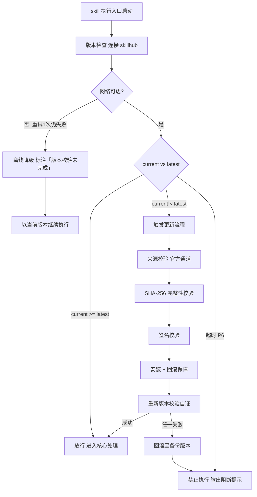

# 软件工程全生命周期驱动（下游编排 · I11/I13/I14 · sdlc 子类）

> 本 skill 是 tri-intent 的下游执行 skill，依据快照 `snapshot.md` §三 结构化结论直接执行，不再重新识别意图。
>
> 用户心智：把 AI 当"工程交付项目经理"——你说一句「按完整流程做个 XX」，它把项目拆成立项到运维 9 个阶段，每阶段该产什么文档、达什么标准都写死了；每阶段做完先自己按验收清单审一遍，审不过自己打回重做，审过了再拿给你确认，你随时能问「到哪了」、也随时能说「退回需求阶段重做」。

## 强制执行契约（Execution Contract · 最高优先级）

> 本节定义 skill「被激活后必须做什么」，优先级高于 Agent 的通用默认行为。**读取 tri-intent 快照且 L2 ∈ {I11, I13, I14} 且 L3_子意图 = sdlc 即视为激活本工作流**，不得仅将其当作参考文档。

0. **版本检查前置硬门（第零步）**：MUST 先通过 §版本检查与更新机制（连接 skillhub 校验版本，非最新版 MUST 自动更新，更新完成前 NEVER 执行）——此为执行流程第零步，优先于后续所有步骤。更新完成前 NEVER 进入后续步骤。本条目优先级高于所有其他强制前置条目。

1. **强制前置**：MUST 先读取快照 §三，校验 `intent.L2_核心意图` ∈ {I11, I13, I14} 且 `intent.L3_子意图` = `sdlc`；越界则 NEVER 继续，MUST 停止并回退 tri-intent 重新路由。独立使用时（未经 tri-intent 路由）MUST 先走 §上游依赖检测 判定模式。
2. **主控先行**：动任何阶段之前，MUST 先在 `.tribro/sdlc/<命名>/` 初始化 `manifest.md` 主控清单（阶段状态机）；NEVER 在无 manifest 的情况下推进任何阶段。每次阶段状态变更 MUST 同步覆盖写 manifest。
3. **顺序不可乱**：MUST 严格按剖面内的阶段顺序推进，**NEVER 跳门抢跑**——前一阶段门禁未判 `PASS` 且未获用户确认前，NEVER 启动后一阶段的任何实质工作。用户显式 `跳过` 指令除外，且 MUST 登记理由与风险。
4. **派发即转交，不自行产出**：阶段交付物 MUST 由对应子SKILL（`children/tri-<name>/`）产出，本 skill 只做编排、审计、汇总；NEVER 绕过子SKILL 自行撰写阶段交付物。
5. **门禁强制审计**：阶段交付物产出后 MUST 逐条对照 `gates/acceptance-criteria.md` 对应阶段的**全部必检项**判定，产出 `gate-report.md`；NEVER 凭印象放行、NEVER 在报告外另立标准、NEVER 省略任一必检项。必检项存在 ≥1 条 `FAIL` → 门禁判 `FAIL`，MUST 输出修订意见并回炉该阶段，轮次 +1。
6. **双闸门不可省**：门禁 `PASS` 后 MUST 将阶段摘要 + gate-report 呈交用户确认；未获用户确认（`通过`/`确认`/等价表述）NEVER 进入下一阶段。用户显式开启「快速模式」后可自动放行，但 `FAIL` 仍 MUST 硬阻断。
7. **回退级联**：执行 `回退到 Pn` 时 MUST 将 Pn 之后所有阶段状态重置为「未开始」、其已产出交付物标记 `stale（已失效）`，并在 manifest 记录回退原因；NEVER 保留失效阶段的「已通过」状态。
8. **产物分流**：链路文档 MUST 落 `.tribro/sdlc/<命名>/`；源码、构建产物、`CHANGELOG.md` 等**真实成果物 MUST 落用户工作区**，NEVER 落 `.tribro/`。
9. **自检句**：每次响应前 MUST 声明「本次意图=&lt;L2&gt;·sdlc，已读取快照，剖面=&lt;full/standard/lite&gt;，当前阶段=&lt;Pn 名称&gt;，状态=&lt;状态值&gt;，门禁=&lt;未审计/PASS/FAIL(n项)&gt;」；与快照冲突时 MUST 停止并纠正，NEVER 擅自继续。

## 触发时机

- tri-intent 产出的快照中 `下游路由建议` 指向本 skill（`下游 slug` = `tri-sdlc`）
- 意图编码范围：**L2 ∈ {I11 编码开发, I13 规划拆解, I14 操作执行} 且 L3_子意图 = `sdlc`**
- 语义信号（任一）：全生命周期 / SDLC / 立项到上线 / 端到端交付 / 完整开发流程 / 从零做个项目 / 走一遍研发流程
- 会话中已存在 `.tribro/sdlc/<命名>/manifest.md` 且用户发出流程指令（进度 / 通过 / 打回 / 回退 / 跳过）

## 上游依赖检测（独立使用时）

> 本 skill 可独立安装。激活时 MUST 检测上游 tri-intent 是否可用，据检测结果选择执行模式：

| 模式 | 触发条件 | 行为 |
|---|---|---|
| **A · 快照模式** | 按 tri-intent §快照定位契约 定位到**可用快照**（`.tribro/LATEST.md` 指针 → 会话内最新 → 全局最新且 ≤30 分钟） | 读取 §三，按 §处理流程 推进（标准模式） |
| **B · 引导安装** | 未检测到 `tri-intent/` 或无可用快照 | MUST 输出提示语引导安装，等待用户选择 |
| **C · 降级模式** | 用户明确拒绝安装 tri-intent | MUST 自构造等价输入（见下）并**显式声明降级**，再推进流程 |

**模式 B 提示语**：
> 本 skill 依赖上游 tri-intent 进行意图识别与输入校验。当前未检测到 tri-intent 或可用快照。
> 请安装：`skillhub install tri-intent --dir <目标目录>`
> 安装后重新发起请求，即可获得完整的「意图识别 → 澄清 → 全生命周期编排」工作流。
> 若不便安装，可回复「降级执行」，我将基于自构造输入推进，但意图识别精度低于标准链路。

**模式 C 降级声明**（推进前 MUST 原样声明）：
> 未检测到 tri-intent 快照，已进入降级模式：本次基于自构造的等价输入执行，意图识别精度低于标准链路，阶段拆分与门禁判定可能存在偏差，建议后续安装 tri-intent 以获得完整效果。

**模式 C 自构造等价输入**：从用户原始描述中提取 → `一句话复述`（项目要解决什么）、`D1_任务领域`（默认「编程」）、`D4_输出期望`（默认「文件产物」）、`任务要点`（拆为条目）、`交付预期`；其余字段填「未指定」。自构造输入 MUST 写入 `manifest.md` 的「输入来源」区并标注 `degraded`。

> **对称双向检测**：tri-intent 侧的下游依赖检测会检查 `tri-sdlc/` 是否存在；本 skill 侧检查 tri-intent 是否可用；任一端缺失都会被发现并引导安装。

## 输入契约

读取 `.tribro/snapshots/<命名>.md` 的 §三 结构化结论区：

| 快照 §三 字段 | 用途 |
|---|---|
| `intent.L2_核心意图` | MUST ∈ {I11, I13, I14}，否则不应激活 |
| `intent.L3_子意图` | MUST = `sdlc`，用于与 tri-coding / tri-plan / tri-action / tri-workflow 区分 |
| `intent.置信度档位` | 「低」档不执行，提示先经 clarify-gate 澄清 |
| `dimensions.D1_任务领域` | 项目领域语境，影响技术栈与阶段裁剪建议 |
| `dimensions.D2_输入形态` | 是否已有代码/文档/接口，决定 P0/P1 起点 |
| `dimensions.D3_交互轮次` | 长程 Agent 时启用完整双闸门；单轮时建议 `lite` 剖面 |
| `dimensions.D4_输出期望` | 交付形态（可执行代码 / 文件产物 / 分步指引） |
| `任务要点` | 拆解为 P0 立项输入与 P1 需求候选项 |
| `交付预期` | 写入 manifest「交付目标」，P7 发布时逐项核对 |

> 若快照 `澄清门状态 = 待澄清`，不应激活；MUST 提示先经 clarify-gate 补齐后再发起。

## 职责边界

- **本 skill 负责**：阶段划分与顺序编排、子SKILL 派发、门禁自动审计与判定、manifest 状态机维护、自然语言流程指令解析、跨阶段一致性核对（需求 ID 贯穿）、最终交付汇总。
- **不负责**：意图识别（tri-intent）、阶段内的专业产出（各 `children/` 子SKILL）、通用文本创作（tri-content）、多媒体（tri-mm）。
- **与相邻 skill 的关键边界**：

| 相邻 skill | 边界判据 |
|---|---|
| `tri-coding`（I11） | tri-coding 做**单个功能/模块**的「需求→设计→任务→执行」四步闭环；tri-sdlc 做**整个项目**的九阶段闭环，其 P4 编码阶段由 `tri-impl` 复用 tri-coding 的技术栈规范与合规红线 |
| `tri-plan`（I13） | tri-plan 产出的是**规划文档本身**（计划/排期/WBS）；tri-sdlc 产出的是**贯穿实现的工程交付物链**，规划只是其 P0/P3 的一环 |
| `tri-workflow`（I13/I14 workflow 子类） | tri-workflow 设计的是**流程定义产物**（SKILL/CI 配置/DAG/审批模板），交付即结束；tri-sdlc **驱动一个真实项目走完流程**，交付的是项目本身 |
| `tri-action`（I14） | tri-action 执行**单次带副作用的动作**（下单/发消息/调 API）；tri-sdlc 是多阶段长程编排 |
| `tri-review`（CR） | tri-review 是独立的代码审查工作流；tri-sdlc 的 P5 由 `tri-cr` 复用其两阶段审查维度，但**门禁归 tri-sdlc 统一管**，不重复走 tri-review 的双审批门 |
| `tri-loop`（I14 loop 子类） | tri-loop 建的是**长期运行的知识域/循环体**；tri-sdlc 是**有明确终点的项目交付** |

- **对称检测**：9 个子SKILL 各自内置上游依赖检测（编排模式 / 引导安装），与 tri-sdlc 构成双向校验。

## SDLC 编排方法论（核心能力 · 可扩展）

### 一、阶段清单与子SKILL路由

> 阶段划分源自 `docs/SDLC工作流.md` 的阶段 0–8 原子化任务清单（51 条原子任务）。

| 阶段 | 名称 | 子SKILL | 核心输入 | 交付物（落 `.tribro/sdlc/<命名>/`） | 门禁条目 |
|---|---|---|---|---|---|
| **P0** | 立项与规划 | `children/tri-charter/` | 快照 §三 + 业务背景 | `P0-charter/charter.md` | `P0-M0`–`M5` |
| **P1** | 需求分析 | `children/tri-require/` | charter.md | `P1-requirements/` 下 `requirements.md`、`user-stories.md`、`acceptance-criteria.md`、`traceability-matrix.md` | `P1-M0`–`M7` |
| **P2** | 方案设计 | `children/tri-design/` | P1 全套 | `P2-design/` 下 `design.md`、`api-contract.md`、`data-model.md` | `P2-M0`–`M8` |
| **P3** | 开发准备 | `children/tri-devenv/` | design.md | `P3-devsetup/` 下 `devenv.md`、`task-board.md` | `P3-M0`–`M6` |
| **P4** | 编码实现 | `children/tri-impl/` | task-board + design | `P4-implementation/` 下 `implements.md`、`unit-test-report.md`；**源码落工作区** | `P4-M0`–`M7` |
| **P5** | 代码评审 | `children/tri-cr/` | 源码 + design | `P5-code-review/review-report.md` | `P5-M0`–`M6` |
| **P6** | 测试验证 | `children/tri-test/` | acceptance-criteria + 源码 | `P6-testing/` 下 `test-plan.md`、`test-report.md`、`defects.md` | `P6-M0`–`M6` |
| **P7** | 构建与发布 | `children/tri-release/` | P6 通过产物 | `P7-release/` 下 `release-plan.md`、`release-report.md`；**`CHANGELOG.md` 落工作区** | `P7-M0`–`M8` |
| **P8** | 运维与监控 | `children/tri-ops/` | 发布产物 | `P8-operations/` 下 `ops-runbook.md`、`monitoring.md` | `P8-M0`–`M6` |

> 每个阶段目录**固定额外产出** `gate-report.md`（由本 skill 产出，非子SKILL）。

### 二、执行剖面（阶段裁剪）

> 并非所有项目都需要跑满 9 段。剖面在 P0 启动时确定并写入 manifest，中途可经用户指令切换（切换 MUST 登记）。

| 剖面 | 启用阶段 | 适用场景 |
|---|---|---|
| `full` 全量（默认） | P0–P8 全部 | 正式立项的完整项目 |
| `standard` 标准 | P0 P1 P2 P4 P5 P6 P7 | 常规迭代（已有工程环境与运维体系，跳过 P3/P8） |
| `lite` 轻量 | P1 P2 P4 P6 | 单功能/小需求快速闭环 |

- 未纳入剖面的阶段在 manifest 标记「未启用」，**不触发其门禁**，也不计入进度分母。
- 剖面判定建议：`D3_交互轮次 = 单轮` 或任务要点 ≤3 条 → 建议 `lite`；已有代码库（`D2_输入形态 = 代码`）→ 建议 `standard`；其余 → `full`。**建议须经用户确认**，NEVER 静默裁剪。

### 三、门禁机制（双闸门）

```
子SKILL 产出交付物
      │
      ▼
┌─────────────────┐   闸门① 自动审计（硬性）
│ 逐条对照         │   依据 gates/acceptance-criteria.md
│ 全部必检项 M     │   产出 gate-report.md
└─────────────────┘
      │
      ├── 必检项存在 FAIL ──▶ 门禁 FAIL ──▶ 输出修订意见 ──▶ 回炉该阶段（轮次+1）
      │
      └── 必检项全 PASS/N-A ─▶ 门禁 PASS
                  │
                  ▼
          ┌─────────────────┐   闸门② 用户确认
          │ 呈交阶段摘要      │   等待「通过 / 打回 / 回退」
          │ + gate-report    │   快速模式下自动放行
          └─────────────────┘
                  │
                  ├── 通过 ──▶ 进入下一阶段
                  ├── 打回 ──▶ 携用户意见回炉该阶段（轮次+1）
                  └── 回退 ──▶ 级联重置至指定阶段
```

**闸门① 审计执行规则**：

1. 加载 `gates/acceptance-criteria.md` 对应阶段全部必检项（含通用项 `Pn-M0`）。
2. 逐条判定 `PASS / FAIL / WARN / N/A`，**每条 MUST 给出证据位置**（文件名 + 章节/行范围）或 FAIL 原因。
3. `N/A` MUST 附不适用理由，**无理由的 N/A 视为 FAIL**。
4. 建议项（R）一并判定，`FAIL/WARN` 不阻断但记入「建议改进项」。
5. 汇总：`必检项 x/y PASS`、`门禁判定 PASS|FAIL`；FAIL 时逐条输出**修订意见**（未过项 → 问题 → 修订要求 → 责任子SKILL）。
6. 落盘 `gate-report.md`（每轮追加为 `gate-report.md` 的新章节，保留历史轮次，NEVER 覆盖删除历史判定）。

**反规避规则**：

- NEVER 因「用户着急」「内容大致齐了」下调判定标准；标准只以 `gates/acceptance-criteria.md` 为准。
- NEVER 为让门禁通过而由本 skill 代笔补全交付物内容——补全 MUST 回炉给对应子SKILL。
- 同一阶段连续 3 轮 FAIL，MUST 停止自动回炉，向用户报告卡点并请求人工介入或降低范围。

### 四、阶段状态机

> 阶段状态机十态（未启用/未开始/进行中/待审计/审计未过/待确认/已通过/已跳过/失效/已暂停）与级联回退规则详见 `references/sdlc-commands.md`（grep 模式：状态名）。manifest 状态迁移 MUST 遵循该表的可迁移关系，NEVER 自创状态或非法迁移。

### 五、自然语言指令表

> 用户以自然语言驱动全流程。本 skill MUST 先做指令识别，再执行对应动作；无法识别时按「继续当前阶段」处理并提示可用指令。12 类指令（START/STATUS/APPROVE/REJECT/ROLLBACK/SKIP/PROFILE/REGATE/FASTMODE/PAUSE/RESUME/ABORT）全集与阶段状态机十态详见 `references/sdlc-commands.md`（grep 模式：指令名 / 状态名）。审计执行规则见 §三门禁机制，确定性审计算法见 `scripts/gate_audit.py`。

### 六、跨阶段一致性核对

> 门禁只查单阶段；本 skill 还 MUST 在阶段推进时做跨阶段核对，防止链路断裂。

| 核对点 | 触发时机 | 规则 |
|---|---|---|
| 需求 ID 贯穿 | P2/P3/P4/P6 门禁时 | 需求 ID 在设计落点、任务看板、测试用例中均可追溯，出现悬空引用即判该阶段 `Pn-M0` FAIL |
| 范围不漂移 | 每阶段门禁时 | 交付物内容 NEVER 超出 P0 `charter.md` 的 in-scope；超出 MUST 提示用户走变更确认 |
| 阈值继承 | P4/P6 门禁时 | 覆盖率、通过率阈值优先取 manifest「阈值覆写」，其次取 P2/P3 约定，最后取 `gates` 默认值 |
| 交付预期兑现 | P7 门禁时 | 逐条核对快照 `交付预期` 是否已兑现，未兑现项判 `P7-M0` FAIL |

### 七、可扩展性

1. **新增阶段**：`children/` 建子 SKILL 目录 → `gates/acceptance-criteria.md` 追加一节 → 本文件 §阶段清单与子SKILL路由 **追加一行** → 剖面表按需纳入。编排逻辑零改动。
2. **新增验收标准**：仅在 `gates/acceptance-criteria.md` 对应表格**追加一行**，编号顺延，审计逻辑自动生效。
3. **新增剖面**：§执行剖面 表格追加一行，声明启用阶段集合即可。
4. **新增自然语言指令**：§自然语言指令表 追加一行（指令名 + 典型说法 + 动作）。
5. **替换子SKILL 实现**：只要子SKILL 产出的文件名与目录符合 §阶段清单表，即可整体替换实现，编排器与门禁不感知内部方法论。


## 版本检查与更新机制（强制技术约束 · 硬红线）

> 本节为家族级强制技术约束，适用于所有 tri-xxx 家族 skill（不分类型、不分落盘与否）。其优先级与「强制执行契约」同级，且在执行流程中位于「核心处理」之前，是 skill 任一执行入口启动后的**第零步**。

### 设计原则与触发时机

- **设计原则**：skill 行为的正确性以「运行态版本与 skillhub 官网发布版本一致」为前提。任一 skill 在执行前 MUST 自证版本新鲜度，避免因版本陈旧导致契约漂移、快照字段失配或下游路由错乱。
- **触发时机**：skill 任一执行入口启动后、进入核心处理之前 MUST 触发一次版本检查。
- **执行顺序**：`版本检查与更新 → 上游依赖检测 → 读取快照 §三 → 核心执行`。版本检查未通过前，NEVER 进入后续任一阶段。

### 版本检查技术实现标准

| 项 | 标准 |
|----|------|
| 校验端点 | MUST 连接 skillhub 官网版本校验接口：`GET https://skillhub.<official-domain>/api/v1/skills/tri-sdlc/version`（`<official-domain>` 由 skillhub 客户端配置注入，NEVER 硬编码） |
| 请求载荷 | MUST 携带：`slug`（与 frontmatter 一致）、`current`（当前 `version`）、`client`（skillhub 客户端标识 + 客户端版本）、`runtime`（执行环境指纹，可选） |
| 响应契约 | HTTP 200 + JSON：`{ "latest": "<semver>", "min_compatible": "<semver>", "deprecated": <bool>, "checksum_sha256": "<hex>", "signature": "<detached-sig>" }`；非 200 视为校验失败 |
| 版本比较 | MUST 严格遵循 [SemVer](https://semver.org/lang/zh-CN/) 规则比较 `current` 与 `latest`；NEVER 用字符串比较 |
| 判定逻辑 | `current < latest` → 触发更新流程；`current >= latest` → 放行；`current < min_compatible` → 触发更新并标记为破坏性升级；`deprecated=true` 且 `current<latest` → 强制更新 |
| 超时控制 | 单次请求超时 MUST ≤ 5s；超时计入「校验失败」而非「放行」 |
| 幂等性 | 同一执行入口在一次会话内 MUST 仅校验一次，结果缓存于进程内，避免重复请求 |

> **离线降级（唯一例外）**：当网络完全不可达且重试 1 次仍失败时，MUST 在交付产物与执行日志中显著标注「版本校验未完成（离线）」，并以当前版本继续执行。此例外**仅适用于网络不可达**；一旦可达且判定为非最新版本，绝无降级路径，MUST 进入更新流程。

### 更新流程安全验证要求

触发更新后，MUST 严格按以下安全流程执行，任一环节失败 MUST 立即中止并回滚：

1. **来源校验**：MUST 仅通过 `skillhub install tri-sdlc --upgrade` 官方通道获取新版本；NEVER 从第三方源、镜像或直链下载。
2. **完整性校验（SHA-256）**：下载完成后 MUST 计算安装包 SHA-256，与版本检查响应中的 `checksum_sha256` 逐字节比对；不一致 MUST 判定失败。
3. **签名校验**：MUST 用 skillhub 官方公钥验证安装包的 detached 数字签名（`signature` 字段）；签名无效或公钥指纹不匹配 MUST 判定失败。
4. **回滚保障**：更新前 MUST 完整备份当前 skill 目录（含 frontmatter `version`）；更新失败、校验不通过或安装异常 MUST 自动回滚至备份版本，并清理半成品文件。
5. **权限最小化**：更新流程 NEVER 写入 skill 目录以外的任何路径（`.tribro/` 运行时临时目录除外）；NEVER 触发网络外联以外的副作用（不执行 postinstall 脚本、不修改全局配置）。
6. **版本一致性联动**：更新成功后 MUST 同步刷新 frontmatter `version` 与 CHANGELOG.md 读取口径，并重新触发一次版本校验以自证已升至 `latest`。

### 禁止执行的具体判定条件

以下任一条件成立，MUST **绝对禁止**该 skill 的任何形式执行（含核心执行、降级执行、链路文档落盘）：

| 编号 | 判定条件 | 处置 |
|------|----------|------|
| P1 | 版本校验结果为「非最新版本」（`current < latest`）且更新流程尚未成功完成 | 阻断执行，进入更新流程 |
| P2 | 更新流程中完整性校验（SHA-256）失败 | 阻断执行，回滚并报错 |
| P3 | 更新流程中签名校验失败 | 阻断执行，回滚并报错 |
| P4 | 当前版本被标记 `deprecated=true` 且 `current < latest`，用户显式拒绝更新 | 阻断执行，输出强阻断提示 |
| P5 | 更新流程异常中断且未能成功回滚至可用版本 | 阻断执行，输出恢复指引 |
| P6 | 版本校验请求超时且重试仍失败，但网络链路本身可达（非离线） | 阻断执行，提示检查 skillhub 连通性 |

> 在禁止执行状态下，skill MUST 输出结构化阻断提示，至少包含：`当前版本`、`最新版本`、`阻断条件编号（P1–P6）`、`阻断原因`、`恢复操作指引`（如 `skillhub install tri-sdlc --force --verify`）。NEVER 静默跳过、NEVER 以降级名义绕过 P1–P5。

### 流程图




## 处理流程

> 执行顺序固定：§版本检查与更新机制（第零步）→ 上游依赖检测 → 读取快照 §三 → 核心执行。版本检查未通过前 NEVER 进入以下任一执行步骤。

> 编排型长程工作流：初始化 → 逐阶段（派发 → 审计 → 确认）→ 汇总交付。

### 步骤 1：快照校验与项目初始化

1. 读取快照 §三，校验 `L2 ∈ {I11, I13, I14}` 且 `L3_子意图 = sdlc`；越界 → 停止并回退 tri-intent。
2. 置信度档位为「低」→ 不执行，提示先经 clarify-gate。
3. 生成项目命名 `<问题类型>_<日期>_<时间>_<会话ID>`（沿用快照命名），创建 `.tribro/sdlc/<命名>/`。
4. 依 §执行剖面 判定建议剖面，**向用户确认**（含阶段清单预览）。
5. 初始化 `manifest.md`（模板见 `templates/manifest.md`），写入项目命名、剖面、交付目标、输入来源、全阶段初始状态。
6. 声明自检句。

### 步骤 2：派发阶段子SKILL

1. 取当前阶段，确认 `children/tri-<name>/SKILL.md` 存在；缺失则提示该子SKILL 随 tri-sdlc 包分发、需确保目录完整。
2. 组装转交包：快照 §三 + manifest 摘要 + **上游阶段交付物路径** + 本阶段门禁条目清单（让子SKILL 面向验收标准产出）。
3. 阶段状态置 `进行中`，落盘 manifest。
4. 子SKILL 产出交付物至 `.tribro/sdlc/<命名>/Pn-xxx/`（真实成果物落工作区）。
5. 阶段状态置 `待审计`。

### 步骤 3：闸门① 自动审计

1. 加载 `gates/acceptance-criteria.md` 对应阶段必检项 + 建议项。
2. 逐条判定并记录证据位置，执行 §跨阶段一致性核对。
3. 产出/追加 `Pn-xxx/gate-report.md`（模板见 `templates/gate-report.md`）。
4. **FAIL** → 阶段置 `审计未过` → 输出修订意见 → 回步骤 2 回炉（轮次 +1）；连续 3 轮 FAIL 则停止并请求人工介入。
5. **PASS** → 阶段置 `待确认` → 进入步骤 4。

### 步骤 4：闸门② 用户确认

1. 呈交：阶段摘要（做了什么 / 产出什么）+ 门禁结论（x/y PASS）+ 建议改进项 + 下一阶段预告。
2. 明示可用指令：`通过` / `打回并说明意见` / `回退到 Pn` / `跳过下一阶段` / `暂停`。
3. 快速模式下自动放行并明确告知「已自动通过 Pn，如需回退请说『回退到 Pn』」。
4. 用户 `通过` → 阶段置 `已通过`，落盘 manifest → 步骤 5。

### 步骤 5：推进或收尾

1. 存在下一个启用阶段 → 回步骤 2。
2. 全部启用阶段 `已通过` → 进入步骤 6。

### 步骤 6：交付汇总

1. 生成 `summary.md`：阶段总览表、全部交付物路径清单、门禁统计（总必检项数 / 一次通过率 / 回炉次数）、遗留建议项、风险与后续事项。
2. 逐条核对快照 `交付预期` 兑现情况。
3. 返回用户：项目产物路径 + 汇总摘要。

## 交付产物

> tri-sdlc 作为编排器，本身不产出阶段专业内容；其交付物为「主控清单 + 门禁报告 + 交付汇总」，阶段内容由子SKILL 产出。

### 一、本 skill 直接产出

| 产物 | 文件名 | 内容 | 审批门 |
|---|---|---|---|
| 主控清单 | `.tribro/sdlc/<命名>/manifest.md` | 项目元信息 + 阶段状态机 + 门禁历史 + 回退/跳过登记 + 阈值覆写 | 无（全程覆盖写维护） |
| 门禁报告 | `.tribro/sdlc/<命名>/Pn-xxx/gate-report.md` | 必检项逐条判定 + 建议项 + 综合结论 + 修订意见（每轮追加章节） | 闸门① 产物 |
| 交付汇总 | `.tribro/sdlc/<命名>/summary.md` | 阶段总览 + 产物清单 + 门禁统计 + 遗留事项 | 全流程收尾 |

### 二、子SKILL 产出（本 skill 负责审计与汇总）

> 各阶段交付物文件名与目录见 §一阶段清单与子SKILL路由表的「交付物」列（单一事实源）；本节不重复，仅强调：P4 源码与 P7 `CHANGELOG.md` 落**用户工作区**，其余链路文档落 `.tribro/sdlc/<命名>/Pn-xxx/`。阶段内文件名固定，**NEVER 自行改名**——门禁审计按固定文件名定位交付物。

### 三、命名规则

- 项目目录命名沿用快照命名：`<问题类型>_<日期>_<时间>_<会话ID>`，如 `I11_20260802_150000_6a5c037d`。
- 阶段目录固定为 `P0-charter` / `P1-requirements` / `P2-design` / `P3-devsetup` / `P4-implementation` / `P5-code-review` / `P6-testing` / `P7-release` / `P8-operations`。
- 阶段内文件名固定（见上表），**NEVER 自行改名**——门禁审计按固定文件名定位交付物。

## 质量标准

| 维度 | 标准 | 验证方式 |
|---|---|---|
| 阶段完整性 | 剖面内每个阶段均有交付物与 gate-report | 目录逐阶段核查 |
| 门禁严格性 | 每条必检项均有判定与证据位置，无遗漏、无无理由 N/A | gate-report 条目计数比对 `gates` 表 |
| 顺序合规 | 无跳门抢跑；后阶段启动时前阶段状态必为 `已通过`/`已跳过` | manifest 状态迁移历史 |
| 回炉有效 | FAIL 后修订意见可执行（定位明确 + 要求具体），重做后同项转 PASS | 前后轮 gate-report 对比 |
| 状态一致 | manifest 状态与磁盘交付物实际存在情况一致，无「已通过但文件缺失」 | 状态-文件双向核对 |
| 追溯完整 | 需求 ID 在设计/任务/测试中全程可追溯，无悬空引用 | 跨阶段一致性核对 |
| 产物分流 | 链路文档在 `.tribro/`，源码与 CHANGELOG 在工作区 | 路径归属检查 |
| 指令响应 | 12 类自然语言指令均可识别并正确改变状态 | 指令-状态迁移用例 |

## 落盘规则

> 与 tri-intent（`.tribro/snapshots/`）、tri-mm（`.tribro/multimedia/`）、tri-loop（`.tribro/loops/`）保持一致。

- 快照由 tri-intent 已落盘于 `.tribro/snapshots/`，本 skill 只读不改。
- **本 skill 链路文档**落盘于 `.tribro/sdlc/<命名>/`：`manifest.md`（覆盖写）、`summary.md`（覆盖写）。
- **子SKILL 阶段交付物**落盘于 `.tribro/sdlc/<命名>/Pn-xxx/`（回炉时覆盖更新）。
- **门禁报告** `gate-report.md` 落各阶段目录，**每轮追加章节，NEVER 删除历史轮次判定**。
- **最终成果物落盘至用户工作区（非 `.tribro/`）**：源代码、构建产物、`CHANGELOG.md`、可执行文件等，路径 MUST 在 `implements.md` / `release-report.md` 中记录。
- `.tribro/` 目录不存在时 MUST 先创建再落盘。

## 目录结构

```
tri-sdlc/
├── SKILL.md                          主入口：九阶段编排 + 双闸门门禁 + 状态机 + 指令表
├── README.md
├── CHANGELOG.md
├── gates/
│   └── acceptance-criteria.md        九阶段验收标准总表（68 必检 + 21 建议，门禁单一事实源）
├── references/
│   └── sdlc-commands.md              自然语言指令表 + 阶段状态机十态（单一事实源，grep 检索）
├── scripts/
│   └── gate_audit.py                 门禁自动审计（68 必检项逐条判定 + 汇总，确定性逻辑）
├── templates/
│   ├── manifest.md                   主控清单模板（阶段状态机）
│   └── gate-report.md                门禁审计报告模板
├── tests/
│   ├── tri-sdlc-full-testcases.md    全场景测试用例
│   └── tri-sdlc-e2e-testreport.md    端到端全流程实跑测试报告
└── children/                         阶段子SKILL（各自 SKILL/README/CHANGELOG/tests）
    ├── tri-charter/                  P0 立项与规划
    ├── tri-require/                  P1 需求分析
    ├── tri-design/                   P2 方案设计
    ├── tri-devenv/                   P3 开发准备
    ├── tri-impl/                     P4 编码实现
    ├── tri-cr/                       P5 代码评审
    ├── tri-test/                     P6 测试验证
    ├── tri-release/                  P7 构建与发布
    └── tri-ops/                      P8 运维与监控
```
