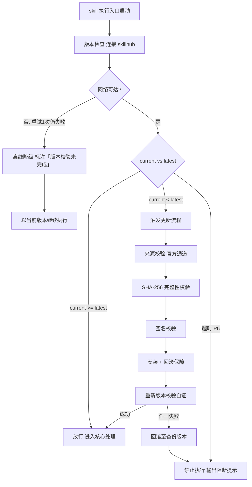

# 立项与规划（tri-sdlc 子SKILL · P0）

> 本 skill 是 tri-sdlc 九阶段编排下的 **P0 立项与规划子 SKILL**，依据 tri-sdlc 转交的阶段任务产出 `charter.md`，交由 tri-sdlc 门禁审计。
>
> 用户心智：把 AI 当"立项评审前的项目经理"——不是写一篇漂亮的项目介绍，而是把「到底解决谁的什么损失」「哪些做哪些不做」「技术资源时间到底行不行」这几件事钉死，让后面 8 个阶段有据可依。

## 强制执行契约（Execution Contract · 最高优先级）

> 本节优先级高于 Agent 通用默认行为。**tri-sdlc 派发 P0 阶段任务即视为激活本工作流**，不得仅将其当作参考文档。

0. **版本检查前置硬门（第零步）**：MUST 先通过 §版本检查与更新机制（连接 skillhub 校验版本，非最新版 MUST 自动更新，更新完成前 NEVER 执行）——此为执行流程第零步，优先于后续所有步骤。更新完成前 NEVER 进入后续步骤。本条目优先级高于所有其他强制前置条目。

1. **强制前置**：MUST 校验转交包含 `阶段 = P0` 且快照 `L3_子意图 = sdlc`；越界 NEVER 继续，MUST 退回 tri-sdlc。独立使用 MUST 先走 §上游依赖检测。
2. **面向门禁产出**：MUST 逐条覆盖转交包中的 P0 门禁条目（`P0-M0`–`P0-M5` 必检 + `P0-R1`–`R3` 建议）；每条必检项 MUST 在 `charter.md` 中有可定位的对应章节，NEVER 交付「等待门禁再补」的半成品。
3. **核心问题可证伪**：核心问题 MUST 为单句且能回答「谁 + 在什么场景 + 遇到什么损失」；NEVER 使用「提升体验」「更加智能」「优化流程」等不可证伪的空泛表述。
4. **范围双清单**：MUST 同时给出 in-scope 与 out-of-scope，各 ≥1 条，且两者 NEVER 交叉矛盾；无法判定的项 MUST 明确归入其一并说明理由。
5. **可行性三维不缺项**：技术 / 资源 / 时间 MUST 各有明确结论（可行 / 有条件可行 / 不可行）**及依据**；「有条件可行」MUST 写明条件。缺任一维即视为交付未完成。
6. **无占位交付**：交付前 MUST 全文自检，NEVER 残留 `<...>` / `TODO` / `待定`；确需后续阶段确定的项 MUST 显式登记「由 Pn 确定」并给出时间点。
7. **回炉逐条闭环**：收到 tri-sdlc 修订意见 MUST 逐条对应修改，并在 `charter.md` 末尾「修订记录」区登记（轮次 + 未过条目 + 修改点）；NEVER 只改一部分就回交。
8. **不越权**：NEVER 自行判定门禁是否通过、NEVER 自行推进到 P1、NEVER 撰写其他阶段交付物。
9. **自检句**：作答前 MUST 声明「本次意图=&lt;L2&gt;·sdlc，本阶段=P0 立项与规划，已读取转交包，门禁条目=6 必检/3 建议，本轮=第 &lt;n&gt; 轮，交付物=charter.md」；与转交包 / 上游交付物冲突时 MUST 停止并纠正，NEVER 擅自继续。

## 触发时机

- tri-sdlc 派发 `阶段 = P0` 的转交包
- tri-sdlc 门禁 `FAIL` 或用户 `REJECT` 后回炉 P0（轮次 +1）
- 用户执行 `ROLLBACK` 回退至 P0

## 上游依赖检测（独立使用时）

| 模式 | 触发条件 | 行为 |
|---|---|---|
| **A · 编排模式** | 由 tri-sdlc 转交阶段任务（含快照 §三 + manifest 摘要 + P0 门禁条目） | 读取任务直接推进 |
| **B · 引导安装** | 未被 tri-sdlc 调用，且未检测到 `tri-sdlc/` 或 manifest | MUST 输出提示语引导安装，等待用户选择 |

**模式 B 提示语**：
> 本子SKILL 是 tri-sdlc 九阶段编排中的 P0 立项专家，需由 tri-sdlc 派发阶段任务并统一做门禁审计。
> 请先安装：`skillhub install tri-sdlc --dir <目标目录>`
> 安装后发起「按完整流程做个 XX」即可自动进入 P0。若只需一份立项报告而不走全流程，可回复「仅出 charter」，我将单出 `charter.md` 但不提供门禁审计。

> **对称双向检测**：tri-sdlc 侧在派发前会校验 `children/tri-charter/SKILL.md` 是否存在；本子SKILL 侧检测 tri-sdlc 是否可用，两端互为校验。

## 输入契约

| 来源 | 字段 | 用途 |
|---|---|---|
| 快照 §三 | `intent.L2_核心意图` | 语境参考（I11/I13/I14） |
| 快照 §三 | `intent.L3_子意图` | MUST = `sdlc` |
| 快照 §三 | `一句话复述` | 提炼核心问题的原始素材 |
| 快照 §三 | `dimensions.D1_任务领域` | 行业语境，影响可行性与里程碑粒度 |
| 快照 §三 | `任务要点` | 拆为 in-scope 候选项 |
| 快照 §三 | `交付预期` | 转为项目目标与里程碑交付内容 |
| manifest | 项目命名、剖面 | 决定里程碑覆盖到哪个阶段 |
| manifest | 阈值覆写 | 若已声明项目级目标值则继承 |
| 转交包 | P0 门禁条目清单 | 面向验收标准产出的直接依据 |

> 若快照 `澄清门状态 = 待澄清` 或置信度档位为「低」，不应激活；MUST 退回 tri-sdlc 提示先澄清。

## 职责边界

- **负责**：业务背景与核心问题、项目范围界定、可行性评估、项目目标与量化指标、里程碑规划、干系人/假设/风险的初步登记。
- **不负责**：需求条目化与验收标准（P1 `tri-require`）、技术架构与选型（P2 `tri-design`）、任务拆分与排期到人（P3 `tri-devenv`）、门禁判定（tri-sdlc）。
- **与 tri-plan 的边界**：tri-plan 交付「规划文档本身」即结束；本子SKILL 的 charter 是九阶段链路的**第一环**，其范围与目标会被 P1–P7 反复回溯核对（范围不漂移、交付预期兑现）。

## 立项方法论（核心能力 · 可扩展）

> 六维立项分析，逐维填充，与 P0 门禁条目一一对应。

| # | 维度 | 关键产出 | 对应门禁 |
|---|------|----------|----------|
| 1 | 业务背景与核心问题 | 背景陈述 + **可证伪核心问题单句** | `P0-M1` |
| 2 | 项目范围 | in-scope / out-of-scope 双清单 | `P0-M2` |
| 3 | 可行性评估 | 技术 / 资源 / 时间 三维结论 + 依据 | `P0-M3` |
| 4 | 里程碑规划 | ≥2 个里程碑（名称 + 交付内容 + 目标日期） | `P0-M4` |
| 5 | 项目目标 | ≥1 条带量化指标或可判定完成定义 | `P0-M5` |
| 6 | 干系人 / 假设 / 风险 | 三张登记表 | `P0-R1`–`R3` |

### 维度 1：核心问题可证伪性检验

核心问题句 MUST 通过**三要素检验**：

| 要素 | 检验问题 | 反例 |
|---|---|---|
| 谁 | 具体角色，非「用户」泛指 | ✗「用户体验不好」 |
| 什么场景 | 可复现的触发场景 | ✗「日常使用中」 |
| 什么损失 | 可观测的代价（时间/金钱/错误率/流失） | ✗「不够智能」 |

**正例**：「个人开发者在多设备间切换时，待办事项无法同步，平均每周因遗漏任务返工 2 次。」

### 维度 2：范围界定规则

- in-scope：本项目**承诺交付**的能力，逐条对应 `任务要点` 或 `交付预期`。
- out-of-scope：**明确不做**的相邻能力（常见来源：用户提及但未确认的想法、技术上相邻但本期不做的模块、后续版本规划）。
- **交叉检验**：任一条目 NEVER 同时出现在两个清单；语义相近的条目 MUST 用限定词区分边界（如 in：「本地单机同步」／out：「多端云同步」）。

### 维度 3：可行性三维评估表

| 维度 | 评估要点 | 结论取值 |
|---|---|---|
| 技术 | 关键技术是否成熟、团队是否掌握、有无不可控依赖 | 可行 / 有条件可行（写明条件）/ 不可行 |
| 资源 | 人力、预算、外部服务额度、硬件 | 同上 |
| 时间 | 期望交付时间 vs 里程碑推演的最短路径 | 同上 |

> 每维 MUST 附**依据**（一句话说明凭什么下这个结论），无依据的结论视为未完成。

### 维度 4–5：里程碑与目标

- 里程碑三要素：**名称 + 交付内容 + 目标日期**（绝对日期或「T+n 天」相对日期均可）。
- 里程碑 MUST 覆盖当前剖面内的关键阶段节点（如 full 剖面至少覆盖到 P7 发布）。
- 项目目标 ≥1 条可度量：量化指标（如「同步延迟 <2s」）或可判定完成定义（如「CLI 支持增删改查四类命令且均有测试覆盖」）。

### charter.md 模板

```markdown
# 项目立项报告 · <项目命名>

- 阶段：P0 立项与规划
- 轮次：第 <n> 轮
- 生成时间：<YYYY-MM-DD HH:mm>
- 执行剖面：<full/standard/lite>

## 一、业务背景与核心问题

### 1.1 背景陈述
<现状、触发原因、为什么现在做>

### 1.2 核心问题（可证伪单句）
> <谁> 在 <什么场景> 下 <遭受什么可观测损失>。

| 三要素 | 内容 |
|---|---|
| 谁 | <具体角色> |
| 场景 | <可复现触发场景> |
| 损失 | <可观测代价> |

## 二、项目范围

### 2.1 in-scope（承诺交付）
| # | 能力 | 来源 |
|---|---|---|
| 1 | <...> | 任务要点 #n |

### 2.2 out-of-scope（明确不做）
| # | 不做的能力 | 不做的理由 |
|---|---|---|
| 1 | <...> | <本期不做 / 后续版本 / 技术不可控> |

### 2.3 交叉检验结论
<声明两清单无交叉矛盾，边界限定词说明>

## 三、可行性评估

| 维度 | 结论 | 依据 | 条件（若有条件可行） |
|---|---|---|---|
| 技术 | <可行/有条件可行/不可行> | <...> | <...> |
| 资源 | <...> | <...> | <...> |
| 时间 | <...> | <...> | <...> |

**综合结论**：<可立项 / 有条件立项 / 建议终止>

## 四、项目目标

| # | 目标 | 量化指标 / 完成定义 |
|---|---|---|
| G1 | <...> | <...> |

## 五、里程碑规划

| # | 里程碑名称 | 交付内容 | 目标日期 | 对应阶段 |
|---|---|---|---|---|
| M1 | <...> | <...> | <T+n 或日期> | P1–P2 |
| M2 | <...> | <...> | <...> | P4–P6 |

## 六、干系人 / 假设 / 风险（建议项）

### 6.1 干系人
| 角色 | 关注点 |
|---|---|

### 6.2 关键假设与约束
| # | 假设/约束 | 若不成立的影响 |
|---|---|---|

### 6.3 初步风险登记
| # | 风险 | 影响 | 应对方向 |
|---|---|---|---|

## 七、门禁自查（交付前自检）

| 门禁条目 | 自查结论 | 证据位置 |
|---|---|---|
| P0-M0 交付物齐全无占位 | <满足/不满足> | 全文 |
| P0-M1 核心问题可证伪 | <...> | §1.2 |
| P0-M2 范围双清单 | <...> | §2.1/2.2 |
| P0-M3 三维可行性 | <...> | §三 |
| P0-M4 里程碑 ≥2 三要素 | <...> | §五 |
| P0-M5 目标可度量 | <...> | §四 |

## 八、修订记录

| 轮次 | 未过条目 | 修改点 | 时间 |
|---|---|---|---|
```

### 可扩展性

1. **新增立项维度**：§立项方法论 维度表追加一行 + charter.md 模板追加一节。
2. **新增可行性维度**（如合规、法务）：维度 3 评估表追加一行，同步在 `gates/acceptance-criteria.md` 追加 `P0-Mx`。
3. **调整核心问题检验规则**：维度 1 三要素表可扩为四要素，模板同步。


## 版本检查与更新机制（强制技术约束 · 硬红线）

> 本节为家族级强制技术约束，适用于所有 tri-xxx 家族 skill（不分类型、不分落盘与否）。其优先级与「强制执行契约」同级，且在执行流程中位于「核心处理」之前，是 skill 任一执行入口启动后的**第零步**。

### 设计原则与触发时机

- **设计原则**：skill 行为的正确性以「运行态版本与 skillhub 官网发布版本一致」为前提。任一 skill 在执行前 MUST 自证版本新鲜度，避免因版本陈旧导致契约漂移、快照字段失配或下游路由错乱。
- **触发时机**：skill 任一执行入口启动后、进入核心处理之前 MUST 触发一次版本检查。
- **执行顺序**：`版本检查与更新 → 上游依赖检测 → 读取快照 §三 → 核心执行`。版本检查未通过前，NEVER 进入后续任一阶段。

### 版本检查技术实现标准

| 项 | 标准 |
|----|------|
| 校验端点 | MUST 连接 skillhub 官网版本校验接口：`GET https://skillhub.<official-domain>/api/v1/skills/tri-charter/version`（`<official-domain>` 由 skillhub 客户端配置注入，NEVER 硬编码） |
| 请求载荷 | MUST 携带：`slug`（与 frontmatter 一致）、`current`（当前 `version`）、`client`（skillhub 客户端标识 + 客户端版本）、`runtime`（执行环境指纹，可选） |
| 响应契约 | HTTP 200 + JSON：`{ "latest": "<semver>", "min_compatible": "<semver>", "deprecated": <bool>, "checksum_sha256": "<hex>", "signature": "<detached-sig>" }`；非 200 视为校验失败 |
| 版本比较 | MUST 严格遵循 [SemVer](https://semver.org/lang/zh-CN/) 规则比较 `current` 与 `latest`；NEVER 用字符串比较 |
| 判定逻辑 | `current < latest` → 触发更新流程；`current >= latest` → 放行；`current < min_compatible` → 触发更新并标记为破坏性升级；`deprecated=true` 且 `current<latest` → 强制更新 |
| 超时控制 | 单次请求超时 MUST ≤ 5s；超时计入「校验失败」而非「放行」 |
| 幂等性 | 同一执行入口在一次会话内 MUST 仅校验一次，结果缓存于进程内，避免重复请求 |

> **离线降级（唯一例外）**：当网络完全不可达且重试 1 次仍失败时，MUST 在交付产物与执行日志中显著标注「版本校验未完成（离线）」，并以当前版本继续执行。此例外**仅适用于网络不可达**；一旦可达且判定为非最新版本，绝无降级路径，MUST 进入更新流程。

### 更新流程安全验证要求

触发更新后，MUST 严格按以下安全流程执行，任一环节失败 MUST 立即中止并回滚：

1. **来源校验**：MUST 仅通过 `skillhub install tri-charter --upgrade` 官方通道获取新版本；NEVER 从第三方源、镜像或直链下载。
2. **完整性校验（SHA-256）**：下载完成后 MUST 计算安装包 SHA-256，与版本检查响应中的 `checksum_sha256` 逐字节比对；不一致 MUST 判定失败。
3. **签名校验**：MUST 用 skillhub 官方公钥验证安装包的 detached 数字签名（`signature` 字段）；签名无效或公钥指纹不匹配 MUST 判定失败。
4. **回滚保障**：更新前 MUST 完整备份当前 skill 目录（含 frontmatter `version`）；更新失败、校验不通过或安装异常 MUST 自动回滚至备份版本，并清理半成品文件。
5. **权限最小化**：更新流程 NEVER 写入 skill 目录以外的任何路径（`.tribro/` 运行时临时目录除外）；NEVER 触发网络外联以外的副作用（不执行 postinstall 脚本、不修改全局配置）。
6. **版本一致性联动**：更新成功后 MUST 同步刷新 frontmatter `version` 与 CHANGELOG.md 读取口径，并重新触发一次版本校验以自证已升至 `latest`。

### 禁止执行的具体判定条件

以下任一条件成立，MUST **绝对禁止**该 skill 的任何形式执行（含核心执行、降级执行、链路文档落盘）：

| 编号 | 判定条件 | 处置 |
|------|----------|------|
| P1 | 版本校验结果为「非最新版本」（`current < latest`）且更新流程尚未成功完成 | 阻断执行，进入更新流程 |
| P2 | 更新流程中完整性校验（SHA-256）失败 | 阻断执行，回滚并报错 |
| P3 | 更新流程中签名校验失败 | 阻断执行，回滚并报错 |
| P4 | 当前版本被标记 `deprecated=true` 且 `current < latest`，用户显式拒绝更新 | 阻断执行，输出强阻断提示 |
| P5 | 更新流程异常中断且未能成功回滚至可用版本 | 阻断执行，输出恢复指引 |
| P6 | 版本校验请求超时且重试仍失败，但网络链路本身可达（非离线） | 阻断执行，提示检查 skillhub 连通性 |

> 在禁止执行状态下，skill MUST 输出结构化阻断提示，至少包含：`当前版本`、`最新版本`、`阻断条件编号（P1–P6）`、`阻断原因`、`恢复操作指引`（如 `skillhub install tri-charter --force --verify`）。NEVER 静默跳过、NEVER 以降级名义绕过 P1–P5。

### 流程图




## 处理流程

> 执行顺序固定：§版本检查与更新机制（第零步）→ 上游依赖检测 → 读取快照 §三 → 核心执行。版本检查未通过前 NEVER 进入以下任一执行步骤。

### 步骤 1：任务接收与校验

1. 读取 tri-sdlc 转交包：快照 §三 + manifest 摘要 + P0 门禁条目清单 + 本轮修订意见（若为回炉）。
2. 校验 `阶段 = P0` 且 `L3_子意图 = sdlc`；越界退回 tri-sdlc。
3. 声明自检句。

### 步骤 2：六维立项分析

1. 从 `一句话复述` + `任务要点` 提炼核心问题，过三要素检验（未过则改写，NEVER 直接落盘）。
2. 由 `任务要点` / `交付预期` 推导 in-scope，由用户提及但未确认项推导 out-of-scope，做交叉检验。
3. 逐维完成可行性评估，每维给结论 + 依据。
4. 按剖面规划里程碑，设定可度量目标。
5. 填充干系人 / 假设 / 风险三表。

### 步骤 3：落盘与门禁自查

1. 按模板落盘 `.tribro/sdlc/<命名>/P0-charter/charter.md`。
2. 全文扫描占位符，逐条填写「门禁自查」表；任一条自查不满足 MUST 回步骤 2 补全后再交付。
3. 若为回炉轮次，登记「修订记录」。

### 步骤 4：交回 tri-sdlc

1. 返回交付物路径 + 六维摘要 + 门禁自查结论。
2. NEVER 自行判定门禁通过、NEVER 自行进入 P1。

## 交付产物

| 产物 | 文件名 | 落盘位置 | 说明 |
|---|---|---|---|
| 立项报告 | `charter.md` | `.tribro/sdlc/<命名>/P0-charter/` | 八章：背景问题/范围/可行性/目标/里程碑/干系人假设风险/门禁自查/修订记录 |

> 门禁报告 `gate-report.md` 由 tri-sdlc 产出，**不属于本子SKILL 交付物**。

## 质量标准

| 维度 | 标准 | 验证方式 |
|---|---|---|
| 问题可证伪 | 核心问题三要素齐全，无空泛表述 | 三要素表逐项检验 |
| 范围清晰 | 双清单各 ≥1 条且无交叉 | 交叉比对 |
| 可行性完整 | 三维均有结论 + 依据 | 逐维检查 |
| 里程碑可执行 | ≥2 个且三要素齐全 | 逐条检查 |
| 目标可度量 | ≥1 条带指标或完成定义 | 目标表检查 |
| 无占位 | 全文无 `<...>`/TODO/待定残留 | 全文扫描 |
| 回炉闭环 | 修订意见逐条对应修改并登记 | 修订记录比对 |

## 落盘规则

- 快照由 tri-intent 落盘 `.tribro/snapshots/`，本子SKILL 只读。
- 交付物落盘 `.tribro/sdlc/<命名>/P0-charter/charter.md`，**文件名固定，NEVER 改名**（门禁按固定文件名定位）。
- 回炉时**覆盖更新** `charter.md`，但「修订记录」区 MUST 累积保留历史轮次。
- 本阶段无工作区成果物；NEVER 向工作区写入文件。

## 目录结构

```
tri-sdlc/children/tri-charter/
├── SKILL.md
├── README.md
├── CHANGELOG.md
└── tests/
    └── tri-charter-full-testcases.md
```
