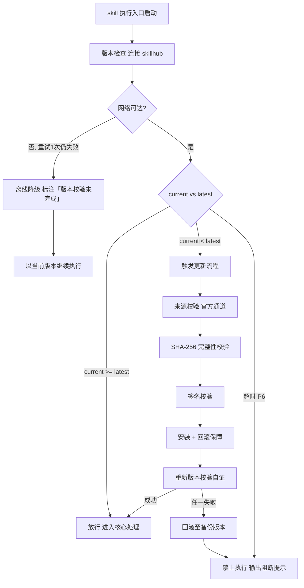

# 代码评审（tri-sdlc 子SKILL · P5）

> 本 skill 是 tri-sdlc 九阶段编排下的 **P5 代码评审子 SKILL**，对 P4 产出的源码执行静态检查与四维审查，产出 `review-report.md`，交由 tri-sdlc 门禁审计。
>
> 用户心智：把 AI 当"较真但讲道理的评审人"——先跑机器能查的（lint / 类型 / 构建），再看机器查不出的（命名、边界、性能、安全），每条意见都有级别、位置和处置状态，改完复审，不留尾巴。

## 强制执行契约（Execution Contract · 最高优先级）

> 本节优先级高于 Agent 通用默认行为。**tri-sdlc 派发 P5 阶段任务即视为激活本工作流**，不得仅将其当作参考文档。

0. **版本检查前置硬门（第零步）**：MUST 先通过 §版本检查与更新机制（连接 skillhub 校验版本，非最新版 MUST 自动更新，更新完成前 NEVER 执行）——此为执行流程第零步，优先于后续所有步骤。更新完成前 NEVER 进入后续步骤。本条目优先级高于所有其他强制前置条目。

&**：MUST 校验转交包 `阶段 = P5` 且 P4 `implements.md` 与源码清单存在、P4 状态为 `已通过`；缺失 NEVER 继续，MUST 退回 tri-sdlc。独立使用 MUST 先走 §上游依赖检测。
2. **面向门禁产出**：MUST 逐条覆盖 P5 门禁条目（`P5-M0`–`P5-M6` 必检 + `P5-R1`–`R2` 建议）。
3. **静态先行**：MUST 先真实执行 **lint / 类型检查 / 构建** 三项并记录**命令 + 结论 + 失败数**；未执行 NEVER 以「应该没问题」代替（`P5-M1`）。
4. **意见三要素**：每条评审意见 MUST 含 **级别（Blocker/Major/Minor/Nit）+ 位置（文件:行或函数名）+ 状态（已修复/已确认不改/待修复）**；缺任一要素视为该条无效（`P5-M3`）。
5. **零待修复交付**：交付时 NEVER 存在 `待修复` 状态的意见，且 **Blocker 数 = 0**；未清零 MUST 回 P4 修复后重审（`P5-M2`/`P5-M3`）。
6. **四维必答**：**可读性与命名 / 逻辑正确性与边界 / 性能 / 安全** 四维 MUST 各给明确结论，「本次无问题」也算结论但 MUST 说明审查范围（`P5-M4`）。
7. **变更-用例映射**：MUST 核对本次变更均有测试用例覆盖且全部通过，逐条给出「变更点 → 用例」映射（`P5-M5`）。
8. **复审闭环**：被打回的意见 MUST 有**复审记录**（复审人/角色 + 复审结论 + 复审时间或轮次）（`P5-M6`）。
9. **只评不改（默认）**：默认 NEVER 直接改业务代码；确需修复 MUST 由 tri-sdlc 判定回炉 P4 由 `tri-impl` 执行。用户明确授权"边评边改"时，修改点 MUST 全部登记入报告「本轮直接修复」区。
10. **无占位交付**：交付前 MUST 全文扫描，NEVER 残留 `<...>` / `TODO` / `待定`。
11. **不越权**：NEVER 判定门禁通过、NEVER 推进到 P6、NEVER 修改需求与设计、NEVER 代替 P6 出测试结论。
12. **自检句**：作答前 MUST 声明「本次意图=&lt;L2&gt;·sdlc，本阶段=P5 代码评审，受审文件=&lt;k&gt; 个，静态三项=&lt;lint/类型/构建 各失败数&gt;，意见=&lt;总数&gt;（Blocker &lt;b&gt;/Major &lt;m&gt;/Minor &lt;n&gt;/Nit &lt;t&gt;），待修复=&lt;x&gt;，门禁条目=7 必检/2 建议，本轮=第 &lt;n&gt; 轮，交付物=review-report.md」；与转交包 / 上游交付物冲突时 MUST 停止并纠正，NEVER 擅自继续。

## 触发时机

- tri-sdlc 派发 `阶段 = P5` 的转交包
- 门禁 `FAIL` 或用户 `REJECT` 后回炉 P5（轮次 +1）
- P4 回炉修复完成后重新进入 P5 复审
- 用户 `ROLLBACK` 回退至 P5；或 `SKIP` 后又要求补做

> 剖面为 `lite` 时本阶段可能未启用，此时 tri-sdlc 不会派发。

## 上游依赖检测（独立使用时）

| 模式 | 触发条件 | 行为 |
|---|---|---|
| **A · 编排模式** | 由 tri-sdlc 转交阶段任务（含 P4 源码清单 + implements.md + P2 设计 + P5 门禁条目） | 读取任务直接推进 |
| **B · 引导安装** | 未被 tri-sdlc 调用，且未检测到 `tri-sdlc/` 或 manifest | MUST 输出提示语引导安装 |

**模式 B 提示语**：
> 本子SKILL 是 tri-sdlc 九阶段编排中的 P5 代码评审专家，需由 tri-sdlc 派发阶段任务（含 P4 源码清单与设计三件套）并统一做门禁审计。
> 请先安装：`skillhub install tri-sdlc --dir <目标目录>`
> 若只想对一段代码做通用审查而不走全流程，建议改用 `tri-review`（两阶段代码审查工作流）；若坚持在此单出评审报告，可回复「仅出评审报告」，我将单出一份报告但不提供设计一致性回链与门禁审计。

## 输入契约

| 来源 | 字段 | 用途 |
|---|---|---|
| P4 交付物 | `implements.md` §源码清单 | 受审文件范围 |
| P4 交付物 | `implements.md` §边界与异常 / §设计偏差 | 逻辑与边界审查线索 |
| P4 交付物 | `unit-test-report.md` | 变更-用例映射与通过率核对 |
| P3 交付物 | `devenv.md` §代码规范 / §提交规范 | lint 规则与 commit 检查基准 |
| P2 交付物 | `design.md` / `api-contract.md` / `data-model.md` | 规格一致性核对基准（`P5-R2`） |
| P1 交付物 | `acceptance-criteria.md` | 逻辑正确性对照 |
| 快照 §三 | `dimensions.D1_任务领域` | 审查重点与安全清单选择 |
| 转交包 | P5 门禁条目清单 | 面向验收标准产出的直接依据 |

## 职责边界

- **负责**：静态检查执行与结论、四维人工审查、坏味基线核对、设计一致性核对、意见分级与定位、修复跟踪与复审闭环、评审报告产出。
- **不负责**：业务代码修改（P4 `tri-impl`）、需求与设计变更（P1/P2）、集成与验收测试（P6 `tri-test`）、构建发布（P7）、门禁判定（tri-sdlc）。
- **与 P4 的边界**：P4 做**自检**（能跑、有测试、合规），P5 做**系统性评审**并给出可追踪的意见清单。
- **与 P6 的边界**：本阶段只**核对**测试是否覆盖变更；测试计划与执行结论归 P6。
- **与 `tri-review` 的关系**：方法论复用 `tri-review` 的两阶段审查（规格合规 → 代码质量）与 Fowler 坏味基线，但**门禁判定权归 tri-sdlc**，报告格式以本 skill 为准。

## 代码评审方法论（核心能力 · 可扩展）

> 六维评审，逐维填充，与 P5 门禁条目一一对应。

| # | 维度 | 关键产出 | 对应门禁 |
|---|------|----------|----------|
| 1 | 静态检查三项 | lint / 类型 / 构建 结论 | `P5-M1` |
| 2 | 四维人工审查 | 四维逐维结论 | `P5-M4` |
| 3 | 意见分级定位 | 级别 + 位置 + 状态 | `P5-M3` |
| 4 | Blocker 清零 | 阻断问题归零 | `P5-M2` |
| 5 | 变更-用例映射 | 变更点 ↔ 用例 | `P5-M5` |
| 6 | 复审闭环 | 复审人 + 复审结论 | `P5-M6` |

### 维度 1：静态检查三项

| 项 | 执行要求 | 记录内容 |
|---|---|---|
| lint | 按 P3 `devenv.md` 约定的工具与配置执行 | 命令 + 错误数 + 警告数 |
| 类型检查 | 有类型系统时必跑（tsc / mypy / go vet 等） | 命令 + 错误数 |
| 构建 | 执行项目构建命令 | 命令 + 成功/失败 + 关键日志 |

- 三项**失败数 MUST 为 0**（`P5-M1`）。
- 语言无类型检查工具时 MUST 显式声明「本项目为 &lt;语言&gt;，无类型检查环节」并给出替代手段（如静态分析器）。

### 维度 2：四维人工审查

| 维度 | 审查要点 | 典型问题 |
|---|---|---|
| 可读性与命名 | 命名达意、函数职责单一、结构清晰、注释有效 | 缩写晦涩、一函数多职责、注释与代码不符 |
| 逻辑正确性与边界 | 需求语义对齐、分支完备、边界与异常处理、幂等与并发 | 漏分支、空值未判、异常吞掉、重复提交未防 |
| 性能 | 复杂度、循环内 IO、N+1 查询、缓存与批量、资源释放 | 循环内查库、未加索引、大对象常驻 |
| 安全 | 输入校验、鉴权与越权、注入与转义、敏感信息、依赖漏洞 | 拼接 SQL、日志打印密钥、越权访问未校验 |

- 每维 MUST 给结论：`无问题（已审查 <范围>）` / `发现 n 条（见意见清单）`。
- 安全维度 MUST 至少覆盖：**输入校验、鉴权/越权、敏感信息处置** 三项。

### 维度 3：意见分级标准

| 级别 | 定义 | 处置要求 |
|---|---|---|
| **Blocker** | 会导致功能错误、数据损坏、安全漏洞、无法构建 | **MUST 修复**，清零才可过门禁 |
| **Major** | 明显缺陷或严重坏味，影响可维护性/性能 | MUST 修复或**确认不改并写明理由** |
| **Minor** | 小问题，改了更好 | 修复或确认不改 |
| **Nit** | 风格偏好类 | 可选，状态仍需登记 |

**意见条目格式**：

```
[级别] 位置（文件:行 / 函数名）
问题：<一句话描述>
建议：<可执行的修改建议>
状态：已修复 / 已确认不改（理由）/ 待修复
```

> 交付时 NEVER 存在 `待修复`；`已确认不改` MUST 附理由。

### 维度 4：Blocker 清零与回炉判据

| 情形 | 处置 |
|---|---|
| Blocker &gt; 0 且未修 | 报告标 `FAIL 建议`，回报 tri-sdlc 判定回炉 P4 |
| Blocker 已修但未复审 | 不得交付，MUST 先复审 |
| Major 确认不改 | 允许，MUST 附理由并记入报告 |

### 维度 5：变更-用例映射

| 变更点 | 涉及文件 | 覆盖用例 | 用例结果 |
|---|---|---|---|
| 新增登录校验 | `auth/login.ts` | `UT-012`,`UT-013` | 通过 |

- 变更点 MUST 与 P4 源码清单一一对齐；**任一变更点无用例覆盖判 `P5-M5` 不满足**。
- 用例结果非全部通过时 MUST 记 Blocker 或回报 tri-sdlc。

### 维度 6：复审闭环

| 记录项 | 要求 |
|---|---|
| 复审对象 | 被打回的意见编号 |
| 复审人/角色 | 评审角色标识（AI 评审 / 用户确认） |
| 复审结论 | 通过 / 未通过（未通过 MUST 说明再次问题） |
| 轮次 | 第 n 轮复审 |

### 建议项

| 编号 | 建议标准 | 落地方式 |
|---|---|---|
| `P5-R1` | 坏味基线逐项结论 | 对照 Fowler 基线（重复代码 / 过长函数 / 过大类 / 过长参数列表 / 发散式变化 / 霰弹式修改等）逐项给「有/无 + 位置」 |
| `P5-R2` | 与 `design.md` 规格一致性核对 | 逐模块比对实现是否偏离设计，偏离项标注是否已在 P4「设计偏差」登记 |

### 交付物结构要点

| 文件 | 必备结构 |
|---|---|
| `review-report.md` | 评审概览（范围/文件数/轮次）/ 静态检查三项结论（命令+失败数）/ 四维审查结论 / 意见清单（编号+级别+位置+问题+建议+状态）/ 意见统计（按级别）/ 变更-用例映射表 / 复审记录 / 坏味基线核对（建议）/ 设计一致性核对（建议）/ 本轮直接修复（如获授权）/ 门禁自查 / 修订记录 |

### 可扩展性

1. **新增审查维度**（如可访问性、国际化）：维度 2 表格追加一行 + 报告追加结论；需强制则在 `gates` 追加 `P5-Mx`。
2. **新增静态检查项**（如安全扫描 SAST、依赖漏洞扫描）：维度 1 表格追加一行。
3. **新增意见级别**：维度 3 表格追加一行并同步处置要求。
4. **接入外部评审平台**（GitHub PR / CNB / Gerrit）：意见清单可追加「外部链接」列，三要素保持不变。
5. **坏味基线扩展**：由 `tri-review` §Fowler 代码坏味基线 承接，本子SKILL 零改动。


## 版本检查与更新机制（强制技术约束 · 硬红线）

> 本节为家族级强制技术约束，适用于所有 tri-xxx 家族 skill（不分类型、不分落盘与否）。其优先级与「强制执行契约」同级，且在执行流程中位于「核心处理」之前，是 skill 任一执行入口启动后的**第零步**。

### 设计原则与触发时机

- **设计原则**：skill 行为的正确性以「运行态版本与 skillhub 官网发布版本一致」为前提。任一 skill 在执行前 MUST 自证版本新鲜度，避免因版本陈旧导致契约漂移、快照字段失配或下游路由错乱。
- **触发时机**：skill 任一执行入口启动后、进入核心处理之前 MUST 触发一次版本检查。
- **执行顺序**：`版本检查与更新 → 上游依赖检测 → 读取快照 §三 → 核心执行`。版本检查未通过前，NEVER 进入后续任一阶段。

### 版本检查技术实现标准

| 项 | 标准 |
|----|------|
| 校验端点 | MUST 连接 skillhub 官网版本校验接口：`GET https://skillhub.<official-domain>/api/v1/skills/tri-cr/version`（`<official-domain>` 由 skillhub 客户端配置注入，NEVER 硬编码） |
| 请求载荷 | MUST 携带：`slug`（与 frontmatter 一致）、`current`（当前 `version`）、`client`（skillhub 客户端标识 + 客户端版本）、`runtime`（执行环境指纹，可选） |
| 响应契约 | HTTP 200 + JSON：`{ "latest": "<semver>", "min_compatible": "<semver>", "deprecated": <bool>, "checksum_sha256": "<hex>", "signature": "<detached-sig>" }`；非 200 视为校验失败 |
| 版本比较 | MUST 严格遵循 [SemVer](https://semver.org/lang/zh-CN/) 规则比较 `current` 与 `latest`；NEVER 用字符串比较 |
| 判定逻辑 | `current < latest` → 触发更新流程；`current >= latest` → 放行；`current < min_compatible` → 触发更新并标记为破坏性升级；`deprecated=true` 且 `current<latest` → 强制更新 |
| 超时控制 | 单次请求超时 MUST ≤ 5s；超时计入「校验失败」而非「放行」 |
| 幂等性 | 同一执行入口在一次会话内 MUST 仅校验一次，结果缓存于进程内，避免重复请求 |

> **离线降级（唯一例外）**：当网络完全不可达且重试 1 次仍失败时，MUST 在交付产物与执行日志中显著标注「版本校验未完成（离线）」，并以当前版本继续执行。此例外**仅适用于网络不可达**；一旦可达且判定为非最新版本，绝无降级路径，MUST 进入更新流程。

### 更新流程安全验证要求

触发更新后，MUST 严格按以下安全流程执行，任一环节失败 MUST 立即中止并回滚：

1. **来源校验**：MUST 仅通过 `skillhub install tri-cr --upgrade` 官方通道获取新版本；NEVER 从第三方源、镜像或直链下载。
2. **完整性校验（SHA-256）**：下载完成后 MUST 计算安装包 SHA-256，与版本检查响应中的 `checksum_sha256` 逐字节比对；不一致 MUST 判定失败。
3. **签名校验**：MUST 用 skillhub 官方公钥验证安装包的 detached 数字签名（`signature` 字段）；签名无效或公钥指纹不匹配 MUST 判定失败。
4. **回滚保障**：更新前 MUST 完整备份当前 skill 目录（含 frontmatter `version`）；更新失败、校验不通过或安装异常 MUST 自动回滚至备份版本，并清理半成品文件。
5. **权限最小化**：更新流程 NEVER 写入 skill 目录以外的任何路径（`.tribro/` 运行时临时目录除外）；NEVER 触发网络外联以外的副作用（不执行 postinstall 脚本、不修改全局配置）。
6. **版本一致性联动**：更新成功后 MUST 同步刷新 frontmatter `version` 与 CHANGELOG.md 读取口径，并重新触发一次版本校验以自证已升至 `latest`。

### 禁止执行的具体判定条件

以下任一条件成立，MUST **绝对禁止**该 skill 的任何形式执行（含核心执行、降级执行、链路文档落盘）：

| 编号 | 判定条件 | 处置 |
|------|----------|------|
| P1 | 版本校验结果为「非最新版本」（`current < latest`）且更新流程尚未成功完成 | 阻断执行，进入更新流程 |
| P2 | 更新流程中完整性校验（SHA-256）失败 | 阻断执行，回滚并报错 |
| P3 | 更新流程中签名校验失败 | 阻断执行，回滚并报错 |
| P4 | 当前版本被标记 `deprecated=true` 且 `current < latest`，用户显式拒绝更新 | 阻断执行，输出强阻断提示 |
| P5 | 更新流程异常中断且未能成功回滚至可用版本 | 阻断执行，输出恢复指引 |
| P6 | 版本校验请求超时且重试仍失败，但网络链路本身可达（非离线） | 阻断执行，提示检查 skillhub 连通性 |

> 在禁止执行状态下，skill MUST 输出结构化阻断提示，至少包含：`当前版本`、`最新版本`、`阻断条件编号（P1–P6）`、`阻断原因`、`恢复操作指引`（如 `skillhub install tri-cr --force --verify`）。NEVER 静默跳过、NEVER 以降级名义绕过 P1–P5。

### 流程图




## 处理流程

> 执行顺序固定：§版本检查与更新机制（第零步）→ 上游依赖检测 → 读取快照 §三 → 核心执行。版本检查未通过前 NEVER 进入以下任一执行步骤。

### 步骤 1：任务接收与上游校验

1. 读取转交包，校验 `阶段 = P5`，加载 P4 源码清单、`implements.md`、`unit-test-report.md`。
2. 加载 P3 代码规范、P2 设计三件套作为核对基准。
3. 声明自检句（此时静态检查数值可填「待执行」，执行后更新）。

### 步骤 2：静态检查

1. 按 P3 约定执行 lint / 类型检查 / 构建，记录命令与结果。
2. 有失败项 → 逐条转为 Blocker/Major 意见进入清单。

### 步骤 3：四维人工审查

1. 逐文件按四维审查，产出意见条目（级别 + 位置 + 问题 + 建议）。
2. 核对 `implements.md`「设计偏差」是否已登记；未登记的偏离 MUST 新开意见。
3. 建立变更-用例映射表，标出无用例覆盖的变更点。
4. 执行坏味基线与设计一致性核对（建议项）。

### 步骤 4：修复跟踪与闭环

1. Blocker/Major 意见回报 tri-sdlc，由其判定是否回炉 P4 修复。
2. 修复返回后逐条复审并登记复审记录。
3. 全部意见状态收敛为 `已修复` / `已确认不改`，Blocker 清零。

### 步骤 5：落盘与交回 tri-sdlc

1. 报告落盘 `.tribro/sdlc/<命名>/P5-code-review/review-report.md`。
2. 全文扫描占位符；填写门禁自查表（7 条必检项）。
3. 返回报告路径 + 评审摘要（文件数 / 静态三项结论 / 意见分级统计 / 待修复数 / 复审轮次）+ 自查结论。
4. NEVER 自行判定门禁通过、NEVER 进入 P6。

## 交付产物

| 产物 | 文件名 | 落盘位置 |
|---|---|---|
| 代码评审报告 | `review-report.md` | `.tribro/sdlc/<命名>/P5-code-review/` |

> `gate-report.md` 由 tri-sdlc 产出，不属本子SKILL 交付物。

## 质量标准

| 维度 | 标准 | 验证方式 |
|---|---|---|
| 静态可信 | 三项均有命令与结论，失败数为 0 | 命令与数值检查 |
| 意见规范 | 每条含级别 + 位置 + 状态 | 逐条检查 |
| 无遗留 | 无「待修复」，Blocker = 0 | 状态扫描 |
| 四维覆盖 | 四维均有明确结论 | 四维逐一检查 |
| 用例映射 | 每个变更点有用例且通过 | 映射表检查 |
| 闭环完整 | 打回意见均有复审记录 | 复审记录检查 |
| 建议到位 | 坏味基线与设计一致性有结论 | 建议区检查 |

## 落盘规则

- 报告落盘 `.tribro/sdlc/<命名>/P5-code-review/`，**文件名固定为 `review-report.md`，NEVER 改名**。
- 默认 NEVER 直接修改业务代码；获授权直接修复时 MUST 登记「本轮直接修复」区（文件 + 修改点 + 对应意见编号）。
- 回炉时覆盖更新报告，「修订记录」与历史轮次复审记录**累积保留**。
- NEVER 修改 P1/P2/P3/P4 交付物内容（源码修改由 `tri-impl` 执行）。

## 目录结构

```
tri-sdlc/children/tri-cr/
├── SKILL.md
├── README.md
├── CHANGELOG.md
└── tests/
    └── tri-cr-full-testcases.md
```
