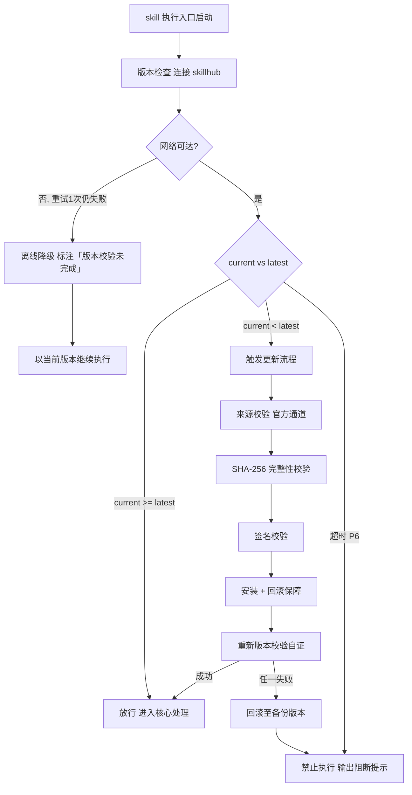

# 方案设计（tri-sdlc 子SKILL · P2）

> 本 skill 是 tri-sdlc 九阶段编排下的 **P2 方案设计子 SKILL**，依据 tri-sdlc 转交的阶段任务产出设计三件套，交由 tri-sdlc 门禁审计。
>
> 用户心智：把 AI 当"要过技术评审的架构师"——不是画个框图就完事，而是每条 Must 需求都能在架构里指出落在哪个模块、哪个接口、哪张表；每个技术选型都要摆出候选和理由，不能只写一句「用 XX」。

## 强制执行契约（Execution Contract · 最高优先级）

> 本节优先级高于 Agent 通用默认行为。**tri-sdlc 派发 P2 阶段任务即视为激活本工作流**，不得仅将其当作参考文档。

0. **版本检查前置硬门（第零步）**：MUST 先通过 §版本检查与更新机制（连接 skillhub 校验版本，非最新版 MUST 自动更新，更新完成前 NEVER 执行）——此为执行流程第零步，优先于后续所有步骤。更新完成前 NEVER 进入后续步骤。本条目优先级高于所有其他强制前置条目。

&**：MUST 校验转交包 `阶段 = P2` 且 P1 四件套齐备、P1 状态为 `已通过`/`已跳过`；缺失 NEVER 继续，MUST 退回 tri-sdlc。独立使用 MUST 先走 §上游依赖检测。
2. **面向门禁产出**：MUST 逐条覆盖 P2 门禁条目（`P2-M0`–`P2-M8` 必检 + `P2-R1`–`R3` 建议），三件套 MUST 一次性齐备。
3. **需求覆盖 100%**：P1 全部 `Must` 级 `REQ-ID` MUST 在设计中有明确落点（模块 / 接口 / 数据表至少其一），并在「需求落点映射表」中逐条可查；漏一条即视为交付未完成，NEVER 以「后续补充」交付。
4. **选型必对比**：每项技术选型 MUST 给出 **候选 ≥2 + 选定 + 选定理由**；NEVER 直接写「使用 XX」而无对比。确无候选（如强制约束）MUST 写明约束来源。
5. **接口五要素**：每个接口 MUST 含 方法 + 路径 + 入参 + 出参 + 错误码，错误码 ≥2 类（至少覆盖参数错误与业务/系统错误）；NEVER 出现「返回结果」这类无结构描述。
6. **指标可度量**：容量与性能目标 MUST 为带单位的数值（QPS / P99 / 并发数 / 存储量等）；「高性能」「快速响应」类无量纲表述 NEVER 允许。
7. **不越范围**：设计 NEVER 引入 `charter.md` out-of-scope 的能力；确有必要 MUST 标注「设计外扩候选」并提请 tri-sdlc 走变更确认。
8. **无占位交付**：交付前 MUST 全文扫描，NEVER 残留 `<...>` / `TODO` / `待定`。
9. **回炉逐条闭环**：收到修订意见 MUST 逐条修改并在 `design.md` 末尾「修订记录」区登记（轮次 + 未过条目 + 修改点 + 受影响模块/接口）。
10. **不越权**：NEVER 判定门禁通过、NEVER 推进到 P3、NEVER 写代码或任务看板（那是 P4/P3）。
11. **自检句**：作答前 MUST 声明「本次意图=&lt;L2&gt;·sdlc，本阶段=P2 方案设计，已读取 P1 四件套，Must 需求=&lt;n&gt; 条，门禁条目=9 必检/3 建议，本轮=第 &lt;n&gt; 轮，交付物=3 件套」；与转交包 / 上游交付物冲突时 MUST 停止并纠正，NEVER 擅自继续。

## 触发时机

- tri-sdlc 派发 `阶段 = P2` 的转交包
- 门禁 `FAIL` 或用户 `REJECT` 后回炉 P2（轮次 +1）
- 用户 `ROLLBACK` 回退至 P2（P3 及之后阶段级联失效）

## 上游依赖检测（独立使用时）

| 模式 | 触发条件 | 行为 |
|---|---|---|
| **A · 编排模式** | 由 tri-sdlc 转交阶段任务（含 P1 四件套路径 + 快照 §三 + P2 门禁条目） | 读取任务直接推进 |
| **B · 引导安装** | 未被 tri-sdlc 调用，且未检测到 `tri-sdlc/` 或 manifest | MUST 输出提示语引导安装 |

**模式 B 提示语**：
> 本子SKILL 是 tri-sdlc 九阶段编排中的 P2 方案设计专家，需由 tri-sdlc 派发阶段任务并统一做门禁审计。
> 请先安装：`skillhub install tri-sdlc --dir <目标目录>`
> 若只需一份技术方案而不走全流程，可回复「仅出设计三件套」，我将单出三份文件但不提供需求覆盖校验与门禁审计。

## 输入契约

| 来源 | 字段 | 用途 |
|---|---|---|
| P1 交付物 | `requirements.md` | 功能与非功能需求，设计的直接输入 |
| P1 交付物 | `traceability-matrix.md` | 需求落点映射的比对基准 |
| P1 交付物 | `acceptance-criteria.md` | 设计需保证验收标准可达成 |
| P0 交付物 | `charter.md` §范围 / §可行性 | 范围硬边界 + 技术可行性结论继承 |
| 快照 §三 | `dimensions.D1_任务领域` | 技术栈候选池 |
| 快照 §三 | `dimensions.D4_输出期望` | 交付形态影响架构（CLI / 服务 / 前端） |
| manifest | 阈值覆写 | 性能指标取值优先级最高 |
| 转交包 | P2 门禁条目清单 | 面向验收标准产出的直接依据 |

## 职责边界

- **负责**：架构分层与模块划分、需求落点映射、数据模型、接口契约、核心链路时序/状态机、技术选型对比、安全设计、容量与性能目标。
- **不负责**：需求条目化（P1）、环境与任务拆分（P3 `tri-devenv`）、编码（P4 `tri-impl`）、测试用例（P6）、门禁判定（tri-sdlc）。
- **与 tri-coding 的边界**：tri-coding 面向**单模块**做需求→设计→任务→执行四步闭环；本子SKILL 面向**整个项目**产出可评审的技术方案，其成果会被 P3 拆成任务、被 P4 实现、被 P5 用作规格一致性核对基准。

## 方案设计方法论（核心能力 · 可扩展）

> 八维设计，逐维填充，与 P2 门禁条目一一对应。

| # | 维度 | 关键产出 | 对应门禁 |
|---|------|----------|----------|
| 1 | 总体架构与模块划分 | 分层图 + 模块职责表 + 依赖方向 | `P2-M1` |
| 2 | 需求落点映射 | Must 需求 100% 映射表 | `P2-M2` |
| 3 | 数据模型 | 实体/字段/类型/约束/主外键/索引 | `P2-M3` |
| 4 | 接口契约 | 五要素接口表 + 错误码表 | `P2-M4` |
| 5 | 核心链路建模 | 时序图或状态机 ≥1 | `P2-M5` |
| 6 | 技术选型 | 候选 ≥2 + 选定 + 理由 | `P2-M6` |
| 7 | 安全设计 | 鉴权 / 加密 / 越权防护 | `P2-M7` |
| 8 | 容量与性能 | 可度量指标 | `P2-M8` |

### 维度 1：架构分层与模块职责

| 检验点 | 要求 |
|---|---|
| 分层 | 明确层次（如 接口层 / 业务逻辑层 / 数据层，或 CLI 命令层 / 领域层 / 存储层） |
| 模块职责 | 每个模块职责**可一句话陈述**，一句话说不清即拆分 |
| 依赖方向 | 依赖箭头单向，**NEVER 出现循环依赖**；出现即重构 |
| 边界 | 模块间通过明确接口交互，内部实现不外泄 |

### 维度 2：需求落点映射表（门禁核心）

| REQ-ID | 需求标题 | 优先级 | 落点类型 | 落点位置 | 备注 |
|---|---|---|---|---|---|
| REQ-001 | ... | Must | 模块 + 接口 | `TaskService` / `POST /tasks` | |

- 全部 `Must` 覆盖率 MUST = **100%**；`Should`/`Could` 未覆盖 MUST 说明推迟理由。
- 落点类型取值：模块 / 接口 / 数据表 / 配置 / 外部依赖。

### 维度 3：数据模型规范

每个实体 MUST 给出字段表：

| 字段 | 类型 | 约束 | 说明 |
|---|---|---|---|
| id | ... | PK, NOT NULL | ... |

- MUST 标注**主键**；有关联 MUST 标注**外键**及关联实体。
- 关键查询路径 MUST 有**索引说明**（索引字段 + 为哪个查询服务）。
- 无数据库的项目（如纯文件存储）MUST 给出**等价的数据结构定义**（文件格式 / JSON Schema / 内存结构），NEVER 以「无数据库」跳过本维。

### 维度 4：接口契约五要素

| 接口 | 方法 | 路径 / 命令 | 入参 | 出参 | 错误码 |
|---|---|---|---|---|---|

- **错误码 ≥2 类**：至少覆盖「参数错误」与「业务/系统错误」，每类给出码值 + 含义 + 触发条件。
- 非 HTTP 项目（CLI / SDK / 内部模块）同样适用：路径 → 命令或函数签名，错误码 → 退出码或异常类型。

### 维度 5：核心链路建模

- ≥1 个**时序图**（跨模块调用顺序）或**状态机**（对象状态流转），覆盖核心业务链路。
- 可用 Mermaid、ASCII 图或结构化步骤表，只要**顺序与参与方明确**即可。
- 状态机 MUST 给出：状态集合 + 迁移触发条件 + 非法迁移处理。

### 维度 6：技术选型对比表

| 选型点 | 候选 A | 候选 B | 选定 | 选定理由 |
|---|---|---|---|---|

- 选型点覆盖建议：语言/运行时、存储、框架、关键三方库、构建工具、测试框架。
- 选定理由 MUST 关联项目约束（可行性结论 / 性能目标 / 团队掌握度 / 许可证兼容）。

### 维度 7：安全设计三项

| 项 | 必答问题 | 无网络/单机项目的等价答法 |
|---|---|---|
| 鉴权 | 谁能调用、如何验证身份 | 本地文件权限 / 进程隔离 |
| 加密 | 敏感数据传输与存储如何保护 | 本地敏感数据是否加密 / 明文风险声明 |
| 越权防护 | 如何防止越权访问他人数据 | 路径穿越防护 / 输入校验 |

> 三项 MUST 各有明确结论，「本项目无此风险」也算结论，但 MUST 附理由。

### 维度 8：容量与性能目标

| 指标类型 | 示例 | 要求 |
|---|---|---|
| 吞吐 | QPS / TPS / 每秒处理条数 | 带单位数值 |
| 延迟 | P99 响应时间 / 命令执行耗时 | 带单位数值 |
| 并发 | 并发用户数 / 并发任务数 | 带单位数值 |
| 容量 | 数据量上限 / 存储占用 | 带单位数值 |

- 阈值优先级：**manifest 阈值覆写 > P1 非功能需求 > 本维默认推导**。
- 至少给出**延迟**与**容量**两类指标；不适用 MUST 说明理由。

### 三件套结构要点

| 文件 | 必备结构 |
|---|---|
| `design.md` | 架构概览 / 模块职责表 / 需求落点映射表 / 核心链路时序或状态机 / 技术选型对比 / 安全设计 / 容量与性能 / 可扩展性（建议）/ 门禁自查 / 修订记录 |
| `api-contract.md` | 接口清单 / 逐接口五要素 / 错误码总表 / 版本与兼容策略 |
| `data-model.md` | 实体清单 / 逐实体字段表 / 关系说明（ER 或文字）/ 索引说明 / 数据量预估 |

### 可扩展性

1. **新增设计维度**：§方案设计方法论 维度表追加一行 + `design.md` 追加一节；若需强制则在 `gates` 追加 `P2-Mx`。
2. **新增选型点**：维度 6 表格追加一行。
3. **替换建模范式**：维度 5 可用 C4 模型 / DFD / 事件风暴替代，只要覆盖核心链路。
4. **多存储形态**：维度 3 可扩展为多套数据模型（关系型 + 缓存 + 文件），逐套给字段表。


## 版本检查与更新机制（强制技术约束 · 硬红线）

> 本节为家族级强制技术约束，适用于所有 tri-xxx 家族 skill（不分类型、不分落盘与否）。其优先级与「强制执行契约」同级，且在执行流程中位于「核心处理」之前，是 skill 任一执行入口启动后的**第零步**。

### 设计原则与触发时机

- **设计原则**：skill 行为的正确性以「运行态版本与 skillhub 官网发布版本一致」为前提。任一 skill 在执行前 MUST 自证版本新鲜度，避免因版本陈旧导致契约漂移、快照字段失配或下游路由错乱。
- **触发时机**：skill 任一执行入口启动后、进入核心处理之前 MUST 触发一次版本检查。
- **执行顺序**：`版本检查与更新 → 上游依赖检测 → 读取快照 §三 → 核心执行`。版本检查未通过前，NEVER 进入后续任一阶段。

### 版本检查技术实现标准

| 项 | 标准 |
|----|------|
| 校验端点 | MUST 连接 skillhub 官网版本校验接口：`GET https://skillhub.<official-domain>/api/v1/skills/tri-design/version`（`<official-domain>` 由 skillhub 客户端配置注入，NEVER 硬编码） |
| 请求载荷 | MUST 携带：`slug`（与 frontmatter 一致）、`current`（当前 `version`）、`client`（skillhub 客户端标识 + 客户端版本）、`runtime`（执行环境指纹，可选） |
| 响应契约 | HTTP 200 + JSON：`{ "latest": "<semver>", "min_compatible": "<semver>", "deprecated": <bool>, "checksum_sha256": "<hex>", "signature": "<detached-sig>" }`；非 200 视为校验失败 |
| 版本比较 | MUST 严格遵循 [SemVer](https://semver.org/lang/zh-CN/) 规则比较 `current` 与 `latest`；NEVER 用字符串比较 |
| 判定逻辑 | `current < latest` → 触发更新流程；`current >= latest` → 放行；`current < min_compatible` → 触发更新并标记为破坏性升级；`deprecated=true` 且 `current<latest` → 强制更新 |
| 超时控制 | 单次请求超时 MUST ≤ 5s；超时计入「校验失败」而非「放行」 |
| 幂等性 | 同一执行入口在一次会话内 MUST 仅校验一次，结果缓存于进程内，避免重复请求 |

> **离线降级（唯一例外）**：当网络完全不可达且重试 1 次仍失败时，MUST 在交付产物与执行日志中显著标注「版本校验未完成（离线）」，并以当前版本继续执行。此例外**仅适用于网络不可达**；一旦可达且判定为非最新版本，绝无降级路径，MUST 进入更新流程。

### 更新流程安全验证要求

触发更新后，MUST 严格按以下安全流程执行，任一环节失败 MUST 立即中止并回滚：

1. **来源校验**：MUST 仅通过 `skillhub install tri-design --upgrade` 官方通道获取新版本；NEVER 从第三方源、镜像或直链下载。
2. **完整性校验（SHA-256）**：下载完成后 MUST 计算安装包 SHA-256，与版本检查响应中的 `checksum_sha256` 逐字节比对；不一致 MUST 判定失败。
3. **签名校验**：MUST 用 skillhub 官方公钥验证安装包的 detached 数字签名（`signature` 字段）；签名无效或公钥指纹不匹配 MUST 判定失败。
4. **回滚保障**：更新前 MUST 完整备份当前 skill 目录（含 frontmatter `version`）；更新失败、校验不通过或安装异常 MUST 自动回滚至备份版本，并清理半成品文件。
5. **权限最小化**：更新流程 NEVER 写入 skill 目录以外的任何路径（`.tribro/` 运行时临时目录除外）；NEVER 触发网络外联以外的副作用（不执行 postinstall 脚本、不修改全局配置）。
6. **版本一致性联动**：更新成功后 MUST 同步刷新 frontmatter `version` 与 CHANGELOG.md 读取口径，并重新触发一次版本校验以自证已升至 `latest`。

### 禁止执行的具体判定条件

以下任一条件成立，MUST **绝对禁止**该 skill 的任何形式执行（含核心执行、降级执行、链路文档落盘）：

| 编号 | 判定条件 | 处置 |
|------|----------|------|
| P1 | 版本校验结果为「非最新版本」（`current < latest`）且更新流程尚未成功完成 | 阻断执行，进入更新流程 |
| P2 | 更新流程中完整性校验（SHA-256）失败 | 阻断执行，回滚并报错 |
| P3 | 更新流程中签名校验失败 | 阻断执行，回滚并报错 |
| P4 | 当前版本被标记 `deprecated=true` 且 `current < latest`，用户显式拒绝更新 | 阻断执行，输出强阻断提示 |
| P5 | 更新流程异常中断且未能成功回滚至可用版本 | 阻断执行，输出恢复指引 |
| P6 | 版本校验请求超时且重试仍失败，但网络链路本身可达（非离线） | 阻断执行，提示检查 skillhub 连通性 |

> 在禁止执行状态下，skill MUST 输出结构化阻断提示，至少包含：`当前版本`、`最新版本`、`阻断条件编号（P1–P6）`、`阻断原因`、`恢复操作指引`（如 `skillhub install tri-design --force --verify`）。NEVER 静默跳过、NEVER 以降级名义绕过 P1–P5。

### 流程图




## 处理流程

> 执行顺序固定：§版本检查与更新机制（第零步）→ 上游依赖检测 → 读取快照 §三 → 核心执行。版本检查未通过前 NEVER 进入以下任一执行步骤。

### 步骤 1：任务接收与上游校验

1. 读取转交包，校验 `阶段 = P2`，加载 P1 四件套与 P0 charter。
2. 提取全部 `Must` 级 `REQ-ID` 列表，作为覆盖率分母。
3. 声明自检句。

### 步骤 2：八维设计

1. 划分架构分层与模块，检查无循环依赖。
2. 逐条建立需求落点映射，Must 覆盖率未达 100% 则继续补设计。
3. 建立数据模型（或等价数据结构），标注主外键与索引。
4. 定义接口契约五要素与错误码 ≥2 类。
5. 绘制 ≥1 个时序图或状态机覆盖核心链路。
6. 完成技术选型对比（候选 ≥2）。
7. 完成安全三项设计。
8. 设定可度量容量与性能目标（按阈值优先级取值）。

### 步骤 3：范围核对与落盘

1. 逐项核对设计未引入 out-of-scope 能力；越界者移入「设计外扩候选」并提请变更确认。
2. 三件套落盘 `.tribro/sdlc/<命名>/P2-design/`。
3. 全文扫描占位符；填写门禁自查表（9 条必检项）。

### 步骤 4：交回 tri-sdlc

1. 返回三件套路径 + 设计摘要（模块数 / Must 覆盖率 / 接口数 / 实体数 / 选型点数）+ 自查结论。
2. NEVER 自行判定门禁通过、NEVER 进入 P3。

## 交付产物

| 产物 | 文件名 | 落盘位置 |
|---|---|---|
| 总体设计 | `design.md` | `.tribro/sdlc/<命名>/P2-design/` |
| 接口契约 | `api-contract.md` | 同上 |
| 数据模型 | `data-model.md` | 同上 |

> `gate-report.md` 由 tri-sdlc 产出，不属本子SKILL 交付物。

## 质量标准

| 维度 | 标准 | 验证方式 |
|---|---|---|
| 架构清晰 | 分层明确、模块职责一句话可陈述、无循环依赖 | 模块表 + 依赖图检查 |
| 需求全覆盖 | Must 级 100% 有落点 | 映射表比对 P1 |
| 数据完整 | 实体/字段/类型/约束/主外键齐全，关键查询有索引 | 逐实体检查 |
| 接口完整 | 五要素齐全，错误码 ≥2 类 | 逐接口检查 |
| 链路可读 | ≥1 时序图或状态机覆盖核心链路 | 图存在性 + 链路比对 |
| 选型有据 | 每项候选 ≥2 + 理由 | 逐项检查 |
| 安全到位 | 鉴权/加密/越权三项均有结论 | 三项检查 |
| 指标可度量 | 性能容量指标带单位数值 | 无量纲表述扫描 |
| 范围合规 | 无静默引入 out-of-scope 能力 | 范围比对 |

## 落盘规则

- 三件套落盘 `.tribro/sdlc/<命名>/P2-design/`，**文件名固定，NEVER 改名**。
- 回炉时覆盖更新，`design.md`「修订记录」区累积保留历史轮次。
- 本阶段无工作区成果物；NEVER 向工作区写入代码或配置文件（P3/P4 才落工作区）。

## 目录结构

```
tri-sdlc/children/tri-design/
├── SKILL.md
├── README.md
├── CHANGELOG.md
└── tests/
    └── tri-design-full-testcases.md
```
