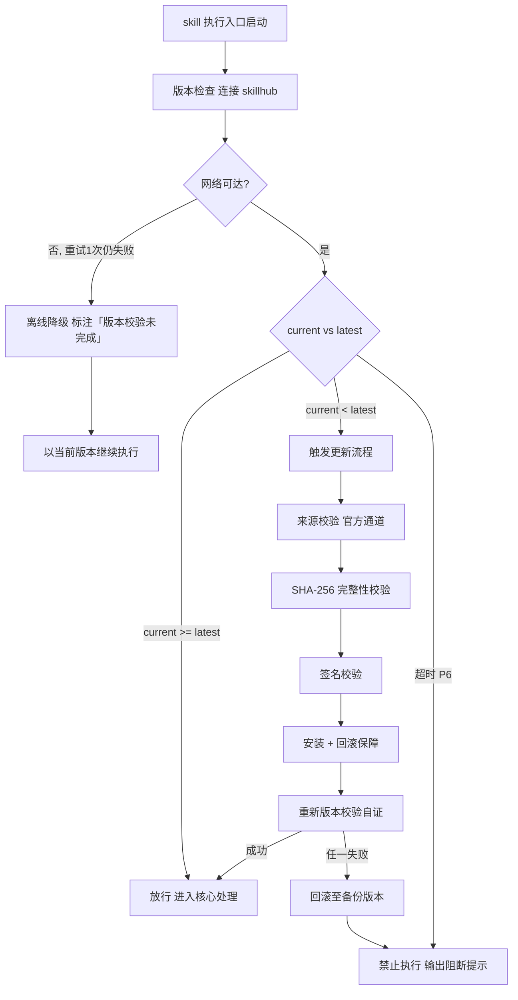

# 开发准备（tri-sdlc 子SKILL · P3）

> 本 skill 是 tri-sdlc 九阶段编排下的 **P3 开发准备子 SKILL**，依据 tri-sdlc 转交的阶段任务产出 `devenv.md` 与 `task-board.md`，交由 tri-sdlc 门禁审计。
>
> 用户心智：把 AI 当"负责搭台子的技术负责人"——开工前把仓库怎么分支、环境怎么装（照着敲就能跑）、代码怎么校验、提交怎么写、活怎么拆到人，一次说清楚，避免开发中途返工统一规范。

## 强制执行契约（Execution Contract · 最高优先级）

> 本节优先级高于 Agent 通用默认行为。**tri-sdlc 派发 P3 阶段任务即视为激活本工作流**，不得仅将其当作参考文档。

0. **版本检查前置硬门（第零步）**：MUST 先通过 §版本检查与更新机制（连接 skillhub 校验版本，非最新版 MUST 自动更新，更新完成前 NEVER 执行）——此为执行流程第零步，优先于后续所有步骤。更新完成前 NEVER 进入后续步骤。本条目优先级高于所有其他强制前置条目。

&**：MUST 校验转交包 `阶段 = P3` 且 P2 设计三件套齐备、P2 状态为 `已通过`/`已跳过`；缺失 NEVER 继续，MUST 退回 tri-sdlc。独立使用 MUST 先走 §上游依赖检测。
2. **面向门禁产出**：MUST 逐条覆盖 P3 门禁条目（`P3-M0`–`P3-M6` 必检 + `P3-R1`–`R2` 建议），两份交付物 MUST 一次性齐备。
3. **步骤可执行**：环境搭建每一步 MUST 可逐条照抄执行且**带版本号**；「自行安装依赖」「配置好环境即可」类模糊表述 NEVER 允许。
4. **分支三类齐全**：MUST 定义 主干 / 特性 / 发布 三类分支的**命名规则 + 合并规则**；缺任一类视为交付未完成。
5. **任务五要素**：每个子任务 MUST 含 **ID + 标题 + 关联需求 ID + 预估 + 负责角色**；缺任一要素即视为该任务无效。
6. **回链无悬空**：全部子任务关联的 `REQ-ID` MUST 存在于 P1 需求集；出现悬空引用 NEVER 交付，MUST 先修正。
7. **任务覆盖设计**：任务集合 MUST 覆盖 P2 设计中全部 `Must` 需求落点；漏覆盖 MUST 补任务或显式说明由哪个阶段承接。
8. **工作区落盘登记**：向用户工作区落工程配置骨架（仓库初始化 / lint 配置 / 钩子配置 / 启动脚本）时 MUST 在 `devenv.md`「工作区产物」区登记路径；NEVER 静默写入工作区。
9. **无占位交付**：交付前 MUST 全文扫描，NEVER 残留 `<...>` / `TODO` / `待定`。
10. **回炉逐条闭环**：收到修订意见 MUST 逐条修改并在 `devenv.md` 末尾「修订记录」区登记（轮次 + 未过条目 + 修改点）。
11. **不越权**：NEVER 判定门禁通过、NEVER 推进到 P4、NEVER 编写业务功能代码（仅工程骨架与配置）。
12. **自检句**：作答前 MUST 声明「本次意图=&lt;L2&gt;·sdlc，本阶段=P3 开发准备，已读取 P2 三件套，任务数=&lt;n&gt;，门禁条目=7 必检/2 建议，本轮=第 &lt;n&gt; 轮，交付物=devenv.md + task-board.md」；与转交包 / 上游交付物冲突时 MUST 停止并纠正，NEVER 擅自继续。

## 触发时机

- tri-sdlc 派发 `阶段 = P3` 的转交包
- 门禁 `FAIL` 或用户 `REJECT` 后回炉 P3（轮次 +1）
- 用户 `ROLLBACK` 回退至 P3；或 `SKIP` 后又要求补做

> 剖面为 `standard` / `lite` 时本阶段可能未启用，此时 tri-sdlc 不会派发。

## 上游依赖检测（独立使用时）

| 模式 | 触发条件 | 行为 |
|---|---|---|
| **A · 编排模式** | 由 tri-sdlc 转交阶段任务（含 P2 三件套路径 + P1 需求 + P3 门禁条目） | 读取任务直接推进 |
| **B · 引导安装** | 未被 tri-sdlc 调用，且未检测到 `tri-sdlc/` 或 manifest | MUST 输出提示语引导安装 |

**模式 B 提示语**：
> 本子SKILL 是 tri-sdlc 九阶段编排中的 P3 开发准备专家，需由 tri-sdlc 派发阶段任务并统一做门禁审计。
> 请先安装：`skillhub install tri-sdlc --dir <目标目录>`
> 若只需一份工程规范与任务拆分而不走全流程，可回复「仅出开发准备文档」，我将单出两份文件但不提供需求回链校验与门禁审计。

## 输入契约

| 来源 | 字段 | 用途 |
|---|---|---|
| P2 交付物 | `design.md` §模块划分 / §需求落点映射 | 任务拆分的直接依据 |
| P2 交付物 | `design.md` §技术选型 | 环境搭建的技术栈与版本来源 |
| P2 交付物 | `api-contract.md` / `data-model.md` | 接口与数据层任务拆分依据 |
| P1 交付物 | `requirements.md` | 需求 ID 回链校验基准 |
| P1 交付物 | 优先级字段 | 任务排序与批次划分 |
| 快照 §三 | `dimensions.D1_任务领域` | 工具链默认选择 |
| manifest | 剖面 | 决定是否需要 CI/发布分支配置 |
| 转交包 | P3 门禁条目清单 | 面向验收标准产出的直接依据 |

## 职责边界

- **负责**：仓库与分支策略、环境搭建步骤、代码规范工具与配置、提交规范与钩子、任务看板拆分与回链、CI 触发策略（建议）、一键启动脚本（建议）。
- **不负责**：技术选型决策（P2 已定，本阶段只落地）、业务功能编码（P4 `tri-impl`）、测试执行（P6）、门禁判定（tri-sdlc）。
- **与 P4 的边界**：本阶段只落**工程骨架与配置**（仓库初始化、lint 配置、钩子、启动脚本）；**任何业务功能代码 NEVER 在本阶段编写**。

## 开发准备方法论（核心能力 · 可扩展）

> 六维准备，逐维填充，与 P3 门禁条目一一对应。

| # | 维度 | 关键产出 | 对应门禁 |
|---|------|----------|----------|
| 1 | 仓库与分支策略 | 三类分支命名 + 合并规则 | `P3-M1` |
| 2 | 环境搭建 | 带版本号的可执行步骤 | `P3-M2` |
| 3 | 代码规范 | 工具 + 关键规则配置 | `P3-M3` |
| 4 | 提交规范 | message 格式 + 钩子 | `P3-M4` |
| 5 | 任务拆分 | 五要素任务看板 | `P3-M5` |
| 6 | 回链校验 | 任务 ↔ 需求 ID 连通 | `P3-M6` |

### 维度 1：分支策略三类

| 分支类型 | 必答项 | 示例 |
|---|---|---|
| 主干 | 名称、保护规则、谁可合入 | `main`，禁止直推，仅 PR 合入 |
| 特性 | 命名规则、从哪切、合回哪 | `feat/<REQ-ID>-<短描述>`，从 main 切，PR 回 main |
| 发布 | 命名规则、何时创建、修复回流 | `release/v1.0.0`，冻结后创建，hotfix 回流 main |

- 合并规则 MUST 明确：合并方式（merge / squash / rebase）+ 前置条件（评审通过 / CI 通过）。

### 维度 2：环境搭建步骤规范

| 要求 | 说明 | 反例 |
|---|---|---|
| 可逐条执行 | 每步是一条可复制的命令或明确操作 | ✗「安装好 Node 环境」 |
| 带版本号 | 运行时、包管理器、关键依赖均标版本 | ✗「安装 Node」→ ✓「Node 22.x（本项目验证于 22.22.2）」 |
| 有验证步骤 | 每个关键环节给出验证命令与期望输出 | ✓「`node -v` 应输出 v22.x」 |
| 覆盖全平台或声明 | 多平台差异需分列，或声明仅支持某平台 | |

### 维度 3：代码规范工具

| 项 | 要求 |
|---|---|
| 工具 | 明确工具名与版本（ESLint / Prettier / Ruff / gofmt 等） |
| 配置文件 | 给出文件名与**关键规则**（不必全量罗列，但核心约束要写明） |
| 执行方式 | 本地命令 + 是否接入钩子 / CI |
| 例外机制 | 如何声明豁免（如 `eslint-disable` 的使用约束） |

### 维度 4：提交规范

- **message 格式** MUST 明确，推荐 Conventional Commits：

```
<type>(<scope>): <subject>

type ∈ {feat, fix, docs, style, refactor, test, chore}
subject 建议关联 REQ-ID
```

- **钩子配置** MUST 明确：工具（husky / pre-commit / lefthook 等）+ 触发时机（pre-commit / commit-msg / pre-push）+ 执行内容。

### 维度 5：任务看板五要素

| 任务 ID | 标题 | 关联需求 ID | 预估 | 负责角色 | 状态 | 依赖 |
|---|---|---|---|---|---|---|
| T-001 | ... | REQ-001 | 0.5d | 后端 | 未开始 | - |

- **任务 ID**：`T-nnn` 顺序编号。
- **预估**：人天 / 小时 / 故事点，全篇统一单位。
- **负责角色**：角色名（后端 / 前端 / 测试 / AI 执行），不强制到具体人。
- **状态**：`未开始` / `进行中` / `完成`，P4 门禁 `P4-M1` 会检查本阶段范围内任务是否全部 `完成`。
- **依赖**：前置任务 ID，用于排定批次。

### 维度 6：回链与覆盖双向校验

| 检查方向 | 规则 | 违规命名 |
|---|---|---|
| 任务→需求 | 每个任务的 `REQ-ID` 存在于 P1 需求集 | 悬空引用 |
| 需求→任务 | 每条 `Must` 需求 ≥1 个任务承接 | 需求无任务 |
| 设计→任务 | P2 每个模块落点有对应任务或说明由他阶段承接 | 设计无落地 |

> 三向校验任一不过 NEVER 交付，MUST 先修正。

### 建议项

| 编号 | 建议标准 | 落地方式 |
|---|---|---|
| `P3-R1` | CI 触发策略 | 说明何时触发（push/PR/定时）、跑什么（lint/test/build） |
| `P3-R2` | 本地调试 / 一键启动脚本 | 给出脚本名与用途（如 `npm run dev`） |

### 交付物结构要点

| 文件 | 必备结构 |
|---|---|
| `devenv.md` | 仓库与分支策略 / 环境搭建步骤（带版本与验证）/ 代码规范工具与配置 / 提交规范与钩子 / CI 触发策略（建议）/ 一键启动（建议）/ 工作区产物登记 / 门禁自查 / 修订记录 |
| `task-board.md` | 任务总览统计 / 五要素任务表 / 批次与依赖关系 / 三向校验结论 |

### 可扩展性

1. **新增准备维度**（如安全基线扫描接入）：维度表追加一行 + `devenv.md` 追加一节；需强制则在 `gates` 追加 `P3-Mx`。
2. **新增分支类型**（如 `hotfix`）：维度 1 表格追加一行。
3. **更换任务体系**（如接入 Jira / TAPD）：维度 5 表格可扩展列（外部任务链接），五要素保持不变。
4. **新增校验方向**：维度 6 表格追加一行。


## 版本检查与更新机制（强制技术约束 · 硬红线）

> 本节为家族级强制技术约束，适用于所有 tri-xxx 家族 skill（不分类型、不分落盘与否）。其优先级与「强制执行契约」同级，且在执行流程中位于「核心处理」之前，是 skill 任一执行入口启动后的**第零步**。

### 设计原则与触发时机

- **设计原则**：skill 行为的正确性以「运行态版本与 skillhub 官网发布版本一致」为前提。任一 skill 在执行前 MUST 自证版本新鲜度，避免因版本陈旧导致契约漂移、快照字段失配或下游路由错乱。
- **触发时机**：skill 任一执行入口启动后、进入核心处理之前 MUST 触发一次版本检查。
- **执行顺序**：`版本检查与更新 → 上游依赖检测 → 读取快照 §三 → 核心执行`。版本检查未通过前，NEVER 进入后续任一阶段。

### 版本检查技术实现标准

| 项 | 标准 |
|----|------|
| 校验端点 | MUST 连接 skillhub 官网版本校验接口：`GET https://skillhub.<official-domain>/api/v1/skills/tri-devenv/version`（`<official-domain>` 由 skillhub 客户端配置注入，NEVER 硬编码） |
| 请求载荷 | MUST 携带：`slug`（与 frontmatter 一致）、`current`（当前 `version`）、`client`（skillhub 客户端标识 + 客户端版本）、`runtime`（执行环境指纹，可选） |
| 响应契约 | HTTP 200 + JSON：`{ "latest": "<semver>", "min_compatible": "<semver>", "deprecated": <bool>, "checksum_sha256": "<hex>", "signature": "<detached-sig>" }`；非 200 视为校验失败 |
| 版本比较 | MUST 严格遵循 [SemVer](https://semver.org/lang/zh-CN/) 规则比较 `current` 与 `latest`；NEVER 用字符串比较 |
| 判定逻辑 | `current < latest` → 触发更新流程；`current >= latest` → 放行；`current < min_compatible` → 触发更新并标记为破坏性升级；`deprecated=true` 且 `current<latest` → 强制更新 |
| 超时控制 | 单次请求超时 MUST ≤ 5s；超时计入「校验失败」而非「放行」 |
| 幂等性 | 同一执行入口在一次会话内 MUST 仅校验一次，结果缓存于进程内，避免重复请求 |

> **离线降级（唯一例外）**：当网络完全不可达且重试 1 次仍失败时，MUST 在交付产物与执行日志中显著标注「版本校验未完成（离线）」，并以当前版本继续执行。此例外**仅适用于网络不可达**；一旦可达且判定为非最新版本，绝无降级路径，MUST 进入更新流程。

### 更新流程安全验证要求

触发更新后，MUST 严格按以下安全流程执行，任一环节失败 MUST 立即中止并回滚：

1. **来源校验**：MUST 仅通过 `skillhub install tri-devenv --upgrade` 官方通道获取新版本；NEVER 从第三方源、镜像或直链下载。
2. **完整性校验（SHA-256）**：下载完成后 MUST 计算安装包 SHA-256，与版本检查响应中的 `checksum_sha256` 逐字节比对；不一致 MUST 判定失败。
3. **签名校验**：MUST 用 skillhub 官方公钥验证安装包的 detached 数字签名（`signature` 字段）；签名无效或公钥指纹不匹配 MUST 判定失败。
4. **回滚保障**：更新前 MUST 完整备份当前 skill 目录（含 frontmatter `version`）；更新失败、校验不通过或安装异常 MUST 自动回滚至备份版本，并清理半成品文件。
5. **权限最小化**：更新流程 NEVER 写入 skill 目录以外的任何路径（`.tribro/` 运行时临时目录除外）；NEVER 触发网络外联以外的副作用（不执行 postinstall 脚本、不修改全局配置）。
6. **版本一致性联动**：更新成功后 MUST 同步刷新 frontmatter `version` 与 CHANGELOG.md 读取口径，并重新触发一次版本校验以自证已升至 `latest`。

### 禁止执行的具体判定条件

以下任一条件成立，MUST **绝对禁止**该 skill 的任何形式执行（含核心执行、降级执行、链路文档落盘）：

| 编号 | 判定条件 | 处置 |
|------|----------|------|
| P1 | 版本校验结果为「非最新版本」（`current < latest`）且更新流程尚未成功完成 | 阻断执行，进入更新流程 |
| P2 | 更新流程中完整性校验（SHA-256）失败 | 阻断执行，回滚并报错 |
| P3 | 更新流程中签名校验失败 | 阻断执行，回滚并报错 |
| P4 | 当前版本被标记 `deprecated=true` 且 `current < latest`，用户显式拒绝更新 | 阻断执行，输出强阻断提示 |
| P5 | 更新流程异常中断且未能成功回滚至可用版本 | 阻断执行，输出恢复指引 |
| P6 | 版本校验请求超时且重试仍失败，但网络链路本身可达（非离线） | 阻断执行，提示检查 skillhub 连通性 |

> 在禁止执行状态下，skill MUST 输出结构化阻断提示，至少包含：`当前版本`、`最新版本`、`阻断条件编号（P1–P6）`、`阻断原因`、`恢复操作指引`（如 `skillhub install tri-devenv --force --verify`）。NEVER 静默跳过、NEVER 以降级名义绕过 P1–P5。

### 流程图




## 处理流程

> 执行顺序固定：§版本检查与更新机制（第零步）→ 上游依赖检测 → 读取快照 §三 → 核心执行。版本检查未通过前 NEVER 进入以下任一执行步骤。

### 步骤 1：任务接收与上游校验

1. 读取转交包，校验 `阶段 = P3`，加载 P2 三件套与 P1 需求。
2. 提取 P2 技术选型（决定环境与工具链）、模块落点（决定任务拆分）。
3. 声明自检句。

### 步骤 2：六维准备

1. 定义三类分支的命名与合并规则。
2. 编写带版本号、含验证命令的环境搭建步骤。
3. 确定代码规范工具与关键规则、执行方式、例外机制。
4. 确定 commit message 格式与钩子配置。
5. 按 P2 模块落点拆分任务，逐任务填五要素。
6. 执行三向校验（任务→需求、需求→任务、设计→任务），未过则回补。

### 步骤 3：工作区骨架（可选）与落盘

1. 如需落工程配置骨架至用户工作区，逐项落盘并在「工作区产物」区登记路径；**NEVER 写业务功能代码**。
2. 两份交付物落盘 `.tribro/sdlc/<命名>/P3-devsetup/`。
3. 全文扫描占位符；填写门禁自查表（7 条必检项）。

### 步骤 4：交回 tri-sdlc

1. 返回交付物路径 + 准备摘要（分支数 / 环境步骤数 / 任务数 / Must 覆盖情况 / 工作区产物清单）+ 自查结论。
2. NEVER 自行判定门禁通过、NEVER 进入 P4。

## 交付产物

| 产物 | 文件名 | 落盘位置 |
|---|---|---|
| 开发环境与规范 | `devenv.md` | `.tribro/sdlc/<命名>/P3-devsetup/` |
| 任务看板 | `task-board.md` | 同上 |
| 工程配置骨架（可选） | lint / 钩子 / 启动脚本等 | **用户工作区**（路径登记于 `devenv.md`） |

> `gate-report.md` 由 tri-sdlc 产出，不属本子SKILL 交付物。

## 质量标准

| 维度 | 标准 | 验证方式 |
|---|---|---|
| 分支完整 | 主干/特性/发布三类均有命名 + 合并规则 | 三类逐一检查 |
| 步骤可执行 | 每步可照抄执行且带版本号，含验证命令 | 模糊表述扫描 |
| 规范明确 | 工具 + 关键规则 + 执行方式 + 例外机制 | 四项检查 |
| 提交规范 | message 格式 + 钩子工具与时机 | 两项检查 |
| 任务完整 | 每任务五要素齐全 | 逐任务检查 |
| 回链无悬空 | 任务 REQ-ID 均存在于 P1 | 引用校验 |
| 覆盖无遗漏 | Must 需求与 P2 模块落点均有任务承接 | 三向校验 |
| 产物登记 | 工作区产物路径已登记 | 路径比对 |

## 落盘规则

- 两份交付物落盘 `.tribro/sdlc/<命名>/P3-devsetup/`，**文件名固定，NEVER 改名**。
- 工程配置骨架落**用户工作区**，路径 MUST 登记于 `devenv.md`「工作区产物」区。
- 回炉时覆盖更新交付物，「修订记录」区累积保留。
- NEVER 向工作区写业务功能代码（P4 才写）。

## 目录结构

```
tri-sdlc/children/tri-devenv/
├── SKILL.md
├── README.md
├── CHANGELOG.md
└── tests/
    └── tri-devenv-full-testcases.md
```
