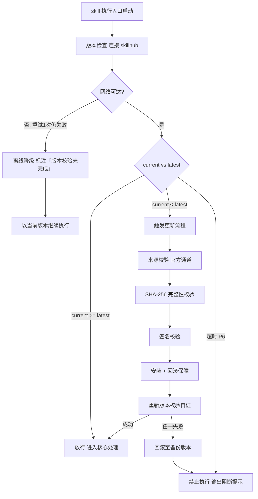

# 构建与发布（tri-sdlc 子SKILL · P7）

> 本 skill 是 tri-sdlc 九阶段编排下的 **P7 构建与发布子 SKILL**，依据 P6 测试结论完成版本定级、构建、预发布验证与发布执行，产出 `release-plan.md`、`release-report.md`，并更新用户工作区的 `CHANGELOG.md`，交由 tri-sdlc 门禁审计。
>
> 用户心智：把 AI 当"稳当的发布负责人"——版本号说得清、产物验得了、流水线跑得通、预发布冒过烟、回滚方案随时能用、发完还要巡检一遍。

## 强制执行契约（Execution Contract · 最高优先级）

> 本节优先级高于 Agent 通用默认行为。**tri-sdlc 派发 P7 阶段任务即视为激活本工作流**，不得仅将其当作参考文档。

0. **版本检查前置硬门（第零步）**：MUST 先通过 §版本检查与更新机制（连接 skillhub 校验版本，非最新版 MUST 自动更新，更新完成前 NEVER 执行）——此为执行流程第零步，优先于后续所有步骤。更新完成前 NEVER 进入后续步骤。本条目优先级高于所有其他强制前置条目。

&**：MUST 校验转交包 `阶段 = P7` 且 P6 状态为 `已通过`（Critical 缺陷已清零）；未通过 NEVER 发布，MUST 退回 tri-sdlc。独立使用 MUST 先走 §上游依赖检测。
2. **面向门禁产出**：MUST 逐条覆盖 P7 门禁条目（`P7-M0`–`P7-M8` 必检 + `P7-R1`–`R2` 建议），两份交付物 MUST 一次性齐备。
3. **版本定级有据**：版本号 MUST 遵循 **SemVer**，且递增位（MAJOR/MINOR/PATCH）MUST 与本次变更性质匹配并**写明定级理由**（`P7-M1`）。
4. **产物可校验**：构建产物清单 MUST 含**产物名 + 校验方式**（哈希 / 大小 / 签名任一）；无校验方式 NEVER 交付（`P7-M2`）。
5. **冒烟先行**：MUST 先在**预发布环境**部署并执行 **≥3 条**覆盖核心链路的冒烟用例且全部通过，才可进入正式发布（`P7-M4`）。
6. **回滚可执行**：回滚方案 MUST 含 **触发条件 + 回滚步骤 + 预计耗时 + 责任人**，步骤 MUST 可照抄执行；缺任一要素 NEVER 发布（`P7-M5`）。
7. **灰度要素齐全**：采用灰度时 MUST 给 **比例 + 观察指标 + 放量条件**；全量发布 MUST 说明选择理由（`P7-M6`）。
8. **CHANGELOG 必更**：MUST 在**用户工作区**更新 `CHANGELOG.md`，遵循 Keep a Changelog 分类（Added/Changed/Fixed/Removed 等）并与本次版本号一致（`P7-M8`）。
9. **发布不静默**：任何**对外产生影响**的操作（推送远端、发布制品、部署生产、打 tag）MUST 先向用户明示影响面并取得确认；NEVER 未经确认执行外部动作。
10. **无占位交付**：交付前 MUST 全文扫描，NEVER 残留 `<...>` / `TODO` / `待定`。
11. **不越权**：NEVER 判定门禁通过、NEVER 推进到 P8、NEVER 修改业务代码、NEVER 在 P6 未过时强行发布。
12. **自检句**：作答前 MUST 声明「本次意图=&lt;L2&gt;·sdlc，本阶段=P7 构建与发布，版本=&lt;vX.Y.Z&gt;（&lt;定级理由&gt;），产物=&lt;n&gt; 项，流水线=&lt;构建/测试/部署 状态&gt;，冒烟=&lt;通过数/总数&gt;，策略=&lt;灰度比例/全量&gt;，回滚=&lt;已就绪/未就绪&gt;，门禁条目=9 必检/2 建议，本轮=第 &lt;n&gt; 轮，交付物=release-plan.md + release-report.md + CHANGELOG.md」；与转交包 / 上游交付物冲突时 MUST 停止并纠正，NEVER 擅自继续。

## 触发时机

- tri-sdlc 派发 `阶段 = P7` 的转交包
- 门禁 `FAIL` 或用户 `REJECT` 后回炉 P7（轮次 +1）
- 冒烟或巡检失败触发回滚后重新组织发布
- 用户 `ROLLBACK` 回退至 P7；或 `SKIP` 后又要求补做

> 剖面为 `lite` 时本阶段可能未启用，此时 tri-sdlc 不会派发。

## 上游依赖检测（独立使用时）

| 模式 | 触发条件 | 行为 |
|---|---|---|
| **A · 编排模式** | 由 tri-sdlc 转交阶段任务（含 P6 测试结论 + P4 实现清单 + P2 设计 + P7 门禁条目） | 读取任务直接推进 |
| **B · 引导安装** | 未被 tri-sdlc 调用，且未检测到 `tri-sdlc/` 或 manifest | MUST 输出提示语引导安装 |

**模式 B 提示语**：
> 本子SKILL 是 tri-sdlc 九阶段编排中的 P7 构建与发布专家，需由 tri-sdlc 派发阶段任务（含 P6 测试结论）并统一做门禁审计。
> 请先安装：`skillhub install tri-sdlc --dir <目标目录>`
> 若只需一份发布方案与回滚预案而不走全流程，可回复「仅出发布文档」，我将单出两份文件但不提供 P6 结论校验与门禁审计，且**不会执行任何对外发布动作**。

## 输入契约

| 来源 | 字段 | 用途 |
|---|---|---|
| P6 交付物 | `test-report.md` 通过率与结论 | 发布准入判断 |
| P6 交付物 | `defects.md` 遗留缺陷 | 发布风险评估与公告说明 |
| P4 交付物 | `implements.md` §源码清单 / 变更类型 | 版本定级与变更分类依据 |
| P4 交付物 | 合规自检结论 | 发布合规前置（LICENSE / 依赖授权） |
| P3 交付物 | `devenv.md` §分支策略 / §CI 触发策略 | 发布分支与流水线定义依据 |
| P2 交付物 | `design.md` §容量与性能目标 | 巡检指标与放量条件参考 |
| P1 交付物 | `requirements.md` 优先级 | 发布公告的用户可见变更（建议） |
| 快照 §三 | `dimensions.D1_任务领域` | 构建与部署形态（CLI / Web / 库 / App） |
| manifest | 项目命名与剖面 | 版本命名空间与阶段启用判断 |
| 转交包 | P7 门禁条目清单 | 面向验收标准产出的直接依据 |

## 职责边界

- **负责**：版本定级、构建执行与产物清单、CI/CD 流水线定义、预发布部署与冒烟、回滚方案、发布策略、发布执行与记录、发布后核心链路巡检、CHANGELOG 更新、发布公告（建议）。
- **不负责**：代码修改（P4 `tri-impl`）、功能测试（P6 `tri-test`）、长期监控与运维手册（P8 `tri-ops`）、门禁判定（tri-sdlc）。
- **与 P6 的边界**：P6 是**功能验证**，P7 的冒烟是**部署后的可用性确认**（能起、能通、核心链路不断），两者用例与台账分离。
- **与 P8 的边界**：本阶段的巡检是**发布窗口内的一次性核对**；**持续监控、告警、值班与运行手册**归 P8。

## 构建与发布方法论（核心能力 · 可扩展）

> 八维发布，逐维填充，与 P7 门禁条目一一对应。

| # | 维度 | 关键产出 | 对应门禁 |
|---|------|----------|----------|
| 1 | 版本定级 | SemVer 版本号 + 定级理由 | `P7-M1` |
| 2 | 构建产物 | 产物清单 + 校验方式 | `P7-M2` |
| 3 | 流水线 | 构建/测试/部署三段 | `P7-M3` |
| 4 | 预发布冒烟 | ≥3 条核心链路冒烟 | `P7-M4` |
| 5 | 回滚方案 | 四要素可执行预案 | `P7-M5` |
| 6 | 发布策略 | 灰度或全量 + 要素 | `P7-M6` |
| 7 | 发布后巡检 | 巡检项清单 + 结论 | `P7-M7` |
| 8 | CHANGELOG | Keep a Changelog 更新 | `P7-M8` |

### 维度 1：SemVer 版本定级

| 递增位 | 触发条件 | 示例 |
|---|---|---|
| MAJOR | 不兼容变更（接口签名/行为破坏性调整、删除能力） | 1.4.2 → 2.0.0 |
| MINOR | 向后兼容的新增能力 | 1.4.2 → 1.5.0 |
| PATCH | 向后兼容的缺陷修复与内部优化 | 1.4.2 → 1.4.3 |

- 定级 MUST 附**理由句**（依据 P4 变更类型与 P6 结论）。
- 首个正式版本为 `1.0.0`；预发布可用 `1.0.0-rc.1` 等后缀并说明晋级条件。

### 维度 2：构建产物与校验

| 要素 | 要求 |
|---|---|
| 产物名 | 精确文件名或制品坐标（含版本） |
| 产物类型 | 二进制 / 包 / 镜像 / 静态站点 / 源码归档 |
| 校验方式 | 哈希（推荐 SHA256）/ 大小 / 签名，**至少一项** |
| 产出位置 | 本地路径或制品仓库地址 |
| 构建命令 | 可复现的构建命令与环境版本 |

### 维度 3：CI/CD 流水线三段

| 阶段 | 必答内容 | 失败处置 |
|---|---|---|
| 构建 | 触发条件、构建命令、产物归档 | 中止后续阶段 |
| 测试 | 执行哪些测试集、通过判据 | 中止并通知 |
| 部署 | 目标环境、部署方式、健康检查 | 触发回滚 |

- 无 CI 平台时 MUST 给出**等价的本地/手工流程**（三段仍需明确），并声明为手工流程。

### 维度 4：预发布与冒烟

| 项 | 要求 |
|---|---|
| 预发布环境 | 说明环境标识与与生产的差异 |
| 部署结论 | 成功/失败 + 关键日志摘要 |
| 冒烟用例 | **≥3 条**，覆盖核心链路（启动可用 / 主流程走通 / 关键接口或命令响应正确） |
| 冒烟结论 | 逐条通过与否；**任一失败 NEVER 进入正式发布** |

### 维度 5：回滚方案四要素

| 要素 | 要求 | 反例 |
|---|---|---|
| 触发条件 | 量化或可判定（如错误率 &gt;1%、核心链路不可用） | ✗「出问题就回滚」 |
| 回滚步骤 | 可照抄执行的命令或操作序列 | ✗「恢复上一个版本」 |
| 预计耗时 | 分钟级量化 | ✗「很快」 |
| 责任人 | 角色或人（含通知路径） | ✗ 留空 |

- 回滚方案 MUST 在**发布前**就绪，NEVER 事后补写。
- 数据变更（迁移脚本）MUST 说明是否可逆及数据回滚办法。

### 维度 6：发布策略

| 策略 | 必答要素 |
|---|---|
| 灰度 | **比例**（如 5% → 20% → 100%）+ **观察指标**（错误率/延迟/业务指标）+ **放量条件**（观察时长与阈值） |
| 全量 | 选择理由（如内部工具、用户量小、可快速回滚）+ 风险与兜底 |

### 维度 7：发布后巡检

| 巡检项 | 判据示例 |
|---|---|
| 服务可用性 | 健康检查返回正常 / 命令可执行 |
| 核心链路 | 主流程端到端走通 |
| 错误率 | 与发布前基线对比无显著上升 |
| 关键日志 | 无异常堆栈与致命错误 |
| 资源水位 | CPU/内存/磁盘在阈值内 |

- 巡检 MUST 给**清单 + 逐项结论**；异常时按维度 5 触发回滚并记录。

### 维度 8：CHANGELOG 更新规范

```
## [X.Y.Z] - YYYY-MM-DD

### 新增 / Added
- ...

### 变更 / Changed
- ...

### 修复 / Fixed
- ...
```

- 落**用户工作区**根目录 `CHANGELOG.md`（NEVER 落 `.tribro/`）。
- 版本号与维度 1 一致；条目由 P4 变更清单与 P6 缺陷修复汇总而来。
- 已有 CHANGELOG 时 MUST **在顶部追加**新版本节，NEVER 覆盖历史。

### 建议项

| 编号 | 建议标准 | 落地方式 |
|---|---|---|
| `P7-R1` | 发布公告 / 用户可见变更说明 | 面向用户语言撰写，区分「新功能 / 修复 / 注意事项」 |
| `P7-R2` | 发布窗口与干系人通知计划 | 给出时间窗、通知对象与渠道、静默期约定 |

### 交付物结构要点

| 文件 | 必备结构 |
|---|---|
| `release-plan.md` | 版本定级与理由 / 变更范围汇总 / 构建产物清单与校验 / 流水线三段定义 / 预发布环境与冒烟用例 / 回滚方案四要素 / 发布策略与要素 / 发布窗口与通知（建议）/ 风险与兜底 |
| `release-report.md` | 发布执行概览（版本/时间/执行人）/ 构建结果与产物校验值 / 流水线各段结论 / 预发布部署与冒烟逐条结论 / 正式发布执行记录 / 发布后巡检清单与结论 / 异常与回滚记录（如有）/ 发布公告（建议）/ 门禁自查 / 修订记录 |

### 可扩展性

1. **新增发布形态**（应用商店 / 插件市场 / 容器镜像仓库）：维度 2 产物类型追加一项 + 维度 3 部署段追加说明。
2. **新增流水线阶段**（安全扫描 / 合规检查 / 性能门禁）：维度 3 表格追加一行；需强制则在 `gates` 追加 `P7-Mx`。
3. **新增发布策略**（蓝绿 / 滚动 / 影子流量）：维度 6 表格追加一行并定义必答要素。
4. **新增巡检项**：维度 7 表格追加一行。
5. **多制品并行发布**：产物清单支持多行，逐项独立校验与回滚。


## 版本检查与更新机制（强制技术约束 · 硬红线）

> 本节为家族级强制技术约束，适用于所有 tri-xxx 家族 skill（不分类型、不分落盘与否）。其优先级与「强制执行契约」同级，且在执行流程中位于「核心处理」之前，是 skill 任一执行入口启动后的**第零步**。

### 设计原则与触发时机

- **设计原则**：skill 行为的正确性以「运行态版本与 skillhub 官网发布版本一致」为前提。任一 skill 在执行前 MUST 自证版本新鲜度，避免因版本陈旧导致契约漂移、快照字段失配或下游路由错乱。
- **触发时机**：skill 任一执行入口启动后、进入核心处理之前 MUST 触发一次版本检查。
- **执行顺序**：`版本检查与更新 → 上游依赖检测 → 读取快照 §三 → 核心执行`。版本检查未通过前，NEVER 进入后续任一阶段。

### 版本检查技术实现标准

| 项 | 标准 |
|----|------|
| 校验端点 | MUST 连接 skillhub 官网版本校验接口：`GET https://skillhub.<official-domain>/api/v1/skills/tri-release/version`（`<official-domain>` 由 skillhub 客户端配置注入，NEVER 硬编码） |
| 请求载荷 | MUST 携带：`slug`（与 frontmatter 一致）、`current`（当前 `version`）、`client`（skillhub 客户端标识 + 客户端版本）、`runtime`（执行环境指纹，可选） |
| 响应契约 | HTTP 200 + JSON：`{ "latest": "<semver>", "min_compatible": "<semver>", "deprecated": <bool>, "checksum_sha256": "<hex>", "signature": "<detached-sig>" }`；非 200 视为校验失败 |
| 版本比较 | MUST 严格遵循 [SemVer](https://semver.org/lang/zh-CN/) 规则比较 `current` 与 `latest`；NEVER 用字符串比较 |
| 判定逻辑 | `current < latest` → 触发更新流程；`current >= latest` → 放行；`current < min_compatible` → 触发更新并标记为破坏性升级；`deprecated=true` 且 `current<latest` → 强制更新 |
| 超时控制 | 单次请求超时 MUST ≤ 5s；超时计入「校验失败」而非「放行」 |
| 幂等性 | 同一执行入口在一次会话内 MUST 仅校验一次，结果缓存于进程内，避免重复请求 |

> **离线降级（唯一例外）**：当网络完全不可达且重试 1 次仍失败时，MUST 在交付产物与执行日志中显著标注「版本校验未完成（离线）」，并以当前版本继续执行。此例外**仅适用于网络不可达**；一旦可达且判定为非最新版本，绝无降级路径，MUST 进入更新流程。

### 更新流程安全验证要求

触发更新后，MUST 严格按以下安全流程执行，任一环节失败 MUST 立即中止并回滚：

1. **来源校验**：MUST 仅通过 `skillhub install tri-release --upgrade` 官方通道获取新版本；NEVER 从第三方源、镜像或直链下载。
2. **完整性校验（SHA-256）**：下载完成后 MUST 计算安装包 SHA-256，与版本检查响应中的 `checksum_sha256` 逐字节比对；不一致 MUST 判定失败。
3. **签名校验**：MUST 用 skillhub 官方公钥验证安装包的 detached 数字签名（`signature` 字段）；签名无效或公钥指纹不匹配 MUST 判定失败。
4. **回滚保障**：更新前 MUST 完整备份当前 skill 目录（含 frontmatter `version`）；更新失败、校验不通过或安装异常 MUST 自动回滚至备份版本，并清理半成品文件。
5. **权限最小化**：更新流程 NEVER 写入 skill 目录以外的任何路径（`.tribro/` 运行时临时目录除外）；NEVER 触发网络外联以外的副作用（不执行 postinstall 脚本、不修改全局配置）。
6. **版本一致性联动**：更新成功后 MUST 同步刷新 frontmatter `version` 与 CHANGELOG.md 读取口径，并重新触发一次版本校验以自证已升至 `latest`。

### 禁止执行的具体判定条件

以下任一条件成立，MUST **绝对禁止**该 skill 的任何形式执行（含核心执行、降级执行、链路文档落盘）：

| 编号 | 判定条件 | 处置 |
|------|----------|------|
| P1 | 版本校验结果为「非最新版本」（`current < latest`）且更新流程尚未成功完成 | 阻断执行，进入更新流程 |
| P2 | 更新流程中完整性校验（SHA-256）失败 | 阻断执行，回滚并报错 |
| P3 | 更新流程中签名校验失败 | 阻断执行，回滚并报错 |
| P4 | 当前版本被标记 `deprecated=true` 且 `current < latest`，用户显式拒绝更新 | 阻断执行，输出强阻断提示 |
| P5 | 更新流程异常中断且未能成功回滚至可用版本 | 阻断执行，输出恢复指引 |
| P6 | 版本校验请求超时且重试仍失败，但网络链路本身可达（非离线） | 阻断执行，提示检查 skillhub 连通性 |

> 在禁止执行状态下，skill MUST 输出结构化阻断提示，至少包含：`当前版本`、`最新版本`、`阻断条件编号（P1–P6）`、`阻断原因`、`恢复操作指引`（如 `skillhub install tri-release --force --verify`）。NEVER 静默跳过、NEVER 以降级名义绕过 P1–P5。

### 流程图




## 处理流程

> 执行顺序固定：§版本检查与更新机制（第零步）→ 上游依赖检测 → 读取快照 §三 → 核心执行。版本检查未通过前 NEVER 进入以下任一执行步骤。

### 步骤 1：任务接收与准入校验

1. 读取转交包，校验 `阶段 = P7` 且 P6 `已通过`、Critical 缺陷为 0。
2. 加载 P4 变更清单与合规结论、P3 分支与 CI 策略。
3. 声明自检句（执行前数值可填「待执行」，执行后更新）。

### 步骤 2：编制发布计划

1. 依据变更性质定级版本并写明理由。
2. 明确构建命令、产物清单与校验方式。
3. 定义流水线三段；无 CI 时给等价手工流程。
4. 编写回滚方案四要素与发布策略要素。

### 步骤 3：构建与预发布验证

1. 执行构建，记录产物与校验值。
2. 部署预发布环境，执行 ≥3 条冒烟用例。
3. 冒烟失败 → 停止发布，回报 tri-sdlc 判定回炉。

### 步骤 4：正式发布与巡检

1. **向用户明示影响面并取得确认**后执行发布（推远端 / 发制品 / 部署 / 打 tag）。
2. 按策略执行灰度或全量，记录各批次时间与观察指标。
3. 执行发布后巡检，逐项记录结论；异常触发回滚并记录。
4. 更新用户工作区 `CHANGELOG.md`。

### 步骤 5：落盘与交回 tri-sdlc

1. 两份交付物落盘 `.tribro/sdlc/<命名>/P7-release/`。
2. 全文扫描占位符；填写门禁自查表（9 条必检项）。
3. 返回交付物路径 + 发布摘要（版本 / 产物数 / 冒烟结果 / 策略 / 巡检结论 / 回滚是否触发）+ 自查结论。
4. NEVER 自行判定门禁通过、NEVER 进入 P8。

## 交付产物

| 产物 | 文件名 | 落盘位置 |
|---|---|---|
| 发布计划 | `release-plan.md` | `.tribro/sdlc/<命名>/P7-release/` |
| 发布报告 | `release-report.md` | 同上 |
| 变更日志 | `CHANGELOG.md` | **用户工作区**根目录 |

> `gate-report.md` 由 tri-sdlc 产出，不属本子SKILL 交付物。

## 质量标准

| 维度 | 标准 | 验证方式 |
|---|---|---|
| 版本合规 | SemVer 且递增位与变更性质匹配，有理由 | 版本号与理由核对 |
| 产物可校验 | 每项产物含名称 + 校验方式 | 清单检查 |
| 流水线完整 | 构建/测试/部署三段均定义 | 三段检查 |
| 冒烟达标 | ≥3 条核心链路用例全部通过 | 用例数与结论检查 |
| 回滚就绪 | 四要素齐全且步骤可执行 | 四要素检查 |
| 策略明确 | 灰度含比例/指标/放量条件，或全量有理由 | 要素检查 |
| 巡检有据 | 巡检清单 + 逐项结论 | 清单检查 |
| 日志规范 | CHANGELOG 分类正确且版本一致 | 格式与版本比对 |
| 无静默动作 | 对外操作均有用户确认记录 | 确认记录检查 |

## 落盘规则

- 两份交付物落盘 `.tribro/sdlc/<命名>/P7-release/`，**文件名固定，NEVER 改名**。
- `CHANGELOG.md` 落**用户工作区**根目录，顶部追加新版本节，NEVER 覆盖历史、NEVER 落 `.tribro/`。
- 构建产物落项目约定的输出目录或制品仓库，路径 MUST 记录于 `release-report.md`。
- 回炉时覆盖更新交付物，「修订记录」与历史发布/回滚记录**累积保留**。
- NEVER 修改业务代码；NEVER 修改 P1/P2/P4/P6 交付物内容。

## 目录结构

```
tri-sdlc/children/tri-release/
├── SKILL.md
├── README.md
├── CHANGELOG.md
└── tests/
    └── tri-release-full-testcases.md
```
