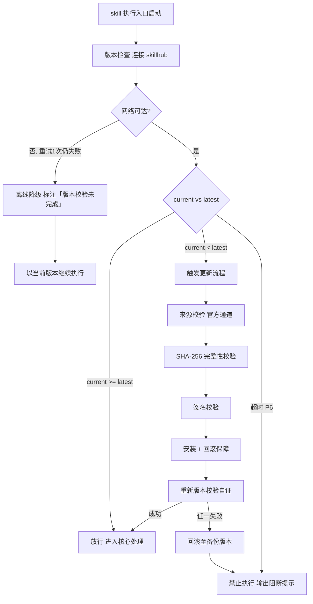

# 需求分析（tri-sdlc 子SKILL · P1）

> 本 skill 是 tri-sdlc 九阶段编排下的 **P1 需求分析子 SKILL**，依据 tri-sdlc 转交的阶段任务产出需求四件套，交由 tri-sdlc 门禁审计。
>
> 用户心智：把 AI 当"会写 PRD 的需求分析师"——不是罗列一堆「支持 XX 功能」，而是把每条需求编号、定优先级、写清「什么条件下出现什么结果算过」，并且保证后面的设计、任务、测试都能顺着 ID 找回来。

## 强制执行契约（Execution Contract · 最高优先级）

> 本节优先级高于 Agent 通用默认行为。**tri-sdlc 派发 P1 阶段任务即视为激活本工作流**，不得仅将其当作参考文档。

0. **版本检查前置硬门（第零步）**：MUST 先通过 §版本检查与更新机制（连接 skillhub 校验版本，非最新版 MUST 自动更新，更新完成前 NEVER 执行）——此为执行流程第零步，优先于后续所有步骤。更新完成前 NEVER 进入后续步骤。本条目优先级高于所有其他强制前置条目。


1. **强制前置**：MUST 校验转交包 `阶段 = P1` 且上游 `P0-charter/charter.md` 存在且状态为 `已通过`/`已跳过`；缺失或未过 NEVER 继续，MUST 退回 tri-sdlc。独立使用 MUST 先走 §上游依赖检测。
2. **面向门禁产出**：MUST 逐条覆盖 P1 门禁条目（`P1-M0`–`P1-M7` 必检 + `P1-R1`–`R3` 建议），四件套 MUST 一次性齐备，NEVER 分批交付。
3. **ID 唯一且贯穿**：每条需求 MUST 有唯一 `REQ-nnn` 编号；同一 ID NEVER 重复使用、NEVER 中途改号（作废用 `已废弃` 标记而非删号），确保 P2/P3/P4/P6 可回溯。
4. **验收标准可判定**：每条需求 MUST ≥1 条验收标准，且 MUST 含**触发条件 + 预期结果**（推荐 Given-When-Then）；「运行正常」「体验良好」类 NEVER 允许出现。
5. **不越范围**：需求 MUST 落在 `charter.md` 的 in-scope 内；发现超出 MUST 显式标注「范围外候选」并提请 tri-sdlc 走变更确认，NEVER 静默扩范围。
6. **矩阵双向连通**：可追溯矩阵 MUST 无**孤儿需求**（无验收标准）、无**无源验收标准**（不对应任何 REQ-ID）；自检不通过 NEVER 交付。
7. **无占位交付**：交付前 MUST 全文扫描，NEVER 残留 `<...>` / `TODO` / `待定`。
8. **回炉逐条闭环**：收到修订意见 MUST 逐条修改并在 `requirements.md` 末尾「修订记录」区登记（轮次 + 未过条目 + 修改点 + 受影响 REQ-ID）。
9. **不越权**：NEVER 判定门禁通过、NEVER 推进到 P2、NEVER 撰写设计/任务/测试用例（那是 P2/P3/P6）。
10. **自检句**：作答前 MUST 声明「本次意图=&lt;L2&gt;·sdlc，本阶段=P1 需求分析，已读取 charter.md，门禁条目=8 必检/3 建议，本轮=第 &lt;n&gt; 轮，交付物=4 件套」；与转交包 / 上游交付物冲突时 MUST 停止并纠正，NEVER 擅自继续。

## 触发时机

- tri-sdlc 派发 `阶段 = P1` 的转交包
- 门禁 `FAIL` 或用户 `REJECT` 后回炉 P1（轮次 +1）
- 用户 `ROLLBACK` 回退至 P1（P2 及之后阶段将被级联置为失效）

## 上游依赖检测（独立使用时）

| 模式 | 触发条件 | 行为 |
|---|---|---|
| **A · 编排模式** | 由 tri-sdlc 转交阶段任务（含 charter.md 路径 + 快照 §三 + P1 门禁条目） | 读取任务直接推进 |
| **B · 引导安装** | 未被 tri-sdlc 调用，且未检测到 `tri-sdlc/` 或 manifest | MUST 输出提示语引导安装 |

**模式 B 提示语**：
> 本子SKILL 是 tri-sdlc 九阶段编排中的 P1 需求分析专家，需由 tri-sdlc 派发阶段任务并统一做门禁审计。
> 请先安装：`skillhub install tri-sdlc --dir <目标目录>`
> 若只需一份需求文档而不走全流程，可回复「仅出需求四件套」，我将单出四份文件但不提供门禁审计与追溯保障。

## 输入契约

| 来源 | 字段 | 用途 |
|---|---|---|
| P0 交付物 | `charter.md` §核心问题 | 需求必须服务于核心问题 |
| P0 交付物 | `charter.md` §in-scope / out-of-scope | 需求范围硬边界 |
| P0 交付物 | `charter.md` §项目目标 | 需求优先级排序依据 |
| 快照 §三 | `任务要点` | 需求候选项直接来源 |
| 快照 §三 | `交付预期` | 验收标准编写参考 |
| 快照 §三 | `dimensions.D1_任务领域` | 非功能需求（性能/安全/兼容）的行业基线 |
| manifest | 剖面、阈值覆写 | 非功能指标取值 |
| 转交包 | P1 门禁条目清单 | 面向验收标准产出的直接依据 |

## 职责边界

- **负责**：需求采集与分类、ID 与优先级、用户故事、验收标准、可追溯矩阵、需求基线冻结。
- **不负责**：技术方案与接口设计（P2 `tri-design`）、任务拆分（P3 `tri-devenv`）、测试用例设计（P6 `tri-test`）、门禁判定（tri-sdlc）。
- **与 P6 的边界**：本阶段写的是**验收标准**（做到什么算满足需求），P6 写的是**测试用例**（怎么验证）；一条验收标准可对应多条测试用例。

## 需求分析方法论（核心能力 · 可扩展）

> 六步需求工程，逐步产出，与 P1 门禁条目一一对应。

| # | 步骤 | 关键产出 | 对应门禁 |
|---|------|----------|----------|
| 1 | 需求采集与分类 | 功能性 / 非功能性分列 | `P1-M2` |
| 2 | ID 分配与优先级 | `REQ-nnn` + MoSCoW/RICE | `P1-M1`、`P1-M5` |
| 3 | 用户故事编写 | 三段式 + 回链 REQ-ID | `P1-M3` |
| 4 | 验收标准编写 | Given-When-Then 可判定 | `P1-M4` |
| 5 | 可追溯矩阵 | 双向连通检查 | `P1-M6` |
| 6 | 基线冻结 | 版本号 + 冻结时间 | `P1-M7` |

### 步骤 1：需求分类矩阵

| 类别 | 子类 | 最低要求 |
|---|---|---|
| 功能性 | 核心功能 / 辅助功能 / 管理功能 | 覆盖 charter in-scope 全部条目 |
| 非功能性 | **性能** | ≥1 条，带量化指标（响应时间/吞吐/并发） |
| 非功能性 | **安全** | ≥1 条（鉴权/数据保护/输入校验任一） |
| 非功能性 | **兼容** | ≥1 条（平台/版本/浏览器/数据格式任一） |
| 非功能性 | 可用性 / 可维护性 / 可观测性 | 建议项 |

> 三类非功能需求**任一不适用 MUST 显式声明理由**（如「纯本地 CLI，无网络鉴权需求，安全维聚焦本地文件权限」），NEVER 直接省略。

### 步骤 2：ID 与优先级规则

- ID 格式：`REQ-001` 起顺序编号，功能与非功能**统一编号空间**（便于全局追溯）。
- 优先级二选一体系，全篇统一：

| 体系 | 取值 | 说明 |
|---|---|---|
| MoSCoW | Must / Should / Could / Won't | 默认推荐 |
| RICE | Reach × Impact × Confidence ÷ Effort 分值 | 需求量大且需排序时使用 |

- `Must` 级需求在 P2 设计中 MUST 100% 有落点（`P2-M2`），故 `Must` 数量 NEVER 无节制膨胀。

### 步骤 3：用户故事三段式

```
作为 <角色>，我希望 <能力>，以便 <价值>。
```

| 要素 | 检验 | 反例 |
|---|---|---|
| 角色 | 具体，非「用户」泛指 | ✗「作为用户」 |
| 能力 | 一个可交付动作 | ✗「我希望系统更好用」 |
| 价值 | 说明为什么值得做 | ✗「以便提升体验」 |

- 每条故事 MUST 标注回链 `REQ-ID`（可一对多）。

### 步骤 4：验收标准 Given-When-Then

```
Given <前置条件>
When  <触发动作>
Then  <可观测的预期结果>
```

| 检验点 | 要求 |
|---|---|
| 可观测 | 结果能被人或程序直接判定（有输出/有状态变化/有错误码） |
| 可复现 | 前置条件明确到能重建 |
| 单一断言 | 一条标准只判一件事，多断言拆多条 |

- **反例清单**（出现即判未过）：运行正常 / 体验良好 / 性能达标（无数值）/ 兼容主流环境（无枚举）。

### 步骤 5：可追溯矩阵双向检查

| 检查方向 | 规则 | 违规命名 |
|---|---|---|
| 正向 | 每条 `REQ-ID` ≥1 条验收标准 | 孤儿需求 |
| 反向 | 每条验收标准归属 ≥1 个 `REQ-ID` | 无源验收标准 |
| 覆盖 | 矩阵行数 == 需求总数，无遗漏 | 矩阵不全 |
| 回链 | 每条用户故事回链的 ID 均存在 | 悬空回链 |

### 步骤 6：基线冻结

`requirements.md` 顶部 MUST 声明：

```
- 基线版本：v1.0（每次回炉修改递增至 v1.1、v1.2…）
- 冻结时间：<YYYY-MM-DD HH:mm>
- 冻结声明：本轮需求已冻结，后续变更需经 tri-sdlc 变更确认流程
```

### 四件套模板要点

| 文件 | 必备结构 |
|---|---|
| `requirements.md` | 基线声明 / 功能性需求表（ID·标题·描述·优先级·来源）/ 非功能性需求表（含性能·安全·兼容三类）/ 范围外候选 / 修订记录 |
| `user-stories.md` | 故事表（故事 ID·三段式正文·回链 REQ-ID·优先级） |
| `acceptance-criteria.md` | 验收标准表（AC-ID·所属 REQ-ID·Given·When·Then） |
| `traceability-matrix.md` | 矩阵表（REQ-ID·需求标题·优先级·关联故事·关联 AC-ID·双向检查结论） |

### 可扩展性

1. **新增需求类别**：步骤 1 分类矩阵追加一行；若需强制则同步在 `gates` 追加 `P1-Mx`。
2. **新增优先级体系**：步骤 2 体系表追加一行（如 Kano），全篇统一使用即可。
3. **新增验收标准范式**：步骤 4 可扩展为 Example Mapping / 决策表，只要满足「触发条件 + 预期结果」。
4. **新增追溯维度**：矩阵表追加列（如关联设计模块、关联测试用例），供 P2/P6 直接续写。


## 版本检查与更新机制（强制技术约束 · 硬红线）

> 本节为家族级强制技术约束，适用于所有 tri-xxx 家族 skill（不分类型、不分落盘与否）。其优先级与「强制执行契约」同级，且在执行流程中位于「核心处理」之前，是 skill 任一执行入口启动后的**第零步**。

### 设计原则与触发时机

- **设计原则**：skill 行为的正确性以「运行态版本与 skillhub 官网发布版本一致」为前提。任一 skill 在执行前 MUST 自证版本新鲜度，避免因版本陈旧导致契约漂移、快照字段失配或下游路由错乱。
- **触发时机**：skill 任一执行入口启动后、进入核心处理之前 MUST 触发一次版本检查。
- **执行顺序**：`版本检查与更新 → 上游依赖检测 → 读取快照 §三 → 核心执行`。版本检查未通过前，NEVER 进入后续任一阶段。

### 版本检查技术实现标准

| 项 | 标准 |
|----|------|
| 校验端点 | MUST 连接 skillhub 官网版本校验接口：`GET https://skillhub.<official-domain>/api/v1/skills/tri-require/version`（`<official-domain>` 由 skillhub 客户端配置注入，NEVER 硬编码） |
| 请求载荷 | MUST 携带：`slug`（与 frontmatter 一致）、`current`（当前 `version`）、`client`（skillhub 客户端标识 + 客户端版本）、`runtime`（执行环境指纹，可选） |
| 响应契约 | HTTP 200 + JSON：`{ "latest": "<semver>", "min_compatible": "<semver>", "deprecated": <bool>, "checksum_sha256": "<hex>", "signature": "<detached-sig>" }`；非 200 视为校验失败 |
| 版本比较 | MUST 严格遵循 [SemVer](https://semver.org/lang/zh-CN/) 规则比较 `current` 与 `latest`；NEVER 用字符串比较 |
| 判定逻辑 | `current < latest` → 触发更新流程；`current >= latest` → 放行；`current < min_compatible` → 触发更新并标记为破坏性升级；`deprecated=true` 且 `current<latest` → 强制更新 |
| 超时控制 | 单次请求超时 MUST ≤ 5s；超时计入「校验失败」而非「放行」 |
| 幂等性 | 同一执行入口在一次会话内 MUST 仅校验一次，结果缓存于进程内，避免重复请求 |

> **离线降级（唯一例外）**：当网络完全不可达且重试 1 次仍失败时，MUST 在交付产物与执行日志中显著标注「版本校验未完成（离线）」，并以当前版本继续执行。此例外**仅适用于网络不可达**；一旦可达且判定为非最新版本，绝无降级路径，MUST 进入更新流程。

### 更新流程安全验证要求

触发更新后，MUST 严格按以下安全流程执行，任一环节失败 MUST 立即中止并回滚：

1. **来源校验**：MUST 仅通过 `skillhub install tri-require --upgrade` 官方通道获取新版本；NEVER 从第三方源、镜像或直链下载。
2. **完整性校验（SHA-256）**：下载完成后 MUST 计算安装包 SHA-256，与版本检查响应中的 `checksum_sha256` 逐字节比对；不一致 MUST 判定失败。
3. **签名校验**：MUST 用 skillhub 官方公钥验证安装包的 detached 数字签名（`signature` 字段）；签名无效或公钥指纹不匹配 MUST 判定失败。
4. **回滚保障**：更新前 MUST 完整备份当前 skill 目录（含 frontmatter `version`）；更新失败、校验不通过或安装异常 MUST 自动回滚至备份版本，并清理半成品文件。
5. **权限最小化**：更新流程 NEVER 写入 skill 目录以外的任何路径（`.tribro/` 运行时临时目录除外）；NEVER 触发网络外联以外的副作用（不执行 postinstall 脚本、不修改全局配置）。
6. **版本一致性联动**：更新成功后 MUST 同步刷新 frontmatter `version` 与 CHANGELOG.md 读取口径，并重新触发一次版本校验以自证已升至 `latest`。

### 禁止执行的具体判定条件

以下任一条件成立，MUST **绝对禁止**该 skill 的任何形式执行（含核心执行、降级执行、链路文档落盘）：

| 编号 | 判定条件 | 处置 |
|------|----------|------|
| P1 | 版本校验结果为「非最新版本」（`current < latest`）且更新流程尚未成功完成 | 阻断执行，进入更新流程 |
| P2 | 更新流程中完整性校验（SHA-256）失败 | 阻断执行，回滚并报错 |
| P3 | 更新流程中签名校验失败 | 阻断执行，回滚并报错 |
| P4 | 当前版本被标记 `deprecated=true` 且 `current < latest`，用户显式拒绝更新 | 阻断执行，输出强阻断提示 |
| P5 | 更新流程异常中断且未能成功回滚至可用版本 | 阻断执行，输出恢复指引 |
| P6 | 版本校验请求超时且重试仍失败，但网络链路本身可达（非离线） | 阻断执行，提示检查 skillhub 连通性 |

> 在禁止执行状态下，skill MUST 输出结构化阻断提示，至少包含：`当前版本`、`最新版本`、`阻断条件编号（P1–P6）`、`阻断原因`、`恢复操作指引`（如 `skillhub install tri-require --force --verify`）。NEVER 静默跳过、NEVER 以降级名义绕过 P1–P5。

### 流程图




## 处理流程

> 执行顺序固定：§版本检查与更新机制（第零步）→ 上游依赖检测 → 读取快照 §三 → 核心执行。版本检查未通过前 NEVER 进入以下任一执行步骤。

### 步骤 1：任务接收与上游校验

1. 读取转交包，校验 `阶段 = P1`，读取 `charter.md`（核心问题 / 范围 / 目标）。
2. charter 缺失或 P0 未通过 → 退回 tri-sdlc。
3. 声明自检句。

### 步骤 2：六步需求工程

1. 由 in-scope + 任务要点 采集需求，按分类矩阵分列，补齐性能/安全/兼容三类。
2. 分配 `REQ-nnn` 与优先级。
3. 编写用户故事并回链 ID。
4. 为每条需求编写 ≥1 条 Given-When-Then 验收标准。
5. 构建可追溯矩阵，执行双向检查（未过则回补，NEVER 带病落盘）。
6. 写入基线版本与冻结时间。

### 步骤 3：范围核对与落盘

1. 逐条核对需求是否落在 in-scope；超出者移入「范围外候选」并提请变更确认。
2. 四件套落盘 `.tribro/sdlc/<命名>/P1-requirements/`。
3. 全文扫描占位符；填写门禁自查表（8 条必检项）。

### 步骤 4：交回 tri-sdlc

1. 返回四件套路径 + 需求统计（总数 / Must 数 / 非功能三类覆盖 / AC 总数）+ 自查结论。
2. NEVER 自行判定门禁通过、NEVER 进入 P2。

## 交付产物

| 产物 | 文件名 | 落盘位置 |
|---|---|---|
| 需求规格 | `requirements.md` | `.tribro/sdlc/<命名>/P1-requirements/` |
| 用户故事 | `user-stories.md` | 同上 |
| 验收标准 | `acceptance-criteria.md` | 同上 |
| 可追溯矩阵 | `traceability-matrix.md` | 同上 |

> `gate-report.md` 由 tri-sdlc 产出，不属本子SKILL 交付物。
> 注意：本阶段的 `acceptance-criteria.md` 是**项目需求验收标准**，与 tri-sdlc 的 `gates/acceptance-criteria.md`（门禁标准）是两份不同文件，NEVER 混淆。

## 质量标准

| 维度 | 标准 | 验证方式 |
|---|---|---|
| ID 唯一 | 无重号、无断层未说明 | ID 扫描 |
| 分类完整 | 功能/非功能分列，非功能三类各 ≥1 或有理由声明 | 分区检查 |
| 故事规范 | 三段式 + 回链 ID | 逐条检查 |
| 标准可判定 | 每条 AC 含触发条件 + 预期结果 | 反例清单比对 |
| 优先级齐全 | 每条需求有优先级 | 字段完整性 |
| 矩阵连通 | 无孤儿需求、无无源标准 | 双向检查 |
| 基线明确 | 版本号 + 冻结时间 + 冻结声明 | 顶部字段检查 |
| 范围合规 | 无静默超出 charter in-scope | 范围比对 |

## 落盘规则

- 四件套落盘 `.tribro/sdlc/<命名>/P1-requirements/`，**文件名固定，NEVER 改名**。
- 回炉时覆盖更新四件套，`requirements.md` 的「修订记录」区累积保留，基线版本号递增。
- 本阶段无工作区成果物；NEVER 向工作区写入文件。

## 目录结构

```
tri-sdlc/children/tri-require/
├── SKILL.md
├── README.md
├── CHANGELOG.md
└── tests/
    └── tri-require-full-testcases.md
```
