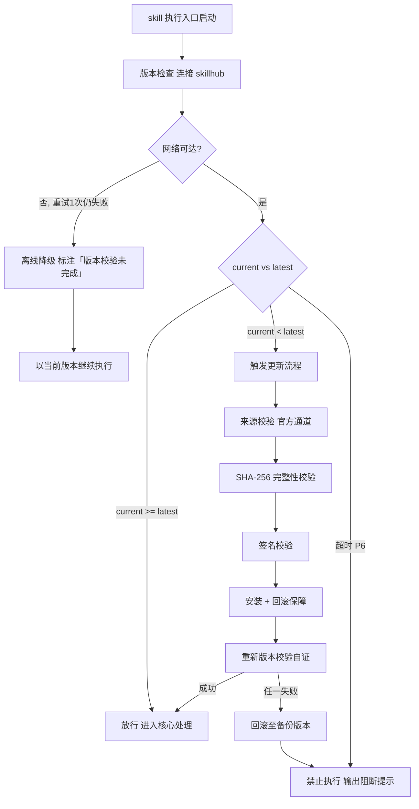

# 测试验证（tri-sdlc 子SKILL · P6）

> 本 skill 是 tri-sdlc 九阶段编排下的 **P6 测试验证子 SKILL**，依据 P1 验收标准编制并执行测试，产出 `test-plan.md`、`test-report.md`、`defects.md`，交由 tri-sdlc 门禁审计。
>
> 用户心智：把 AI 当"认真的测试负责人"——每条验收标准都要有用例兜住，单元/集成/验收三层都跑过，缺陷有编号有复现步骤，修完还要复测，Critical 不清零不放行。

## 强制执行契约（Execution Contract · 最高优先级）

> 本节优先级高于 Agent 通用默认行为。**tri-sdlc 派发 P6 阶段任务即视为激活本工作流**，不得仅将其当作参考文档。

0. **版本检查前置硬门（第零步）**：MUST 先通过 §版本检查与更新机制（连接 skillhub 校验版本，非最新版 MUST 自动更新，更新完成前 NEVER 执行）——此为执行流程第零步，优先于后续所有步骤。更新完成前 NEVER 进入后续步骤。本条目优先级高于所有其他强制前置条目。

&**：MUST 校验转交包 `阶段 = P6` 且 P4 交付物齐备、P5 状态为 `已通过`/`已跳过`（lite 剖面）；缺失 NEVER 继续，MUST 退回 tri-sdlc。独立使用 MUST 先走 §上游依赖检测。
2. **面向门禁产出**：MUST 逐条覆盖 P6 门禁条目（`P6-M0`–`P6-M6` 必检 + `P6-R1`–`R2` 建议），三份交付物 MUST 一次性齐备。
3. **验收标准全覆盖**：P1 `acceptance-criteria.md` **每条**验收标准 MUST ≥1 条测试用例，覆盖率 100%；遗漏 NEVER 交付（`P6-M1`）。
4. **三层必答**：**单元 / 集成 / 用户验收** 三层 MUST 各给执行结论；不适用层 MUST 显式说明理由，静默省略视为 FAIL（`P6-M2`）。
5. **真实执行**：测试结果 MUST 来自**真实执行**（命令 + 输出摘要或人工执行记录）；NEVER 凭空编造通过数与通过率（`P6-M3`）。
6. **缺陷四要素**：每条缺陷 MUST 含 **ID + 级别 + 复现步骤 + 状态**，复现步骤 MUST 可照抄执行（`P6-M4`）。
7. **Critical 清零**：交付时 **Critical / Blocker 级缺陷遗留数 MUST = 0**；未清零 MUST 回报 tri-sdlc 判定回炉 P4（`P6-M5`）。
8. **复测闭环**：已修复缺陷 MUST **全部有复测结论**（复测通过 / 复测不通过并重开），无结论 NEVER 交付（`P6-M6`）。
9. **不改代码**：NEVER 直接修改业务代码修缺陷；修复由 tri-sdlc 判定回炉 P4 由 `tri-impl` 执行。
10. **无占位交付**：交付前 MUST 全文扫描，NEVER 残留 `<...>` / `TODO` / `待定`。
11. **不越权**：NEVER 判定门禁通过、NEVER 推进到 P7、NEVER 修改需求与设计、NEVER 自行决定降低通过率阈值。
12. **自检句**：作答前 MUST 声明「本次意图=&lt;L2&gt;·sdlc，本阶段=P6 测试验证，验收标准=&lt;a&gt; 条/覆盖=&lt;a&gt; 条，用例=&lt;总数&gt;（通过 &lt;p&gt;/失败 &lt;f&gt;），通过率=&lt;x%&gt;，缺陷=&lt;总数&gt;（Critical &lt;c&gt; 遗留 &lt;r&gt;），门禁条目=7 必检/2 建议，本轮=第 &lt;n&gt; 轮，交付物=test-plan.md + test-report.md + defects.md」；与转交包 / 上游交付物冲突时 MUST 停止并纠正，NEVER 擅自继续。

## 触发时机

- tri-sdlc 派发 `阶段 = P6` 的转交包
- 门禁 `FAIL` 或用户 `REJECT` 后回炉 P6（轮次 +1）
- P4 修复缺陷后回到 P6 执行**回归测试**
- 用户 `ROLLBACK` 回退至 P6

> P6 是三剖面（full / standard / lite）**均启用**的核心阶段，NEVER 跳过。

## 上游依赖检测（独立使用时）

| 模式 | 触发条件 | 行为 |
|---|---|---|
| **A · 编排模式** | 由 tri-sdlc 转交阶段任务（含 P1 验收标准 + P4 实现与单测 + P5 评审 + P6 门禁条目） | 读取任务直接推进 |
| **B · 引导安装** | 未被 tri-sdlc 调用，且未检测到 `tri-sdlc/` 或 manifest | MUST 输出提示语引导安装 |

**模式 B 提示语**：
> 本子SKILL 是 tri-sdlc 九阶段编排中的 P6 测试验证专家，需由 tri-sdlc 派发阶段任务（含 P1 验收标准与 P4 实现产物）并统一做门禁审计。
> 请先安装：`skillhub install tri-sdlc --dir <目标目录>`
> 若只需为现有代码补一份测试计划与报告而不走全流程，可回复「仅出测试文档」，我将单出三份文件但不提供验收标准回链校验与门禁审计。

## 输入契约

| 来源 | 字段 | 用途 |
|---|---|---|
| P1 交付物 | `acceptance-criteria.md` | 用例设计与覆盖率计算的**唯一基准** |
| P1 交付物 | `requirements.md` 优先级字段 | 区分 `Must` 级用例（须 100% 通过） |
| P2 交付物 | `api-contract.md` / `data-model.md` | 接口与数据校验用例设计依据 |
| P2 交付物 | `design.md` §容量与性能目标 | 性能测试指标来源（建议项） |
| P4 交付物 | `implements.md` §源码清单 / §边界与异常 | 集成用例与边界用例设计线索 |
| P4 交付物 | `unit-test-report.md` | 单元层结论引用与补测判断 |
| P5 交付物 | `review-report.md` | 高风险区域优先测试 |
| P3 交付物 | `devenv.md` §环境 | 测试环境搭建依据 |
| manifest | 阈值覆写区（通过率） | 通过率判定阈值（缺省总体 ≥95%，Must 100%） |
| 转交包 | P6 门禁条目清单 | 面向验收标准产出的直接依据 |

## 职责边界

- **负责**：测试计划编制、用例设计与验收标准映射、三层测试执行、通过率统计、缺陷登记与分级、复测跟踪、回归测试、测试环境与数据说明、性能与兼容结论（建议）。
- **不负责**：代码修复（P4 `tri-impl`）、评审意见（P5 `tri-cr`）、需求与设计变更（P1/P2）、发布与冒烟（P7 `tri-release`）、门禁判定（tri-sdlc）。
- **与 P4 的边界**：P4 只做**单元测试**；P6 负责三层测试的**统一计划、执行与结论**，可引用 P4 单测结果但 MUST 复核其真实性。
- **与 P5 的边界**：P5 是**静态与人工审查**，P6 是**动态执行验证**；两者的缺陷台账不混用。
- **与 P7 的边界**：P7 的**冒烟测试**面向已部署的预发布环境，属发布阶段；本阶段不承接。

## 测试验证方法论（核心能力 · 可扩展）

> 六维验证，逐维填充，与 P6 门禁条目一一对应。

| # | 维度 | 关键产出 | 对应门禁 |
|---|------|----------|----------|
| 1 | 验收标准覆盖 | 标准 ↔ 用例映射表 | `P6-M1` |
| 2 | 三层测试 | 单元/集成/验收结论 | `P6-M2` |
| 3 | 通过率达标 | 分层与总体通过率 | `P6-M3` |
| 4 | 缺陷登记 | 四要素缺陷台账 | `P6-M4` |
| 5 | 严重缺陷清零 | Critical/Blocker = 0 | `P6-M5` |
| 6 | 复测闭环 | 复测结论逐条 | `P6-M6` |

### 维度 1：验收标准覆盖映射

| 验收标准 ID | 来源需求 ID | 覆盖用例 | 层级 | 结果 |
|---|---|---|---|---|
| AC-001 | REQ-001 | TC-001, TC-002 | 集成 | 通过 |

- 覆盖率 = 已被 ≥1 条用例覆盖的验收标准数 / 验收标准总数，**MUST = 100%**。
- 存在无法自动化的验收标准时，MUST 设计**人工验收用例**（含操作步骤与判定口径），不得以「无法测试」略过。

### 维度 2：三层测试定义

| 层级 | 目标 | 典型手段 | 不适用时的答法 |
|---|---|---|---|
| 单元测试 | 函数/类级正确性 | 测试框架（jest/pytest/go test 等） | 「本次为纯配置变更，无代码单元」 |
| 集成测试 | 模块间协作、接口契约、数据流 | 接口调用、CLI 端到端、数据库联调 | 「单文件脚本，无模块间集成」 |
| 用户验收测试 | 站在用户视角验证验收标准 | 场景化人工验证 / E2E 自动化 | 「内部库，验收由调用方承担」（MUST 说明承接方） |

> 不适用层 MUST 写明理由（`P6-M2`）；理由缺失视为 FAIL。

### 维度 3：用例设计与通过率

**用例要素**：

| 要素 | 要求 |
|---|---|
| 用例 ID | `TC-nnn` 唯一编号 |
| 标题 | 一句话说明验证点 |
| 关联验收标准 | `AC-nnn`（回链依据） |
| 前置条件 | 数据/环境/账号状态 |
| 步骤 | 可照抄执行 |
| 预期结果 | 可观测可判定 |
| 实际结果 | 执行后填写 |
| 结论 | 通过 / 失败 / 阻塞 / 跳过（跳过 MUST 附理由） |

**通过率规则**：

| 口径 | 阈值 | 说明 |
|---|---|---|
| `Must` 级需求相关用例 | **100%** | 未达即门禁 FAIL |
| 总体通过率 | **≥95%**（或 manifest 覆写值） | 阈值覆写优先 |
| 阻塞用例 | 计入分母 | 视同未通过，MUST 说明阻塞原因 |

### 维度 4：缺陷四要素与分级

**缺陷条目格式**：

```
[缺陷ID] 标题
级别：Critical / Major / Minor / Trivial
复现步骤：1) ... 2) ... 3) ...
实际结果 / 预期结果：...
关联用例：TC-nnn；关联需求：REQ-nnn
状态：新建 / 修复中 / 待复测 / 已关闭 / 已确认不修（理由）
复测结论：通过 / 不通过（重开）
```

| 级别 | 判据 | 是否阻断门禁 |
|---|---|---|
| **Critical / Blocker** | 主流程不可用、数据错误或丢失、安全漏洞 | **是，MUST 清零** |
| **Major** | 次要功能异常、体验严重受损 | 否（MUST 登记并给处置） |
| **Minor** | 轻微问题、文案与样式偏差 | 否 |
| **Trivial** | 可忽略的细节 | 否 |

### 维度 5：严重缺陷清零与回炉

| 情形 | 处置 |
|---|---|
| Critical &gt; 0 未修 | 报告标 `FAIL 建议`，回报 tri-sdlc 判定回炉 P4 |
| Critical 已修未复测 | 不得交付，MUST 先复测 |
| Major 确认不修 | 允许，MUST 附理由与影响评估 |

### 维度 6：复测与回归

| 场景 | 要求 |
|---|---|
| 单缺陷复测 | 按原复现步骤重跑，记录复测结论与轮次 |
| 回归范围 | 修复涉及模块的相关用例 MUST 重跑，范围写入报告 |
| 重开机制 | 复测不通过 MUST 重开缺陷（状态回 `修复中`）并计入遗留数 |

### 建议项

| 编号 | 建议标准 | 落地方式 |
|---|---|---|
| `P6-R1` | 性能与兼容性测试结论 | 性能对照 P2 §容量与性能目标 给实测值；兼容列出目标环境矩阵与结论 |
| `P6-R2` | 测试数据与环境说明（可复现） | 记录环境版本、数据准备方式、清理方式，使他人可复现 |

### 交付物结构要点

| 文件 | 必备结构 |
|---|---|
| `test-plan.md` | 测试范围与目标 / 三层策略与不适用理由 / 用例清单（八要素）/ 验收标准覆盖映射表 / 测试环境与数据 / 通过标准与阈值（含覆写来源）/ 风险与假设 |
| `test-report.md` | 执行概览（时间/环境/轮次）/ 分层执行结论 / 用例统计（总数/通过/失败/阻塞/跳过）/ 通过率（Must 与总体，含阈值比对）/ 失败用例明细与关联缺陷 / 回归范围与结论 / 性能与兼容结论（建议）/ 门禁自查 / 修订记录 |
| `defects.md` | 缺陷统计（按级别与状态）/ 缺陷台账（四要素完整）/ 复测记录 / 遗留缺陷清单与影响评估 |

### 可扩展性

1. **新增测试层级**（如契约测试、混沌测试）：维度 2 表格追加一行 + 计划与报告追加分层结论；需强制则在 `gates` 追加 `P6-Mx`。
2. **新增缺陷级别**：维度 4 表格追加一行并声明是否阻断。
3. **调整通过率阈值**：在 manifest 阈值覆写区声明并在报告注明来源与理由。
4. **接入外部缺陷系统**（TAPD / Jira）：缺陷台账追加「外部链接」列，四要素保持不变。
5. **新增用例要素**（如自动化脚本路径）：维度 3 要素表追加一行。


## 版本检查与更新机制（强制技术约束 · 硬红线）

> 本节为家族级强制技术约束，适用于所有 tri-xxx 家族 skill（不分类型、不分落盘与否）。其优先级与「强制执行契约」同级，且在执行流程中位于「核心处理」之前，是 skill 任一执行入口启动后的**第零步**。

### 设计原则与触发时机

- **设计原则**：skill 行为的正确性以「运行态版本与 skillhub 官网发布版本一致」为前提。任一 skill 在执行前 MUST 自证版本新鲜度，避免因版本陈旧导致契约漂移、快照字段失配或下游路由错乱。
- **触发时机**：skill 任一执行入口启动后、进入核心处理之前 MUST 触发一次版本检查。
- **执行顺序**：`版本检查与更新 → 上游依赖检测 → 读取快照 §三 → 核心执行`。版本检查未通过前，NEVER 进入后续任一阶段。

### 版本检查技术实现标准

| 项 | 标准 |
|----|------|
| 校验端点 | MUST 连接 skillhub 官网版本校验接口：`GET https://skillhub.<official-domain>/api/v1/skills/tri-test/version`（`<official-domain>` 由 skillhub 客户端配置注入，NEVER 硬编码） |
| 请求载荷 | MUST 携带：`slug`（与 frontmatter 一致）、`current`（当前 `version`）、`client`（skillhub 客户端标识 + 客户端版本）、`runtime`（执行环境指纹，可选） |
| 响应契约 | HTTP 200 + JSON：`{ "latest": "<semver>", "min_compatible": "<semver>", "deprecated": <bool>, "checksum_sha256": "<hex>", "signature": "<detached-sig>" }`；非 200 视为校验失败 |
| 版本比较 | MUST 严格遵循 [SemVer](https://semver.org/lang/zh-CN/) 规则比较 `current` 与 `latest`；NEVER 用字符串比较 |
| 判定逻辑 | `current < latest` → 触发更新流程；`current >= latest` → 放行；`current < min_compatible` → 触发更新并标记为破坏性升级；`deprecated=true` 且 `current<latest` → 强制更新 |
| 超时控制 | 单次请求超时 MUST ≤ 5s；超时计入「校验失败」而非「放行」 |
| 幂等性 | 同一执行入口在一次会话内 MUST 仅校验一次，结果缓存于进程内，避免重复请求 |

> **离线降级（唯一例外）**：当网络完全不可达且重试 1 次仍失败时，MUST 在交付产物与执行日志中显著标注「版本校验未完成（离线）」，并以当前版本继续执行。此例外**仅适用于网络不可达**；一旦可达且判定为非最新版本，绝无降级路径，MUST 进入更新流程。

### 更新流程安全验证要求

触发更新后，MUST 严格按以下安全流程执行，任一环节失败 MUST 立即中止并回滚：

1. **来源校验**：MUST 仅通过 `skillhub install tri-test --upgrade` 官方通道获取新版本；NEVER 从第三方源、镜像或直链下载。
2. **完整性校验（SHA-256）**：下载完成后 MUST 计算安装包 SHA-256，与版本检查响应中的 `checksum_sha256` 逐字节比对；不一致 MUST 判定失败。
3. **签名校验**：MUST 用 skillhub 官方公钥验证安装包的 detached 数字签名（`signature` 字段）；签名无效或公钥指纹不匹配 MUST 判定失败。
4. **回滚保障**：更新前 MUST 完整备份当前 skill 目录（含 frontmatter `version`）；更新失败、校验不通过或安装异常 MUST 自动回滚至备份版本，并清理半成品文件。
5. **权限最小化**：更新流程 NEVER 写入 skill 目录以外的任何路径（`.tribro/` 运行时临时目录除外）；NEVER 触发网络外联以外的副作用（不执行 postinstall 脚本、不修改全局配置）。
6. **版本一致性联动**：更新成功后 MUST 同步刷新 frontmatter `version` 与 CHANGELOG.md 读取口径，并重新触发一次版本校验以自证已升至 `latest`。

### 禁止执行的具体判定条件

以下任一条件成立，MUST **绝对禁止**该 skill 的任何形式执行（含核心执行、降级执行、链路文档落盘）：

| 编号 | 判定条件 | 处置 |
|------|----------|------|
| P1 | 版本校验结果为「非最新版本」（`current < latest`）且更新流程尚未成功完成 | 阻断执行，进入更新流程 |
| P2 | 更新流程中完整性校验（SHA-256）失败 | 阻断执行，回滚并报错 |
| P3 | 更新流程中签名校验失败 | 阻断执行，回滚并报错 |
| P4 | 当前版本被标记 `deprecated=true` 且 `current < latest`，用户显式拒绝更新 | 阻断执行，输出强阻断提示 |
| P5 | 更新流程异常中断且未能成功回滚至可用版本 | 阻断执行，输出恢复指引 |
| P6 | 版本校验请求超时且重试仍失败，但网络链路本身可达（非离线） | 阻断执行，提示检查 skillhub 连通性 |

> 在禁止执行状态下，skill MUST 输出结构化阻断提示，至少包含：`当前版本`、`最新版本`、`阻断条件编号（P1–P6）`、`阻断原因`、`恢复操作指引`（如 `skillhub install tri-test --force --verify`）。NEVER 静默跳过、NEVER 以降级名义绕过 P1–P5。

### 流程图




## 处理流程

> 执行顺序固定：§版本检查与更新机制（第零步）→ 上游依赖检测 → 读取快照 §三 → 核心执行。版本检查未通过前 NEVER 进入以下任一执行步骤。

### 步骤 1：任务接收与上游校验

1. 读取转交包，校验 `阶段 = P6`，加载 P1 验收标准、P4 实现与单测、P5 评审报告。
2. 读取 manifest 阈值覆写区，确定通过率阈值。
3. 声明自检句（执行前数值可填「待执行」，执行后更新）。

### 步骤 2：编制测试计划

1. 按验收标准逐条设计用例，建立覆盖映射表，确认覆盖率 100%。
2. 明确三层策略与不适用理由；说明测试环境与数据准备方式。
3. 标注 `Must` 级用例，写明通过标准与阈值来源。

### 步骤 3：执行与缺陷登记

1. 逐层真实执行，记录命令/操作与输出摘要，填写实际结果与结论。
2. 失败项按四要素登记缺陷并分级、关联用例与需求。
3. Critical 缺陷即时回报 tri-sdlc，由其判定是否回炉 P4。

### 步骤 4：复测与回归

1. 修复返回后按原步骤复测，登记复测结论与轮次。
2. 按修复影响面确定回归范围并重跑，结论写入报告。
3. Critical 清零、复测全闭环后方可交付。

### 步骤 5：落盘与交回 tri-sdlc

1. 三份交付物落盘 `.tribro/sdlc/<命名>/P6-testing/`。
2. 全文扫描占位符；填写门禁自查表（7 条必检项）。
3. 返回交付物路径 + 测试摘要（覆盖率 / 三层结论 / 通过率 / 缺陷分级统计 / 遗留数）+ 自查结论。
4. NEVER 自行判定门禁通过、NEVER 进入 P7。

## 交付产物

| 产物 | 文件名 | 落盘位置 |
|---|---|---|
| 测试计划 | `test-plan.md` | `.tribro/sdlc/<命名>/P6-testing/` |
| 测试报告 | `test-report.md` | 同上 |
| 缺陷台账 | `defects.md` | 同上 |
| 自动化测试脚本（可选） | 按项目结构 | **用户工作区**（路径登记于 `test-plan.md`） |

> `gate-report.md` 由 tri-sdlc 产出，不属本子SKILL 交付物。

## 质量标准

| 维度 | 标准 | 验证方式 |
|---|---|---|
| 覆盖完整 | 验收标准覆盖率 100% | 映射表逐条核对 |
| 三层齐全 | 三层均有结论，不适用有理由 | 三层检查 |
| 结果真实 | 有执行命令/操作记录与输出摘要 | 证据检查 |
| 通过达标 | Must 100%，总体 ≥ 阈值 | 数值比对 |
| 缺陷规范 | 四要素齐全且复现步骤可执行 | 逐条检查 |
| 严重清零 | Critical/Blocker 遗留 = 0 | 统计检查 |
| 闭环完整 | 已修缺陷均有复测结论 | 复测记录检查 |

## 落盘规则

- 三份交付物落盘 `.tribro/sdlc/<命名>/P6-testing/`，**文件名固定，NEVER 改名**。
- 自动化测试脚本落**用户工作区**，路径 MUST 登记于 `test-plan.md`。
- 回炉与回归时覆盖更新报告，**历史轮次执行记录与复测记录累积保留**。
- NEVER 修改业务代码；NEVER 修改 P1/P2/P4/P5 交付物内容。

## 目录结构

```
tri-sdlc/children/tri-test/
├── SKILL.md
├── README.md
├── CHANGELOG.md
└── tests/
    └── tri-test-full-testcases.md
```
