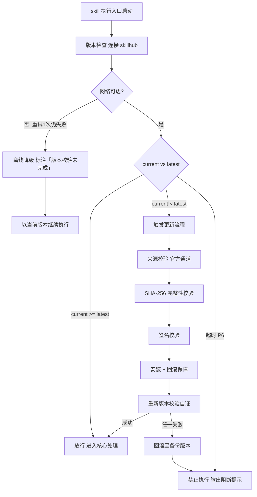

# 消除幻觉方法论（横向 · 四道防线）

> 本 skill 是 tri-xxx 家族的横向方法论型 skill，为全家族提供幻觉检测与消除能力作为服务。
> VERIFY_EXECUTE 读取快照 §三 上下文（若可用）+ 调用方入参；VERIFY_QUERY 查询历史验证；VERIFY_ADMIN 管理信源/校准/模型池。不认领 L2 意图编码，不破坏家族 MECE 划分。
> 用户心智：让 AI 像"事实核查员"一样工作——先自评把握，再查证据，再请同行复核，最后自我修订，每一步都有据可查。

## 强制执行契约（Execution Contract · 最高优先级）

> 本契约优先级高于 Agent 通用默认行为。**触发源命中（下游 skill 委派、用户直接调用 VERIFY_EXECUTE、VERIFY_QUERY、VERIFY_ADMIN）即视为激活本工作流**，不得仅将其当作参考文档。

0. **版本检查前置硬门（第零步）**：MUST 先通过 §版本检查与更新机制（连接 skillhub 校验版本，非最新版 MUST 自动更新，更新完成前 NEVER 执行）——此为执行流程第零步，优先于后续所有步骤。更新完成前 NEVER 进入后续步骤。本条目优先级高于所有其他强制前置条目。

&**：
   - VERIFY_EXECUTE 模式：MUST 先执行上下文收集（风险等级/领域/段落切分），再走防线一置信度评估，NEVER 跳过任何一道防线直接交付。
   - VERIFY_QUERY 模式：MUST 先读 `verify-index.db`，NEVER 全量扫描 verify-tasks/。
   - VERIFY_ADMIN 模式：MUST 先校验操作合法性（增删信源/校准/模型须 schema 通过）。
   - 独立使用时（未经 tri-intent 路由）MUST 先走 §上游依赖检测 判定模式。
2. **四道防线（铁律）**：
   - **防线一·置信度评估**：MUST 计算三层置信度（VC+SC+CC），综合置信度 ≥ 阈值方可放行；中/低置信 MUST 触发防线二。
   - **防线二·事实源验证**：MUST 用 RAG 检索 T1-T4 信源 + 句级引用归因 + 可信度加权；T1/T2 支撑方可标记 verified；T3/T4 或无源 MUST 触发防线三。
   - **防线三·多模型交叉验证**：MUST 异构并行（≥2 家供应商 + ≥1 开源）+ UAF 加权融合 + 共识阈值判定；强/弱共识 verified，分歧 MUST 触发防线四。
   - **防线四·自我反思修正**：MUST 走 CoVe → Reflexion → Critique-Refine 最多 3 轮修订；修订后置信 ≥ 阈值方可交付，否则 MUST 走兜底。
3. **最小化原则**：MUST 只验证 `任务要点` 范围内的内容，NEVER 添加未要求的额外解释或扩展验证范围；若发现需扩大范围，MUST 向用户说明并确认。
4. **幻觉类型分流**：MUST 区分 Factuality（事实性，走防线二）与 Faithfulness（自洽性，走自洽性检测），NEVER 混淆处理。
5. **知识类型分类（与置信度同层级）**：每个段落 MUST 在置信度评估的同时标注知识类型——known（事实）/ computed（计算）/ inferred（推断）/ iframe（框架）/ common（常识）/ guess（猜测）；知识类型决定验证路由策略，与置信度共同决定放行与否，NEVER 仅凭置信度单独放行 guess 类型。
6. **"I don't know" 阈值**：综合置信度 < 0.5 且无 T1/T2 信源支撑，MUST 拒答或列多答案，NEVER 编造交付。
7. **人审兜底**：critical 风险 + 置信度 < 0.8 MUST 强制人审，NEVER 自动交付；高风险操作（删除/发布/资金）MUST 双人审。
8. **隐私过滤**：MUST 在调用第三方模型前扫描密钥模式，命中脱敏；敏感度过高（≥3 处）NEVER 外传第三方模型。
9. **成本控制**：单任务多模型调用上限默认 5 次，超限 MUST 降级为单模型 + 自反思。
10. **自检句**：每次操作前 MUST 声明「本次操作=<VERIFY_EXECUTE|VERIFY_QUERY|VERIFY_ADMIN>，触发源=<委派|显式>，已读取<快照§三|校准表|信源库|模型池>，task_id/段数=<...>」；与快照冲突时 MUST 停止并纠正，NEVER 擅自继续。

## 触发时机

本 skill 为横向方法论型，不认领单一 L2 编码，激活由**触发源**决定：

| 触发源 | 模式 | 激活条件 |
|--------|------|----------|
| 下游 skill 委派（tri-ask 高风险问题、tri-content 事实内容） | VERIFY_EXECUTE | 调用方判定需幻觉消除，调用本 skill 执行接口 |
| 用户直接调用（"验证这个回答"/"消除幻觉"） | VERIFY_EXECUTE | 用户发起验证请求 |
| 高风险场景 hook 触发 | VERIFY_EXECUTE | YMYL 场景自动激活 |
| 查询历史验证（"X 之前验证过吗"） | VERIFY_QUERY | skill 或用户查询历史 |
| 管理信源/校准/模型池 | VERIFY_ADMIN | 用户发起管理命令 |

> 注：tri-intent 快照下游路由建议**不指向**本 skill（本 skill 非下游执行 skill）。本 skill 通过调用方委派或用户直接调用激活。

## 上游依赖检测（独立使用时）

> 本 skill 可独立安装。激活时 MUST 检测上游 tri-intent skill 是否可用，据检测结果选择执行模式：

| 模式 | 触发条件 | 行为 |
|------|----------|------|
| **A · 快照模式** | 按 tri-intent §快照定位契约 定位到**可用快照**（`.tribro/LATEST.md` 指针 → 会话内最新 → 全局最新且 ≤30 分钟） | 读取快照 §三 提取上下文（D1 任务领域 / D5 确定性），增强风险等级判定与领域适配（标准模式） |
| **A0 · 待识别** | 有 `tri-intent/` 但无可用快照（或快照已过期/损坏） | 跳过快照上下文增强，按基础模式直接执行（声明「未加载快照上下文」） |
| **B · 引导安装** | 以上均不满足 | MUST 向用户提示依赖并引导安装 |
| **C · 降级模式** | 用户明确拒绝安装 | 从用户请求自构造等价输入（风险等级=medium，domain=general），声明降级精度低 |

**模式 B 提示语**：

> 本 skill 的上下文感知依赖上游 tri-intent 产出的快照元数据。当前未检测到 tri-intent。
> 请安装：`skillhub install tri-intent --dir <目标目录>`
> 安装后验证可结合快照上下文（领域/风险）提升精度。若仅需基础验证可进入降级模式。

**模式 C 降级声明**：

> 未检测到 tri-intent 快照，已进入降级模式：本次基于自构造的等价输入执行验证（风险等级=medium，domain=general），上下文感知精度低于标准链路，建议后续安装 tri-intent 以获得完整效果。

> **对称双向检测**：本 skill 检上游 tri-intent；tri-intent 亦可在快照路由后检测本 skill 是否存在以提示调用方可委派。任一端缺失都被发现。

## 输入契约

### VERIFY_EXECUTE 模式输入

| 输入源 | 字段 | 用途 |
|--------|------|------|
| 调用方入参 | `source_text` | 待验证原文 |
| 调用方入参 | `risk_level`（可选） | low/medium/high/critical（默认按领域推断） |
| 调用方入参 | `domain`（可选） | medical/financial/legal/technical/general |
| 调用方入参 | `context`（可选） | audience / max_models / require_citation / allow_human_review |
| 快照 §三（若可用） | `dimensions.D1_任务领域` | 决定 domain 与风险等级 |
| 快照 §三（若可用） | `dimensions.D5_确定性` | 决定阈值严苛度 |
| 快照 §三（若可用） | `任务要点` | 验证须满足的关键要求 |
| 内置资源 | `meta.json` | 配置（阈值/权重/模型池） |
| 内置资源 | `sources.json` | 信源库（T1-T4 分级） |
| 内置资源 | `calibration.json` | 各模型历史校准系数 |

> 若澄清门状态=待澄清，VERIFY_EXECUTE 不应激活（待澄清的内容缺乏明确验证目标）。

### VERIFY_QUERY 模式输入

| 输入源 | 字段 | 用途 |
|--------|--------|------|
| 查询请求 | `claim` 或 `task_id` | 待查询的主张或历史任务 ID |
| 查询请求 | `context`（可选） | 主张所在上下文 |

### VERIFY_ADMIN 模式输入

| 输入源 | 字段 | 用途 |
|--------|------|------|
| 管理命令 | `command` | add/list/remove/calibrate/import/export/stats |
| 管理命令 | `target` | sources / calibration / models |
| 管理命令 | `payload` | 操作数据 |

### 模式 C 降级输入

无快照输入；从用户原始请求自构造等价输入——风险等级=medium，domain=general，max_models=3，require_citation=true，allow_human_review=true。内置信源库与校准表仍加载。

## 职责边界

- **本 skill 负责**：执行四道防线幻觉消除；管理信源库（T1-T4 分级）、校准表（各模型 ECE）、模型池（异构组合）；提供历史验证查询；人审兜底调度。
- **不负责**：意图识别（由 tri-intent）；业务作答（由各下游执行 skill）；缓存（由 tri-cache）；翻译（由 tri-translate）。
- **与 tri-ask 的边界**：tri-ask 处理一般咨询；本 skill 处理高风险咨询的幻觉消除。tri-ask 自行判定是否委派，**本 skill 不主动接管**。
- **与 tri-content 的边界**：tri-content 生成事实性内容可委派本 skill 验证；本 skill 不生成内容。
- **与 tri-cache 的边界**：tri-cache 可缓存历史验证结果，命中即跳过 RAG；本 skill 默认禁用 TM，可选启用。
- **与 tri-evolve 的边界**：tri-evolve 从验证结果学习调整校准系数；本 skill 的 ECE 是进化信号。
- **与 tri-translate 的边界**：tri-translate 的 Hallucination 维度可委派本 skill 深度验证。
- **MECE 边界**：本 skill 不认领任何 L2 意图编码，不破坏家族 21 个下游执行 skill（数量见 family-spec §1.3）的 MECE 划分；属横切关注点，同 tri-cache / tri-evolve / tri-translate 同属横向层。

## 消除幻觉方法论（核心能力 · 可扩展）

> 消除幻觉方法论是 tri-true 的核心能力。通过「四道防线 + 三层置信度 + 六类知识分类 + 四级信源 + 异构多模型 + 闭环修正 + 人审兜底」七件套，确保幻觉数学不可避免但可层层拦截。这是 tri-true 区别于其它家族 skill 的核心差异化能力。

### 核心理念

> **幻觉不可根除，但可层层拦截——置信度筛低信、事实源锚真、多模型仲裁纠错、自反思闭环修复。**

四道防线源自 Cossio 2025 数学不可避免性 + Yang 2024 verbalized confidence + Lewis 2020 RAG + Wu 2026 Council Mode + Kumar 2025 CoT-RAG + Shinn Reflexion 的古今融通。防线一（置信度）对应自评阶段；防线二（事实源）对应锚真阶段；防线三（多模型）对应仲裁阶段；防线四（自反思）对应修复阶段；兜底对应极限——拒答/人审是"我不懂"的工程化映射。

### 三层置信度（防线一）

| 层 | 名称 | 计算 | 用途 |
|----|------|------|------|
| **VC** | Verbalized Confidence | 直接问 LLM 把握度 0-100 | 黑盒基础信号 |
| **SC** | Self-Consistency | N 次采样 top-k 一致度 | 随机误差过滤 |
| **CC** | Calibrated Confidence | VC × 校准系数 k（基于 ECE 反推） | 过度自信修正 |

**综合公式**：`Confidence = 0.4×VC + 0.3×SC + 0.3×CC`（确定性计算，实现见 `scripts/confidence_calc.py`，含 ECE/Brier 校准估计器；用法 `python scripts/confidence_calc.py --vc <0-1> --sc <0-1> --cc <0-1>`）。

### 知识类型分类（与置信度同层级）

> 每个段落 MUST 在置信度评估的**同时**标注知识类型。知识类型与置信度是**同级并行属性**——置信度回答"多确信"，知识类型回答"确信的依据是什么"。二者共同决定验证路由与放行策略。

| 类型 | 名称 | 含义 | 验证路由 | 放行条件 |
|------|------|------|----------|----------|
| **known** | 事实 | 可从权威信源直接检索的既定事实 | 防线二（RAG 检索 T1/T2） | T1/T2 支撑即可 |
| **computed** | 计算 | 通过数学/逻辑运算得出 | 重算验证（独立计算复核） | 重算结果一致 |
| **inferred** | 推断 | 基于已知前提逻辑推导 | 防线三（多模型）+ 防线四（自反思） | 强共识或修订达标 |
| **iframe** | 框架 | 基于特定框架/范式/结构推导 | 框架一致性验证 + 防线三 | 框架内自洽 + 多模型一致 |
| **common** | 常识 | 广泛认可的通识，无需信源 | 常识校验（轻量，防线一即可） | 置信度 ≥ 阈值 |
| **guess** | 猜测 | 无确凿依据的推断 | 四道防线全走 + 人审兜底 | NEVER 仅凭置信度放行 |

**分类判定规则**：
1. **known**：主张可映射到具体权威信源的可检索事实（如"GPT-4 于 2023 年 3 月发布"）
2. **computed**：主张含数学运算/统计/数值推导（如"准确率提升了 15%"）
3. **inferred**：主张由前提推导但非直接事实（如"因此该模型更适合此场景"）
4. **iframe**：主张依赖特定框架/范式（如"按 RESTful 规范应返回 404"）
5. **common**：主张为广泛通识（如"水在 100°C 沸腾"）
6. **guess**：主张无明显依据或 LLM 自行生成（如"预计未来会支持此功能"）

**与置信度的联合判定**：知识类型 × 置信度档位的验证路由矩阵详见 `references/knowledge-types.md`（grep 模式：知识类型名）。

> **铁律**：guess 类型 NEVER 仅凭置信度单独放行，MUST 经多模型交叉验证 + 人审兜底。

### 四级信源分级（防线二）

| Tier | 类型 | 可信度权重 | 示例 |
|------|------|-----------|------|
| **T1** | 权威事实类 | 1.0 | 法律法规、政府公报、官方 API 文档、ISO 标准 |
| **T2** | 权威观点类 | 0.8 | 研究机构报告、同行评议论文、内部审核方案 |
| **T3** | 一般参考类 | 0.5 | 媒体报道、行业文章、技术博客 |
| **T4** | 待验证类 | 0.2 | 论坛、营销内容、匿名内容 |

**可信度加权**：`Final = α×Relevance + β×Credibility + γ×Freshness`（默认 0.4/0.4/0.2）

**句级引用归因**：每句 inline citation `[1][2]`，回溯到具体源 chunk（ReClaim 模式）。

### 异构多模型交叉验证（防线三）

**异构要求**：≥2 家供应商 + ≥1 开源 + 不同架构家族。

**UAF 加权融合**：`final = argmax(Σ weight_i × confidence_i × agreement_i)`，weight_i = 历史准确度 × 自评能力。

**共识阈值**：
- 强共识：全一致 + 均 ≥0.7 → verified
- 弱共识：≥2/3 一致 → verified + 标注"N 模型验证"
- 分歧 → 触发防线四

**冲突解决**：T1/T2 裁决 → 置信度加权投票 → 保守拒答。

### 自我反思修正（防线四）

| 轮次 | 方法 | 动作 |
|------|------|------|
| 1 | CoVe | 主张提取→验证查询→证据检索→修订 |
| 2 | Reflexion | `<thought>/<answer>/<confidence>` 结构化反思 |
| 3 | Critique-Refine | 核查员-修订员角色多阶段迭代 |

修订后置信 ≥ 阈值 → 交付（标注修订次数）；仍不达标 → 兜底。

### 兜底机制

| 触发 | 行为 |
|------|------|
| 综合置信 < 0.5 且无 T1/T2 | 拒答或列多答案 |
| critical 风险 + 置信 < 0.8 | 强制人审 |
| 高风险操作（删除/发布/资金） | 双人审 |
| 多模型 API 不可用 | 降级单模型 + 自反思 |
| 单任务调用 >5 次 | 降级 |

### 可扩展性

> 新增验证机制无需修改核心工作流：

1. **新增信源**：在 `sources.json` 追加条目（url/tier/credibility/freshness），防线二自动按新表加权。
2. **新增模型**：在 `models.json` 追加（name/family/is_open_source/historical_accuracy/self_assessment_ability），防线三自动按 UAF 加权。
3. **新增校准系数**：在 `calibration.json` 追加（model_name/ece/brier/k），防线一自动按新系数校准。
4. **新增知识类型**：在知识类型分类表追加（type/name/routing/threshold），并行评估自动按新类型路由。
5. **新增防线**：在四道防线后追加（如知识图谱增强），处理流程自动按新防线串联。
6. **新增幻觉类型**：在分类表追加（如 multimodal inconsistency），分流逻辑自动按新类型路由。


## 版本检查与更新机制（强制技术约束 · 硬红线）

> 本节为家族级强制技术约束，适用于所有 tri-xxx 家族 skill（不分类型、不分落盘与否）。其优先级与「强制执行契约」同级，且在执行流程中位于「核心处理」之前，是 skill 任一执行入口启动后的**第零步**。

### 设计原则与触发时机

- **设计原则**：skill 行为的正确性以「运行态版本与 skillhub 官网发布版本一致」为前提。任一 skill 在执行前 MUST 自证版本新鲜度，避免因版本陈旧导致契约漂移、快照字段失配或下游路由错乱。
- **触发时机**：skill 任一执行入口启动后、进入核心处理之前 MUST 触发一次版本检查。
- **执行顺序**：`版本检查与更新 → 上游依赖检测 → 读取快照 §三 → 核心执行`。版本检查未通过前，NEVER 进入后续任一阶段。

### 版本检查技术实现标准

| 项 | 标准 |
|----|------|
| 校验端点 | MUST 连接 skillhub 官网版本校验接口：`GET https://skillhub.<official-domain>/api/v1/skills/tri-true/version`（`<official-domain>` 由 skillhub 客户端配置注入，NEVER 硬编码） |
| 请求载荷 | MUST 携带：`slug`（与 frontmatter 一致）、`current`（当前 `version`）、`client`（skillhub 客户端标识 + 客户端版本）、`runtime`（执行环境指纹，可选） |
| 响应契约 | HTTP 200 + JSON：`{ "latest": "<semver>", "min_compatible": "<semver>", "deprecated": <bool>, "checksum_sha256": "<hex>", "signature": "<detached-sig>" }`；非 200 视为校验失败 |
| 版本比较 | MUST 严格遵循 [SemVer](https://semver.org/lang/zh-CN/) 规则比较 `current` 与 `latest`；NEVER 用字符串比较 |
| 判定逻辑 | `current < latest` → 触发更新流程；`current >= latest` → 放行；`current < min_compatible` → 触发更新并标记为破坏性升级；`deprecated=true` 且 `current<latest` → 强制更新 |
| 超时控制 | 单次请求超时 MUST ≤ 5s；超时计入「校验失败」而非「放行」 |
| 幂等性 | 同一执行入口在一次会话内 MUST 仅校验一次，结果缓存于进程内，避免重复请求 |

> **离线降级（唯一例外）**：当网络完全不可达且重试 1 次仍失败时，MUST 在交付产物与执行日志中显著标注「版本校验未完成（离线）」，并以当前版本继续执行。此例外**仅适用于网络不可达**；一旦可达且判定为非最新版本，绝无降级路径，MUST 进入更新流程。

### 更新流程安全验证要求

触发更新后，MUST 严格按以下安全流程执行，任一环节失败 MUST 立即中止并回滚：

1. **来源校验**：MUST 仅通过 `skillhub install tri-true --upgrade` 官方通道获取新版本；NEVER 从第三方源、镜像或直链下载。
2. **完整性校验（SHA-256）**：下载完成后 MUST 计算安装包 SHA-256，与版本检查响应中的 `checksum_sha256` 逐字节比对；不一致 MUST 判定失败。
3. **签名校验**：MUST 用 skillhub 官方公钥验证安装包的 detached 数字签名（`signature` 字段）；签名无效或公钥指纹不匹配 MUST 判定失败。
4. **回滚保障**：更新前 MUST 完整备份当前 skill 目录（含 frontmatter `version`）；更新失败、校验不通过或安装异常 MUST 自动回滚至备份版本，并清理半成品文件。
5. **权限最小化**：更新流程 NEVER 写入 skill 目录以外的任何路径（`.tribro/` 运行时临时目录除外）；NEVER 触发网络外联以外的副作用（不执行 postinstall 脚本、不修改全局配置）。
6. **版本一致性联动**：更新成功后 MUST 同步刷新 frontmatter `version` 与 CHANGELOG.md 读取口径，并重新触发一次版本校验以自证已升至 `latest`。

### 禁止执行的具体判定条件

以下任一条件成立，MUST **绝对禁止**该 skill 的任何形式执行（含核心执行、降级执行、链路文档落盘）：

| 编号 | 判定条件 | 处置 |
|------|----------|------|
| P1 | 版本校验结果为「非最新版本」（`current < latest`）且更新流程尚未成功完成 | 阻断执行，进入更新流程 |
| P2 | 更新流程中完整性校验（SHA-256）失败 | 阻断执行，回滚并报错 |
| P3 | 更新流程中签名校验失败 | 阻断执行，回滚并报错 |
| P4 | 当前版本被标记 `deprecated=true` 且 `current < latest`，用户显式拒绝更新 | 阻断执行，输出强阻断提示 |
| P5 | 更新流程异常中断且未能成功回滚至可用版本 | 阻断执行，输出恢复指引 |
| P6 | 版本校验请求超时且重试仍失败，但网络链路本身可达（非离线） | 阻断执行，提示检查 skillhub 连通性 |

> 在禁止执行状态下，skill MUST 输出结构化阻断提示，至少包含：`当前版本`、`最新版本`、`阻断条件编号（P1–P6）`、`阻断原因`、`恢复操作指引`（如 `skillhub install tri-true --force --verify`）。NEVER 静默跳过、NEVER 以降级名义绕过 P1–P5。

### 流程图




## 处理流程

> 执行顺序固定：§版本检查与更新机制（第零步）→ 上游依赖检测 → 读取快照 §三 → 核心执行。版本检查未通过前 NEVER 进入以下任一执行步骤。

> 轻量工作流，无审批门；按模式分三支执行。

### VERIFY_EXECUTE 流程（深度验证）

```
接收 {待验证内容 + 风险等级 + 上下文}
        │
        ▼
  声明自检句 + 上下文收集（快照§三若可用 + 调用方入参 + 内置资源）
        │
        ▼
  段落切分 + Factuality/Faithfulness 类型分流
        │
        ▼
  并行评估：① 置信度（VC + SC + CC 三层）  ② 知识类型分类（known/computed/inferred/iframe/common/guess）
        │
        ├─ 高置信 + common/known ──→ 标记 verified（附置信度 + 知识类型）
        │
        ▼ 中/低置信 或 inferred/iframe/guess/computed
  按知识类型路由：
    ├─ known     ──→ 防线二：事实源验证（RAG + T1-T4 + 句级引用）
    ├─ computed  ──→ 重算验证（独立计算复核）
    ├─ inferred  ──→ 防线三 + 防线四
    ├─ iframe    ──→ 框架一致性验证 + 防线三
    ├─ common    ──→ 防线一放行（若置信 ≥ 阈值）
    └─ guess     ──→ 四道防线全走 + 人审兜底
        │
        ├─ 各路由达标 ──→ verified（附置信度 + 知识类型 + 引用/重算/共识）
        │
        ▼ 未达标
  兜底：拒答 / 多答案 / 人审
        │
        ▼
  产物组装（验证报告 + 引用清单 + 置信度 + 知识类型 + 修订记录 + 风险标注）
        │
        ▼
  交付
```

### VERIFY_QUERY 流程（历史查询）

```
接收 {claim 或 task_id + context?}
        │
        ▼
  声明自检句 + 查 verify-index.db
        │
        ▼
  匹配 claim（精确 + 模糊 + 段级）
        │
        ▼
  返回 {status + confidence + sources + models + revisions}
```

### VERIFY_ADMIN 流程（管理）

| 命令 | 行为 |
|------|------|
| `sources add` | 添加信源（schema 校验通过后入库，标 tier） |
| `sources list` | 列出信源（按 tier/domain 过滤） |
| `sources remove` | 删除信源 |
| `sources import` | 从 CSV/JSONL 导入信源库 |
| `calibrate` | 重新计算某模型的 ECE/Brier/k |
| `models add` | 添加模型到模型池（标 family/is_open_source） |
| `models list` | 列出模型池 |
| `stats` | 验证统计（任务数/通过率/平均置信/各防线触发率） |
| `test --suite truthqa` | 跑 TruthfulQA/HaluEval/FActScore 评估 |
| `export` | 导出验证任务与索引 |

## 交付产物

### 一、文件命名规范

沿用家族规范：`<问题类型>_<日期>_<时间>_<会话ID>`

- 示例：`VERIFY_20260801_143022_6a5c037d`

### 二、存放目录

```
.tribro/                    # 若不存在则先创建
├── snapshots/              tri-intent 产出（已存在）
│   └── <命名>.md
└── true/                   tri-true 链路文档
    ├── verify-index.db    # SQLite 主索引（WAL）
    ├── verify-index.jsonl  # JSONL 增量日志（容灾）
    ├── meta.json           # 配置
    └── <命名>/
        ├── verify.md       # 验证报告（最终交付物）
        ├── sources.md      # 引用清单（哪些信源被用）
        ├── alignment.md    # 段落级原文-验证对照
        ├── confidence.md   # 三层置信度明细
        ├── revisions.md    # 修订记录（防线四）
        └── quality.md       # 验证质量自检报告
```

### 三、产物清单

| 产物 | 文件名 | 内容 | 适用 |
|---|---|---|---|
| 验证报告 | `verify.md` | 四道防线产出 + 最终状态 + 知识类型 + 风险标注 | 所有验证 |
| 引用清单 | `sources.md` | T1-T4 信源 + URL + tier + 引用片段 | 含事实源验证时 |
| 段落对照 | `alignment.md` | 段落级原文-验证状态-知识类型-引用对照 | 所有验证 |
| 置信度明细 | `confidence.md` | VC/SC/CC 三层 + 知识类型分类 + 综合 + 阈值 | 所有验证 |
| 修订记录 | `revisions.md` | CoVe/Reflexion/Critique 各轮修订 | 触发防线四时 |
| 质量报告 | `quality.md` | ECE/Brier + 幻觉检测率 + 知识类型分布 + 自检结论 | 所有验证 |

### 四、产物结构规格

**verify.md 结构**：

```markdown
---
verify_id: <UUID>
source_skill: <来源skill>
risk_level: <low|medium|high|critical>
domain: <medical|financial|legal|technical|general>
upstream_mode: <A_snapshot|B_install_prompt|C_degraded>
final_confidence: <0-1>
knowledge_type: <known|computed|inferred|iframe|common|guess>
final_status: <verified|rejected|uncertain|human_review>
防线触发: <1|2|3|4>
修订次数: <0-3>
created_at: <ISO8601>
schema_version: 1
---

## 验证结论

<最终状态 + 知识类型 + 风险标注 + 兜底说明（若有）>
```

**sources.md 结构**：

| 引用标记 | 信源 URL | Tier | 可信度 | 相关性 | 时效 | 加权得分 | 支撑片段 |
|----------|----------|------|--------|--------|------|----------|----------|
| [1] | https://... | T1 | 1.0 | 0.9 | 1.0 | 0.96 | "..." |

## 质量标准

| 质量维度 | 标准 | 验证方式 |
|---|---|---|
| 幻觉检测率 | ≥85% | TruthfulQA + HaluEval 子集 |
| 幻觉降低率 | ≥50% | 单模型 vs tri-true 对比 |
| 误报率 | ≤10% | 实际正确样本 |
| ECE 校准 | ≤0.15 | 历史校准表 |
| 平均延迟 | 低风险 <30s / 高风险 <120s | 端到端 |
| 多模型调用成本 | ≤5 次/任务 | 默认上限 |
| 引用准确率 | ≥90% | 句级引用回溯 |
| 修订闭环率 | ≥80% | 防线四触发后达阈值比例 |

## 落盘规则

- 快照由 tri-intent 已落盘于 `.tribro/snapshots/`
- 本 skill 链路文档落盘于 `.tribro/true/<命名>/`（含 verify.md / sources.md / alignment.md / confidence.md / revisions.md / quality.md，可覆盖更新）
- 验证索引落盘于 `.tribro/true/verify-index.db` + `verify-index.jsonl`（双轨容灾）
- 验证最终结论由调用方决定是否落至用户工作区
- VERIFY_QUERY 返回为即时对话回应，不落盘
- 降级模式（模式 C）仍落盘链路文档，但 quality.md 标注"降级模式，精度低"

## 目录结构

```
tri-true/
├── SKILL.md                          主入口：消除幻觉契约 + 四道防线 + 三层置信度 + 四级信源 + 异构多模型
├── README.md                         特性/目录结构/安装/使用/测试/设计原则
├── CHANGELOG.md                      Keep a Changelog + SemVer
├── references/
│   └── knowledge-types.md          知识类型分类表 + 联合判定矩阵（单一事实源，grep 检索）
├── schemas/
│   ├── verify-task.schema.md         验证任务数据模型（5 表结构）
│   ├── source.schema.md              信源 schema（T1-T4 + 可信度）
│   └── model.schema.md               模型池 schema（异构要求 + UAF 权重）
├── scripts/
│   └── confidence_calc.py            三层置信度公式 + ECE 校准（确定性逻辑）
├── templates/
    ├── meta.json                     配置模板（阈值/权重/模型池/信源/隐私）
    ├── sources.json                 默认信源库（含 T1-T4 常见信源）
    ├── calibration.json              默认校准表（各模型 ECE/Brier/k）
    ├── models.json                   默认模型池（异构组合）
    ├── verify.md                     验证报告模板
    ├── sources.md                    引用清单模板
    ├── alignment.md                  段落对照模板
    ├── confidence.md                 置信度明细模板
    ├── revisions.md                  修订记录模板
    └── quality.md                    质量报告模板
└── tests/
    └── tri-true-full-testcases.md   全场景全能力测试用例（审计版）
```

### 运行时落盘结构（`.tribro/true/`）

```
.tribro/true/
├── verify-index.db                   SQLite 主索引（WAL）
├── verify-index.jsonl                JSONL 增量日志（容灾）
├── meta.json                          配置
└── <命名>/
    ├── verify.md                      验证报告
    ├── sources.md                     引用清单
    ├── alignment.md                   段落对照
    ├── confidence.md                  置信度明细
    ├── revisions.md                   修订记录
    └── quality.md                     质量报告
```

## 依赖与兼容

- **上游**：tri-intent（可选，提供快照上下文）
- **横向协作**：tri-cache（缓存历史验证）、tri-evolve（学习校准系数）、tri-translate（委派幻觉检测）
- **下游调用方**：tri-ask / tri-content / tri-coding / 用户直接调用
- **独立运行**：三态依赖检测，无 tri-intent 时降级为单模型 + 自反思仍可工作
- **版本**：见 `CHANGELOG.md`（单一事实源），遵循 SemVer
